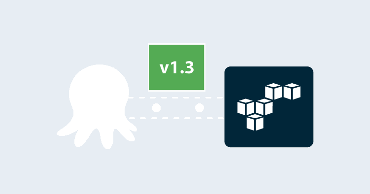

Cloud platforms have ushered in some extraordinarily useful workflows for developers and operations. The ability to spin up temporary infrastructure for testing removes the burden to maintain local virtual machines and means you can scale testing up to include many machines of different capacities, safe in the knowledge that you won’t be flooding the corporate network with a deluge of traffic.

In the good old days, "classic" AWS created EC2 virtual machines in a single, shared network space. This made it very easy to create a virtual machine, as there was almost no network configuration required.

These days best practice demands even a single VM also requires a VPC, Internet gateways, security groups, subnets, and route tables.

In this blog post, we’ll look at two CloudFormation templates to create Windows and Linux EC2 instances in their own VPC.

## The Windows CloudFormation template

This example CloudFormation template creates a single Windows EC2 instance inside a VPC:

```YAML
AWSTemplateFormatVersion: 2010-09-09
Parameters:
  InstanceTypeParameter:
    Type: String
    Default: t3a.medium
    Description: Enter instance size. Default is t3a.medium.
  WorkstationIp:
    Type: String
    Description: The IP address of the workstation that can RDP into the instance.
  AMI:
    Type: String
    Default: ami-05bb2dae0b1de90b3
    Description: The Windows AMI to use.
  Key:
    Type: String
    Description: The key used to access the instance.
Resources:
  VPC:
    Type: AWS::EC2::VPC
    Properties:
      CidrBlock: 10.0.0.0/16
      EnableDnsSupport: true
      EnableDnsHostnames: true
      InstanceTenancy: default
      Tags:
        - Key: Name
          Value: Windows Target VPC
  InternetGateway:
    Type: AWS::EC2::InternetGateway
  VPCGatewayAttachment:
    Type: AWS::EC2::VPCGatewayAttachment
    Properties:
      VpcId: !Ref VPC
      InternetGatewayId: !Ref InternetGateway
  SubnetA:
    Type: AWS::EC2::Subnet
    Properties:
      AvailabilityZone: us-east-1a
      VpcId: !Ref VPC
      CidrBlock: 10.0.0.0/24
      MapPublicIpOnLaunch: true
  RouteTable:
    Type: AWS::EC2::RouteTable
    Properties:
      VpcId: !Ref VPC
  InternetRoute:
    Type: AWS::EC2::Route
    DependsOn: InternetGateway
    Properties:
      DestinationCidrBlock: 0.0.0.0/0
      GatewayId: !Ref InternetGateway
      RouteTableId: !Ref RouteTable
  SubnetARouteTableAssociation:
    Type: AWS::EC2::SubnetRouteTableAssociation
    Properties:
      RouteTableId: !Ref RouteTable
      SubnetId: !Ref SubnetA
  InstanceSecurityGroup:
    Type: AWS::EC2::SecurityGroup
    Properties:
      GroupName: "Octopus Target Group"
      GroupDescription: "Tentacle traffic in from hosted static ips, and RDP in from a personal workstation"
      VpcId: !Ref VPC
      SecurityGroupIngress:
        - IpProtocol: tcp
          FromPort: '10933'
          ToPort: '10933'
          CidrIp:  20.188.245.156/32
        - IpProtocol: tcp
          FromPort: '10933'
          ToPort: '10933'
          CidrIp:  52.147.25.42/32 
        - IpProtocol: tcp
          FromPort: '10933'
          ToPort: '10933'
          CidrIp:  52.147.31.180/32 
        - IpProtocol: tcp
          FromPort: '10933'
          ToPort: '10933'
          CidrIp:  20.188.244.132/32 
        - IpProtocol: tcp
          FromPort: '10933'
          ToPort: '10933'
          CidrIp:  52.147.25.94/32 
        - IpProtocol: tcp
          FromPort: '10933'
          ToPort: '10933'
          CidrIp:  52.147.25.173/32 
        - IpProtocol: tcp
          FromPort: '10933'
          ToPort: '10933'
          CidrIp:  20.188.245.171/32 
        - IpProtocol: tcp
          FromPort: '10933'
          ToPort: '10933'
          CidrIp:  20.188.245.7/32
        - IpProtocol: tcp
          FromPort: '10933'
          ToPort: '10933'
          CidrIp:  20.188.244.147/32
        - IpProtocol: tcp
          FromPort: '10933'
          ToPort: '10933'
          CidrIp:  20.188.244.240/32
        - IpProtocol: tcp
          FromPort: '3389'
          ToPort: '3389'
          CidrIp:  !Sub ${WorkstationIp}/32
      SecurityGroupEgress:
        - IpProtocol: -1
          CidrIp: 0.0.0.0/0
  ElasticIP:
    Type: AWS::EC2::EIP
    Properties:
      Domain: vpc
      InstanceId: !Ref Windows
  Windows:
    Type: 'AWS::EC2::Instance'
    Properties:
      ImageId: !Ref AMI
      InstanceType:
        Ref: InstanceTypeParameter
      KeyName: !Ref Key
      SubnetId: !Ref SubnetA
      SecurityGroupIds:
        - Ref: InstanceSecurityGroup
      BlockDeviceMappings:
        - DeviceName: /dev/sda1
          Ebs:
            VolumeSize: 250
      UserData:
        Fn::Base64: !Sub |
          <powershell>
          Write-Host "Hello World!"
          </powershell>
      Tags:
        -
          Key: Appplication
          Value:  Windows Server
        -
          Key: Domain
          Value: None
        -
          Key: Environment
          Value: Test
        -
          Key: LifeTime
          Value: Transient
        -
          Key: Name
          Value:  Windows Server Worker
        -
          Key: OS
          Value: Windows
        -
          Key: OwnerContact
          Value: "@matthewcasperson"
        -
          Key: Purpose
          Value: MattC Test Worker
        -
          Key: Source
          Value: CloudFormation Script in Octopus Deploy
Outputs:
  PublicIp:
    Value:
      Fn::GetAtt:
        - Windows
        - PublicIp
    Description: Server's PublicIp Address
```

Let’s break this code down.

The [template version](https://docs.aws.amazon.com/AWSCloudFormation/latest/UserGuide/format-version-structure.html) is defined:

```YAML
AWSTemplateFormatVersion: 2010-09-09
```

Any values that might be customized by the end user are defined as parameters. Here we expose four parameters:

* The [instance type](https://aws.amazon.com/ec2/instance-types/), which defines the hardware associated with our VM.
* The IP address of a workstation that can connect to the instance via remote desktop. Having this IP means we can limit access from just one workstation, instead of the entire Internet.
* The AMI used to create the VM. AMIs can be found in the [AWS Marketplace](https://aws.amazon.com/marketplace/search/?filters=VendorId&VendorId=e6a5002c-6dd0-4d1e-8196-0a1d1857229b).
* The [key pair](https://docs.aws.amazon.com/AWSEC2/latest/WindowsGuide/ec2-key-pairs.html) used to secure the instance. We expect a key pair to already be created in the account:

```YAML
Parameters:
  InstanceTypeParameter:
    Type: String
    Default: t3a.medium
    Description: Enter instance size. Default is t3a.medium.
  WorkstationIp:
    Type: String
    Description: The IP address of the workstation that can RDP into the instance.
  AMI:
    Type: String
    Default: ami-05bb2dae0b1de90b3
    Description: The Windows AMI to use.
  Key:
    Type: String
    Description: The key used to access the instance.
```

The next section of the template defines the resources to be created.

We start with a [VPC](https://aws.amazon.com/vpc/), which is essentially an isolated network segment that holds our resources. This VPC will hold private IP addresses in the `10.0.0.0/16` range:

```YAML
Resources:
  VPC:
    Type: AWS::EC2::VPC
    Properties:
      CidrBlock: 10.0.0.0/16
      EnableDnsSupport: true
      EnableDnsHostnames: true
      InstanceTenancy: default
      Tags:
        - Key: Name
          Value: Windows Target VPC
```

To give our EC2 access to the Internet, we need an [Internet gateway](https://docs.aws.amazon.com/vpc/latest/userguide/VPC_Internet_Gateway.html):

```YAML
  InternetGateway:
    Type: AWS::EC2::InternetGateway
```

The Internet gateway is then attached to the VPC:

```YAML
  VPCGatewayAttachment:
    Type: AWS::EC2::VPCGatewayAttachment
    Properties:
      VpcId: !Ref VPC
      InternetGatewayId: !Ref InternetGateway
```

Inside the VPC we can have one or more [subnets](https://docs.aws.amazon.com/vpc/latest/userguide/VPC_Subnets.html). While a VPC can span multiple availability zones, a subnet is a network address range in a single AZ. We are creating one EC2 instance, and so we only create one subnet to hold it:

```YAML
  SubnetA:
    Type: AWS::EC2::Subnet
    Properties:
      AvailabilityZone: us-east-1a
      VpcId: !Ref VPC
      CidrBlock: 10.0.0.0/24
      MapPublicIpOnLaunch: true
```

Traffic routing is handled by a [route table](https://docs.aws.amazon.com/vpc/latest/userguide/VPC_Route_Tables.html):

```YAML
  RouteTable:
    Type: AWS::EC2::RouteTable
    Properties:
      VpcId: !Ref VPC
```

We then route any external traffic to the Internet gateway. This will give our EC2 instance Internet access:

```YAML
  InternetRoute:
    Type: AWS::EC2::Route
    DependsOn: InternetGateway
    Properties:
      DestinationCidrBlock: 0.0.0.0/0
      GatewayId: !Ref InternetGateway
      RouteTableId: !Ref RouteTable
```

The route table is then associated with the subnet. Any subnet whose traffic is routed through an Internet gateway is known as a [public subnet](https://docs.aws.amazon.com/vpc/latest/userguide/VPC_Subnets.html):

```YAML
  SubnetARouteTableAssociation:
    Type: AWS::EC2::SubnetRouteTableAssociation
    Properties:
      RouteTableId: !Ref RouteTable
      SubnetId: !Ref SubnetA
```

Traffic in and out of the EC2 instance is controlled by a [security group](https://docs.aws.amazon.com/vpc/latest/userguide/VPC_SecurityGroups.html). The rules below allow access on port `10933`, the Listening Tentacle port, to all the [static IPs](https://octopus.com/docs/octopus-cloud/static-ip) that could be used by my hosted Octopus instance.

Remote desktop access is allowed in from one specific workstation via port `3389`. This means only one workstation can log in remotely.

We also allow all outbound traffic:

:::hint
These IP addresses will change depending on your specific Octopus Cloud instance, so refer to the [documentation](https://octopus.com/docs/octopus-cloud/static-ip) for the list that would apply to you.
:::

```YAML
  InstanceSecurityGroup:
    Type: AWS::EC2::SecurityGroup
    Properties:
      GroupName: "Octopus Target Group"
      GroupDescription: "Tentacle traffic in from hosted static ips, and RDP in from a personal workstation"
      VpcId: !Ref VPC
      SecurityGroupIngress:
        - IpProtocol: tcp
          FromPort: '10933'
          ToPort: '10933'
          CidrIp:  20.188.245.156/32
        - IpProtocol: tcp
          FromPort: '10933'
          ToPort: '10933'
          CidrIp:  52.147.25.42/32 
        - IpProtocol: tcp
          FromPort: '10933'
          ToPort: '10933'
          CidrIp:  52.147.31.180/32 
        - IpProtocol: tcp
          FromPort: '10933'
          ToPort: '10933'
          CidrIp:  20.188.244.132/32 
        - IpProtocol: tcp
          FromPort: '10933'
          ToPort: '10933'
          CidrIp:  52.147.25.94/32 
        - IpProtocol: tcp
          FromPort: '10933'
          ToPort: '10933'
          CidrIp:  52.147.25.173/32 
        - IpProtocol: tcp
          FromPort: '10933'
          ToPort: '10933'
          CidrIp:  20.188.245.171/32 
        - IpProtocol: tcp
          FromPort: '10933'
          ToPort: '10933'
          CidrIp:  20.188.245.7/32
        - IpProtocol: tcp
          FromPort: '10933'
          ToPort: '10933'
          CidrIp:  20.188.244.147/32
        - IpProtocol: tcp
          FromPort: '10933'
          ToPort: '10933'
          CidrIp:  20.188.244.240/32
        - IpProtocol: tcp
          FromPort: '3389'
          ToPort: '3389'
          CidrIp:  !Sub ${WorkstationIp}/32
      SecurityGroupEgress:
        - IpProtocol: -1
          CidrIp: 0.0.0.0/0
```

Listening Tentacles require a static hostname or IP address. While our EC2 instance will get a public IP address when it is created, this address will change if the instance is stopped and started again. To ensure the instance always has a static IP address, we create an [elastic IP](https://docs.aws.amazon.com/AWSEC2/latest/UserGuide/elastic-ip-addresses-eip.html):

```YAML
  ElasticIP:
    Type: AWS::EC2::EIP
    Properties:
      Domain: vpc
      InstanceId: !Ref Windows
```

We have now created all the networking required to host an EC2 instance with Internet access and a static IP. Now we create the EC2 instance.

We have given this EC2 instance a larger hard disk through the `BlockDeviceMappings` section, while the `UserData` section holds a [script to be run on startup](https://docs.aws.amazon.com/AWSEC2/latest/WindowsGuide/ec2-windows-user-data.html). This example script doesn’t do anything, but can be replaced if needed:

```YAML
  Windows:
    Type: 'AWS::EC2::Instance'
    Properties:
      ImageId: !Ref AMI
      InstanceType:
        Ref: InstanceTypeParameter
      KeyName: !Ref Key
      SubnetId: !Ref SubnetA
      SecurityGroupIds:
        - Ref: InstanceSecurityGroup
      BlockDeviceMappings:
        - DeviceName: /dev/sda1
          Ebs:
            VolumeSize: 250
      UserData:
        Fn::Base64: !Sub |
          <powershell>
          
          </powershell>
      Tags:
        -
          Key: Appplication
          Value:  Windows Server
        -
          Key: Domain
          Value: None
        -
          Key: Environment
          Value: Test
        -
          Key: LifeTime
          Value: Transient
        -
          Key: Name
          Value:  Windows Server Worker
        -
          Key: OS
          Value: Windows
        -
          Key: OwnerContact
          Value: "@matthewcasperson"
        -
          Key: Purpose
          Value: MattC Test Worker
        -
          Key: Source
          Value: CloudFormation Script in Octopus Deploy
```

The outputs capture the instance ID and elastic public IP that the instance is available on:

```YAML
Outputs:
  PublicIp:
    Value:
      Fn::GetAtt:
        - Windows
        - PublicIp
    Description: Server's PublicIp Address
```

We can now deploy this template with a **Deploy an AWS CloudFormation template** step in Octopus:


And the result is a new EC2 instance in an isolated VPC:


## The Linux CloudFormation template

The template to create a Linux VM is very similar:

```YAML
AWSTemplateFormatVersion: 2010-09-09
Parameters:
  InstanceTypeParameter:
    Type: String
    Default: t3a.medium
    Description: Enter instance size. Default is t3a.medium.
  WorkstationIp:
    Type: String
    Description: The IP address of the workstation that can SSH into the instance.
  AMI:
    Type: String
    Default: ami-08f3d892de259504d
    Description: The Linux AMI to use.
  Key:
    Type: String
    Description: The key used to access the instance.
Resources:
  VPC:
    Type: AWS::EC2::VPC
    Properties:
      CidrBlock: 10.0.0.0/16
      EnableDnsSupport: true
      EnableDnsHostnames: true
      InstanceTenancy: default
      Tags:
        - Key: Name
          Value: Linux VPC
  InternetGateway:
    Type: AWS::EC2::InternetGateway
  VPCGatewayAttachment:
    Type: AWS::EC2::VPCGatewayAttachment
    Properties:
      VpcId: !Ref VPC
      InternetGatewayId: !Ref InternetGateway
  SubnetA:
    Type: AWS::EC2::Subnet
    Properties:
      AvailabilityZone: us-east-1a
      VpcId: !Ref VPC
      CidrBlock: 10.0.0.0/24
      MapPublicIpOnLaunch: true
  RouteTable:
    Type: AWS::EC2::RouteTable
    Properties:
      VpcId: !Ref VPC
  InternetRoute:
    Type: AWS::EC2::Route
    DependsOn: InternetGateway
    Properties:
      DestinationCidrBlock: 0.0.0.0/0
      GatewayId: !Ref InternetGateway
      RouteTableId: !Ref RouteTable
  SubnetARouteTableAssociation:
    Type: AWS::EC2::SubnetRouteTableAssociation
    Properties:
      RouteTableId: !Ref RouteTable
      SubnetId: !Ref SubnetA
  InstanceSecurityGroup:
    Type: AWS::EC2::SecurityGroup
    Properties:
      GroupName: "Internet Group"
      GroupDescription: "SSH and web traffic in, all traffic out."
      VpcId: !Ref VPC
      SecurityGroupIngress:
        - IpProtocol: tcp
          FromPort: '10933'
          ToPort: '10933'
          CidrIp:  20.188.245.156/32
        - IpProtocol: tcp
          FromPort: '10933'
          ToPort: '10933'
          CidrIp:  52.147.25.42/32 
        - IpProtocol: tcp
          FromPort: '10933'
          ToPort: '10933'
          CidrIp:  52.147.31.180/32 
        - IpProtocol: tcp
          FromPort: '10933'
          ToPort: '10933'
          CidrIp:  20.188.244.132/32 
        - IpProtocol: tcp
          FromPort: '10933'
          ToPort: '10933'
          CidrIp:  52.147.25.94/32 
        - IpProtocol: tcp
          FromPort: '10933'
          ToPort: '10933'
          CidrIp:  52.147.25.173/32 
        - IpProtocol: tcp
          FromPort: '10933'
          ToPort: '10933'
          CidrIp:  20.188.245.171/32 
        - IpProtocol: tcp
          FromPort: '10933'
          ToPort: '10933'
          CidrIp:  20.188.245.7/32
        - IpProtocol: tcp
          FromPort: '10933'
          ToPort: '10933'
          CidrIp:  20.188.244.147/32
        - IpProtocol: tcp
          FromPort: '10933'
          ToPort: '10933'
          CidrIp:  20.188.244.240/32
        - IpProtocol: tcp
          FromPort: '22'
          ToPort: '22'
          CidrIp:  !Sub ${WorkstationIp}/32
      SecurityGroupEgress:
        - IpProtocol: -1
          CidrIp: 0.0.0.0/0
  ElasticIP:
    Type: AWS::EC2::EIP
    Properties:
      Domain: vpc
      InstanceId: !Ref Linux
  Linux:
    Type: 'AWS::EC2::Instance'
    Properties:
      SubnetId: !Ref SubnetA
      ImageId: !Ref AMI
      InstanceType:
        Ref: InstanceTypeParameter
      KeyName: !Ref Key
      SecurityGroupIds:
        - Ref: InstanceSecurityGroup
      BlockDeviceMappings:
        - DeviceName: /dev/xvda
          Ebs:
            VolumeSize: 250
      Tags:
        -
          Key: Appplication
          Value: Linux Server
        -
          Key: Domain
          Value: None
        -
          Key: Environment
          Value: Test
        -
          Key: LifeTime
          Value: Transient
        -
          Key: Name
          Value: Linux Server
        -
          Key: OS
          Value: Linux
        -
          Key: OwnerContact
          Value: "@matthewcasperson"
        -
          Key: Purpose
          Value: Support Test Instance
        -
          Key: Source
          Value: CloudForation Script in Octopus Deploy
      UserData:
        Fn::Base64: |
          #cloud-boothook
          #!/bin/bash
          echo "Hello World!"
Outputs:
  PublicIp:
    Value:
      Fn::GetAtt:
        - Linux
        - PublicIp
    Description: Server's PublicIp Address
```

Most of this template is the same as the Windows one. There are some small differences worth calling out:

* `InstanceSecurityGroup` now defines a rule allowing a workstation in on port `22` (SSH) instead of port `3389` (RDP).
* The `BlockDeviceMappings` in the EC2 instance changes the path that it maps to for a Linux host.
* The `UserData` script is now a Bash script instead of PowerShell.

## Conclusion

These templates have served me well over the years as a way of self-servicing Windows and Linux VMs in AWS. By creating a VPC to hold the VMs, we get access to the newer instance types, which [do not support the EC2-Classic environment](https://docs.aws.amazon.com/AWSEC2/latest/UserGuide/ec2-classic-platform.html). VPCs also allow us to create two or more VMs that can communicate with each other but are still isolated from any other VMs.
