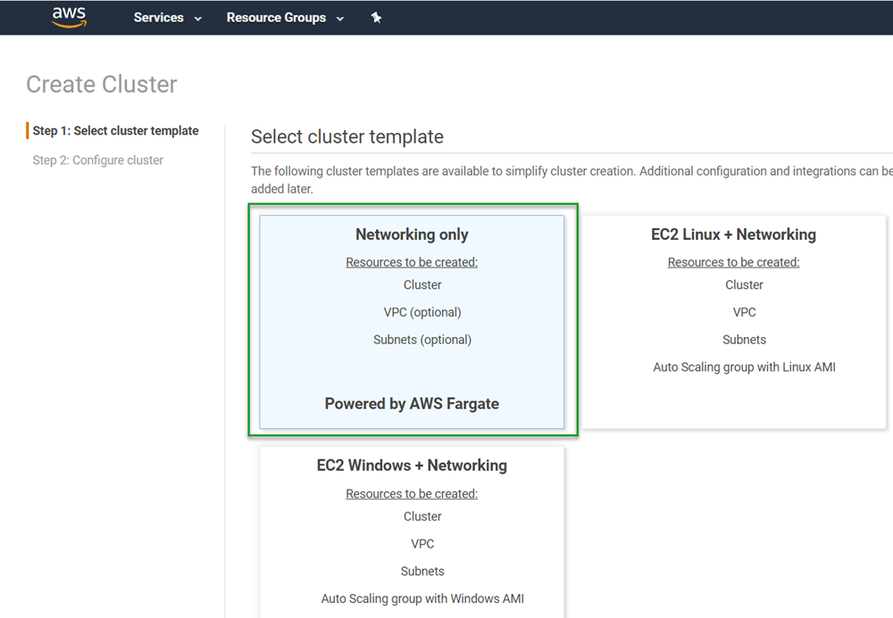

[Amazon Web Services (AWS) Fargate](https://aws.amazon.com/fargate/) has become a popular technology for deploying containerized applications without having to worry about back-end infrastructure management.  A question my team encounters quite often is can you use Octopus Deploy with AWS Fargate?  YES!  Not only can you use Fargate, you can use the AWS Elastic Container Registry (ECR) as an External Feed to Octopus Deploy.  In this post, I'll demonstrate an entire CI/CD pipeline using TeamCity, ECR, Octopus Deploy, and Elastic Container Services (ECS) Fargate.

## Create AWS resources
For this post, we'll need to create some resources within AWS to work with:
- Credentials
- ECR repo
- VPC
- Subnets
- Security group
- ECS cluster


### Create AWS credentials
Both TeamCity and Octopus Deploy are going to need some credentials to work with the AWS services.  The first thing that you'll need to do is log into the [AWS Management Console](https://aws.amazon.com/console/) and create an account using Identity and Access Management (IAM).  Once the account has been created, click on the user then the `Security Credentials` to create an `Access Key`.


Once the Access Key has been created, be sure to save the `Secret Key` as you will only be shown the value *once*.  The `Access Key` and `Secret Key` combination are what is used to authenticate with AWS.

:::hint
It is possible to use AWS IAM Roles for both TeamCity and Octopus Deploy for everything except the Octopus Deploy External Feed to ECR.  This post uses the Access Key/Secret Key method for simplicity and the ECR External Feed.
:::

### Retrieve AWS ECR registry information
Each container that you create will end up in it's own ECR repo and is region specific.  The URI for the repo consists of the following parts:
```text
<RegistryId>.dkr.ecr.<RegionName>.amazonaws.com/<RepoName>
```
The `RegistryId` and `RegionName` will be used for the connection that we'll create in TeamCity and the entire URI will be used when we tag our images.

To get what these values are, navigate to `Elastic Container Registry` in the AWS console

:::hint
Typing in `ecr` in the **Find Services** box is a quick shortcut to this
:::

If you don't currently have any ECR repositories, click on the **Get Started** button


If you have existing ECR repositiories, either click on the **Create repository** button or copy the URI for an existing repo


### Create or use an existing VPC
Fargate does not require a Virtual Private Cloud (VPC) so it is not necessary to create a VPC, however using an existing VPC will work just fine.  This post assumes that you already have some knowledge in AWS and know how to create VPC if needed.

### Create or use existing Subnets
Along with the VPC, Fargate does not require subnets to be defined. Just like the VPC, Fargate is perfectly capable of using existings items.  Again, this post assumes you already know how to create subnets if needed.

### Create or use existing Security Groups
Security groups are the one item that you may consider creating a new one for.  The reason for this is that in order to access your containers, you may need to define ports that aren't necessary for other AWS resources.  

The Octo Pet Shop application is a .NET Core application where the web front-end is using the built-in Kestrel web server, which uses the default port of 5000.  The Octo Pet Shop front-end is configured to automatically redirect HTTP traffic to HTTPS and is configured to use port 5001.  Those two ports aren't used by any other resources so I created a new Security Group for Octo Pet Shop.

To create a new Security Group, navigate to the `VPC` service within AWS Console and click on `Security Groups` on the left-hand side.  If you're following along with this post, create two Inbound rules for ports 5000 and 5001


### Create an ECS Cluster
The final resource we'll need is an ECS cluster to host our containers.  Navigate to ECS in the AWS Console.  Once there click on **Create cluster**.  On the next screen choose the `Networking only` template



Click **Next step**.  On the next screen, give your cluster a name then click **Create**.  The process is pretty quick, so it should only take at most a minute to complete.

With our AWS resources created, we can proceed to the build.

## Defining our TeamCity build
For this post, I'll be using TeamCity as a build server to build the Octo Pet Shop application as Docker containers and push them to AWS ECR.

### Create the project connection
In order to push our container images to ECR, we first need to configure the TeamCity project with a connection to AWS ECR.  This is accomplished by following these steps
1. Click on Projects
1. Select the project to add the connection to
1. Click **Edit Project**


4. Click **Connections** then the **Add Connection** button
5. Choose `Amazon ECR` from the drop down menu and fill in the following values
- AWS Region
- Access key ID
- Secret access key
- Registry Id


### Enable Build Feature
Once you have created a build definition for your Docker containers, you'll need to enable the Docker Support Build Feature.  To do so, navigate to your build definition and click on the **Build Features** tab.  Click the **Add build feature** button and choose `Docker Support`.  Choose the registry that you created for ECR and click **Save**


### Add your build steps
The Octo Pet Shop application consists of four major components:
- Web front-end
- Product Service
- Shopping Cart service
- DBUp database migrator

My build consists of only 6 steps
1. Set version number
1. Build Web
1. Build Product service
1. Build Shopping cart service
1. Build DBUp
1. Push Docker images to ECR

Steps 2-5 build their respective Docker images, then tag them using the following pattern `octopetshop-<component>:%build.number% 968802670493.dkr.ecr.us-west-1.amazonaws.com/octopetshop-<component>:%build.number%`.  For example, this is how the web front-end is tagged

```
octopetshop-web:%build.number% 968802670493.dkr.ecr.us-west-1.amazonaws.com/octopetshop-web:%build.number%
```

Step 6 pushes the Docker images to ECR in a single step.  Instead of the `build` option, it uses the `push` option with the following:
```
968802670493.dkr.ecr.us-west-1.amazonaws.com/octopetshop-web:%build.number%
968802670493.dkr.ecr.us-west-1.amazonaws.com/octopetshop-productservice:%build.number%
968802670493.dkr.ecr.us-west-1.amazonaws.com/octopetshop-shoppingcartservice:%build.number%
968802670493.dkr.ecr.us-west-1.amazonaws.com/octopetshop-database:%build.number%
```

### Run the build
Once executed, you should get output similar to this
```
Step 6/6: Push OctoPetShop-Web (Docker)
15:57:57
  Starting: /bin/sh -c "docker push  968802670493.dkr.ecr.us-west-1.amazonaws.com/octopetshop-web:1.0.20226.225747 && docker push  968802670493.dkr.ecr.us-west-1.amazonaws.com/octopetshop-productservice:1.0.20226.225747 && docker push  968802670493.dkr.ecr.us-west-1.amazonaws.com/octopetshop-shoppingcartservice:1.0.20226.225747 && docker push  968802670493.dkr.ecr.us-west-1.amazonaws.com/octopetshop-database:1.0.20226.225747"
15:57:57
  in directory: /opt/buildagent/work/7f2634c2d5e5df05
15:57:57
  The push refers to repository [968802670493.dkr.ecr.us-west-1.amazonaws.com/octopetshop-web]
15:57:57
  dae5c6c2d080: Preparing
15:57:57
  92dbf6df1786: Preparing
15:57:57
  9d32e62891bc: Preparing
15:57:57
  b22206f4fa7b: Preparing
15:57:57
  b701a024aaa5: Preparing
15:57:57
  0b565516ff7f: Preparing
15:57:57
  91ab7edbc80b: Preparing
15:57:57
  9262398ff7bf: Preparing
15:57:57
  804aae047b71: Preparing
15:57:57
  5d33f5d87bf5: Preparing
15:57:57
  4e38024e7e09: Preparing
15:57:57
  0b565516ff7f: Waiting
15:57:57
  91ab7edbc80b: Waiting
15:57:57
  9262398ff7bf: Waiting
15:57:57
  804aae047b71: Waiting
15:57:57
  5d33f5d87bf5: Waiting
15:57:57
  4e38024e7e09: Waiting
15:58:00
  b22206f4fa7b: Pushed
15:58:01
  9d32e62891bc: Pushed
15:58:01
  dae5c6c2d080: Pushed
15:58:04
  92dbf6df1786: Pushed
15:58:16
  804aae047b71: Pushed
15:58:16
  91ab7edbc80b: Pushed
15:58:31
  5d33f5d87bf5: Pushed
15:58:52
  0b565516ff7f: Pushed
15:58:56
  9262398ff7bf: Pushed
15:59:02
  4e38024e7e09: Pushed
15:59:24
  b701a024aaa5: Pushed
```
With the images pushed to ECR, we can hop over to Octopus Deploy to create the deployment process.

## Octopus Deploy
In order to use the images that were pushed to ECR in our deployment process, we must first configure an External Feed within Octopus Deploy pointing to our ECR registry.

### Create ECR External Feed
Creating an Exteranl Feed in Octopus Deploy is quite easy.  First, navigate to **Library**, then choose **External Feeds**.  Once on the External Feeds screen, click on **ADD FEED**.  Choose `AWS Elastic Container Registry` from the drop down and fill in the following:

- Name
- Access Key
- Secret Key
- Region

Then click **SAVE**

### Define deployment process
This post assumes you are familiar enough with Octopus Deploy to be able to create a project and will focus on the AWS Farget specific components of the deployment.

Before we get started adding steps, we need to first add some variables that we'll use in our process

There are just a couple of steps that are required to deploy the Octo Pet Shop application to Fargate.  For simplicity, I'll be configuring the Docker containers to be run within the same ECS Service.  This makes it easier for the containers to be able to talk to each other without having to navigate over networks.