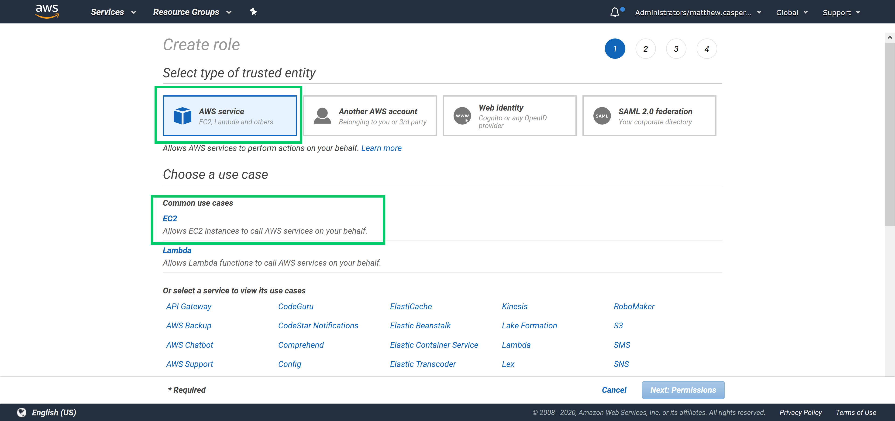
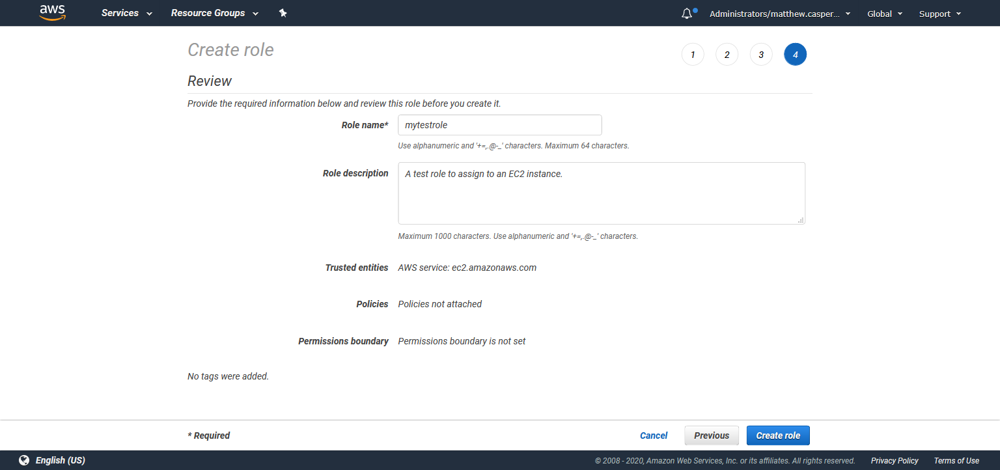
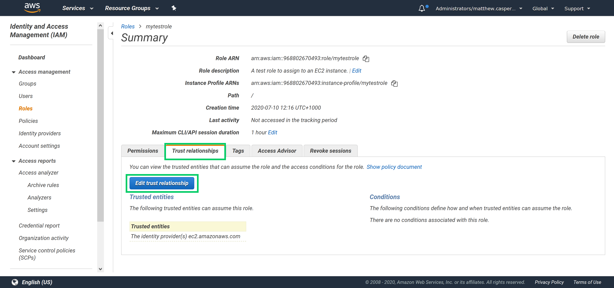
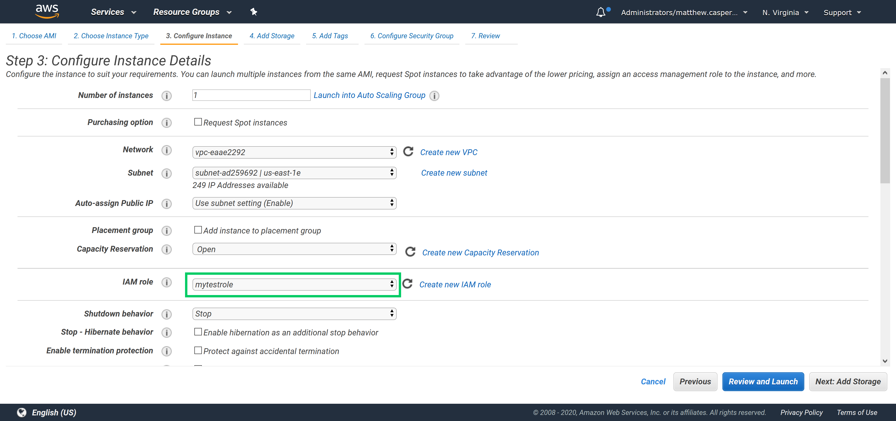
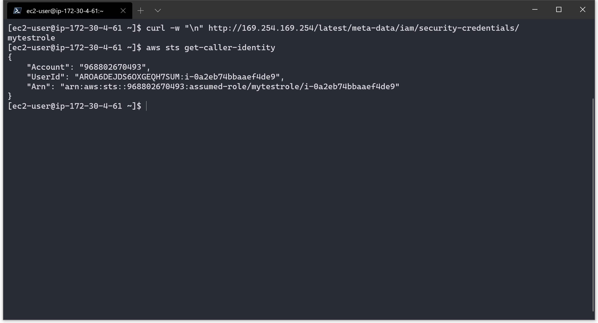
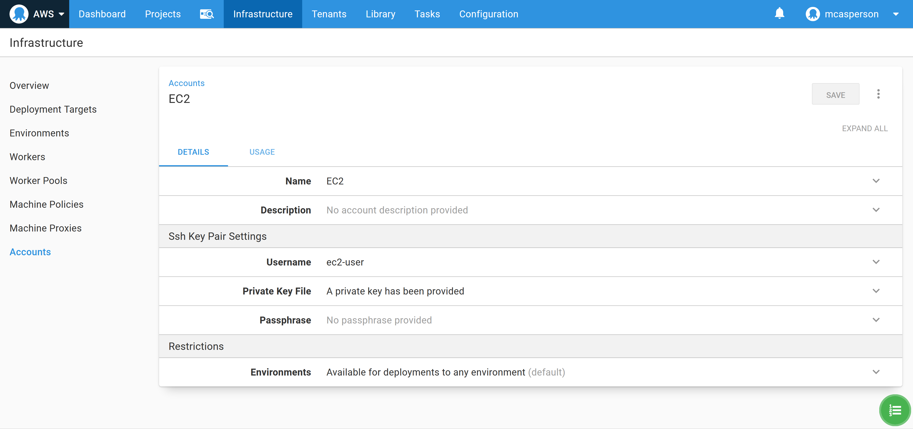
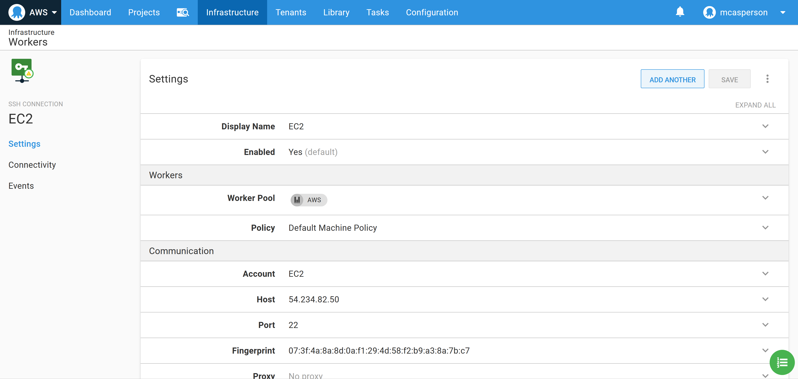

Managing credentials for cloud providers is a challenge, especially when you consider that you won't have the luxury of physical security, meaning one leaked admin key could grant access to your entire account from anywhere in the world. Nor are cloud accounts immune from the preverbal "rf -rf" scenario where an admin account accidentally deletes resources they shouldn't.

IAM roles can be used to provide task specific authorization, and when a role is assigned to an EC2 instance, users with access to that VM can inherit the role.

In this blog post we'll take a look at IAM roles in AWS and learn how they can be used in Octopus.

## Creating a role

Roles are created in the AWS  IAM console. When you create a new role, you will be presented with a list of services that the role will apply to. With the default selection of **AWS service** selected, click the **EC2** link:



We won't attach any permissions or tags to this role, so skip to the end, give the role a name and create it:



Open up the newly created role, click the **Trust relationships** tab, and click the **Edit trust relationship** button:



The trust relationship is a JSON structure that configures which service or user can inherit the role. Because we selected the EC2 service when creating the role, the EC2 service has been granted the ability to assume it:

```
{
  "Version": "2012-10-17",
  "Statement": [
    {
      "Effect": "Allow",
      "Principal": {
        "Service": "ec2.amazonaws.com"
      },
      "Action": "sts:AssumeRole"
    }
  ]
}
```

## Assigning a role to an EC2 instance

The role can be assigned to a new EC2 instance when it is created:



When you log into this instance, the name of the role assigned to the VM is available from the instance metadata HTTP interface with the command:

```
curl http://169.254.169.254/latest/meta-data/iam/security-credentials/
```

We can also verify the role that commands issued through tools like the AWS CLI assume with the command:

```
aws sts get-caller-identity
```

In both cases we see the role **mytestrole**:



What this means is that tools that are aware of the instance metadata HTTP interface can operate with the role assigned to the EC2 instance. So long as you have access to the VM, you can interact with AWS with the associated IAM role.

The AWS CLI is one example of a tool that is aware of the instance metadata, and Octopus tentacles are another. We can take advantage of the EC2 IAM roles and Octopus workers to run commands against AWS services without any AWS credentials.

## EC2 as Octopus worker

To connect to the Linux VM we need to create a **SSH Key Pair** account with the certificate used when the VM was created. For VMs created with Amazon AMIs, the username is **ec2-user**:



We can then create a SSH worker and connect to the VM:

