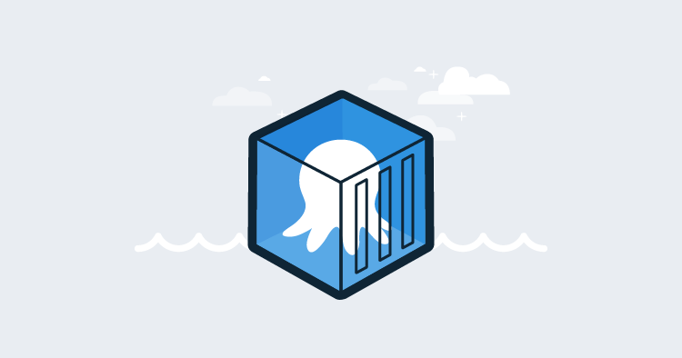
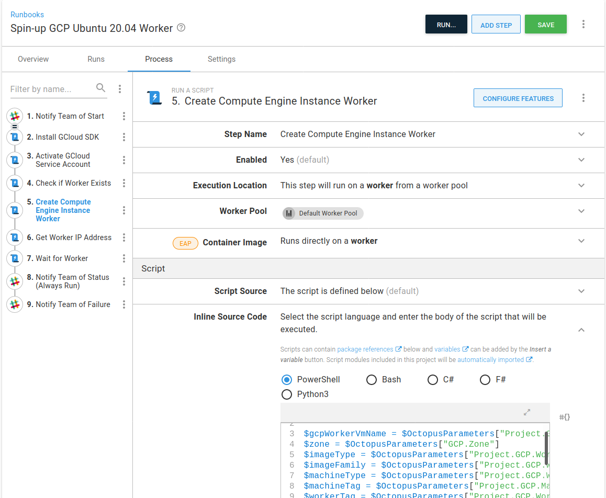
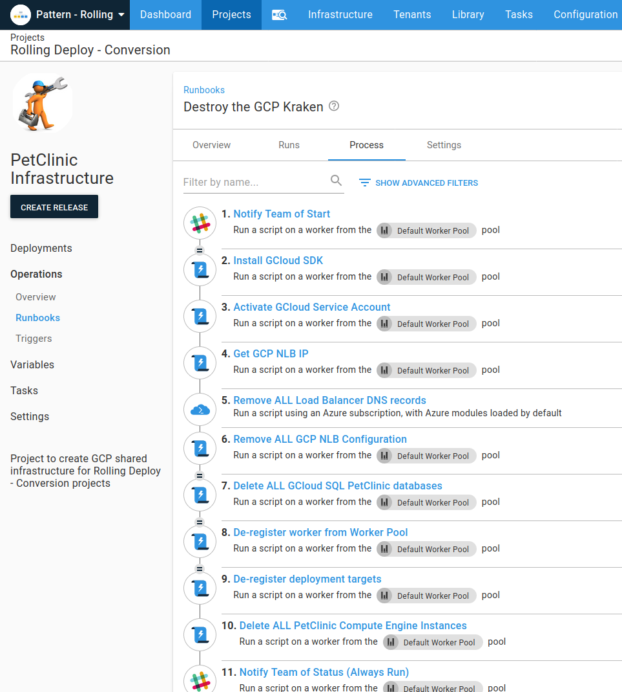
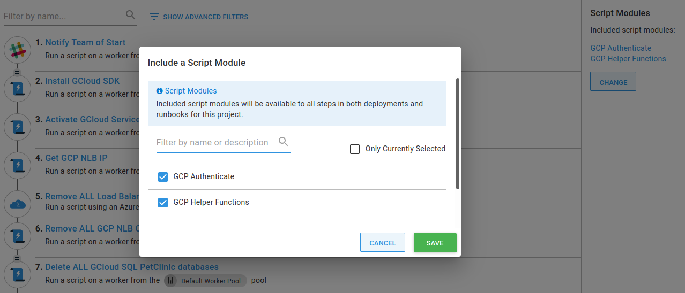
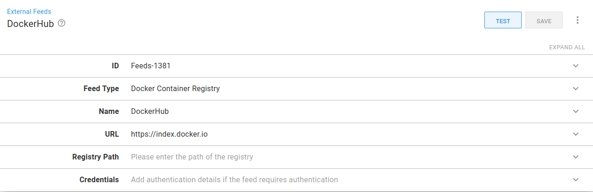
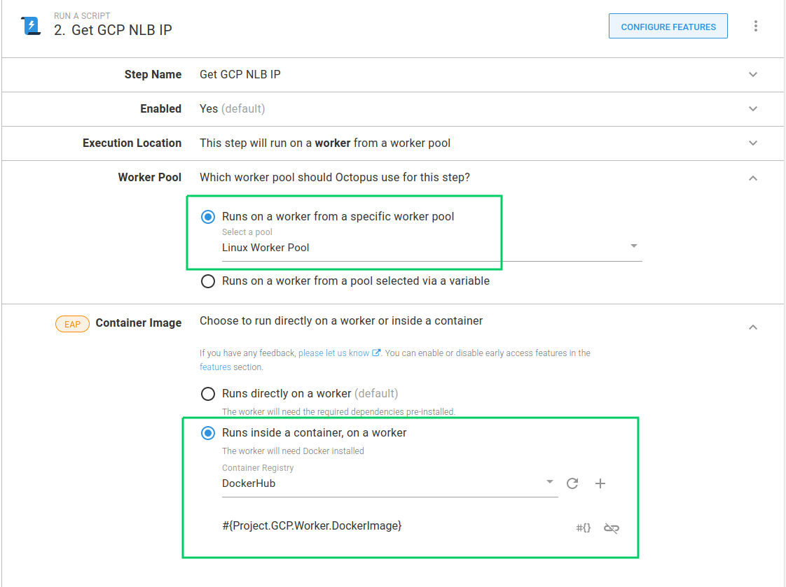
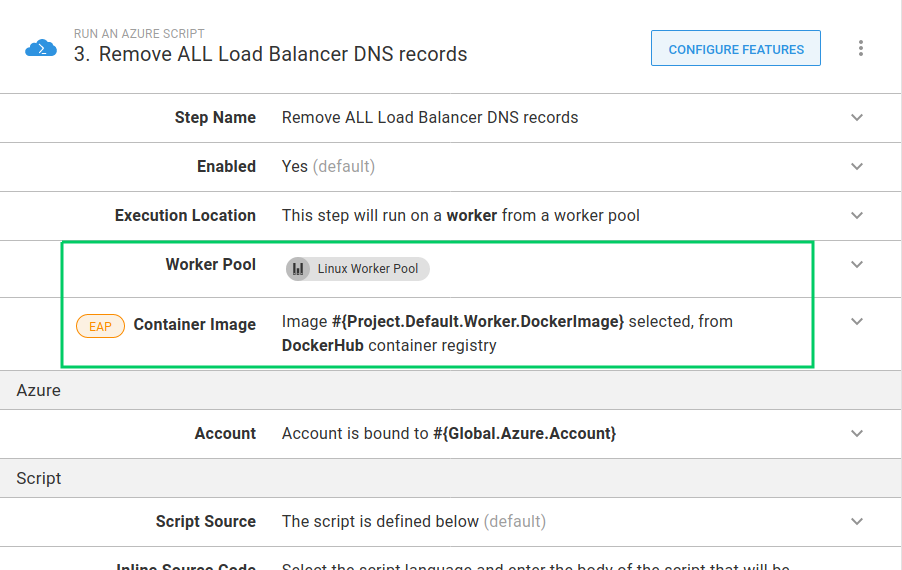
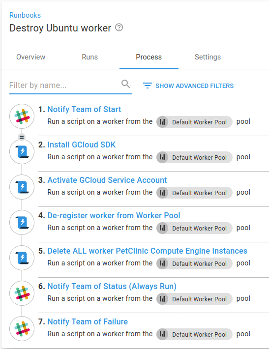
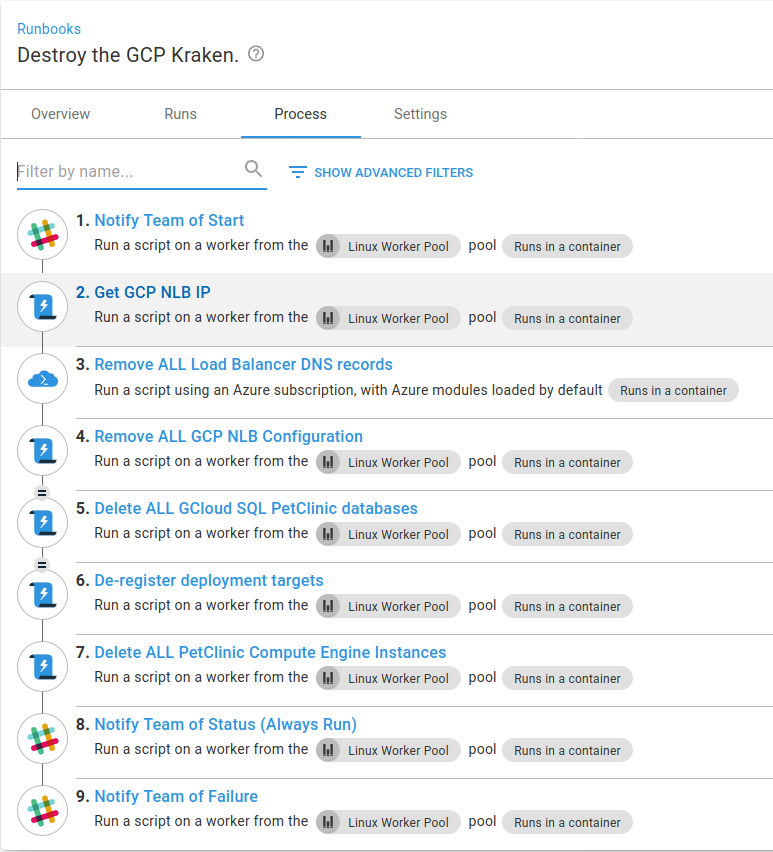

Following on from my previous post, [Execution containers for workers](https://octopus.com/blog/extending-octopus-execution-container), I want to change a runbook from running the steps directly on a worker to using [execution containers](https://g.octopushq.com/ExecutionContainersForWorkers). Doing this will mean I can have the minimum installed on my worker machine, and instead maintain software versions in the Docker images I use as execution containers.

I’m using the project [PetClinic Infrastructure](https://g.octopushq.com/PatternRollingSamplePetClinicIacRunbooks), which spins up Google Cloud (GCP) infrastructure for other projects to deploy to in the **Pattern - Rolling** space on our samples instance.

:::hint 
You can read about the projects in the **Pattern - Rolling** space in Mark’s blog [Convert an existing application to use rolling deployments](https://octopus.com/blog/convert-to-rolling-deployments).

:::

## Set up the worker machine

The project already makes use of a specific worker machine that it spins up, I’m going to take the [runbook](https://samples.octopus.app/app#/Spaces-45/projects/petclinic-infrastructure/operations/runbooks/Runbooks-445/process/RunbookProcess-Runbooks-445) that creates the worker machine and make sure it installs Docker.  To do this, I need to update the bootstrapping script used as a startup script on the newly created GCP VM.  I took an existing script that installs the required software on a new machine and added the following to install Docker:

```bash
# Install Docker
apt-get update
apt-get -y install apt-transport-https ca-certificates curl software-properties-common
curl -fsSL https://download.docker.com/linux/ubuntu/gpg | sudo apt-key add -
add-apt-repository "deb [arch=amd64] https://download.docker.com/linux/ubuntu bionic stable"
apt-get update
apt-get -y install docker-ce docker-ce-cli containerd.io

```

The complete script is available on [GitHub](https://github.com/OctopusSamples/IaC/blob/master/gcp/bootstrap/gcp-linux-listening-worker-install-and-register-docker.sh).

Then, for the runbook to use the new script, I update the `Project.GCP.Targets.StartupScriptUrl` project variable to point to the raw version: https://raw.githubusercontent.com/OctopusSamples/IaC/master/gcp/bootstrap/gcp-linux-listening-tentacle-wildfly.sh.  This variable is used by the `Create Compute Engine Instance Worker` step. 



## Create the Docker image

The bulk of the work in the project I’m working on uses [Google Cloud (GCP)](https://cloud.google.com/).  All of the scripts in this project are in PowerShell, for this first pass of updates, I’m going to stick with that.  This means I need an image with the [Google SDK](https://cloud.google.com/sdk/install) and [PowerShell](https://github.com/powershell/powershell).  Here’s my Dockerfile:

```dockerfile
FROM ubuntu:18.04

ARG DEBIAN_FRONTEND=noninteractive
ARG Azure_Cli_Version=2.9.0\*
ARG Powershell_Version=7.0.0\*

# get `wget` & utils & software-properties-common
# https://docs.microsoft.com/en-us/powershell/scripting/install/installing-powershell-core-on-linux?view=powershell-7#ubuntu-1804
RUN apt-get update && \ 
    apt-get install -y wget apt-utils curl && \
    apt-get install -y software-properties-common 

# get powershell for 18.04
RUN wget -q https://packages.microsoft.com/config/ubuntu/18.04/packages-microsoft-prod.deb && \
    dpkg -i packages-microsoft-prod.deb && \
    apt-get update && \
    add-apt-repository universe && \
    apt-get install -y powershell=${Powershell_Version}

# Install Google SDK
RUN echo "deb [signed-by=/usr/share/keyrings/cloud.google.gpg] https://packages.cloud.google.com/apt cloud-sdk main" | tee -a /etc/apt/sources.list.d/google-cloud-sdk.list && \
  apt-get -y install apt-transport-https ca-certificates gnupg && \
  curl https://packages.cloud.google.com/apt/doc/apt-key.gpg | apt-key --keyring /usr/share/keyrings/cloud.google.gpg add - && \
  apt-get update && apt-get -y install google-cloud-sdk

RUN apt-get clean

```

I’ve built this and published it to my Docker repository on Docker hub: `octocrock/gcp-tools`.

## Update the runbook to use execution containers 

The runbook I’m going to convert to use execution containers is **Destroy the GCP Kraken**. This runbook removes all the deployment target infrastructure.  



This runbook also de-registers and deletes the worker machine.  Part of this refactoring is to extract those steps to a separate runbook. I’ve created a new runbook, **Destroy Ubuntu worker**, to use for this, and I can copy any steps across that are of use.

### The Google Cloud SDK

In the Dockerfile above, I installed the `google-cloud-sdk`.  In the runbook, there is a step to install the SDK on the worker machine.  As I’m going to use the Docker image as an execution container, installing the SDK is no longer required. After I’ve copied the step to my **Destroy Ubuntu worker** runbook,  I’ll delete the **Install GCloud SDK** step.

### Authentication

The runbook has a step that sets the authentication scope. This needs to change as we need to set the authentication scope on each step.  We can refactor this out to a reusable [script module](https://g.octopushq.com/ScriptModules).

I’ll go to **{{ Library, Script Modules, Add Script Module }}**, and add the following PowerShell code I copied from the **Activate GCloud Service Account** step:

```Powershell
function Set-GCPAuth() {
  $JsonKey = $OctopusParameters["GCP.ServiceAccount.Key"]
  $JsonFile = [System.IO.Path]::GetTempFileName()

  if (Test-Path $JsonFile)
  {
      Remove-Item $JsonFile -Force
  }

  New-Item $JsonFile -Type "File" -Force

  $JsonKey | Set-Content $JsonFile
  $gcpServiceAccountEmail = $OctopusParameters["GCP.ServiceAccount.Email"]
  $gcpProjectName = $OctopusParameters["Project.GCP.ProjectName"]
  Write-Host "Activating service account $gcpServiceAccountEmail"

  Write-Host "##octopus[stderr-progress]"
  gcloud auth activate-service-account $gcpServiceAccountEmail --key-file=$JsonFile --project=$gcpProjectName --quiet
  Test-LastExit "gcloud auth activate-service-account"

  if (Test-Path $JsonFile)
  {
      Write-Host "Clearing up temp auth file"
      Remove-Item $JsonFile -Force
  }
}
```

Then I just need to go into my runbook, include the newly created script module by clicking `Change` and selecting **GCP Authenticate**:



Now, after I’ve copied the step to my **Destroy Ubuntu worker** runbook, I can delete the step **Activate GCloud Service Account**.

### Specify the execution container

The first step in the runbook that I’m going to change to use an execution container is **Get GCP NLB IP**. Before using a container, I have to set up an [external feed](https://g.octopushq.com/DockerRegistries) for [DockerHub](https://hub.docker.com/).  To do this, navigate to **{{ Library, External Feeds, Add Feed }}**.



In the runbook, most steps are running GCP scripts, but one uses the Azure CLI to manage DNS.  I’m going to set two variables to specify the Docker images.  

- `Project.Default.Worker.DockerImage`: This has a value of `octopusdeploy/worker-tools:1.0-ubuntu.18.04`. The default image I’m going to use is the Octopus [worker-tools](https://hub.docker.com/r/octopusdeploy/worker-tools/) image. This will run the Azure CLI step.  The image doesn’t have the GCP CLI installed though.
- `Project.GCP.Worker.DockerImage`: This has a value of `octocrock/gcp-tools:1.0.0` and points to the image created from the Dockerfile created above.

The **Get GCP NLB IP** runbook step runs a script that uses GCloud.  I can set the step to use the Worker Pool that contains the machine I’ve configured with Docker installed. I select **Linux Worker Pool**.  I also set the container image to use by specifying the `Project.GCP.Worker.DockerImage` variable.



As I mentioned above, each step needs to authenticate with GCP, so now we need to set that in the script.  The current script code for this step is:

```powershell
CheckForGCPSDK

$projectName = $OctopusParameters["Project.GCP.ProjectName"]
$loadbalancerIPName = $OctopusParameters["Project.GCP.LoadBalancer.ExternalIP.Name"]

Write-Host "Getting compute address matching name: $loadbalancerIPName"
Write-Host "##octopus[stderr-progress]"
$ipAddress=(& $GCloudExecutable compute addresses list --project=$projectName --filter="name=($loadbalancerIPName)" --format="get(address)" --quiet)
Test-LastExit "gcloud compute addresses list"

if( -not ([string]::IsNullOrEmpty($ipAddress))) 
{
    Write-Highlight "Found $loadbalancerIPName of: $ipAddress"
    Set-OctopusVariable -name "IPAddress" -value $ipAddress
}
else {
    Set-OctopusVariable -name "IPAddress" -value ""
```

The first command here is now obsolete, the check for GCP being installed, as we know it is included in the Docker image we’re using.  I’m going to replace it with a call to the function created for GCP authentication, `Set-GCPAuth`.  

Next, because we’re using the GCP CLI directly in the container, I can change the reference `$GCloudExecutable` to `gcloud`.

The updated script looks like this:

```powershell
Set-GCPAuth

$projectName = $OctopusParameters["Project.GCP.ProjectName"]
$loadbalancerIPName = $OctopusParameters["Project.GCP.LoadBalancer.ExternalIP.Name"]

Write-Host "Getting compute address matching name: $loadbalancerIPName"
Write-Host "##octopus[stderr-progress]"
$ipAddress=(& gcloud compute addresses list --project=$projectName --filter="name=($loadbalancerIPName)" --format="get(address)" --quiet)
Test-LastExit "gcloud compute addresses list"

if( -not ([string]::IsNullOrEmpty($ipAddress))) 
{
    Write-Highlight "Found $loadbalancerIPName of: $ipAddress"
    Set-OctopusVariable -name "IPAddress" -value $ipAddress
}
else {
    Set-OctopusVariable -name "IPAddress" -value ""
}
```

And that’s all we need for this step to run inside a container on a worker.  The same changes are needed on all other steps that use GCP scripts.

### Azure CLI step

The DNS records referenced by this runbook are managed in Microsoft Azure. The step to remove the DNS records needs a different Docker image that has the Azure CLI installed.  

I’m going to set the **Remove ALL Load Balancer DNS records** step to use the `Project.Default.Worker.DockerImage` variable that I set up above.



This Docker image can be used for the Slack message steps as well.  

### Extracting the destruction of the worker machine to a new runbook

As I mentioned above, there is a new runbook **Destroy Ubuntu worker**, which will tear down the worker machine.  In addition to the previous steps, I’ve copied across the notification steps and moved the **De-register worker from Worker Pool** step from the **Destroy the Kraken** runbook.



Lastly, we need to ensure that the worker is not deleted from GCP when the compute engine instances are deleted in the **Destroy the GCP Kraken** runbook.  This involves changing the line that selects compute resources to ignore the worker machine:

```powershell 

$instanceList=(& gcloud compute instances list --project=$gcpProjectName --filter="tags.items=$machineTag AND -tags.items=$workerTag" --format="get(name)" --quiet)

```

By adding the clause of `AND -tags.items=$workerTag` the query has changed so that items with our worker machine tag will not be selected.

Conversely, in the **Destroy Ubuntu worker** runbook, the line in the step to delete the worker compute instances selects just those resources with the `$workerTag`:

```powershell

$instanceList=(& $GCloudExecutable compute instances list --project=$gcpProjectName --filter="tags.items=$workerTag" --format="get(name)" --quiet)

```

#### Finishing up

Here is the completed **Destroy the Kraken** runbook:



## Conclusion

It is great how straight forward it was to convert this runbook to use execution containers.  We can now use the GCP Docker image elsewhere, confident an update to the tooling versions will be picked up across all projects by updating the version of the image to select in the variable.  To further reduce the steps, we could set up a library variable set and set the value globally.  We could even set the version to use as `latest`, although this is not recommended, as there is less control over when to absorb changes made to the image.
