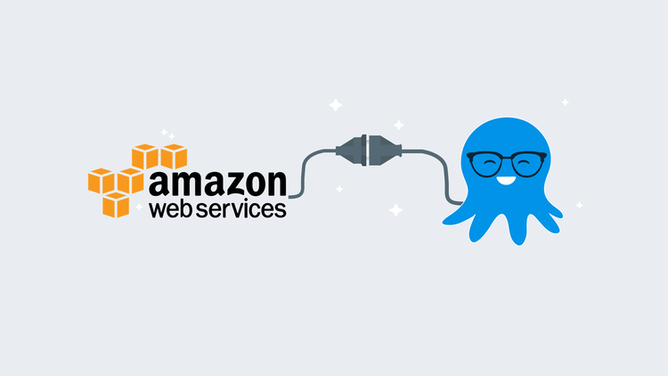
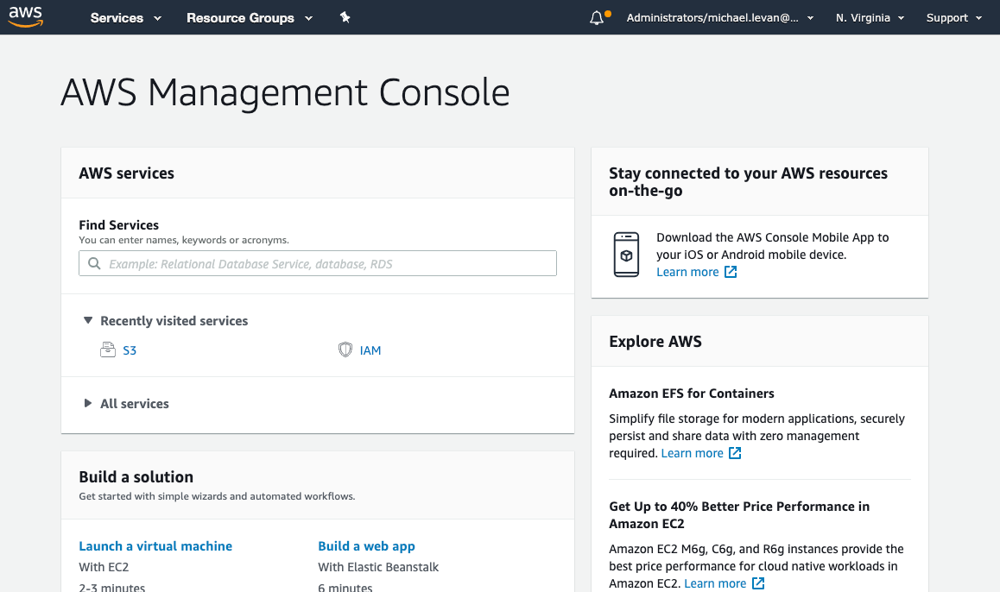
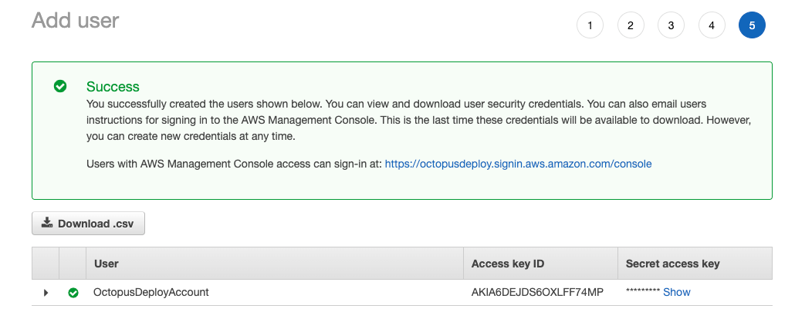
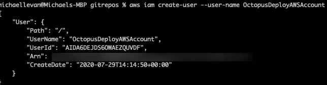
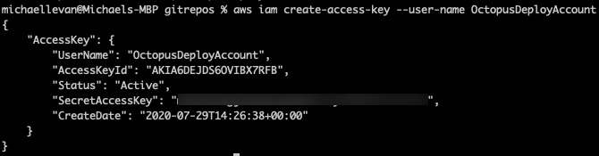
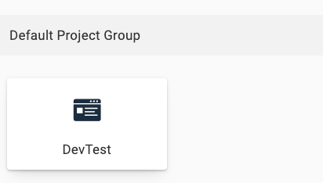
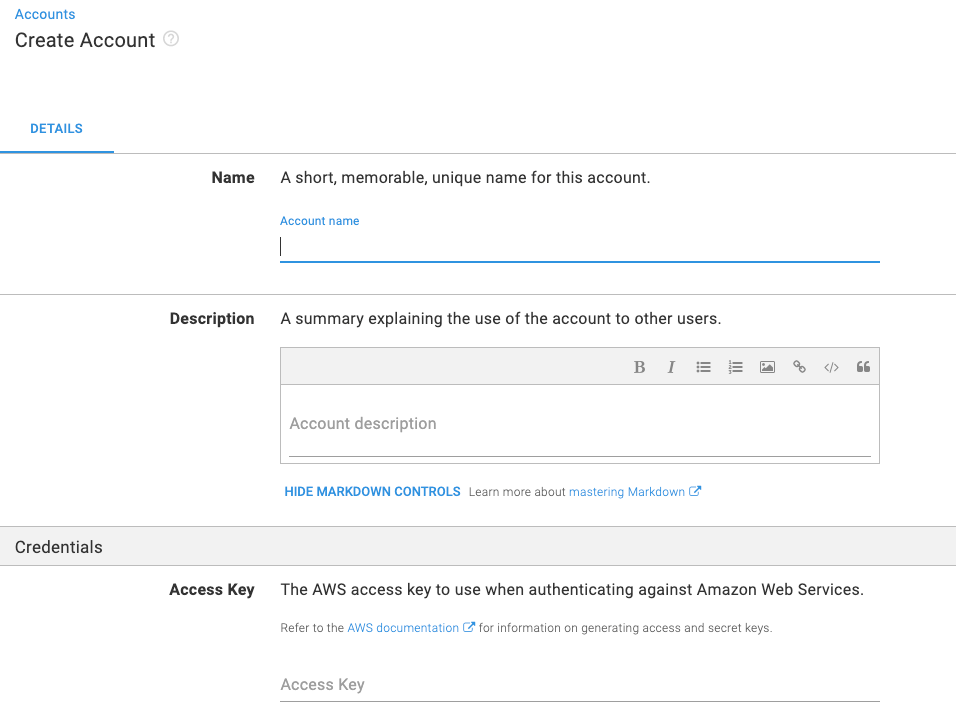

When you’re working with any cloud provider, you want an easy way to connect to the cloud. You don’t want to worry about creating custom scripts, API calls, and duct-tape workarounds just to deploy code or build infrastructure with Continuous Delivery.

Octopus Deploy has a clean and straight-forward way to connect to many cloud providers. In this blog post, you will learn how to connect Octopus Deploy to AWS.

## Prerequisites

To follow along with this blog post, you need to have:

- An AWS account.
- An Octopus Deploy server, either an on-premises instance of Octopus Server or an Octopus Cloud instance.

!include <register>

## Creating an IAM user

Before deploying from Octopus Deploy to AWS, you need an authentication method. Because Octopus Deploy will deploy infrastructure or applications to AWS, AWS needs to know *who* Octopus Deploy is. The typical authentication method for AWS is Identity and Access Management ([IAM](https://aws.amazon.com/iam/#:~:text=AWS%20Identity%20and%20Access%20Management%20(IAM)%20enables%20you%20to%20manage,offered%20at%20no%20additional%20charge.)), which provides an access key and secret.

### Create the IAM user in the UI

1. To create an IAM user in the AWS UI, open a web browser and go the [AWS console](https://aws.amazon.com/console/):



2. Under **Find Services** in the search bar, type in **IAM**.
3. Click on the **Users** option under **Access management**.
4. To create the new user that will have access to AWS from Octopus Deploy, click the blue **Add user** button.
5. Under Set user details, create an appropriate name for the user name. For example, `OctopusDeployAccount`.
6. In the **Select AWS access type** section, select the **Programmatic access** option. Octopus Deploy will make API calls to AWS at the SDK level. 
7. Click the blue **Next: Permissions** button.

Permissions for the user are going to depend on what AWS services you want Octopus Deploy to have permissions for. For example, let’s say you want Octopus Deploy to just deploy EC2 instances, in that case, you give the IAM user access to something like `AmazonEC2FullAccess`. 

8. For the purposes of this blog post, we want Octopus to communicate with all AWS services, so we’ll choose the `AdministratorAccess` policy under **Attach existing policies directly**. After you choose the `AdministratorAccess` option, click the blue **Next: Tags** button as shown in the screenshot below.

9. Tags aren’t necessary for the purposes of this blog post, so you can click the blue **Next: Review** button.
10. Finally, to create the new IAM user, click the blue **Create user** button.

You will be shown a screen that contains the Access key ID and the Secret access key. Save the Secret access key in a secure location because you will not be able to access it again. However, you can create a new secret access key if you lose this one. The Access key ID and Secret access key will be used for the Octopus Deploy authentication.



### IAM user on the CLI

As you saw in the previous section, creating an IAM user and adding them to the appropriate policy can be a bit cumbersome and requires a lot of clicking around. If you use the [AWS CLI](https://aws.amazon.com/cli/), there is a much easier way with just a few lines of code.

The first piece of code creates the new IAM user:

```
aws iam create-user --user-name OctopusDeployAWSAccount
```

The output should be similar to the screenshot below:



Next, you need to create the Secret access key. The Secret access key acts as a *password* of sorts.

To create the Secret access key, run the code below:

```
aws iam create-access-key --user-name OctopusDeployAccount
```

The output should look similar to the screenshot below:



You are now ready to connect the AWS IAM account to Octopus Deploy.

## Connecting AWS to Octopus Deploy

In the previous section you learned about creating the ability to have Octopus Deploy interact with AWS at a programmatic level. Now that you understand the purpose of the access and secret keys, it’s time to set up the AWS account in Octopus Deploy.

1. Open up a web browser and go to the Octopus Deploy Web Portal:



2. Navigate to **{{Infrastructure, Accounts}}** to set up the new AWS account.
3. Under **Accounts**, click the green **ADD ACCOUNT** button and choose **AWS Account**:



4. Under **Details**, you can add metadata about your account; the name and description.
5. Next, under **Credentials**, you can add the AWS access key and secret key.
6. Finally, you can set restrictions under the Restrictions section. For example, I’ve chosen to allow this account for my Dev environment only.
7. Click the green **SAVE** button on the top of the page.

Congrats! You have successfully set up an AWS account in Octopus Deploy.

## Conclusion

The need to interact with different cloud-based platforms is not a need that will go away. Regardless of what Continuous Delivery and Deployment tool you’re using, there will always be a reason for authentication from the CD tool to a cloud, or even on-premises, platform. 

Happy Deployments!
