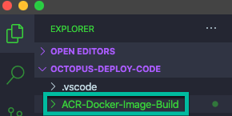
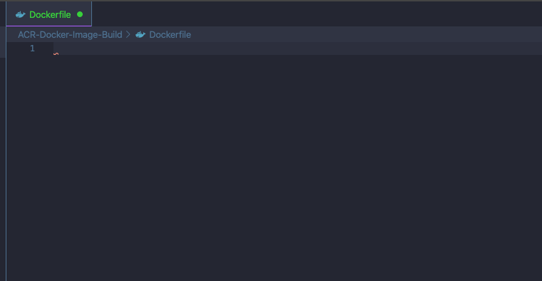
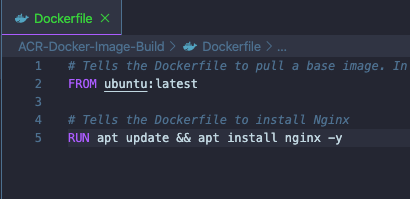

When you think about creating a Docker image, the thought process is generally always the same. You first create a Dockerfile then build the Dockerfile with `docker build` and boom, you have a Docker image. However, if you work in Azure and use Azure Container Registry ([ACR](https://azure.microsoft.com/en-us/services/container-registry/)), there's a different approach. 

Azure CLI has a specific command that allows you to take a Dockerfile, build a Docker image, and store it in ACR. In this blog post, you'll take a hands-on approach at learning just that.

## Prerequisites

To follow along with this blog post, you'll need:

1. An Azure account. If you don't already have one, you can sign up for a 30-day free trial [here](https://azure.microsoft.com/en-us/free/).
2. Azure CLI installed. If you don't already have Azure CLI, you can install it [here](https://docs.microsoft.com/en-us/cli/azure/get-started-with-azure-cli?view=azure-cli-latest).
3. Visual Studio Code (VS Code) installed. Although not required, VS Code is the text editor/IDE that will be used in this blog post. You can find it [here](https://code.visualstudio.com/download).

## Creating the Dockerfile

The first step before creating a Docker image is ensuring you have a proper Dockerfile ready for Azure CLI to create a Docker image out of. You can either go with a complicated Dockerfile or something simple just to see the process. For the purposes of this blog post, you'll see a simple, yet efficient example of creating a Dockerfile.

1. In a location of your choosing, like the desktop, create a new directory called **ACR-Docker-Image-Build**. Although the name of the directory isn't mandatory, that's what this blog post will be following.
2. Open up VS Code and open the newly created directory.



  3. Within the **ACR-Docker-Image-Build** directory, create a new Dockerfile.



  4. Within the Dockerfile, add in the following code:

```bash
# Tells the Dockerfile to pull a base image. In this case, it's using Ubuntu
FROM ubuntu:latest

# Tells the Dockerfile to install Nginx
RUN apt update && apt install nginx -y
```



Now that the Dockerfile is created and saved, it's time to create the container registry.

## Creating an Azure Container Registry

In the previous section, you created the Dockerfile that will use Ubuntu as a base image and install Nginx on it. Now that the Dockerfile is created, you're able to take that Docker file and build a Docker image to store in ACR.

### Azure Container Registry with Azure CLI

ACR can get created in many ways. Because this blog post is following the pattern of using Azure CLI, you will create the ACR with the `az acr` command.

1. Open up a terminal.
2. Change directory (`cd`) into the directory that contains the Dockerfile. This is so once the Docker image is built, the Azure CLI commands can look in the local directory for the Dockerfile.
3. There are a few switches that are required for the `az acr create` command to work. Let's take a look at what each means and then run the code:
    - `--name` is the name of the Azure Container Registry.
    - `--resource-group` is the resource group that the ACR will reside in.
    - `--sku` is specifying what tier you want to use for ACR.

    ```bash
    az acr create --name 'nginxreg' --resource-group 'MichaelLevanResources' --sku Basic
    ```

### Logging into the Registry

Now that the ACR is created, you need to log into it. It may seem strange because you're already logged into the Azure CLI, but it makes sense. Microsoft does this for the reason of if you have multiple ACRs, you can log into one at a time.

To log into the ACR, run the following command:

```bash
az acr login --name 'nginxreg'
```

### Building the Docker Image

The ACR is built, logged into, and you're now ready to build the Docker image. Using the `az acr build` command, you can run the build process. Before running the build process, let's take a look at the switches.

- `--registry` is specifying the registry where you want the Docker image to exist.
- `--file` is specifying that you want to create the image based on an existing Dockerfile.

```bash
az acr build  --registry 'nginxreg' -t devnginx --file Dockerfile .
```

## Conclusion

If you've worked with Docker before, you know that creating a Dockerfile and a Docker image is typically done in one way, with `docker build`. If you're working in the Azure space, Microsoft provides you with another option that can easily tie into an automation process, using the `az acr build` command. 

In this blog post, you took a hands-on approach at building a Dockerfile, creating an ACR, and building a Docker image and pushing it directly to ACR.