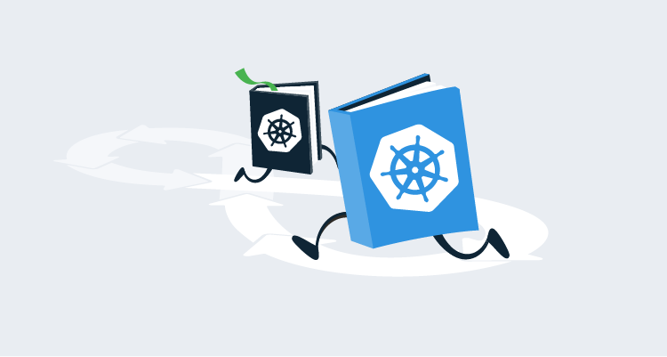

The previous blogs in this series have all focused on how to use the opinionated steps in Octopus to perform Kubernetes deployments. But there are times when you need to jump into a script. Maybe you want to take advantage of a custom scripting tool like [istioctl ](https://istio.io/docs/ops/diagnostic-tools/istioctl/) or use some advanced or uncommon properties exposed by Kubernetes resources. For these situations, Octopus allows you to write custom scripts against kubectl.

In this post, we'll look at some of the tricks you can take advantage of to create flexible and reusable scripts running against your Kubernetes cluster.

## Create a kubectl script

The **Run a kubectl CLI script** step exposes the ability to write scripts against a Kubernetes cluster:

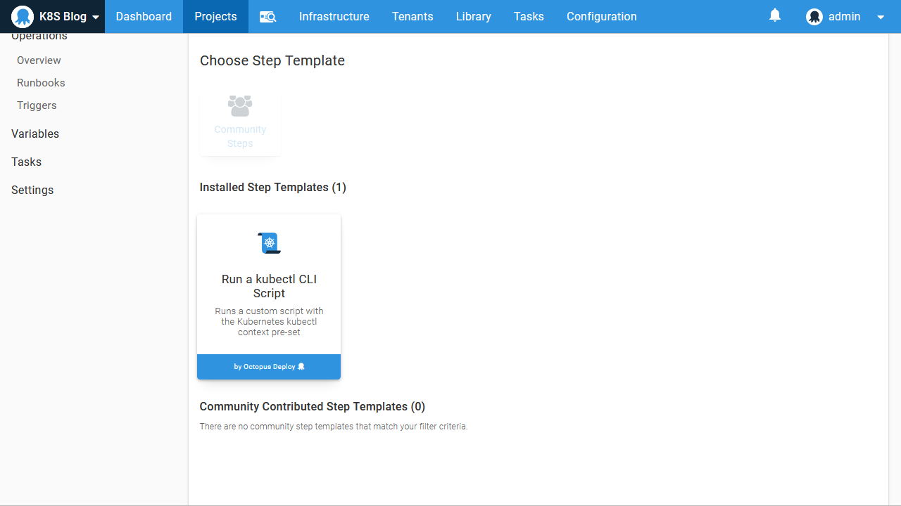

This step is similar to the other script steps in Octopus, with the exception that it must be run against a Kubernetes target. Behind the scenes, Octopus takes the details of the Kubernetes target and constructs a configuration file scoped to the script being run. It does this by setting the `KUBECONFIG` environment variable to the path of the newly generated configuration file, which then allows all subsequent calls to `kubectl` to be directed to the Kubernetes target.

Here is a sample PowerShell script that shows the environment variable and the contents of the configuration file:

```powershell
echo "KUBECONFIG environment variable is set to: $($env:KUBECONFIG)"
echo "kubectl config view returns:"
kubectl config view
```

Here is a screenshot of the result:

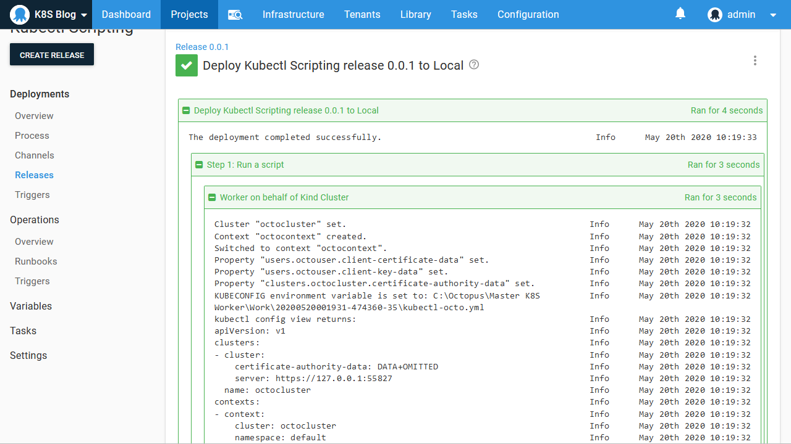

From the output, we can see that the Kubernetes configuration file has been saved to `C:\Octopus\Master K8S Worker\Work\20200520001931-474360-35\kubectl-octo.yml`, which is a temporary directory created to hold the working files required by the step. We can also see how the configuration file has been constructed with the details saved in the Kubernetes target.

## Using variables in scripts

Our script has access to all the variables available when the step runs. The easiest way to see the variables that are available is to set the [Octopus variable](https://octopus.com/docs/support/how-to-turn-on-variable-logging-and-export-the-task-log) `OctopusPrintVariables` or `OctopusPrintEvaluatedVariables` to `True`:

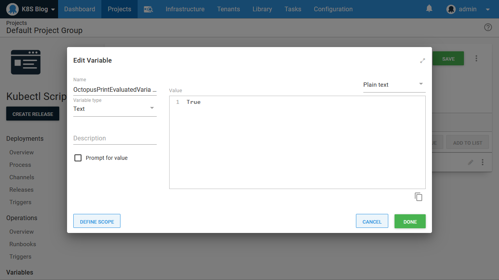

With this variable defined, the verbose logs will show the available variables and their values. This is a convenient way to browse the variables that can be used in your scripts:

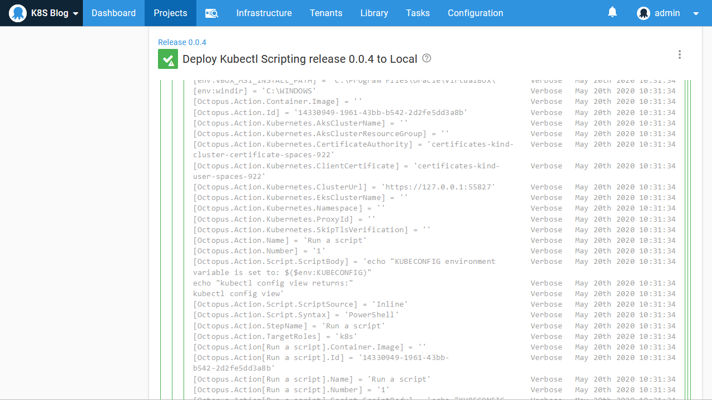

## Referencing Docker images

One of the advantages of the Octopus deployment process is that the deployment logic is relatively static, even though the packages change each time. This is implemented by performing package selection at deployment time.

This process is not inherent to Kubernetes, though. For example, in the deployment YAML below, you can see we have hardcoded a reference to the Docker image `mcasperson/mywebapp:0.1.7`:

```
apiVersion: apps/v1
kind: Deployment
metadata:
  name: mydeployment
  labels:
    app: mydeployment
spec:
  selector:
    matchLabels:
      app: mydeployment
  replicas: 1
  strategy:
    type: RollingUpdate
  template:
    metadata:
      labels:
        app: mydeployment
    spec:
      containers:
        - name: randomquotes
          image: mcasperson/mywebapp:0.1.7
          ports:
            - name: web
              containerPort: 80
```

Even if we didn't supply the tag and used an image reference of `mcasperson/mywebapp`, the tag of `latest` is assumed, so we still effectively have a hardcoded reference to a single Docker image.

To allow the YAML above to be deployed with different versions of a Docker image, we could use a tool like Helm to define the image tag via a template. But someone still has to know the version of the Docker image and supply it to Helm.

Octopus offers another option. By referencing a Docker image as an additional package and setting it to not be acquired, Octopus will prompt for a version of the image to be selected during deployment and then expose the version as a variable at run time. Here is the Docker image referenced as an additional package:

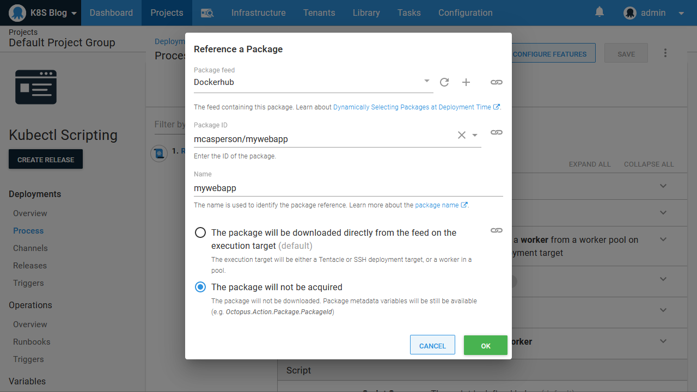

The package version is then selected during deployment:

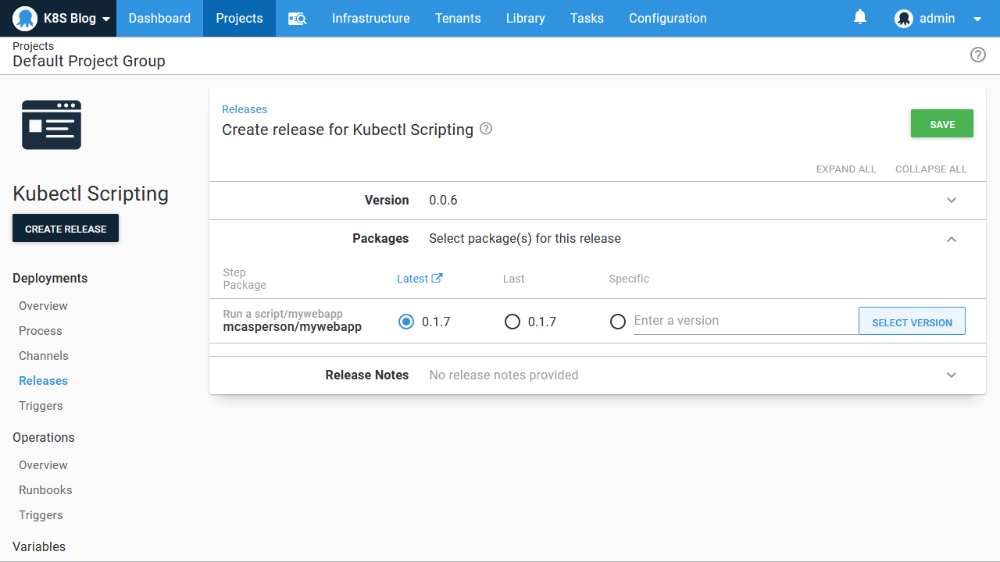

Finally, we scan through the variables printed in the logs to find the one that references our Docker image. You can see in the screenshot below that the variables called `Octopus.Action.Package[mywebapp].Image` is the complete Docker image name and `Octopus.Action.Package[mywebapp].PackageVersion` is the version:

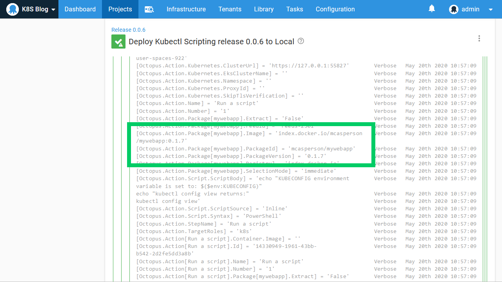

We can use these variables in our script. The example script below writes a YAML file to disk, and then uses `kubectl` to apply it. The image property is defined as `image: #{Octopus.Action.Package[mywebapp].Image}`, which will be updated with each deployment to reflect the selected Docker image:

```Powershell
Set-Content -Path deployment.yml -Value @"
apiVersion: apps/v1
kind: Deployment
metadata:
  name: mydeployment
  labels:
    app: mydeployment
spec:
  selector:
    matchLabels:
      app: mydeployment
  replicas: 1
  strategy:
    type: RollingUpdate
  template:
    metadata:
      labels:
        app: mydeployment
    spec:
      containers:
        - name: randomquotes
          image: #{Octopus.Action.Package[mywebapp].Image}
          ports:
            - name: web
              containerPort: 80
"@

kubectl apply -f deployment.yml
```

## Running in a container image

One of the challenges with a tool like Octopus is the sheer number of platforms it integrates with, and the tooling that Octopus leverages to do so. The initial solution to this problem was to package tools with Octopus itself, but over time, the different tool versions, different operating systems, and constant introduction of new tools made this approach unmaintainable.

The solution to this problem was the introduction of [Worker tool Docker images](https://hub.docker.com/r/octopusdeploy/worker-tools) that deployment processes can be executed inside of. These Docker images contain a selection of common open source tools and can be versioned and published independently of Octopus itself.

It should come as no surprise that the images provided by Octopus include a good selection of Kubernetes tooling, including `kubectl`, `istioctl`, `linkerd`, and `helm`.

In the screenshot below the script step has been configured to run inside a Worker tool Docker image:

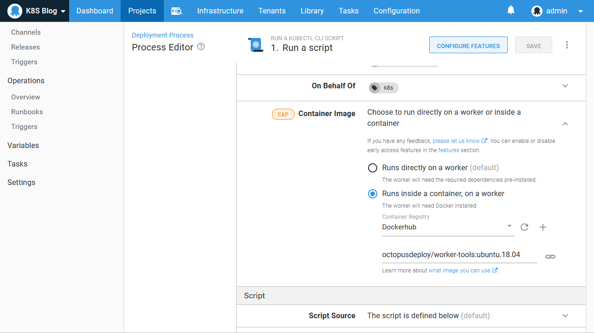

However, because we are using a Kubernetes cluster hosted in Docker with Kind, we have to do some configuration to ensure the Docker container that runs our Octopus steps can access the cluster.

First, we need to ensure that the Kubernetes cluster control plane is running on the default Docker network called `bridge`. Since [version 0.8.0](https://github.com/kubernetes-sigs/kind/releases/tag/v0.8.0), Kind will create the Kubernetes cluster in a special network called `kind`, which isolates the cluster control plane from the container running our deployment. To resolve this, set the `KIND_EXPERIMENTAL_DOCKER_NETWORK` environment variable to `bridge` to force Kind to use the default network.

You may need to delete the existing cluster with `kind cluster delete`. Then recreate it with the instructions from the [previous blog post](/blog/2020-08/getting-started-with-kind-and-octopus/index.md), remembering to extract the certificates and re-upload them in Octopus as they will have changed.

We also need to point our Kubernetes target to a new IP address and port. The command `docker container ls` shows us the Kind container hosting the Kubernetes control plane:

```
$ docker container ls
CONTAINER ID        IMAGE                  COMMAND                  CREATED             STATUS              PORTS                       NAMES
ebb9eb784a55        kindest/node:v1.18.2   "/usr/local/bin/entr…"   6 minutes ago       Up 6 minutes        127.0.0.1:59747->6443/tcp   kind-control-plane
```

From this, we can see that port `6443` is the internal port that exposes the Kubernetes API.

We then get the IP address of the container with the command `docker container inspect kind-control-plane`. Below is a truncated copy of the output from this command:

```
$ docker container inspect kind-control-plane
[
    {
        // ... removed the container details for brevity
        "NetworkSettings": {
            // ... removed networking details for brevity
            "Networks": {
                "bridge": {
                    "IPAMConfig": null,
                    "Links": null,
                    "Aliases": null,
                    "NetworkID": "29f0f93df185df5ecae63abcca94c7a1bdd24a13bc8cd0158b2534199a08b95e",
                    "EndpointID": "0dc06d6e58a17e169d1c58a4ddaec179252d7b3e79695c40eba52af3ae8b921a",
                    "Gateway": "172.17.0.1",
                    "IPAddress": "172.17.0.2",
                    "IPPrefixLen": 16,
                    "IPv6Gateway": "",
                    "GlobalIPv6Address": "",
                    "GlobalIPv6PrefixLen": 0,
                    "MacAddress": "02:42:ac:11:00:02",
                    "DriverOpts": null
                }
            }
        }
    }
]
```

We can see the `bridge` network was used, meaning the `KIND_EXPERIMENTAL_DOCKER_NETWORK` environment variable worked as expected. We then see that the `IPAddress` property is set to `172.17.0.2`. This means the URL for our Kubernetes cluster is `https://172.17.0.2:6443`:

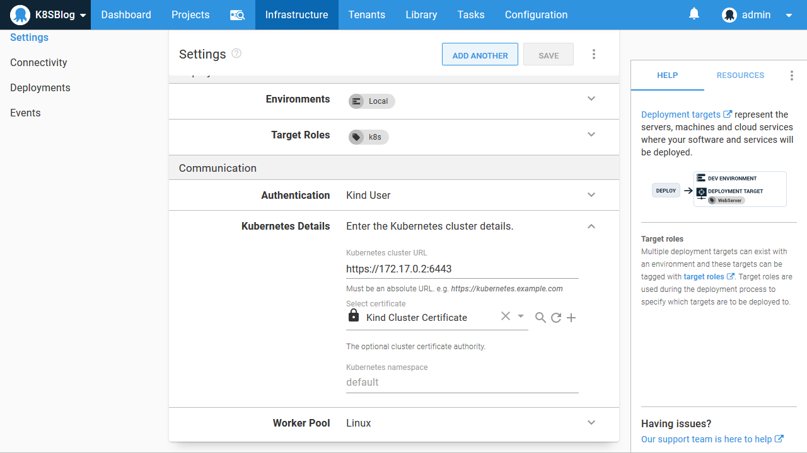

Now that we have configured the correct networking for two sibling Docker containers to talk to each other, we can verify that the worker-tools image is exposing the tooling we expect by running the script:

```powershell
istioctl version
linkerd version
helm version
```

As expected, all these tools are available for our script to use:

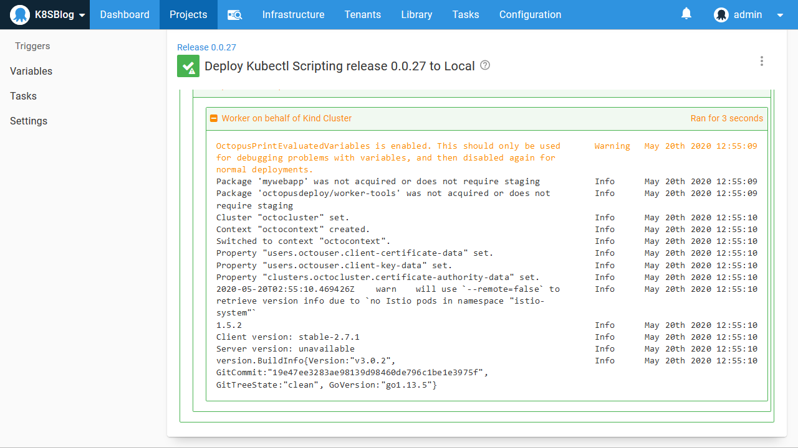

## Conclusion

By exposing a wealth of variables, allowing Docker images to be selected at deployment time, and providing a wide range of tooling through the [Worker tool Docker images](https://hub.docker.com/r/octopusdeploy/worker-tools), it is possible to script complex deployments and management tasks against Kubernetes from Octopus.

This post looked at some useful debugging techniques in Octopus and provided example scripts that take advantage of package variables and the Worker tools Docker images to highlight some of the possibilities of using Octopus to automate Kubernetes clusters.