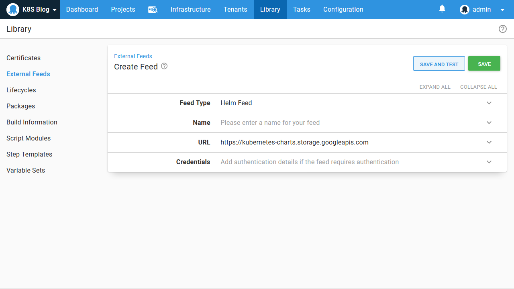
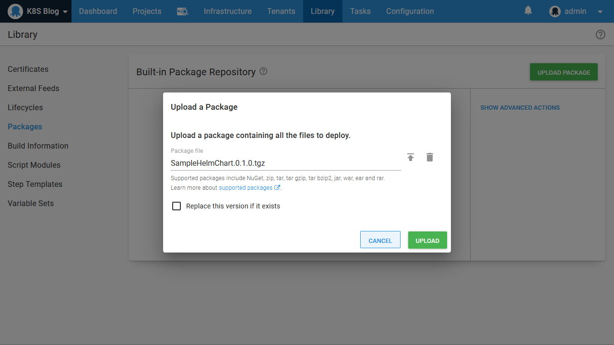
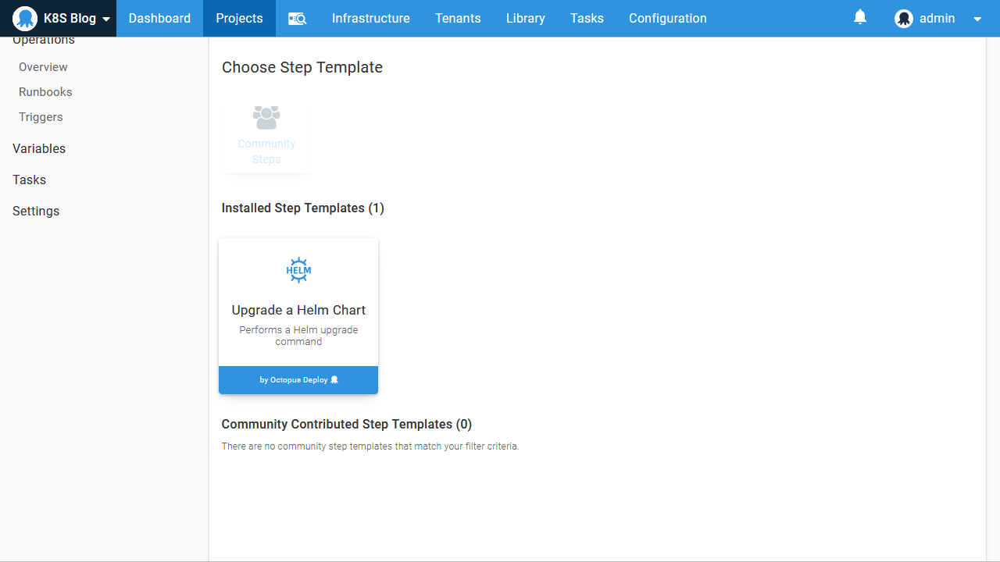
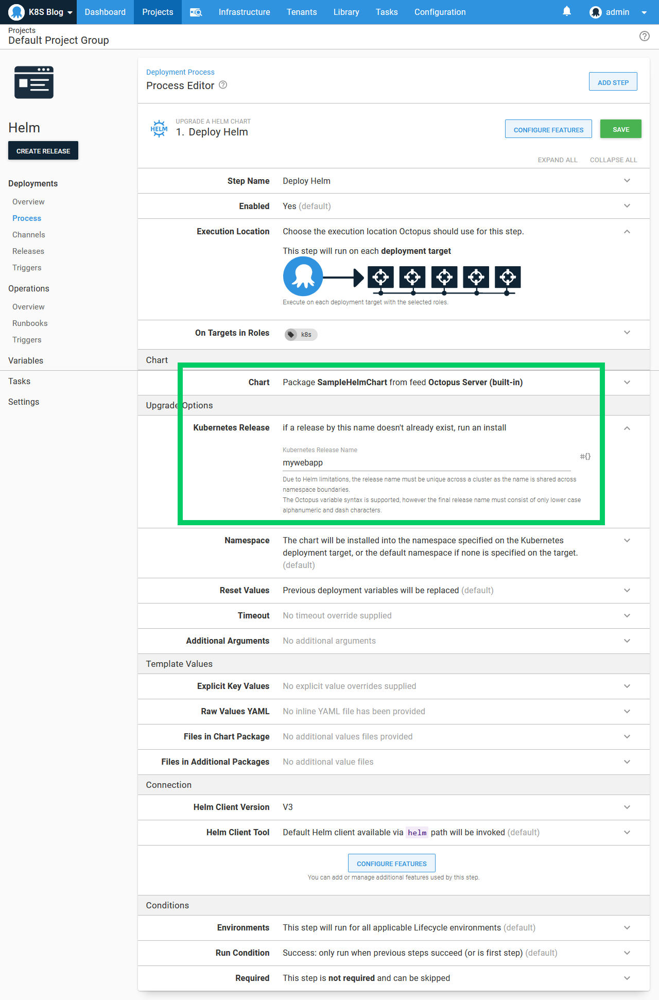

Helm has emerged as the de facto Kubernetes package manager. It offers rich templates, a powerful CLI tool, centralized repositories for sharing charts, and the recently released Helm 3, addresses security concerns that overshadowed previous Helm versions.

Octopus provides native support for deploying Helm charts, and in this blog post, we’ll look at how to manage Helm deployments in Octopus to a Kubernetes cluster created in a [previous blog post](/blog/2020-08/getting-started-with-kind-and-octopus/index.md).

## The sample chart

In the blog post, [Deploy your first container to Kubernetes via Octopus](/blog/2020-08/deploy-your-first-container-to-kubernetes/index.md), we ran through the process of creating a Docker image and pushing it to Docker Hub. The end result was the image [mcasperson/mywebapp](https://hub.docker.com/r/mcasperson/mywebapp). We will reuse this Docker image from our Helm chart.

The example Helm chart can be found on [GitHub](https://github.com/OctopusSamples/SampleHelmChart). This chart creates a Kubernetes deployment and service to expose the web application embedded in our Docker image.

Start by cloning the GitHub repository and packaging the files into a chart with the command `helm package .\SampleHelmChart`:

```
$ helm package .\SampleHelmChart
Successfully packaged chart and saved it to: C:\Code\SampleHelmChart-0.1.0.tgz
```

The resulting chart has the filename `SampleHelmChart-0.1.0.tgz`. Typically, this file would then be uploaded to a chart repository, such as one hosted by [ChartMuseum](https://chartmuseum.com/). Such chart repositories are natively supported by Octopus, and setting up a chart repository is a perfectly valid option for those looking to take advantage of Helm:



However, starting with version 2020.3.0, Octopus offers the ability to upload Helm charts directly to the built-in feed. This removes the need to configure a separate chart repository. The only requirement to upload a chart to the built-in feed is that the package version is appended to the filename after a period, meaning we need to rename the chart file from `SampleHelmChart-0.1.0.tgz` to `SampleHelmChart.0.1.0.tgz` before it is uploaded:



## Deploy the chart

To deploy the Helm chart we’ll use the **Upgrade a Helm chart** step:



We then reference the package that was uploaded to the built-in feed, and define a name for the Helm release:



And that’s it. With just a few simple steps, we have deployed our first Helm chart to Kubernetes.

## Conclusion

By hosting Helm charts in the built-in feed and consuming them with the native Helm step, Octopus makes it trivial to share and deploy Helm charts to Kubernetes.

Octopus can also access external Helm chart repositories if you already have one deployed or wish to take advantage of the [public repositories](https://github.com/helm/charts) available. Any mature Kubernetes infrastructure will inevitably include a range of external services like ingress controllers, dashboards, monitoring solutions, and other Kubernetes operators. These third-party applications will typically be distributed as Helm charts, and so accessing external Helm feeds allows Octopus to manage their deployment just like an internally managed application.
