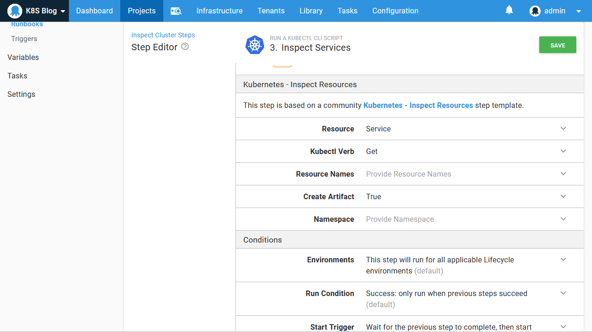

In the [previous post](/blog/2020-08/getting-started-with-kind-and-octopus/index.md), we saw how to create a local test Kubernetes cluster with Kind and configure it in Octopus. In this post, we learn how to deploy and expose a single Docker container to the local Kubernetes cluster using the steps in Octopus.

## Create and push the Docker image

Octopus uses a feed to access Docker images from a Docker repository. Many tools exist that let you host your own Docker repository, but when you’re first getting started, the public repository [Docker Hub](https://hub.docker.com/) is by far the easiest option.

Create a new account if you do not already have one, and then log into Docker Hub with the command `docker login`:

```
$ docker login
Login with your Docker ID to push and pull images from Docker Hub. If you don't have a Docker ID, head over to https://hub.docker.com to create one.
Username: mcasperson
Password:

Login Succeeded
```

Next, we need to build the Docker image. For this post, we’ll use the sample application from https://github.com/OctopusSamples/RandomQuotes-Java. Build the image with the command `docker build . -t mcasperson/mywebapp:0.1.7` (replacing `mcasperson` with your Docker Hub username).

It is important that the tag (`0.1.7` in this case) is a valid SemVer version string. Docker tags don’t enforce any versioning rules, but Octopus expects all packages it deploys can be compared to find the latest one. This is achieved by requiring Docker tags to be SemVer strings.

:::hint
Docker images without SemVer compatible tags are ignored by Octopus.
:::

After the build is finished, you can verify the image has been created with the command `docker images "mcasperson/mywebapp"`:

```
$ docker images "mcasperson/mywebapp"
REPOSITORY            TAG                 IMAGE ID            CREATED             SIZE
mcasperson/mywebapp   0.1.7               fadf80ecf48a        1 second ago        129MB
```

Finally, the image is pushed to Docker Hub with the command `docker push mcasperson/mywebapp:0.1.7`:

```
$ docker push mcasperson/mywebapp:0.1.7
The push refers to repository [docker.io/mcasperson/mywebapp]
d817461c3564: Pushed
11276c4aac8e: Pushed
f955d35132bf: Pushed
edd61588d126: Mounted from library/openjdk
9b9b7f3d56a0: Mounted from library/openjdk
f1b5933fe4b5: Mounted from library/openjdk
0.1.7: digest: sha256:0eb09072c3ab7768e9e5f9cae994e63a2d5c8d6957a2d0cd85baae31ee8cc6d7 size: 1573
```

Once pushed, the image can be [viewed on Docker Hub](https://hub.docker.com/r/mcasperson/mywebapp).

## Create the Docker feed

All packages referenced by Octopus during deployment are sourced from feeds. In order to use our new Docker image in a Kubernetes deployment, we need to configure Docker Hub as a Docker feed via the URL https://index.docker.io:


We can then search for our new image:


## Deploy the image

Octopus ships with a number of steps that support Kubernetes deployments. Broadly speaking, they fall into three categories:

* Opinionated, UI centric steps for deployments, services, ingresses, secrets, and configmaps.
* Deployment of raw YAML.
* Deployment of Helm charts.
* Custom scripting against `kubectl`.

Because this is our first deployment into a Kubernetes cluster, the opinionated steps will get us up and running quickly without having to know the details of Kubernetes YAML, so we’ll add a **Deploy Kubernetes containers** step to our Octopus project:


This step combines a Kubernetes deployment resource with an optional service, ingress, secret, and configmap. These resources are typically deployed together as a single, tightly coupled unit when deploying an application in Kubernetes. However, in our case, we won’t be deploying an ingress, secret, or configmap, so these features can be disabled to simplify the step UI:


The step exposes a large number of options, but there are only two that we need to pay attention to for this example.

The first is the definition of the container, and the second is the service ports. These have been highlighted in the screenshot below:


The container definition references the image we pushed to Docker Hub earlier:


It also exposes TCP port 80 with a Kubernetes port called **web**:


The service port then exposes port 80 on the container as port 80 on the service:


That is all we need to configure to deploy our image to Kubernetes. When we deploy this project, Octopus will perform some logic behind the scenes to create the Kubernetes deployment and services resources, and link the two together. Linking these resources saves us from some manual work that would otherwise be required to expose a deployment with a service.

One thing to notice when creating the Octopus deployment is that we select the Docker image version (which, if you recall, was the tag we assigned to the image when it was built) at deploy time. Selecting image versions at deployment time, and by default selecting the latest version is one of the advantages of using Octopus to manage Kubernetes deployments. Typically, new versions of your Docker images will not require any changes to the Kubernetes resources that reference them, so pushing new versions of your code to Kubernetes can be performed simply by creating a new Octopus deployment and referencing the new Docker image:


When the deployment is completed, we can verify that Kubernetes contains the deployment resource with the command `kubectl get deployments`:

```
$ kubectl get deployments
NAME           READY   UP-TO-DATE   AVAILABLE   AGE
randomquotes   1/1     1            1           20m
```

We then verify that the deployment created pods with the command `kubectl get pods`:

```
$ kubectl get pods
NAME                            READY   STATUS    RESTARTS   AGE
randomquotes-65cbb7c849-5vvnw   1/1     Running   0          30s
```

We then verify the service was created with the command `kubectl get service randomquotes`:

```
$ kubectl get service randomquotes
NAME           TYPE        CLUSTER-IP      EXTERNAL-IP   PORT(S)   AGE
randomquotes   ClusterIP   10.99.245.202   <none>        80/TCP    19m
```

To access the service from our local PC, we need to use `kubectl` to proxy a local port to the service port, which we do with the command `kubectl port-forward svc/randomquotes 8081:80`. We can then open our application on http://localhost:8081:


## Inspect the cluster via Octopus

Running `kubectl` locally is great for seasoned Kubernetes administrators and is often required when creating new deployments to debug and verify that things work as expected. It does have some disadvantages, though:

* It requires `kubectl` to be installed locally and configured with administrator credentials.
* Local `kubectl` configurations need to be manually updated if credentials change.
* The actions performed against the cluster can be difficult to reconstruct at a later date.
* The values on which decisions were made are often lost, such as the contents of pod logs or the state of pods.
* Using `kubectl` requires a good level of familiarity with Kubernetes administration.

As your Kubernetes infrastructure matures, it is advantageous to automate common management tasks. By automating these tasks, institutional knowledge can be embedded into Octopus, making it easier to hand day to day operations to teams that may not be Kubernetes experts.

To automate the calls to `kubectl` we made in the last section, we’ll take advantage of a community step template called **Kubernetes - Inspect Resources**:


First, we’ll get the list of deployments. This is achieved by setting the **Resource** option to `Deployment`, setting the **Kubectl Verb** to `Get`, and capturing the output by setting **Create Artifact** to `True`:


This runbook can now be run by anyone granted access via the Octopus UI, addressing the limitations noted above:

* The credentials are managed by Octopus and only need to be updated in a single location.
* The `kubectl` executable only needs to be available on the worker, removing the need for users to install this tooling locally.
* The output of this runbook is captured in the Octopus logs and as an artifact generated by the step, making it easy to go back and review the state of the cluster that led to certain actions being taken.
* The `kubectl` commands are embedded in a step, removing the need for support staff to know the commands from memory.


Let’s now add a second step to query the pods. Notice here that the **Resource Names** has been set to `randomquotes\*`. This is a convenience added by the **Kubernetes - Inspect Resources** step that allows Kubernetes resources to be matched by wildcards, which is not available from `kubectl` natively. It is especially handy with pods created by deployments because Kubernetes assigns random suffixes to these pod names:


Finally we get the services:



With this, we have created a runbook that can be run by support staff as a first step in diagnosing any issues with the cluster, with the generated artifacts providing a useful collection of logs that can be reviewed at a later date or passed onto higher levels of support.

## Conclusion

In this post, we compiled and pushed a new Docker image to Docker Hub, added Docker Hub as a feed in Octopus, and then deployed the image as a Kubernetes deployment exposed by a service to the test cluster we created with Kind in a [previous blog post](/blog/2020-08/getting-started-with-kind-and-octopus/index.md).

It has been said that *Kubernetes makes simple things hard, and hard things possible*. It can seem like there are many moving parts to even a simple Kubernetes deployment, but if you have reached this point, you have implemented a solid foundation on which to build more complex and production ready infrastructure with Kubernetes. In fact, even with this simple example, you have created:

* Repeatable deployments that can be initiated by anyone through the Octopus Web Portal with no local tooling or Kubernetes expertise required.
* Audited deployments thanks to the built-in capabilities in Octopus.
* A continuous delivery pipeline ready to be triggered from a CI system through the [many available plugins](https://octopus.com/docs/packaging-applications/build-servers).
* The foundation for multi-environment deployments - see [this guide](https://i.octopus.com/books/kubernetes-book.pdf) for more details.
* Some initial runbooks to aid support staff who are responsible for the cluster.
