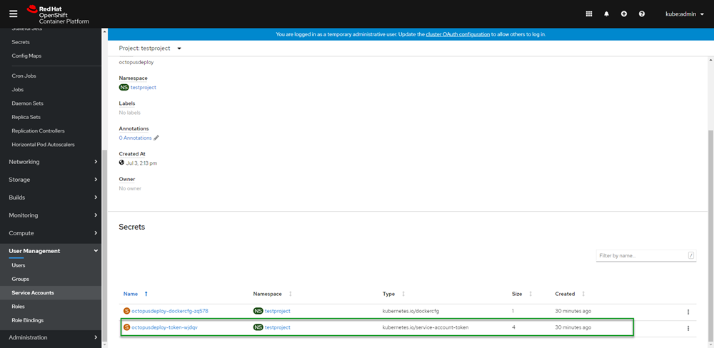
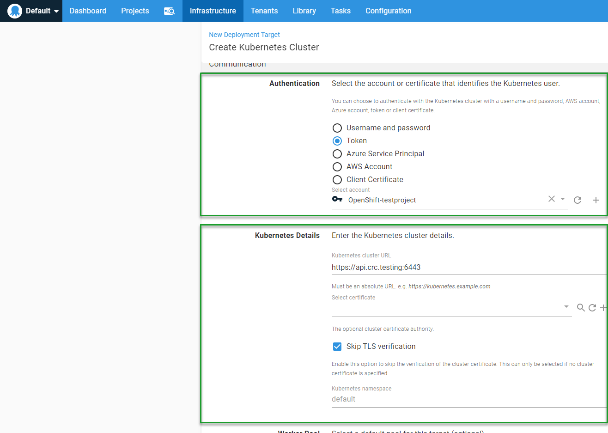
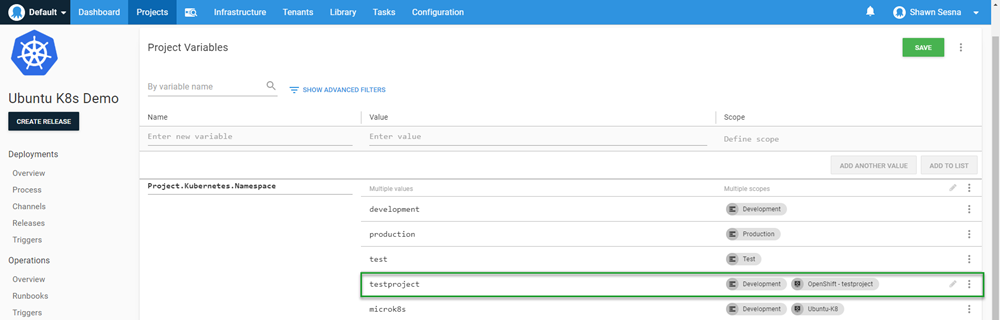
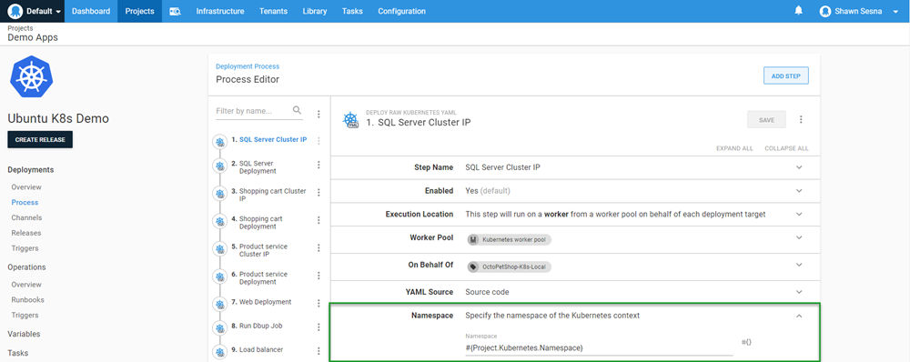
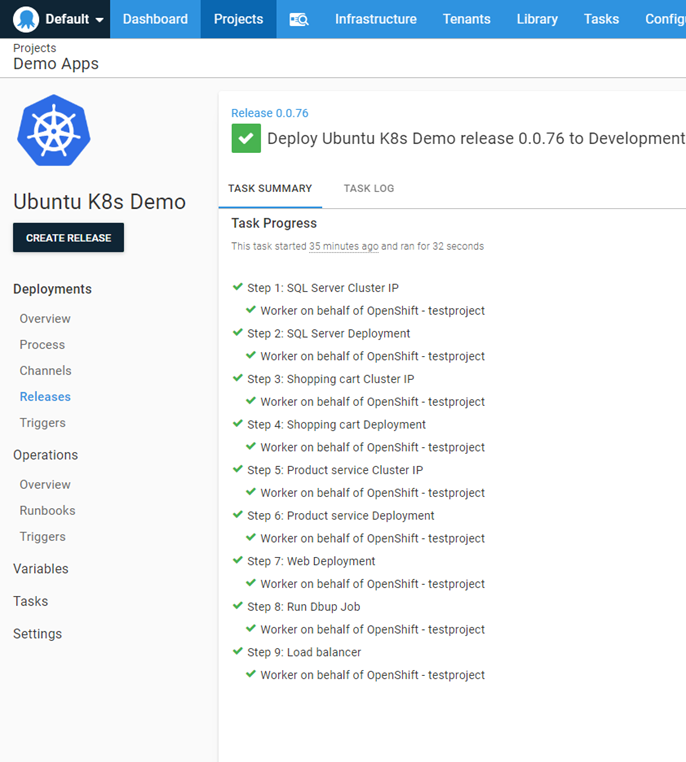
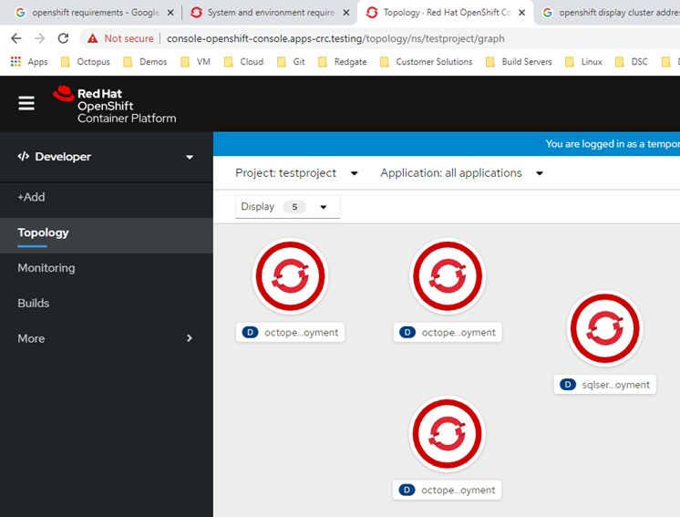

In a [previous post](/blog/2021-03/deploy-to-rancher-with-octopus/index.md), I wrote about using Octopus Deploy to deploy to Kubernetes (K8s) clusters that are managed by Rancher.  In this post, I cover a similar topic, how to deploy to Red Hat OpenShift.

## Red Hat OpenShift

Like Rancher, Red Hat OpenShift is a K8s management platform.  However, that is where the similarity ends, the two products are vastly different.  The system requirements for running OpenShift are not insubstantial.  There is a minimum of three master nodes, each with at least 4 vCPUs and 16 GB of RAM.  Worker nodes require fewer resources: 1 vCPU and 8 GB of RAM.

There is a stripped down version of OpenShift that is designed to run on a laptop for development and trial purposes called CodeReady Containers (CRC).  The CRC version is what I used for this post as my hypervisor didn’t have enough remaining resources to host the full version of OpenShift. Even though it is a stripped down, CRC still has the same overall functionality.

### Using CRC

This section shares some of the lessons I learned using CRC.  If you’re not planning on using it, you can skip this section.

To download CRC, you need a Red Hat account.  

CRC comes in three flavors:

- Windows (Hyper-V)
- macOS (HyperKit)
- Linux (Libvirt)

For this post, I use the Windows Hyper-V variant.

#### Hyper-V Virtual Switches

The Windows CRC download is a single .exe file. This file takes care of creating and provisioning the VM to run OpenShift on a laptop.  One thing I discovered using CRC is that it specifically uses the default virtual switch in Hyper-V.  Some time ago, Windows disabled the ability to edit the default virtual switch so it’s permanently stuck using Network Address Translation (NAT).  However, I did manage to find a not well publicized feature of CRC, if you create a virtual switch called `crc`, the provisioning of the VM will use that virtual switch instead.

#### CRC changes the DNS server to itself

The folks at Red Hat have tried to make things as easy as possible by having an all encompassing solution to help you can learn the OpenShift product.  This includes altering your network settings to change the DNS server to itself so you can resolve the built-in DNS entries.  I’ll admit to not paying enough attention to the messages as everything was being set up, and then scratching my head for a while trying to figure out why my local DNS entries no longer worked.  After I figured that out, it was easy enough to duplicate the DNS entries local to the laptop so that external machines could interact with the OpenShift cluster.

### OpenShift Perspectives

The interface to OpenShift comes with two modes called Perspectives:
- Administrator
- Developer

The displayed options change based on which Perspective you are using.  The Administrator Perspective shows options related to operations and management, whereas the Developer Perspective shows only options that developers are concerned with.

### Create a project

OpenShift uses projects to help you organize the resources you need and keep everything together. A project consists of all your application’s components and can be monitored from the project screen.  To create a project:

1. Ensure you have selected the Administrator Perspective.
1. Wait for the display to update if you have switched perspectives (if you’re using CRC, this could take several seconds).
1. From the Administrator Perspective, click the blue **Create Project** button.  
1. Give your project a name and click **Create**.

#### Create service account

In order to deploy to OpenShift, we need to provide Octopus Deploy with credentials it can use to connect to OpenShift.  Each OpenShift project has a section where you can define service accounts.  After your project has been created:

1. Expand **User Management**.
1. Click **Service Accounts**.
1. Click **Create Service Account**.

#### Create role binding

With the service account created, we need to give it a role so it can create resources on the cluster.

I had some difficulties getting the correct permissions using the UI, but I found using the command-line **oc.exe** tool allowed me to give my service account the correct permissions:

```
C:\Users\Shawn.Sesna\.kube>oc.exe policy add-role-to-user cluster-admin -z octopusdeploy
```

:::hint
Ensure you're in the correct project by running,
```
C:\Users\Shawn.Sesna\.kube>oc project <project name>
```
:::

#### Service account token

OpenShift will automatically create a token for your service account.  This token is how the service account authenticates to OpenShift from Octopus Deploy.  To retrieve the value of the token:

1. Click **Service Accounts**.
1. Click `octopusdeploy` (or whatever you named yours).
1. Scroll down to the **Secrets** section.
1. Click on the entry that has the `type` of `kubernetes.io/service-account-token`.



Copy the token value by clicking on the copy to clipboard icon on the right-hand side of the token.

#### The cluster URL

The final piece of information we need from OpenShift is the URL to the cluster.  Using the `oc.exe` command-line tool, we can quickly retrieve the URL we need with the `status` command:

```
C:\Users\Shawn.Sesna\.kube>oc.exe status
In project testproject on server https://api.crc.testing:6443
```

## Connect OpenShift to Octopus Deploy

Connecting OpenShift to Octopus Deploy is achieved by following the same procedure you would use for any other K8s cluster. First, create an account, and then add a K8s cluster target.

### Create an account

Before we can connect our OpenShift K8s target, we must create an account to authenticate against it.  In the Octopus Web Portal, navigate to the **Infrastructure** tab and click **Accounts**:

1. Click **ADD ACCOUNT**.
1. Select **token**.
1. Enter the values for the account and click **SAVE**.

Now that we’ve created an account, we’re ready to create our Kubernetes targets.

### Add the K8s cluster

To add the OpenShift K8s cluster:

1. Navigate to **{{Infrastructure, Deployment Targets}}**.
1. Click **ADD DEPLOYMENT TARGET**.
1. Click the **KUBERNETES CLUSTER** category.
1. Then click **ADD** on the Kubernetes Cluster.

The two most important parts of the Kubernetes deployment target form are:

- Authentication
- Kubernetes Details

#### Authentication

The authentication type that we will use for our OpenShift cluster is token.

#### Kubernetes details

This is where we use the URL we retrieved from the **oc.exe** `status` command: https://api.crc.testing:6443.  My cluster is using a self-signed certificate, so I selected **Skip TLS verification**.



:::warning
Leave the namespace box empty.
:::

Click **SAVE** and you’re done.

Verify the connection by watching for the initial health check in the **Tasks** tab.

## Deploy to OpenShift

At the beginning of this post, we created the project within OpenShift.  The project name is the K8s namespace that we deploy to.  This is important because when we create the steps for our deployment, we need to make sure we specify which namespace we’re deploying to.

Just like in the Rancher post, I use the same deployment process from the [Beyond Hello World: Build a real-world Kubernetes CI/CD pipeline](https://octopus.com/blog/build-a-real-world-kubernetes-cicd-pipeline) post. I add a value of `testproject` to the `Project.Kubernetes.Namespace` variable to scope it specifically to our new target:



This value will be used in our deployment steps:



### Execute the deployment

I had to make a minor change to the YAML for the Load Balancer resource. OpenShift didn’t like the use of External IPs:

```
Forbidden: externalIPs have been disabled
```

After I commented that out, I was able to successfully deploy:



In OpenShift, we can see all of our resources were indeed created:



## Conclusion

In this post, I demonstrated how you can integrate Red Hat OpenShift with Octopus Deploy.  Happy Deployments!
