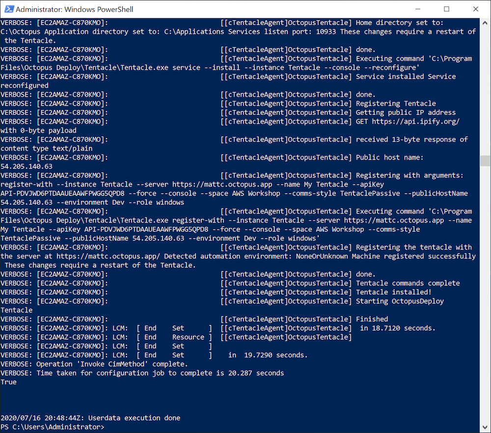

In a previous blog post, we looked at some sample CloudFormation templates that created a new EC2 virtual machine in a VPC.

These templates had placeholder scripts in the [instance user data](https://docs.aws.amazon.com/AWSEC2/latest/WindowsGuide/ec2-windows-user-data.html). In this blog post, we’ll look at how these user data scripts can be configured to install a Tentacle, either as a target or a Worker through the [Octopus DSC module](https://github.com/OctopusDeploy/OctopusDSC).

## Install a target

Here is the complete CloudFormation template we use to build an EC2 instance in a VPC and configure a Tentacle as a target:

```YAML
AWSTemplateFormatVersion: 2010-09-09
Parameters:
  InstanceTypeParameter:
    Type: String
    Default: t3a.medium
    Description: Enter instance size. Default is t3a.medium.
  WorkstationIp:
    Type: String
    Description: The IP address of the workstation that can RDP into the instance.
  AMI:
    Type: String
    Default: ami-05bb2dae0b1de90b3
    Description: The Windows AMI to use.
  Key:
    Type: String
    Description: The key used to access the instance.
  APIKey:
    Type: String
    Description: The API key used to connect to the Octopus server.
  OctopusURL:
    Type: String
    Description: The Octopus server URL.   
  TentacleRole:
    Type: String
    Description: The tentacle role.   
  TentacleEnvironment:
    Type: String
    Description: The tentacle environment. 
  TentacleSpace:
    Type: String
    Description: The tentacle space.  
Resources:
  VPC:
    Type: AWS::EC2::VPC
    Properties:
      CidrBlock: 10.0.0.0/16
      EnableDnsSupport: true
      EnableDnsHostnames: true
      InstanceTenancy: default
      Tags:
        - Key: Name
          Value: Windows Target VPC
  InternetGateway:
    Type: AWS::EC2::InternetGateway
  VPCGatewayAttachment:
    Type: AWS::EC2::VPCGatewayAttachment
    Properties:
      VpcId: !Ref VPC
      InternetGatewayId: !Ref InternetGateway
  SubnetA:
    Type: AWS::EC2::Subnet
    Properties:
      AvailabilityZone: us-east-1a
      VpcId: !Ref VPC
      CidrBlock: 10.0.0.0/24
      MapPublicIpOnLaunch: true
  RouteTable:
    Type: AWS::EC2::RouteTable
    Properties:
      VpcId: !Ref VPC
  InternetRoute:
    Type: AWS::EC2::Route
    DependsOn: InternetGateway
    Properties:
      DestinationCidrBlock: 0.0.0.0/0
      GatewayId: !Ref InternetGateway
      RouteTableId: !Ref RouteTable
  SubnetARouteTableAssociation:
    Type: AWS::EC2::SubnetRouteTableAssociation
    Properties:
      RouteTableId: !Ref RouteTable
      SubnetId: !Ref SubnetA
  InstanceSecurityGroup:
    Type: AWS::EC2::SecurityGroup
    Properties:
      GroupName: "Octopus Target Group"
      GroupDescription: "Tentacle traffic in from hosted static ips, and RDP in from a personal workstation"
      VpcId: !Ref VPC
      SecurityGroupIngress:
        - IpProtocol: tcp
          FromPort: '10933'
          ToPort: '10933'
          CidrIp:  20.188.245.156/32
        - IpProtocol: tcp
          FromPort: '10933'
          ToPort: '10933'
          CidrIp:  52.147.25.42/32 
        - IpProtocol: tcp
          FromPort: '10933'
          ToPort: '10933'
          CidrIp:  52.147.31.180/32 
        - IpProtocol: tcp
          FromPort: '10933'
          ToPort: '10933'
          CidrIp:  20.188.244.132/32 
        - IpProtocol: tcp
          FromPort: '10933'
          ToPort: '10933'
          CidrIp:  52.147.25.94/32 
        - IpProtocol: tcp
          FromPort: '10933'
          ToPort: '10933'
          CidrIp:  52.147.25.173/32 
        - IpProtocol: tcp
          FromPort: '10933'
          ToPort: '10933'
          CidrIp:  20.188.245.171/32 
        - IpProtocol: tcp
          FromPort: '10933'
          ToPort: '10933'
          CidrIp:  20.188.245.7/32
        - IpProtocol: tcp
          FromPort: '10933'
          ToPort: '10933'
          CidrIp:  20.188.244.147/32
        - IpProtocol: tcp
          FromPort: '10933'
          ToPort: '10933'
          CidrIp:  20.188.244.240/32
        - IpProtocol: tcp
          FromPort: '3389'
          ToPort: '3389'
          CidrIp:  !Sub ${WorkstationIp}/32
      SecurityGroupEgress:
        - IpProtocol: -1
          CidrIp: 0.0.0.0/0
  Windows:
    Type: 'AWS::EC2::Instance'
    Properties:
      ImageId: !Ref AMI
      InstanceType:
        Ref: InstanceTypeParameter
      KeyName: !Ref Key
      SubnetId: !Ref SubnetA
      SecurityGroupIds:
        - Ref: InstanceSecurityGroup
      BlockDeviceMappings:
        - DeviceName: /dev/sda1
          Ebs:
            VolumeSize: 250
      UserData:
        Fn::Base64: !Sub |
          <powershell>
          Set-Content -Path c:\dsc.ps1 -Value @"
          Configuration SampleConfig
          {
              param (`$ApiKey, `$OctopusServerUrl, `$Environments, `$Roles, `$ListenPort, `$Space)

              Import-DscResource -Module OctopusDSC

              Node "localhost"
              {
                  cTentacleAgent OctopusTentacle
                  {
                      Ensure = "Present"
                      State = "Started"

                      # Tentacle instance name. Leave it as 'Tentacle' unless you have more
                      # than one instance
                      Name = "Tentacle"

                      # Defaults to <MachineName>_<InstanceName> unless overridden
                      DisplayName = "My Tentacle"

                      # Defaults to 10933 unless otherwise specified
                      ListenPort = `$ListenPort

                      # Required parameters. See full properties list below
                      ApiKey = `$ApiKey
                      OctopusServerUrl = `$OctopusServerUrl
                      Environments = `$Environments
                      Roles = `$Roles
                      Space = `$Space # This is for versions 2019.1 and above.  If null or not specified, it uses the space designated as Default
                  }
              }
          }

          SampleConfig -ApiKey "${APIKey}" -OctopusServerUrl "${OctopusURL}" -Environments @("${TentacleEnvironment}") -Roles @("${TentacleRole}") -ListenPort 10933 -Space "${TentacleSpace}"

          Start-DscConfiguration .\SampleConfig -Verbose -wait

          Test-DscConfiguration
          "@

          Install-PackageProvider -Name NuGet -MinimumVersion 2.8.5.201 -Force -Confirm:$false
          Set-PSRepository -Name "PSGallery" -InstallationPolicy Trusted
          Install-Module -Name OctopusDSC -Force -Confirm:$false
          Import-Module -Name OctopusDSC
          
          # Need .NET 4.8 to work around a bug in 4.7
          Set-ExecutionPolicy Bypass -Scope Process -Force; [System.Net.ServicePointManager]::SecurityProtocol = [System.Net.ServicePointManager]::SecurityProtocol -bor 3072; iex ((New-Object System.Net.WebClient).DownloadString('https://chocolatey.org/install.ps1'))
          choco install dotnetfx -y

          # Dot source the DSC config to install the tentacle
          . c:\dsc.ps1
          </powershell>
      Tags:
        -
          Key: Application
          Value:  Windows Server
        -
          Key: Domain
          Value: None
        -
          Key: Environment
          Value: Test
        -
          Key: LifeTime
          Value: Transient
        -
          Key: Name
          Value:  Windows Server Worker
        -
          Key: OS
          Value: Windows
        -
          Key: OwnerContact
          Value: "@matthewcasperson"
        -
          Key: Purpose
          Value: MattC Test Worker
        -
          Key: Source
          Value: CloudForation Script in Octopus Deploy
  ElasticIP:
    Type: AWS::EC2::EIP
    Properties:
      Domain: vpc
      InstanceId: !Ref Windows
Outputs:
  PublicIp:
    Value:
      Fn::GetAtt:
        - Windows
        - PublicIp
    Description: Server's PublicIp Address
```

This template has two changes compared to the template that was described in the previous blog post.

Additional parameters have been added:

```yaml
  APIKey:
    Type: String
    Description: The API key used to connect to the Octopus server.
  OctopusURL:
    Type: String
    Description: The Octopus server URL.   
  TentacleRole:
    Type: String
    Description: The tentacle role.   
  TentacleEnvironment:
    Type: String
    Description: The tentacle environment. 
  TentacleSpace:
    Type: String
    Description: The tentacle space.  
```

These parameters define the API key used to connect to Octopus, the Octopus Server URL, and the role, environment, and space for the new target.

To configure the target, we have expanded the script in the user data section. Let’s break this script down.

We start by saving the DSC configuration into a second PowerShell script. We need to do this because PowerShell will parse any `Configuration` block before running other script commands. The command `Import-DscResource -Module OctopusDSC` in the `Configuration` block will then fail because the DSC module has not been installed.

The workaround used here is to save the `Configuration` block to a second file, and dot source it after the DSC module has been installed:

```
Set-Content -Path c:\dsc.ps1 -Value @"
    Configuration SampleConfig
    {
        param (`$ApiKey, `$OctopusServerUrl, `$Environments, `$Roles, `$ListenPort, `$Space)

        Import-DscResource -Module OctopusDSC

        Node "localhost"
        {
            cTentacleAgent OctopusTentacle
            {
                Ensure = "Present"
                State = "Started"

                # Tentacle instance name. Leave it as 'Tentacle' unless you have more
                # than one instance
                Name = "Tentacle"

                # Defaults to <MachineName>_<InstanceName> unless overridden
                DisplayName = "My Tentacle"

                # Defaults to 10933 unless otherwise specified
                ListenPort = `$ListenPort

                # Required parameters. See full properties list below
                ApiKey = `$ApiKey
                OctopusServerUrl = `$OctopusServerUrl
                Environments = `$Environments
                Roles = `$Roles
                Space = `$Space # This is for versions 2019.1 and above.  If null or not specified, it uses the space designated as Default
            }
        }
    }

    SampleConfig -ApiKey "${APIKey}" -OctopusServerUrl "${OctopusURL}" -Environments @("${TentacleEnvironment}") -Roles @("${TentacleRole}") -ListenPort 10933 -Space "${TentacleSpace}"

    Start-DscConfiguration .\SampleConfig -Verbose -wait

    Test-DscConfiguration
    "@
```

To install the DSC module, we need to install the NuGet provider and then install the DSC module from the [PowerShell Gallery](https://www.powershellgallery.com/packages/OctopusDSC):

```
Install-PackageProvider -Name NuGet -MinimumVersion 2.8.5.201 -Force -Confirm:$false
Set-PSRepository -Name "PSGallery" -InstallationPolicy Trusted
Install-Module -Name OctopusDSC -Force -Confirm:$false
Import-Module -Name OctopusDSC
```

Due to a bug with the version of .NET installed on the VM by default, we need to install .NET 4.8. This is done via [Chocolatey](https://chocolatey.org/packages/dotnetfx):

```
Set-ExecutionPolicy Bypass -Scope Process -Force; [System.Net.ServicePointManager]::SecurityProtocol = [System.Net.ServicePointManager]::SecurityProtocol -bor 3072; iex ((New-Object System.Net.WebClient).DownloadString('https://chocolatey.org/install.ps1'))
choco install dotnetfx -y
```

With all the prerequisites in place, we dot source the DSC configuration, which will now complete successfully:

```
. c:\dsc.ps1
```

## Verify the Installation

The log files for the user data script are found in `C:\ProgramData\Amazon\EC2-Windows\Launch\Log\UserdataExecution.log`. If we view the contents of this file in the newly created EC2 instance, we’ll see the Tentacle being installed:



## Install a Worker

The template for installing a Worker is very similar:

```YAML
AWSTemplateFormatVersion: 2010-09-09
Parameters:
  InstanceTypeParameter:
    Type: String
    Default: t3a.medium
    Description: Enter instance size. Default is t3a.medium.
  WorkstationIp:
    Type: String
    Description: The IP address of the workstation that can RDP into the instance.
  AMI:
    Type: String
    Default: ami-05bb2dae0b1de90b3
    Description: The Windows AMI to use.
  Key:
    Type: String
    Description: The key used to access the instance.
  APIKey:
    Type: String
    Description: The API key used to connect to the Octopus server.
  OctopusURL:
    Type: String
    Description: The Octopus server URL.   
  WorkerPools:
    Type: String
    Description: The worker pools to add the tentacle to. 
  TentacleSpace:
    Type: String
    Description: The tentacle space.  
Resources:
  VPC:
    Type: AWS::EC2::VPC
    Properties:
      CidrBlock: 10.0.0.0/16
      EnableDnsSupport: true
      EnableDnsHostnames: true
      InstanceTenancy: default
      Tags:
        - Key: Name
          Value: Windows Target VPC
  InternetGateway:
    Type: AWS::EC2::InternetGateway
  VPCGatewayAttachment:
    Type: AWS::EC2::VPCGatewayAttachment
    Properties:
      VpcId: !Ref VPC
      InternetGatewayId: !Ref InternetGateway
  SubnetA:
    Type: AWS::EC2::Subnet
    Properties:
      AvailabilityZone: us-east-1a
      VpcId: !Ref VPC
      CidrBlock: 10.0.0.0/24
      MapPublicIpOnLaunch: true
  RouteTable:
    Type: AWS::EC2::RouteTable
    Properties:
      VpcId: !Ref VPC
  InternetRoute:
    Type: AWS::EC2::Route
    DependsOn: InternetGateway
    Properties:
      DestinationCidrBlock: 0.0.0.0/0
      GatewayId: !Ref InternetGateway
      RouteTableId: !Ref RouteTable
  SubnetARouteTableAssociation:
    Type: AWS::EC2::SubnetRouteTableAssociation
    Properties:
      RouteTableId: !Ref RouteTable
      SubnetId: !Ref SubnetA
  InstanceSecurityGroup:
    Type: AWS::EC2::SecurityGroup
    Properties:
      GroupName: "Octopus Target Group"
      GroupDescription: "Tentacle traffic in from hosted static ips, and RDP in from a personal workstation"
      VpcId: !Ref VPC
      SecurityGroupIngress:
        - IpProtocol: tcp
          FromPort: '10933'
          ToPort: '10933'
          CidrIp:  20.188.245.156/32
        - IpProtocol: tcp
          FromPort: '10933'
          ToPort: '10933'
          CidrIp:  52.147.25.42/32 
        - IpProtocol: tcp
          FromPort: '10933'
          ToPort: '10933'
          CidrIp:  52.147.31.180/32 
        - IpProtocol: tcp
          FromPort: '10933'
          ToPort: '10933'
          CidrIp:  20.188.244.132/32 
        - IpProtocol: tcp
          FromPort: '10933'
          ToPort: '10933'
          CidrIp:  52.147.25.94/32 
        - IpProtocol: tcp
          FromPort: '10933'
          ToPort: '10933'
          CidrIp:  52.147.25.173/32 
        - IpProtocol: tcp
          FromPort: '10933'
          ToPort: '10933'
          CidrIp:  20.188.245.171/32 
        - IpProtocol: tcp
          FromPort: '10933'
          ToPort: '10933'
          CidrIp:  20.188.245.7/32
        - IpProtocol: tcp
          FromPort: '10933'
          ToPort: '10933'
          CidrIp:  20.188.244.147/32
        - IpProtocol: tcp
          FromPort: '10933'
          ToPort: '10933'
          CidrIp:  20.188.244.240/32
        - IpProtocol: tcp
          FromPort: '3389'
          ToPort: '3389'
          CidrIp:  !Sub ${WorkstationIp}/32
      SecurityGroupEgress:
        - IpProtocol: -1
          CidrIp: 0.0.0.0/0
  Windows:
    Type: 'AWS::EC2::Instance'
    Properties:
      ImageId: !Ref AMI
      InstanceType:
        Ref: InstanceTypeParameter
      KeyName: !Ref Key
      SubnetId: !Ref SubnetA
      SecurityGroupIds:
        - Ref: InstanceSecurityGroup
      BlockDeviceMappings:
        - DeviceName: /dev/sda1
          Ebs:
            VolumeSize: 250
      UserData:
        Fn::Base64: !Sub |
          <powershell>
          Set-Content -Path c:\dsc.ps1 -Value @"
          Configuration SampleConfig
          {
              param (`$ApiKey, `$OctopusServerUrl, `$WorkerPools, `$ListenPort, `$Space)

              Import-DscResource -Module OctopusDSC

              Node "localhost"
              {
                  cTentacleAgent OctopusTentacle
                  {
                      Ensure = "Present"
                      State = "Started"

                      # Tentacle instance name. Leave it as 'Tentacle' unless you have more
                      # than one instance
                      Name = "Tentacle"

                      # Defaults to <MachineName>_<InstanceName> unless overridden
                      DisplayName = "My Tentacle"

                      # Defaults to 10933 unless otherwise specified
                      ListenPort = `$ListenPort

                      # Required parameters. See full properties list below
                      ApiKey = `$ApiKey
                      OctopusServerUrl = `$OctopusServerUrl
                      WorkerPools = `$WorkerPools
                      Space = `$Space # This is for versions 2019.1 and above.  If null or not specified, it uses the space designated as Default
                  }
              }
          }

          SampleConfig -ApiKey "${APIKey}" -OctopusServerUrl "${OctopusURL}" -WorkerPools @("${WorkerPools}") -ListenPort 10933 -Space "${TentacleSpace}"

          Start-DscConfiguration .\SampleConfig -Verbose -wait

          Test-DscConfiguration
          "@

          Install-PackageProvider -Name NuGet -MinimumVersion 2.8.5.201 -Force -Confirm:$false
          Set-PSRepository -Name "PSGallery" -InstallationPolicy Trusted
          Install-Module -Name OctopusDSC -Force -Confirm:$false
          Import-Module -Name OctopusDSC
          
          # Need .NET 4.8 to work around a bug in 4.7
          Set-ExecutionPolicy Bypass -Scope Process -Force; [System.Net.ServicePointManager]::SecurityProtocol = [System.Net.ServicePointManager]::SecurityProtocol -bor 3072; iex ((New-Object System.Net.WebClient).DownloadString('https://chocolatey.org/install.ps1'))
          choco install dotnetfx -y

          # Dot source the DSC config to install the tentacle
          . c:\dsc.ps1
          </powershell>
      Tags:
        -
          Key: Application
          Value:  Windows Server
        -
          Key: Domain
          Value: None
        -
          Key: Environment
          Value: Test
        -
          Key: LifeTime
          Value: Transient
        -
          Key: Name
          Value:  Windows Server Worker
        -
          Key: OS
          Value: Windows
        -
          Key: OwnerContact
          Value: "@matthewcasperson"
        -
          Key: Purpose
          Value: MattC Test Worker
        -
          Key: Source
          Value: CloudFormation Script in Octopus Deploy
  ElasticIP:
    Type: AWS::EC2::EIP
    Properties:
      Domain: vpc
      InstanceId: !Ref Windows
Outputs:
  PublicIp:
    Value:
      Fn::GetAtt:
        - Windows
        - PublicIp
    Description: Server's PublicIp Address
```

To install a Worker, we remove the role and environment and define a worker pool parameter:

```YAML
  WorkerPools:
    Type: String
    Description: The worker pools to add the tentacle to. 
```

We then remove the role and environment from the DSC configuration and define the worker pool:

```Powershell
# Required parameters. See full properties list below
ApiKey = `$ApiKey
OctopusServerUrl = `$OctopusServerUrl
WorkerPools = `$WorkerPools
Space = `$Space # This is for versions 2019.1 and above.  If null or not specified, it uses the space designated as Default
```

## Conclusion

By taking advantage of user data scripts and the Octopus DSC module, we can quickly spin up new VMs that automatically install and register either targets or Workers in Octopus. There is some work required to install the DSC module before PowerShell attempts to parse the DSC configuration, but once you understand the quirks of DSC and the workarounds, the process is relatively easy to implement.