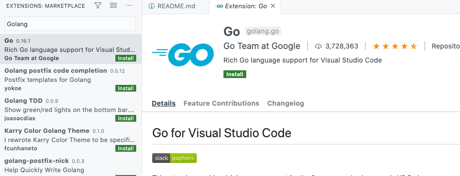
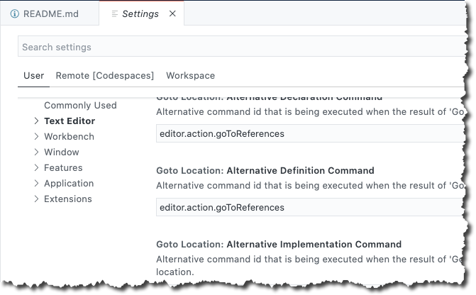

There are many source control systems, but let's face it, GitHub is arguably the most popular. 

GitHub recently stepped their game up in the CICD space by introducing GitHub Actions and at Microsoft Build 2020, GitHub Codespaces was introduced.

GitHub Codespaces is like Visual Studio Codespaces, which is VS Code in a UI, except with GitHub Codespaces it's built into GitHub. This of course provides a one-stop-shop to all of your development needs. 

In this blog post, you'll be walked through the private beta and how to use it if you've been accepted into the beta program.

## Prerequisites

To follow along with this blog post, you'll need:

- The private beta invitation to GitHub Codespaces. If you don't already have that, you can request early access [here](https://github.com/features/codespaces).
- A GitHub account
- At least one repository

## Why GitHub Codespaces?

There's one big problem with having so many development tools and ways to write code - there's simply no centralized place to store specific configurations that you want. Let's take VS Code for example. Let's say you have a few different machines you work on, or you're pair-programming with a teammate. To have the ability to work on the same code across the board and have it look identical, you need a few things:

- Extensions.
- Logged into services, for example, logging into Azure from VS Code
- Themes.
- Settings in the `settings.json`
- Runtimes
- Linters

You see where this is going. It can be cumbersome to manage.

With something like Codespaces, you don't have to worry about this anymore. All settings and configurations are in one place, regardless of where you log in from.

Codespaces provides the centralized location for your specific development needs.

## Setting up Codespaces

If the private beta is active, you'll see a new icon on the top taskbar called **Codespaces**. It should be added in automatically, but you may have to log out and log back into GitHub.

1. Log into GitHub and click on the **Codespaces** icon.

  2. Click on the green **New codespace** button.

  3. You will see two options:

- Repository
- Branch

Choose a repository that you'd like to open in Codespaces. The code will show in Codespaces, so anything will work.

  4. Click the green **Create codespace** button.

The codespace will now open and you'll be able to see the code from the repository like you would in using VS Code on the desktop. Below is a screenshot of a repository that was used for this example.

## First Look at Extensions

You'll be pleasantly surprised to see from an extensions perspective, nothing has changed. You can use any extension you typically would in VS Code while using codespaces.

1. Open up the extensions tab

  2. Search for an extension, for example, Golang.

       Just like in VS Code, you can see the extensions ready to install.

## Settings in GitHub Codespaces

Surprisingly, even the settings are pretty much the same in codespaces. The idea was for the UI itself of VS Code to not change too much in codepsaces. That way, it's a familiar and smooth transition.

1. Click on the **Settings** icon on the bottom left corner.

  2. Within the settings, you can configure the environment, user environment, and remote codespaces environment.

## Conclusion

Although GitHub Codespaces is still in private preview, it's very apparent that it's certainly the tool of the future. There's simply no need for a developer to leave GitHub. They can now store code and write it all under one roof.