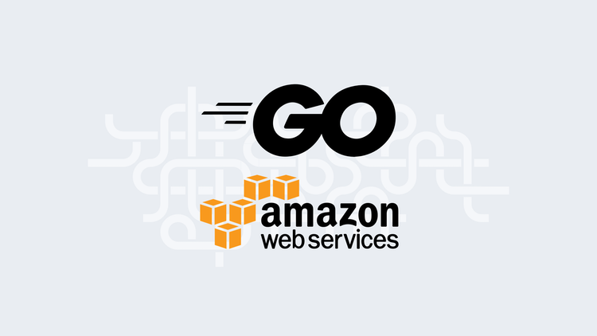
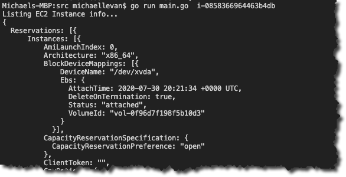

When we think of automation, one of the first things that come to mind is code. A few questions we may be asked are:

1. What programming language is best for automation?
2. What’s a straight-forward language for a team to learn?

Golang, by default, is a procedural-based language. That means it’s primarily based on writing functions. When you think of automation code, for example, PowerShell or Python, chances are you’re thinking of writing some function for a script. Because of that, Golang is a natural fit.

In this blog post, you’re going to learn how to use Golang for AWS automation, much like you’d use PowerShell or Python.

## Prerequisites

To follow along with this blog post, you need the following:

1. A beginner-level knowledge of GoLang.
2. A beginner-level knowledge of AWS.
3. [Visual Studio Code (VS Code)](https://code.visualstudio.com/).
4. [Golang installed](https://golang.org/doc/install).
5. An AWS configuration on localhost. You can do this by installing the AWS CLI and running `aws configure`.
6. A running EC2 instance.

## Figuring out what packages to use

Before you can run any code, you need to import some packages, also known as libraries. The primary way you can import packages for AWS in Golang is by pointing directly to the [GitHub repository](https://github.com/) where the package(s) exist.

To start adding Golang code, you need a place to save the code. For the purposes of this blog post, you can save a directory on the Desktop and open it in VS Code.

1. Create a new file and call it `main.go` to store the Golang code for AWS.
2. Add the following code to create the main package and import a list of packages:

```go
package main

import (
	"fmt"
	"os"

	"github.com/aws/aws-sdk-go/aws"
	"github.com/aws/aws-sdk-go/aws/session"
	"github.com/aws/aws-sdk-go/service/ec2"
)
```

The three packages specific to AWS are:

1. [github.com/aws/aws-sdk-go/aws](http://github.com/aws/aws-sdk-go/aws): Allows you to connect to the AWS package, specifically, to authenticate and specify a region that you want to work within AWS.
2. [github.com/aws/aws-sdk-go/aws/session](http://github.com/aws/aws-sdk-go/aws/session): Allows you to create a new session to connect to AWS.
3. [github.com/aws/aws-sdk-go/service/ec2](http://github.com/aws/aws-sdk-go/service/ec2): Allows you to work with specific EC2 service data, like EC2 status, load balancers, public IPs, etc.

With the packages above, you can connect to AWS and start using the Golang EC2 features that are available.

## Set up a function

The previous section showed you how to set up the main package and the AWS-specific package that needs to be imported to interact with AWS at the programmatic level. Now that the AWS packages are imported, it’s time to start writing the `ListInstances` function, which will list metadata from a specific instance ID that you can pass in at runtime.

### The AWS connection

1. Under the `import`, set up a function called `listInstances` with one parameter to be passed in at runtime called `instanceID`:

```go
func listInstances(instanceID string) {

}
```

2. In the function, the first piece of code that will be set up is the connection to AWS with an existing AWS configuration on localhost. The variable will be called `awsConnect` and includes error handling. The `session` package is used to call the `aws` package to point to the existing AWS configuration on localhost. Then, you specify a specific region (feel free to change this if needed):

```go
awsConnect, err := session.NewSession(&aws.Config{
		Region: aws.String("us-east-2")},
	)
```

### Error handling

Next, add in the error handling for the `err` that was configured in the variable. It is a simple output to the screen if an error occurs:

```go
if err != nil {
		fmt.Println(err)
	}
```

### Initiate the AWS connection

Initiating the AWS connection is done with the `New()` method found in the `EC2` package and using the `awsConnect` variable that points to the local AWS configuration:

```go
ec2sess := ec2.New(awsConnect)
```

### Output the EC2 information

To output the EC2 instance metadata, the `ec2` package is used with the `DescribeInstancesInput` method. Within the `DescribeInstancesInput` method, the `instanceID` variable is passed in (the `instanceID` parameter will be explained more in the next section for the `main` function).

After the Instance ID is passed in, there are two print statements:

1. Let the user know the EC2 info is printing.
2. Print out the instance info using the `DescribeInstances` method:

```go
instanceInfo := &ec2.DescribeInstancesInput{
		InstanceIds: []*string{aws.String(instanceID)},
	}
	fmt.Println("Listing EC2 Instance info...")

	fmt.Println(ec2sess.DescribeInstances(instanceInfo))
}
```

## Configure the Main function

In the previous section, you configured the primary function that does all the legwork. In this section, you’ll configure the main function. The main function does the following:

1. Run the `listInstances` function.
2. Set up the `instanceID` variable that is used as a parameter in the `listInstances` function.

The `instanceID` variable in the main function uses the `os.Args` package so you can pass in values at runtime. This makes the code reusable because it does not have any hard-coded EC2 instance IDs:

```go
func main() {
	instanceID := os.Args[1]

	listInstances(instanceID)
}
```

## Running the code

In the three previous sections, you set up all of the code needed to retrieve the EC2 metadata information. The entire program should look like this:

```go
package main

import (
	"fmt"
	"os"

	"github.com/aws/aws-sdk-go/aws"
	"github.com/aws/aws-sdk-go/aws/session"
	"github.com/aws/aws-sdk-go/service/ec2"
)

func main() {
	instanceID := os.Args[1]

	listInstances(instanceID)
}

func listInstances(instanceID string) {
	awsConnect, err := session.NewSession(&aws.Config{
		Region: aws.String("us-east-2")},
	)
	if err != nil {
		fmt.Println(err)
	}

	ec2sess := ec2.New(awsConnect)

	instanceInfo := &ec2.DescribeInstancesInput{
		InstanceIds: []*string{aws.String(instanceID)},
	}
	fmt.Println("Listing EC2 Instance info...")

	fmt.Println(ec2sess.DescribeInstances(instanceInfo))
}
```

After the program is correctly written, it’s time to run it:

1. Open a terminal and change into the directory (`cd`) where the `main.go` program exists.
2. Run the following command to run the Golang program:

```go
go run main.go instance_id
```

After the program has completed successfully, you should see output similar to the screenshot below:



Congrats! You have successfully used Golang to retrieve EC2 information from AWS.

## Conclusion

There are several ways to automate, and many different programming languages to do so, but that doesn’t mean all programming languages are the best for automation. When you’re scripting for automation, you need a programming language that’s easily readable, straight-forward, and built for writing small functions.

In this blog post, you learned how to write a small function to retrieve metadata on an EC2 instance and how you can automate the tasks in AWS.
