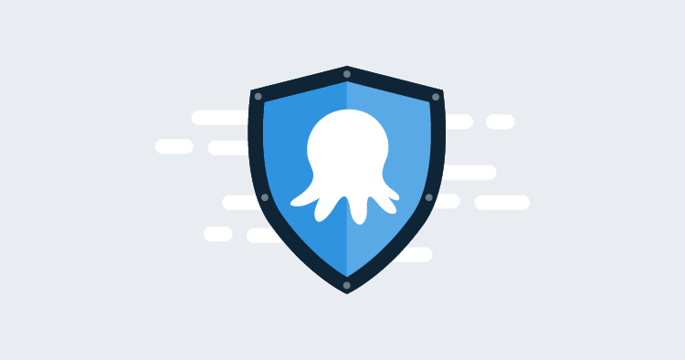

It doesn’t take much research to conclude that most IT departments really care about the security of the tools they use. Using SaaS products is usually an exercise in trust, and Octopus Cloud is no different. You trust us to keep your data safe, and we trust you to use our platform [fairly](https://octopus.com/legal/acceptable-usage), so it’s a reasonable question, just how secure are we?

Customers ask about our security posture all the time, particularly for Octopus Cloud. Right now, we ask them to read our documentation online, and we answer a few ad-hoc questions for them.

## What is our security posture?

It’s something that we think about constantly and have done a lot of work on over the years. To name a few highlights, we have a great [RBAC system](https://octopus.com/docs/security/users-and-teams), support for [many popular authentication providers](https://octopus.com/docs/security/authentication), and we have [solid auditing features](https://octopus.com/docs/security/users-and-teams/auditing) to help you secure your instance and keep it that way when you’re implementing our product. We’ve done our homework on things like [GDPR compliance](https://octopus.com/legal/gdpr), our use of [open source licenses](https://octopus.com/docs/credits), and calling out incidents on our [status page](https://status.octopus.com/).

When new features are created, we usually have an [internal bug bash](https://octopus.com/blog/how-we-work-some-lessons#deadlines-bug-bashes-swarms-and-kanban), and we run regular penetration testing exercises which are are performed by respected companies in that space, and by ourselves.

:::success
Our attitude has always been that it is more important to do material things towards our product’s security than it is to tick some compliance boxes.
:::

## Taking us at our word

Having said that, asking people to trust us at our word only gets us so far and only lasts for so long. How can you verify our work? Right now, you can’t, other than by our actions and our track record.

In order to help you verify our posture, we are working toward an ISO 27001 compliance certification for our products and the things that support their development. In the short term, we’ll share our self-assessment questionnaire from the Cloud Security Alliance (CAIQ Lite v3.1) to give potential cloud customers an idea of where we’re at right now. Ultimately, achieving ISO 27001 compliance will benefit not only our Octopus Cloud customers but our self-hosted customers as well.

By all accounts, it will be a tough journey, but we think we’re ready for it. We’ve defined the [high-level roadmap](https://github.com/OctopusDeploy/Issues/issues/6523) that we’d like to take, so you can see what our plans in finer detail.

## Trust, but verify us

As much as we’ve dedicated ourselves to achieving ISO 27001 compliance, we’re still focused on making actual security improvements, after all:

> _**Certificates don’t make you secure**, but our aim is for the process of attaining one to help affirm our worthiness of your trust and help us to improve our security along the way._

We recognize that security is not a state; it is a lifestyle choice. I personally think being able to answer the question “What is your security posture?” in common language that other businesses can interpret has a lot of value. 

It forces us to think about our security in a more holistic way. Certification will give us a well-trodden roadmap for analyzing our current position and making further improvements, but it will also force us to think about risk management in a more systematic way.

## Over to you

As we go through this process, it’s important to us to hear about your priorities. What can we do to be worthy of your business’s trust? Are certifications important to you, and if so, which ones? Maybe there is something else we should consider? We would love to get your thoughts and opinions on this.
