If you have been using Kubernetes for some time outside of Octopus, you likely have existing YAML resource definitions. Migrating this YAML into Octopus is easy thanks to a new feature introduced in Octopus 2020.2, giving you the best of both worlds with the ability to import, export, and edit raw YAML while having your Kubernetes resources managed in an opinionated way by Octopus.

In this blog post, I'll show you how to migrate an existing YAML definition into an Octopus deployment.

## The sample YAML

Below is YAML that defines a deployment resource and a service to expose the web application the Docker image contains:

```yaml
apiVersion: apps/v1
kind: Deployment
metadata:
  name: randomquotes
spec:
  selector:
    matchLabels:
      app: randomquotes
  replicas: 1
  strategy:
    type: RollingUpdate
  template:
    metadata:
      labels:
        app: randomquotes
    spec:
      containers:
        - name: randomquotes
          image: mcasperson/mywebapp:0.1.7
          ports:
            - name: web
              containerPort: 80
---
apiVersion: v1
kind: Service
metadata:
  name: randomquotes
spec:
  selector:
    app: randomquotes
  ports:
    - name: web
      port: 80
```

A common pattern in Kubernetes is to have a deployment exposed by a service, and then, potentially, have web traffic directed to it via an ingress. The YAML above is a simple example of the deployment and service pattern.

The Kubernetes steps in Octopus provide a way to capture this pattern in a single step, abstracting away some of the plumbing that links these resources together. Let's take our raw YAML and use it to build a step in Octopus.

## Create the Octopus step

We'll use the **Deploy Kubernetes containers** step to define the deployment and service in the YAML above. This step is an opinionated combination of a deployment with an optional service, ingress, secret, and configmap, and handles the plumbing required to link everything together:

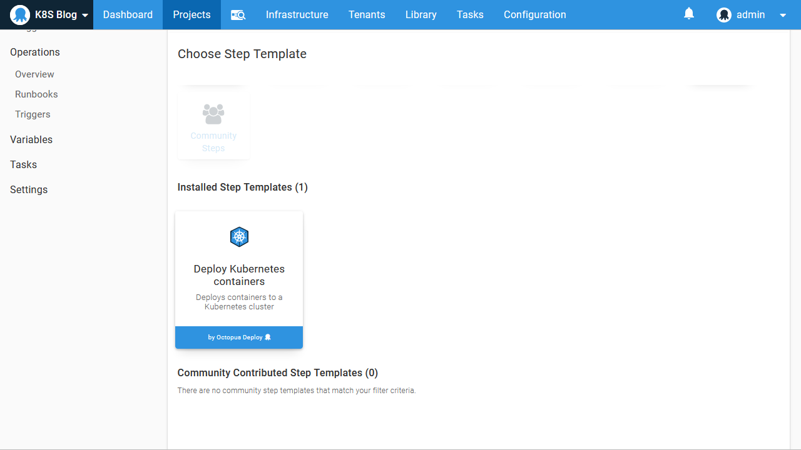

Because we are not deploying an ingress, secret, or configmap, we can remove those features from the step. This simplifies the user interface, allowing us to focus on the resources we are creating:

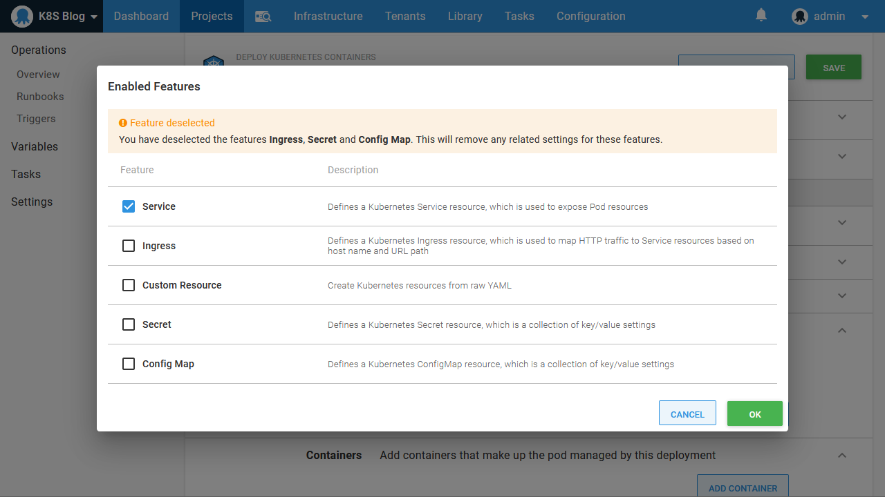

The **Edit YAML** section is new in Octopus 2020.2, and it allows the Kubernetes resources created by the step to be edited as YAML:

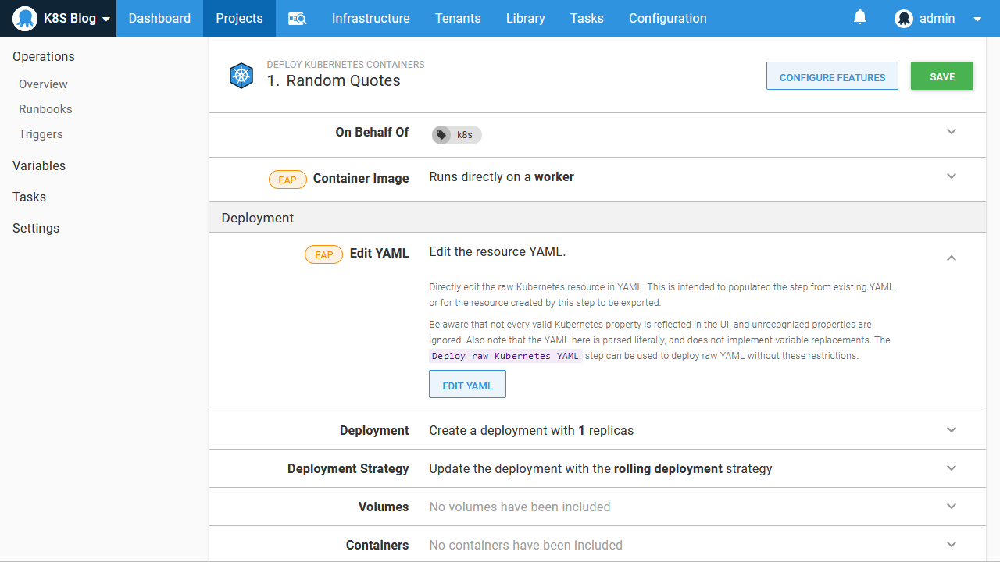

Clicking the **Edit YAML** button displays the YAML representation of the current settings in the step. Since we have just added the step, the only values shown are defaults or placeholders:

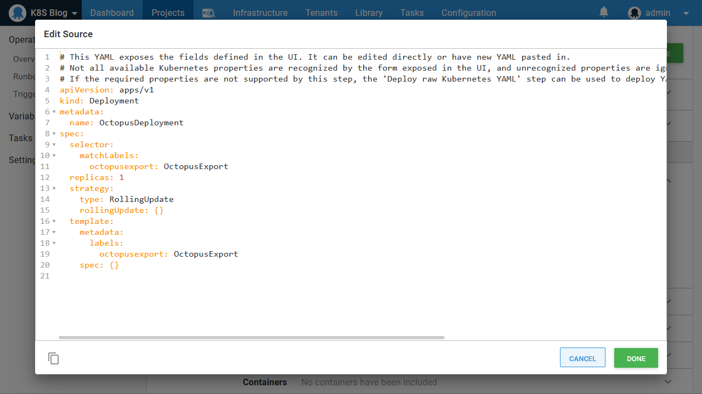

We can overwrite these values with the deployment YAML from our example above:

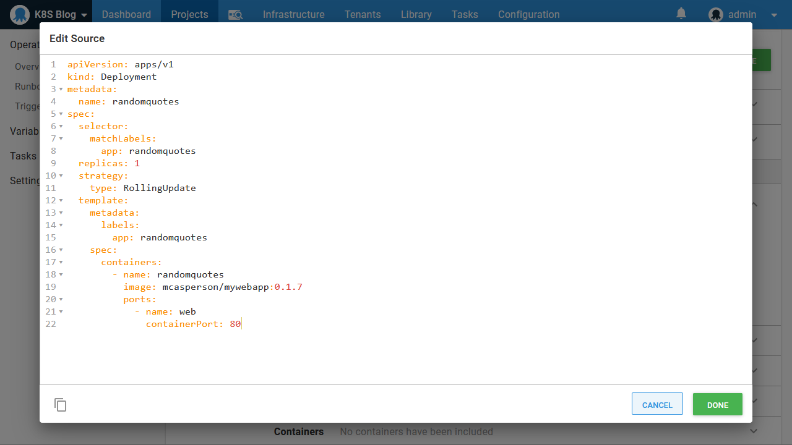

The deployment properties and container definitions are then populated in the form. Notice that the image version (or tag) has been removed, as this is expected to be selected when a deployment is created:

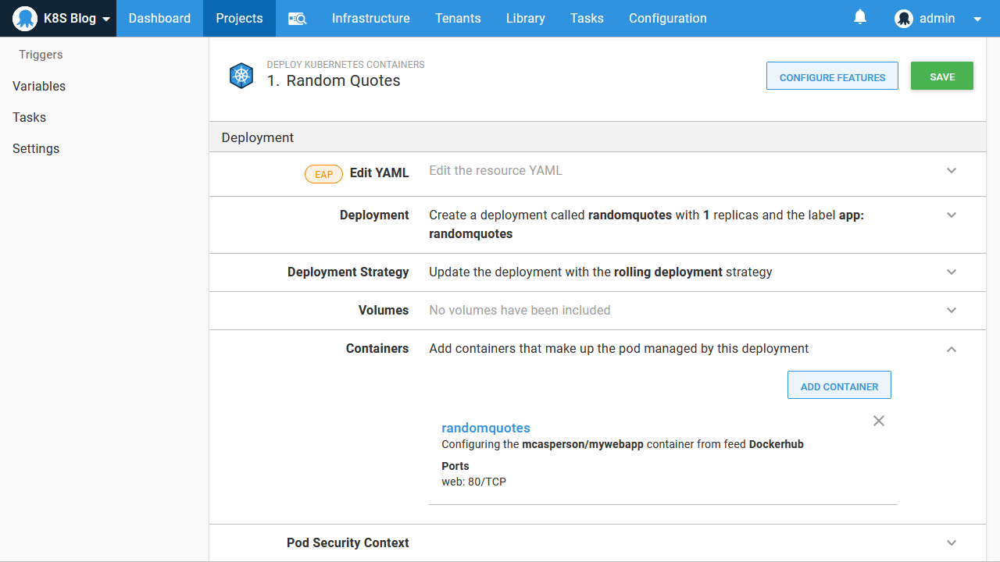

We can then repeat the process for the service, which has its own **Edit YAML** section:

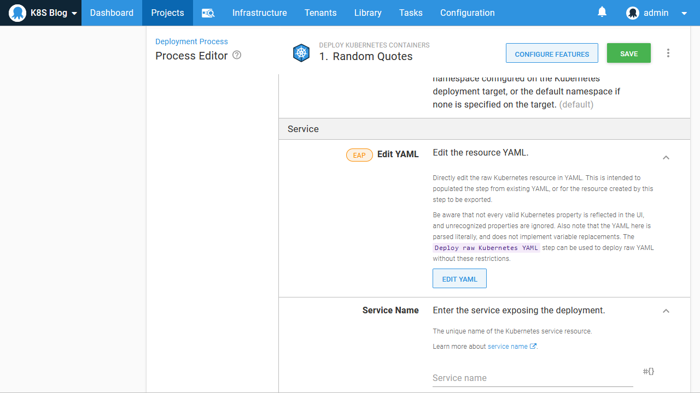

After the details are saved, the service is populated with the service properties and ports:

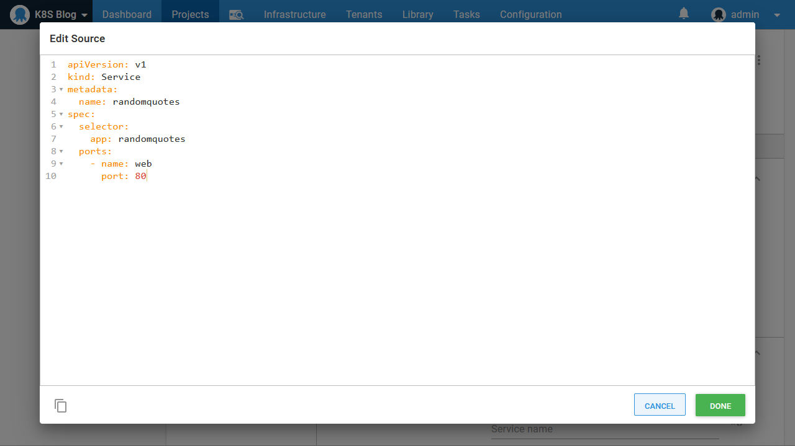

One thing to notice is that the service labels were not imported, as they are not exposed by the step. One of the opinions of this step is that all resources (which is the deployment and service in our case) share the labels defined on the deployment. The service and deployment are linked up at deployment time through additional labels automatically added by Octopus, freeing us from maintaining selector labels on the service:

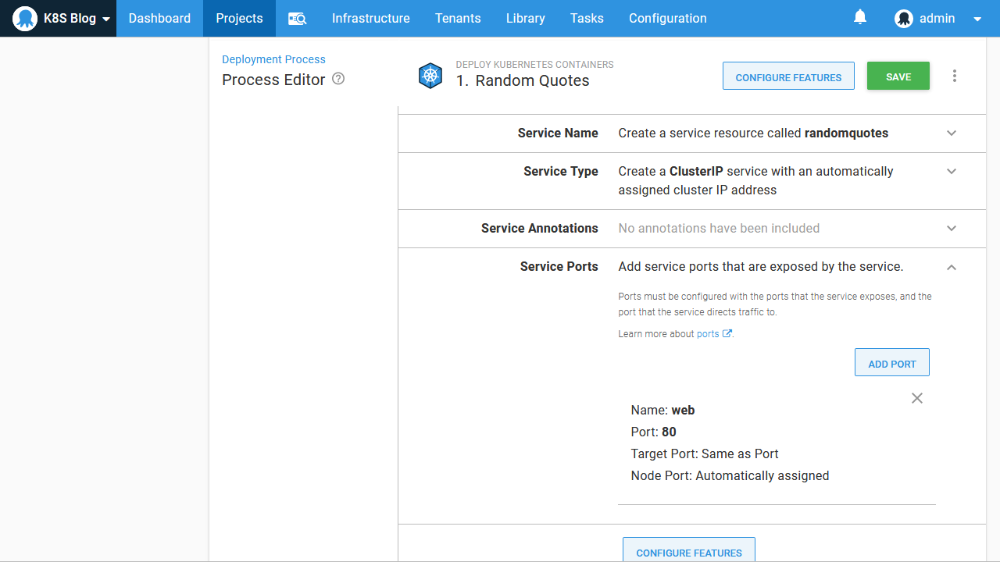

## Export the YAML

In the previous section, we used the **Edit YAML** section to import our existing YAML. This, in turn, populated the step with the details from our existing resource definitions.

Now that the step is populated, the **Edit YAML** section can be used as a way to export the YAML. Clicking the **Edit YAML** button in either the deployment or service section will expose the details in the form as a standard YAML resource. It is worth noting the exported YAML is not exactly the same as what was pasted in previously. Some default labels called `octopusexport` have been added to the deployment and the pod specification to link the two together:

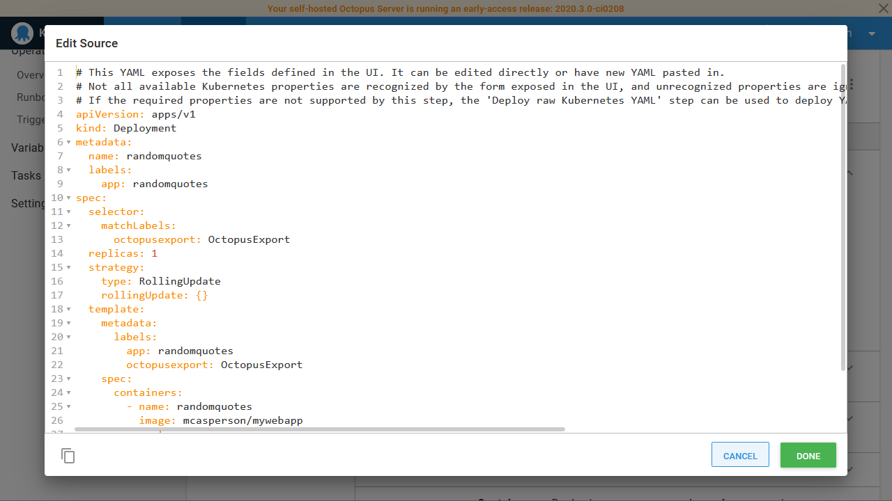

Likewise, the service YAML also includes some default labels to link the service to the pods:

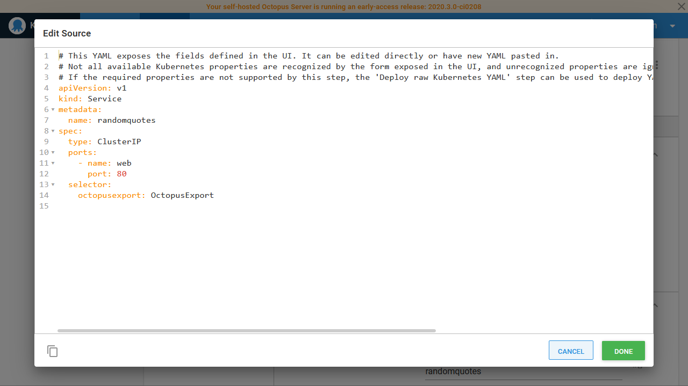

But apart from some small changes to how the resources reference each other, the generated YAML retains all the important details from the originally imported YAML. This makes it easy to copy the Kubernetes YAML definitions in and out of the opinionated Octopus steps or to simply edit the YAML in place if you find that easier than editing values via the UI.

## Limitations of YAML Importing

It is important to note the step will only import YAML values it recognizes. If your deployment YAML includes an unrecognized field, it is simply ignored. This functionality does not provide a way to have unrecognized values merged with those exposed by the UI.

If you have unrecognized values, you can take advantage of the **Deploy raw Kubernetes YAML** step, which will deploy YAML as is to Kubernetes and will only perform variable replacements based on the [Octopus variable syntax](https://octopus.com/docs/projects/variables/variable-substitutions).

However, if you find that you have run into the limitations of the opinionated step, copying and pasting the YAML it generates is an easy way to move to the raw YAML step.

## Conclusion

It is common to find Kubernetes resources like deployments combined with services, ingresses, secrets, and configmaps. Octopus captures this combination of resources with the **Deploy Kubernetes containers** step.

If you already have existing Kubernetes YAML, the **Deploy Kubernetes containers** step allows you to quickly populate its values by copying and pasting the YAML into the **Edit YAML** section.

The **Deploy Kubernetes containers** step does not (and never will) expose every possible value available for the underlying Kubernetes resources, and if you find yourself outgrowing this opinionated step, the **Edit YAML** section provides a quick way to extract the YAML produced by the step for use in generic steps like **Deploy raw Kubernetes YAML**.