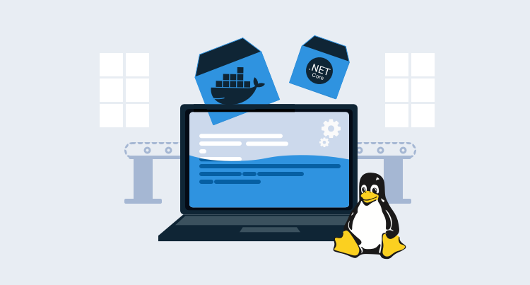
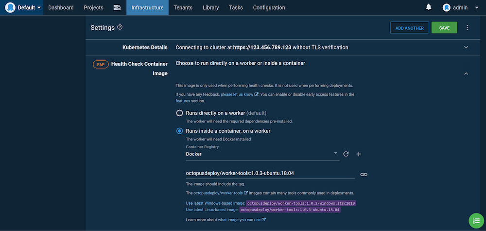

As part of our efforts to provide a scalable, cost-effective hosted solution for Octopus Cloud, we migrated all the V1 hosted instances to our new V2 infrastructure running Octopus in Linux containers inside Kubernetes, and we’re really pleased with the result.

Today, I’d like to announce early access to the Octopus Server Linux Docker image. The image is based on the same code that powers our hosted solution. These images allow Linux users to host Octopus on their operating system of choice.

## Getting started

The following Docker Compose template is the easiest way to get started. The template configures Microsoft SQL Server and Octopus with a single command.

Here is the `docker-compose.yml` file:

```yaml
version: '3'
services:
   db:
    image: ${SQL_IMAGE}
    environment:
      SA_PASSWORD: ${SA_PASSWORD}
      ACCEPT_EULA: ${ACCEPT_EULA}
      # Prevent SQL Server from consuming the defult of 80% physical memory.
      MSSQL_MEMORY_LIMIT_MB: 2048
    ports:
      - 1401:1433
    healthcheck:
      test: [ "CMD", "/opt/mssql-tools/bin/sqlcmd", "-U", "sa", "-P", "${SA_PASSWORD}", "-Q", "select 1"]
      interval: 10s
      retries: 10
   octopus-server:
    image: octopusdeploy/octopusdeploy:${OCTOPUS_SERVER_TAG}
    privileged: true
    environment:
      ACCEPT_EULA: ${ACCEPT_OCTOPUS_EULA}
      OCTOPUS_SERVER_NODE_NAME: ${OCTOPUS_SERVER_NODE_NAME}
      DB_CONNECTION_STRING: ${DB_CONNECTION_STRING}
      ADMIN_USERNAME: ${ADMIN_USERNAME}
      ADMIN_PASSWORD: ${ADMIN_PASSWORD}
      ADMIN_EMAIL: ${ADMIN_EMAIL}
      OCTOPUS_SERVER_BASE64_LICENSE: ${OCTOPUS_SERVER_BASE64_LICENSE}
      MASTER_KEY: ${MASTER_KEY}
      ADMIN_API_KEY: ${ADMIN_API_KEY}
    ports:
      - 8080:8080
    depends_on:
      - db
```

The `.env` file defines the environment variables used by Docker Compose:

:::hint
Be sure to change the `ACCEPT_EULA` and `ACCEPT_OCTOPUS_EULA` values!
:::

```
# It is highly recommended this value is changed as it's the password used for the database user.
SA_PASSWORD=N0tS3cr3t!

# Tag for the Octopus Server image. See https://hub.docker.com/repository/docker/octopusdeploy/octopusdeploy for the tags.
OCTOPUS_SERVER_TAG=2020.3.1

# Sql Server image. Set this variable to the version you wish to use. Default is to use the latest.
SQL_IMAGE=mcr.microsoft.com/mssql/server

# The default created user username for login to the Octopus Server
ADMIN_USERNAME=admin

# It is highly recommended this value is changed as it's the default user password for login to the Octopus Server
ADMIN_PASSWORD=Passw0rd123

# Email associated with the default created user. If empty will default to octopus@example.local
ADMIN_EMAIL=

# Accept the Microsoft Sql Server Eula found here: https://hub.docker.com/r/microsoft/mssql-server-windows-express/
ACCEPT_EULA=N

# Use of this Image means you must accept the Octopus Deploy Eula found here: https://octopus.com/company/legal
ACCEPT_OCTOPUS_EULA=N

# Unique Server Node Name - If left empty will default to the machine Name
OCTOPUS_SERVER_NODE_NAME=

# Database Connection String. If using database in sql server container, it is highly recommended to change the password.
DB_CONNECTION_STRING=Server=db,1433;Database=OctopusDeploy;User=sa;Password=N0tS3cr3t!

# Your License key for Octopus Deploy. If left empty, it will try and create a free license key for you
OCTOPUS_SERVER_BASE64_LICENSE=

# Octopus Deploy uses a Master Key for encryption of your database. If you're using an external database that's already been setup for Octopus Deploy, you can supply the Master Key to use it. If left blank, a new Master Key will be generated with the database creation.
MASTER_KEY=

# The API Key to set for the administrator. If this is set and no password is provided then a service account user will be created. If this is set and a password is also set then a standard user will be created.
ADMIN_API_KEY=
```

You create the containers with the command:

```
docker-compose up
```

After the images have booted, Octopus is accessible on `http://localhost:8080`.

## Tips and tricks

If you have a keen eye, you may have noticed that we launched the Octopus container with the `privileged` flag set to `true`. This is required to support the [Docker-in-Docker](https://hub.docker.com/_/docker) feature which is enabled by default in the container. Docker-in-Docker allows Octopus to make use of [execution containers for Workers](https://octopus.com/blog/execution-containers).

As Octopus has grown, one of the challenges we’ve faced, is the number, combination, and versions of the supporting tooling that’s required to interact with cloud services and platforms like Kubernetes. To address this, deployments and the health checks for targets like Kubernetes can be executed inside a Docker container. Octopus supplies [images for Windows and Linux](https://hub.docker.com/r/octopusdeploy/worker-tools) with a wide range of common tools and end-users can create their own images too.

To run these images from the container hosting Octopus, the Docker daemon is run in the background, which requires the `privileged` flag. This allows full access to the execution containers, meaning Linux users have out-of-the-box support to deploy to cloud services and Kubernetes (although Service Fabric still requires a Windows Worker for deployments).

:::hint
To disable Docker-in-Docker, set the `DISABLE_DIND` environment variable to `Y`.
:::

This means end-users no longer need to manage separate Workers with tools like `kubectl`, and instead, they can leverage the provided Worker tools images:



*Kubernetes health checks require kubectl, which is provided by the Worker tools image.*

## Running Octopus in Kubernetes

As the introduction of this post mentioned, the driving force behind running Octopus on Linux was to allow it to run in Kubernetes, and this option is available now to those who want to host Octopus in their own Kubernetes clusters.

Since high availability (HA) and Kubernetes go hand in hand, the solution presented here supports scaling Octopus Server instances with multiple HA nodes.

There are a number of aspects to consider when deploying a HA Octopus cluster, including:
* A HA database.
* A shared file systems for artifacts, logs, and the built-in feed.
* Load balancers for web traffic.
* Direct access to each Octopus node for polling Tentacles.
* Startup and upgrade processes that may result in database schema upgrades.

We won’t go into the details of deploying a HA SQL database. For the purposes of this blog, we’ll deploy a single instance of MS SQL Express to the cluster. The YAML below creates a persistent volume claim to store the database files, a service to expose the database internally, and the database itself:

```YAML
kind: PersistentVolumeClaim
apiVersion: v1
metadata:
  name: mssql-data
spec:
  accessModes:
  - ReadWriteOnce
  resources:
    requests:
      storage: 8Gi
---
apiVersion: v1
kind: Service
metadata:
  name: mssql
spec:
  type: ClusterIP
  ports:
    -
      port: 1433
      targetPort: 1433
      protocol: TCP
  selector:
    app: mssql
---
apiVersion: apps/v1
kind: Deployment
metadata:
  name: mssql-deployment
  labels:
    app: mssql
spec:
  selector:
    matchLabels:
      app: mssql
  replicas: 1
  strategy:
    type: Recreate
  template:
    metadata:
      labels:
        app: mssql
    spec:
      terminationGracePeriodSeconds: 10
      volumes:
        - name: mssqldb
          persistentVolumeClaim:
            claimName: mssql-data
      containers:
        - name: mssql
          image: mcr.microsoft.com/mssql/server:2019-latest
          ports:
            - containerPort: 1433
          env:
            - name: MSSQL_PID
              value: Express
            - name: ACCEPT_EULA
              value: 'Y'
            - name: SA_PASSWORD
              value: Password01!
          volumeMounts:
            - name: mssqldb
              mountPath: /var/opt/mssql
```

To share common files between the Octopus nodes, we need access to three shared volumes that multiple pods can read to and write from simultaneously. These are created via persistent volume claims with an access mode of `ReadWriteMany` to indicate they are shared between multiple pods. The YAML below creates the shared persistent volume claims that will host the task logs, the built-in feed, and the artifacts:

:::note
Note that the storage class name `azurefile` is specific to Azure AKS, and other Kubernetes providers will expose different names for their shared filesystems.
:::

```YAML
kind: PersistentVolumeClaim
apiVersion: v1
metadata:
  name: repository-claim
spec:
  accessModes:
    - ReadWriteMany
  storageClassName: azurefile
  resources:
    requests:
      storage: 1Gi
---
kind: PersistentVolumeClaim
apiVersion: v1
metadata:
  name: artifacts-claim
spec:
  accessModes:
    - ReadWriteMany
  storageClassName: azurefile
  resources:
    requests:
      storage: 1Gi
---
kind: PersistentVolumeClaim
apiVersion: v1
metadata:
  name: task-logs-claim
spec:
  accessModes:
    - ReadWriteMany
  storageClassName: azurefile
  resources:
    requests:
      storage: 1Gi
```

The Octopus web interface is a React single page application (SPA) that can direct all backend requests to any Octopus node. This means we can expose all Octopus nodes through a single load balancer for the web interface. Below is the YAML for a load balancer service directing web traffic on port 80 to pods with the label `app:octopus`:

```YAML
apiVersion: v1
kind: Service
metadata:
  name: octopus-web
spec:
  type: LoadBalancer
  ports:
    - name: web
      port: 80
      targetPort: 8080
      protocol: TCP
  selector:
    app: octopus
```

Unlike the web interface, Polling Tentacles must be able to connect each Octopus node individually to pick up new tasks. Our Octopus HA cluster assumes two nodes, and the load balancers below create separate public IPs for each node.

Note the selectors of `statefulset.kubernetes.io/pod-name: octopus-0` and `statefulset.kubernetes.io/pod-name: octopus-1`. These labels are added to pods created as part of a stateful set, and the values are the combination of the stateful set name and the pod index:

```YAML
apiVersion: v1
kind: Service
metadata:
  name: octopus-0
spec:
  type: LoadBalancer
  ports:
    - name: web
      port: 80
      targetPort: 8080
      protocol: TCP
    - name: tentacle
      port: 10943
      targetPort: 10943
      protocol: TCP
  selector:
    statefulset.kubernetes.io/pod-name: octopus-0
```

```YAML
apiVersion: v1
kind: Service
metadata:
  name: octopus-1
spec:
  type: LoadBalancer
  ports:
    - name: web
      port: 80
      targetPort: 8080
      protocol: TCP
    - name: tentacle
      port: 10943
      targetPort: 10943
      protocol: TCP
  selector:
    statefulset.kubernetes.io/pod-name: octopus-1
```

Finally, we combine all the resources above into a stateful set that creates the Octopus nodes.

A stateful set provides a mechanism for deploying pods that have fixed names, consistent ordering, and an initial deployment process that rolls out one pod at a time, ensuring each is healthy before the next is started (although redeployments need special consideration, which I cover later). This functionality works very nicely when deploying Octopus, as we need to ensure that Octopus instances start sequentially so only one instance attempts to apply updates to the database schema.

The YAML below creates a stateful set with two pods. These pods will be called `octopus-0` and `octopus-1`, which will also be the value assigned to the `statefulset.kubernetes.io/pod-name` label, which in turn is how we link services exposing individual pods. The pods then mount the shared volumes for artifacts, logs, and the built-in feed.

The `preStop` hook is used to drain a node before it is stopped. This gives the node time to complete any running tasks and prevents it from starting new tasks. The `postStart` start hook does the reverse and disables drain mode when the server is up and running.

The `readinessProbe` is used to ensure the node is responding to network traffic before the pod is marked as ready. The `startupProbe` is used to delay the `livenessProbe` until such time as the node is started, and the `livenessProbe` runs continuously to ensure the node is functioning correctly:

```YAML
apiVersion: apps/v1
kind: StatefulSet
metadata:
  name: octopus
spec:
  selector:
    matchLabels:
      app: octopus
  serviceName: "octopus"
  replicas: 2
  template:
    metadata:
      labels:
        app: octopus
    spec:
      terminationGracePeriodSeconds: 10
      volumes:
      - name: repository-vol
        persistentVolumeClaim:
          claimName: repository-claim
      - name: artifacts-vol
        persistentVolumeClaim:
          claimName: artifacts-claim
      - name: task-logs-vol
        persistentVolumeClaim:
          claimName: task-logs-claim
      containers:
      - name: octopus        
        image: octopusdeploy/octopusdeploy:2020.3.1
        securityContext:
          privileged: true
        env:
          - name: ACCEPT_EULA
            # "Y" means accepting the EULA at https://octopus.com/company/legal
            value: "Y"
          - name: OCTOPUS_SERVER_NODE_NAME
            valueFrom:
              fieldRef:
                fieldPath: metadata.name
          - name: DB_CONNECTION_STRING
            value: Server=mssql,1433;Database=Octopus;User Id=SA;Password=Password01!
          - name: ADMIN_USERNAME
            value: admin
          - name: ADMIN_PASSWORD
            value: Password01!
          - name: ADMIN_EMAIL
            value: admin@example.org
          - name: OCTOPUS_SERVER_BASE64_LICENSE
            # Your license key goes here. When using more than one node, a HA license is required. Without a HA license, the stateful set can have a replica count of 1.
            value: License goes here
          - name: MASTER_KEY
            # Replace this, as this value protects secrets in Octopus
            value: 6EdU6IWsCtMEwk0kPKflQQ==
        ports:
        - containerPort: 8080
          name: web
        - containerPort: 10943
          name: tentacle
        volumeMounts:
        - name: repository-vol
          mountPath: /repository
        - name: artifacts-vol                                                  
          mountPath: /artifacts
        - name: task-logs-vol
          mountPath: /taskLogs
        lifecycle:
          preStop:
            exec:
              command:
              - /bin/bash
              - -c
              - '[[ -f /Octopus/Octopus.Server ]] && EXE="/Octopus/Octopus.Server" || EXE="dotnet /Octopus/Octopus.Server.dll"; $EXE node --instance=OctopusServer --drain=true --wait=600 --cancel-tasks;'
          # postStart must finish in 5 minutes or the container will fail to create
          postStart:
            exec:
              command:
              - /bin/bash
              - -c
              - 'URL=http://localhost:8080; x=0; while [ $x -lt 9 ]; do response=$(/usr/bin/curl -k $URL/api/octopusservernodes/ping --write-out %{http_code} --silent --output /dev/null); if [ "$response" -ge 200 ] && [ "$response" -le 299 ]; then break; fi; if [ "$response" -eq 418 ]; then [[ -f /Octopus/Octopus.Server ]] && EXE="/Octopus/Octopus.Server" || EXE="dotnet /Octopus/Octopus.Server.dll"; $EXE node --instance=OctopusServer --drain=false; now=$(date); echo "${now} Server cancelling drain mode." break; fi; now=$(date); echo "${now} Server is not ready, can not disable drain mode."; sleep 30; done;'
        readinessProbe:
          exec:
            command:
            - /bin/bash
            - -c
            - URL=http://localhost:8080; response=$(/usr/bin/curl -k $URL/api/serverstatus/hosted/internal --write-out %{http_code} --silent --output /dev/null); /usr/bin/test "$response" -ge 200 && /usr/bin/test "$response" -le 299 || /usr/bin/test
          initialDelaySeconds: 30
          periodSeconds: 30
          timeoutSeconds: 5
          failureThreshold: 60
        livenessProbe:
          exec:
            command:
            - /bin/bash
            - -c
            - URL=http://localhost:8080; response=$(/usr/bin/curl -k $URL/api/octopusservernodes/ping --write-out %{http_code} --silent --output /dev/null); /usr/bin/test "$response" -ge 200 && /usr/bin/test "$response" -le 299 || /usr/bin/test "$response" -eq 418
          periodSeconds: 30
          timeoutSeconds: 5
          failureThreshold: 10
        startupProbe:
          exec:
            command:
            - /bin/bash
            - -c
            - URL=http://localhost:8080; response=$(/usr/bin/curl -k $URL/api/octopusservernodes/ping --write-out %{http_code} --silent --output /dev/null); /usr/bin/test "$response" -ge 200 && /usr/bin/test "$response" -le 299 || /usr/bin/test "$response" -eq 418
          failureThreshold: 30
          periodSeconds: 60
```

The initial deployment of the stateful set works exactly as Octopus requires; one pod at a time is successfully started before the next. This gives the first node a chance to update the SQL schema with any required changes, and all other nodes start-up and share the already configured database.

One limitation with stateful sets is how they process updates. For example, if the Docker image version was updated, by default the rolling update strategy is used. A rolling update deletes and recreates each pod, which means that during the update there will be a mix of old and new versions of Octopus. This won’t work, as the new version may apply schema updates that the old version can not use, leading to unpredictable results at best, and could result in corrupted data.

The typical solution to this problem is to use a recreate deployment strategy. Unfortunately, stateful sets do not support the recreate strategy.

What this means is that the stateful set can not be updated in place, but instead must be deleted and then a new version deployed. This new, fresh copy of the stateful set will then start the new pods one by one, allowing the database update to complete as expected.

Once fully deployed, this configuration will have three load balancers, and in turn three public IPs.

The `octopus-web` service is used to access the web interface. As we noted previously, the web app can make requests to any node, and so load balancing across all the nodes means the web interface is accessible even if one node is down.

The `octopus-0` service is used to point Polling Tentacles to the first node, and the `octopus-1` service is used to point Polling Tentacles to the second node. We have also exposed the web interface through these services, which gives support teams the ability to directly interact with a given node, but the `octopus-web` service should be used for day to day work. The [documentation](https://octopus.com/docs/administration/high-availability/maintain/polling-tentacles-with-ha) provides details on connecting Polling Tentacles to HA nodes.

For a greater degree of reliability, pod [anti-affinity rules](https://kubernetes.io/docs/concepts/scheduling-eviction/assign-pod-node/#inter-pod-affinity-and-anti-affinity) could be used to ensure Octopus pods are not placed onto the same node. This ensures the loss of a node does not bring down the Octopus cluster.

## Octopus Helm chart

For convenience, the Kubernetes resources described above have been bundled into a Helm chart. To add the Helm repository, run the following commands:

```
helm repo add octopus https://octopus-helm-charts.s3.amazonaws.com
helm repo update
```

Then install the chart with the command:

```
helm install octopus octopus/octopusdeploy --set octopus.licenseKeyBase64=<your Octopus license key base64 encoded> --set octopus.acceptEula=Y --set mssql-linux.acceptEula.value=Y
```

The default values of the chart are configured to create a single node Octopus cluster with `ReadWriteOnce` volumes. These values are well supported by default in Kubernetes clusters.

To deploy a HA cluster, you need to define some additional values specific to the cluster you are deploying to. For example, when deploying to Azure AKS, the following values are used to create `ReadWriteMany` volumes shared between three Octopus HA nodes:

```
helm install octopus octopus/octopusdeploy --set octopus.replicaCount=3 --set octopus.storageClassName=azurefile --set octopus.licenseKeyBase64=<your Octopus license key base64 encoded> --set octopus.acceptEula=Y --set mssql-linux.acceptEula.value=Y
```

The chart source code is available on [GitHub](https://github.com/OctopusSamples/OctopusHelmChart).

## Adding deployment targets

In addition to cloud deployments, self-hosted deployments are supported through the [Linux versions of Tentacle](https://octopus.com/docs/infrastructure/deployment-targets/linux/tentacle). Both DEB and RPM packages are provided or you can download Tentacle as a standalone archive.

Of course, you can still connect Windows Tentacles to the Linux version of Octopus if you need to manage deployments and operations across operating systems.

## Where to go from here

The Linux Docker images and sample Kubernetes resources have been released as part of our Early Access Program (EAP), so we do expect a few bugs and rough edges, and we do not support this version for production deployments. However, if you encounter any issues we’d love to hear about them through our [support channels](https://octopus.com/support) so we can iron out the bugs.

Happy deployments!
