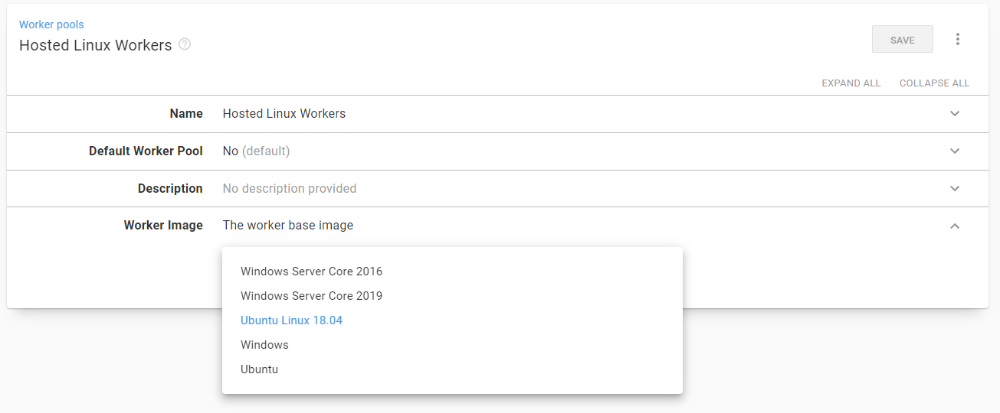
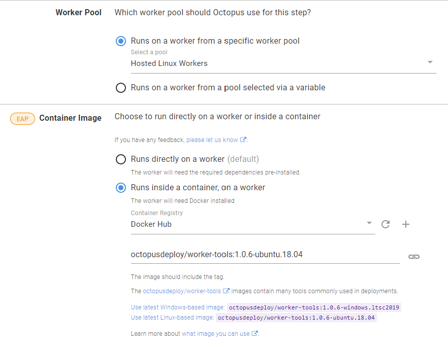

With Octopus-hosted [dynamic worker pools](https://octopus.com/docs/infrastructure/workers/dynamic-worker-pools), you can spin up an [Octopus Cloud](https://octopus.com/pricing/cloud) instance and be running PowerShell deployment or runbook steps on a Windows machine in minutes. Unfortunately, running a bash script on a Linux machine was not as easy.

The omission of support for Linux workers on Octopus Cloud has made us a little sad since we launched. You've been able to add your own Linux workers, but it hasn't felt as natural as the built in support for dynamic workers provided for Windows.

## Ubuntu 18.04 workers now available

As of today, I'm happy to announce that we now support Ubuntu workers on Octopus Cloud. This is a step forward for us on our journey to not only be the best deployment tool for your Windows workloads, but also for your Linux workloads too.



## Windows 2019 workers now available

Another thing that I'm happy to share is that we've also launched Windows 2019 workers at the same time. We've not yet switched everyone over, but you can opt-in to using the new worker images under `Infrastructure -> Worker Pools`.

## Docker now pre-installed

A big positive of switching to the Windows 2019 workers is that they've got Docker installed as well, so you can make your builds sparkle with your own custom docker images - the only limit is your imagination (oh, and DockerHub download times).

One thing we're really excited about here is that adding support for Docker here really opens up our [execution containers feature](https://octopus.com/blog/execution-containers) which has been behind a feature flag for a while. We'll be removing the feature flag very soon to make it generally available, but you can opt in right now by going to `Configuration -> Features`.

<!-- todo: make sure this :point_up: is updated when feature flag is removed -->

## New worker tools container version

Oh, and one last thing - we've also updated our [worker tools containers](https://hub.docker.com/r/octopusdeploy/worker-tools) with the latest tooling ready to unblock lots of goodness, such as the brand new shiny [Terraform 0.13](https://www.hashicorp.com/blog/announcing-hashicorp-terraform-0-13/) version that just got released. Check out the [PR #20](https://github.com/OctopusDeploy/WorkerTools/pull/20) for full details of the versions available.

## Walkthough

Enough with the "what's new". Read on for a walkthrough of running a bash script on a Linux worker. For added points, we'll execute Terraform from inside a  container to show how easy it is to use the newest version.

### Enable the feature

<!-- todo: make sure this is updated once 2020.4.0 is GA on cloud (the feature flag is going away) -->

Go to the `Configuration -> Features` menu, and make sure `Execution containers for workers` is set to enabled.

### Configuring the worker pool

<!-- todo: make sure this is updated once 2020.4.0 is GA on cloud (the worker pool will be auto-created -->

As of today, most customers on Octopus Cloud are on 2020.3.3. This does not yet have a Linux worker pool created by default - this will happen when 2020.4.0 is made available shortly.

In the meantime, go to `Infrastructure -> Worker Pools`, and hit the `Add Worker Pool` button. Selecting `Dynamic` for the Worker Pool Type will use a virtual machine hosted in Octopus Cloud for your deployments.

### Configure an external feed for DockerHub

If you dont yet have a feed setup for DockerHub, go to `Library -> External Feeds` and hit the `Add Feed` button. Select `Docker Container Registry` in the `Feed Type` field, and give it a name - I called mine `Docker Hub`.

### Create a new runbook

Once you've created your new Worker Pool, go to the projects tab, and create a new project. From there, go to Runbooks and hit the `Add Runbook` button and give it a name.

On the process tab, add a new `Run a Script` step. Choosing `Run once on a worker` will let you choose your new worker pool, and expose a new section called `Container Image`.



Choose your Docker Hub feed, and then click the `Use latest Linux-based image` link at the bottom. This will populate the field with the latest version automatically.

Finally, for the script, choose `Bash` and enter the following script:

```bash
cat <<EOT > main.tf
resource "null_resource" "example1" {
  provisioner "local-exec" {
    command = "echo 'hello'"
  }
}
EOT

echo "-----terraform init-----"
terraform init -no-color

echo "-----terraform apply-----"
terraform apply -no-color -auto-approve
```

Hitting `Save` then `Run` will execute the script:


While this script doesn't exactly do much (it `echo`'s out "hello"), it highlights how easy is is to run a bash script and use the latest terraform version.

## Conclusion

We hope you're as excited as we are about these new capabilities. Give it a bash today (pun fully intended) and let us know what you think!

Happy deployments!
