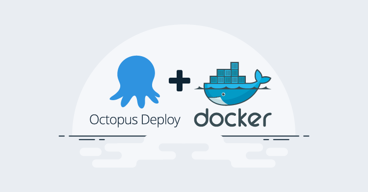
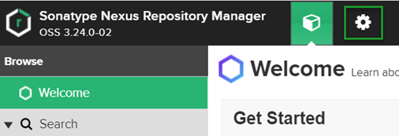
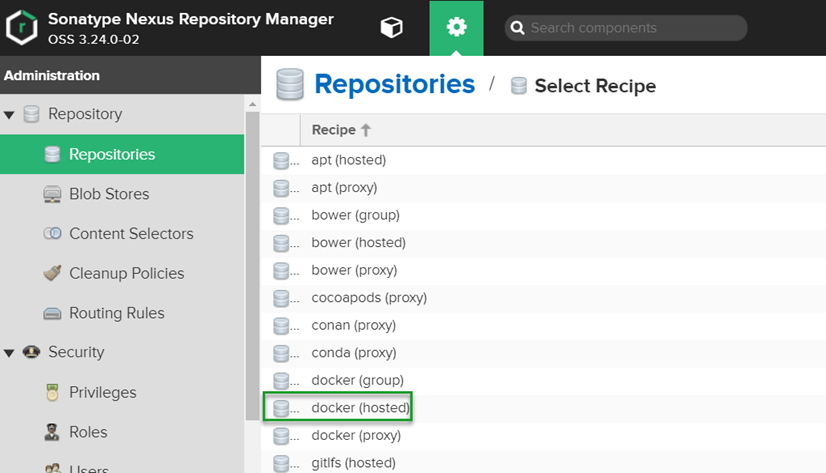
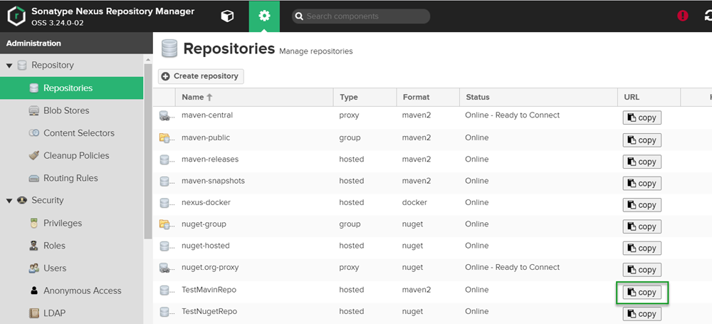
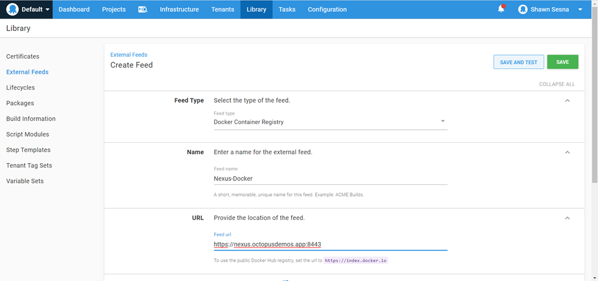

Connecting [Docker Hub](https://hub.docker.com) to Octopus Deploy is pretty straight forward, however, not everyone wants to use a publicly available Docker registry.  In these cases, you can use repository software such as [JFrog Artifactory](https://jfrog.com/artifactory) or [Sonatype Nexus](https://www.sonatype.com/product-nexus-repository).  Both JFrog and Sonatype have Open-Source Software (OSS) versions, however, JFrog does not include the Docker registry repository type in their OSS flavor.  In this post, I demonstrate how to create a Docker registry in Nexus and connect it to Octopus Deploy.

## Nexus
The paid version includes features such as High Availability (HA), dynamic storage, and better authentication integration, but the overall operational features are all turned on in the OSS version.

### Create a Docker registry
Creating a Docker registry repository in Nexus is pretty easy. Log in to Nexus and navigate to the **Server Administration** tab (gear icon):



From here, click on the **Repositories** tab on the left, and click **Create repository**.

Choose the **docker (hosted)** repository type:



This part of the process is where it differs from other repository types such as NuGet and Maven 2.  Whereas the other two use `https://ServerUrl/repository/RepositoryName`, Nexus Docker registries require a port assignment.  In this example, I used port `8443`, this will become important later when we tag our images.

You can accept the defaults for the rest of the options.  Click the **Create repository** button at the bottom of the page when you’re done.

### Tagging images

In order to upload a docker image to our Nexus Docker registry, we have to tag the image appropriately.  This is accomplished with the following tag scheme: `ServerUrl:Port/ImageName:Version`.  For example:

```
nexus.octopusdemos.app:8443/pitstop-auditlogservice:1.0.0.0
```

Note the repository name `nexus-docker` is not present in the tag.  This is where the port designation is important as it identifies which registry this will belong to when uploaded to Nexus.

## Connect to Octopus Deploy

When connecting other repository types to Octopus Deploy, you simply provide the URL from the Copy URL button within Nexus:



While the button is present for our Docker registry, this is not how we connect to the repository with Octopus Deploy.

:::warning
Using the URL from this page when creating an external feed within Octopus Deploy and testing it will produce a false positive. The endpoint will respond with a success message and even provide search results, but it will fail when you attempt to use it in a deployment process.
:::

### Create the external feed
To create an external feed in Octopus Deploy click on the **Library** tab, then **External Feeds**, and click the **ADD FEED** button.

Enter the following information for the external feed:
- Feed type: Docker Container Registry.
- Name: Give it a descriptive name.
- URL: https://ServerUrl:Port (e.g. https://nexus.octopusdemos.app:8443).
- Registry Path: leave blank.
- Credentials: Enter credentials if they are required:



Click **SAVE AND TEST** when done.

Enter an image name (partial names are supported) and click **SEARCH** to verify the connection is working properly.

## Conclusion

Nexus has a unique way of handling Docker registries as repository types.  In this post, I demonstrated what is necessary to create a registry and connect it to Octopus Deploy.