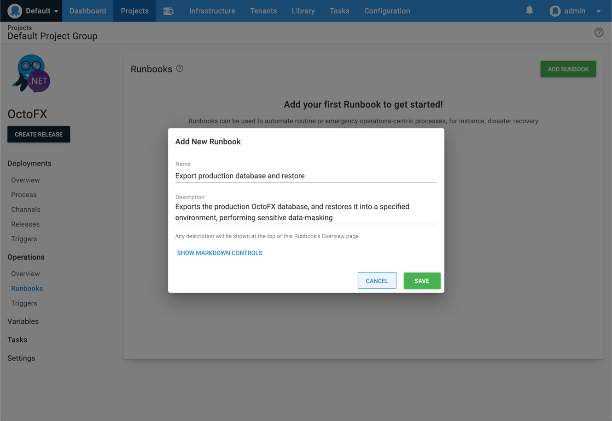

One of the attractions of platform-as-a-service products such as Azure Web Apps is that they reduce the burden of operations. For example, there are no servers to be provisioned and updated. However, there many operations tasks which are still required, even in a PaaS world. 

Our friends at [Clear Measure](https://clearmeasure.com/) have contributed some step templates to the [Octopus community library](https://library.octopus.com/) to help perform some common operations tasks for Azure Web Apps.   

**Scenarios:**
- Export and restore database 
- Directing traffic between deployment slots (canary deployments)
- Updating configuration settings
- Restart/Stop/Start 

## Export and restore database

Any real world Azure Web Apps will be backed by a database, just like any other application. In the case of Azure Web Apps, that database is very often a SQL Server database also hosted in Azure.   

It's often desirable for test environments to have data that closely matches production. This is valuable when testing new features or bug-fixes, as it ensures they work with real-world data. 

Let's walk-through creating a runbook which exports the data from the production Azure SQL Server database, restores it into a selected test environment, and then obscures any sensitive data.  This will allow developers, QA, Product Managers, etc, the ability to populate a test environment with production-like data without needing to give them access to the production database.    

1. Ensure you have [created an Azure Service Principal account](https://octopus.com/docs/infrastructure/deployment-targets/azure#CreatinganAzureAccount-AuthenticationMethod). This account will need to have the required Azure permissions to export the database. 

2. Create the runbook: {{ Project, Runbooks, Add Runbook }}  

3. 

