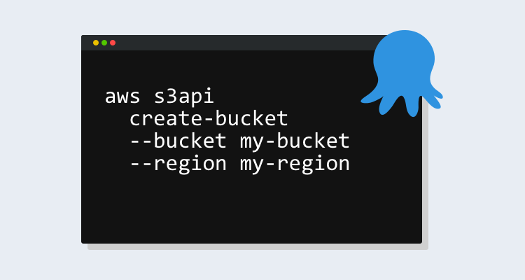
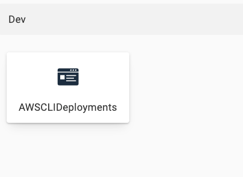
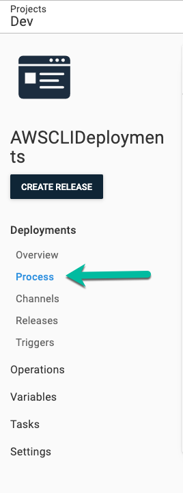
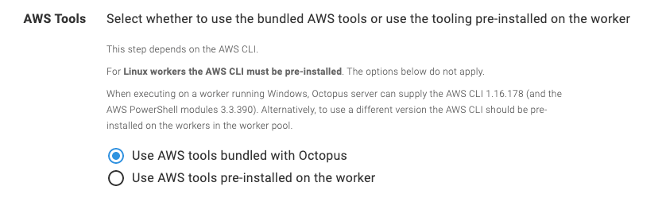
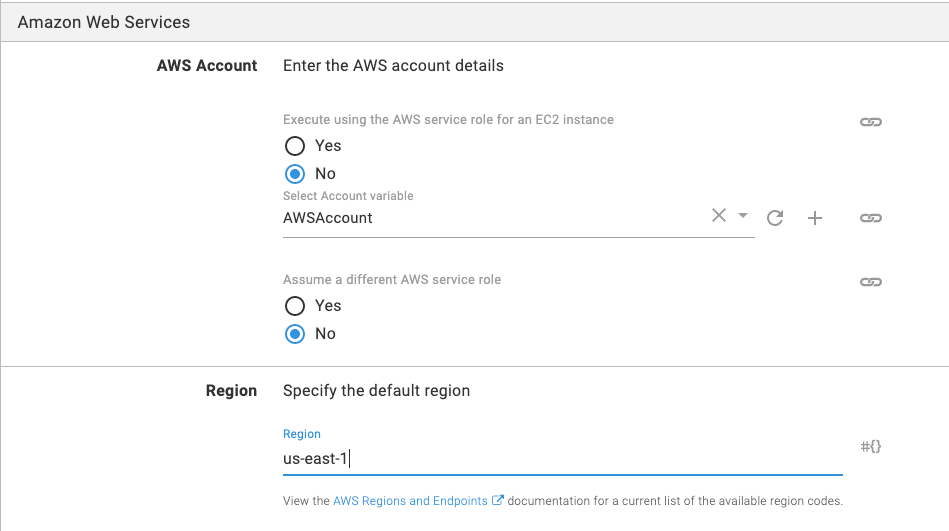

Have you ever found yourself in a situation where you knew you wanted to automate the creation of an object or perhaps even list out objects and generate a report, but you didn’t want to jump around between programming languages? CLI’s give you a way to have the full usability of an SDK and they typically run the same on every system, which means you don’t have to create a wrapper around an API.

In this blog post, we take a look at how to use the AWS CLI in Octopus Deploy. The demonstration focuses on creating an S3 bucket with the **Run an AWS CLI Script** step template in Octopus Deploy.

## Prerequisites

To follow along with this blog post, you should have the following:

- An Octopus Deploy server, on-premises or Octopus Cloud.
- [An AWS account set up with an IAM user in Octopus Deploy](/blog/2020-08/connect-an-aws-account-to-octopus/index.md).
- Experience with the AWS CLI.
- At least one environment set up in Octopus Deploy.
- The Octopus CLI installed. If you don’t have it installed, you can download and install it from the [Octopus CLI download page](https://octopus.com/downloads/octopuscli).

!include <register>

## Create a new project

Before running any AWS CLI commands or creating steps, you need to configure a project so you have somewhere to create the AWS CLI process and steps. To do this, we’ll use the power of the Octopus CLI.

Open a terminal and run the following command to create a new project with the appropriate switch values added:

```
octo create-project --name AWSCLIDeployments --server=octopus_server_url --apiKey=octopus_server_api_key --projectGroup project_group --lifecycle=lifecycle_name
```

Open a web browser and log into the Octopus Web Portal. You should now see the new project available:



## Configure the variables

Now that the project is created, you can the configure the project itself. First, we’ll configure the variables. For the AWS CLI step template to work, it needs the AWS account to be a variable:

1. In the Octopus Web Portal, navigate to the project you just created, **{{Projects,AWSCLIDeployments}}**.
2. Under the project pane, click **Variables**.
3. Within the project variables under **value**, choose the drop down and select **CHANGE TYPE**.
4. Under the type options, choose **AWS Account**.
5. Choose an existing AWS Account and give it a name. When complete, click the green **DONE** button.
6. Click the green **SAVE** button to save the variable in the project.

## Add the AWS CLI step

Now that the AWS account variable has been configured, you’re ready to start configuring the AWS CLI step itself to run AWS CLI commands. To do that, you’re going to create a new process:

1. On the project’s overview page, select **Process**:



2. On the process page you can start adding new steps, specifically, the AWS CLI step. Click the **ADD STEP** button.
3. Under **Choose Step Template**, choose AWS, and under the installed steps templates, select the step template called **Run an AWS CLI Script**. After you find it, click the step.
4. In the **AWS Tools** section, select **Use AWS tools bundled with Octopus** as this option has everything we need:



5. In the **Amazon Web Services** section, select the `AWSAccount` variable you created earlier and choose the **us-east-1** region:



6. In the **Script section** of the step, select the inline source code option and type in the following code which will be used to create an S3 bucket. You can also change the name of the bucket to the environment you’re in instead. Remember, the S3 bucket names must be unique:

```
aws s3api create-bucket --bucket octopusdeploys392 --region us-east-1
```

7. After you type in the code, click the green **SAVE** button.

You are now ready to run the pipeline.

## Run the pipeline

The step is now created to use the AWS CLI, the inline code has been added, and you’re ready to start the deployment process of the pipeline. 

1. Under the project, click the blue **CREATE RELEASE** button.
2. To save the release, click the green **SAVE** button.
3. Choose which environment you want to deploy to. For example, Dev.
4. Click the green **DEPLOY** button and the deployment will begin.
5. When complete, you will see the task summary in which creating the S3 bucket was complete.

Congrats! You have successfully used the AWS CLI to create an S3 bucket in AWS.

## Conclusion

Many CLIs give you the ability to perform simple actions around tasks that may be complex or cumbersome in the UI. With a CLI, you can still interact directly with a platform from a programmatic perspective to ensure you have the ability to automate tasks.

In this blog post, you learned not only how to get a project up and running in Octopus Deploy, but also how to configure the AWS CLI task to create an S3 bucket in AWS.

Happy deployments!
