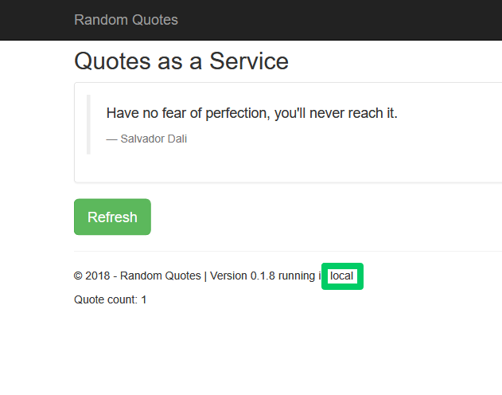
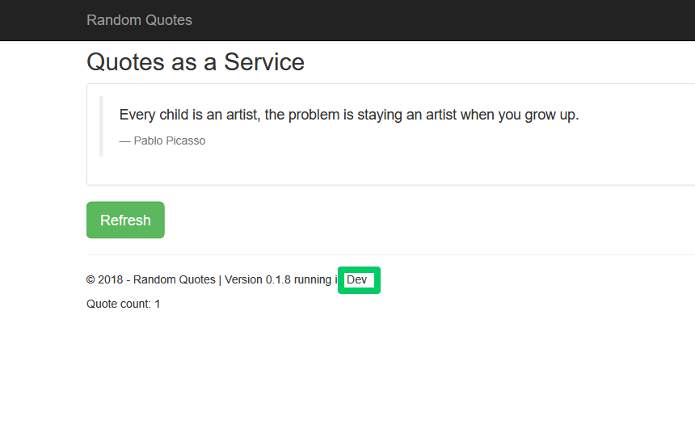

Spring has rich support for complex configurations. The built in support for profiles and [externalized configuration](https://docs.spring.io/spring-boot/docs/current/reference/html/spring-boot-features.html#boot-features-external-config) gives you a good degree of freedom to construct environment specific configuration that can be bundled into a single, self contained application archive.

But most developers will still face the fundamental question of how to develop an application locally, and then deploy that application to an environment where configuration values like database connection strings (and especially the passwords they may embed) must be kept secret.

One solution is to push environment specific configuration into the environment in the form of environment variables. This is a perfectly valid choice, but when you have an application server hosting multiple applications, careful attention must be paid to the environment variable names to ensure application specific configurations don't collide.

Another solution is to modify the application as it is being deployed to inject application and environment specific configuration. For example, you may have a connection string for a database on `localhost` saved into a configuration file. This configuration can be safely checked into source control, providing developers with the ability to clone, build and run locally. But during deployment, the connection string for a particular environment overwrites the default value, resulting an an environment specific deployment with credentials that were kept hidden from prying eyes.

Octopus has long supported this kind of configuration file modification for .NET config files, and JSON files. This was achieved either by understanding the specific format of the .NET XML files in order to make the appropriate modifications, or by allowing specially named variables to push values into JSON files. 

Typically though Java and Spring applications have defined configuration in YAML, XML or Properties files. With Octopus 2020.4.0, support has been added to push variables into XML, YAML and Properties files, giving Java and Spring developers the ability to create environment specific deployments from generic application archives.

In this blog post we'll look at some common strategies for deploying generic Spring applications to specific environments.

## Modifying the Spring application.yml file

Let's start with a simple example where we change the name of the active profile to match the environment. The code shown below comes from the [Random Quotes](https://github.com/OctopusSamples/RandomQuotes-Java) sample application.

In the example `application.yml` file below we have set the `spring.profiles.active` property to `local` to indicate that we are working in a local development environment:

```YAML
# The configuration defines the settings used in a local development environment
# to give developers the ability to clone, develop and build without any
# additional configuration.

server:
  port : 5555

spring:
  profiles:
    active: local
  h2:
    console:
      enabled: true
  jpa:
    database-platform: org.hibernate.dialect.H2Dialect
  datasource:
    url: jdbc:h2:mem:testdb
    dbcp2:
      driver-class-name: org.h2.Driver
  flyway:
    locations: classpath:db/migration/{vendor}
```

There are no secrets in this configuration file, making it safe to commit directly to source control, and removing any additional local configuration by developers to start working on the code.

The active profile can be exposed as a property on a Spring object by injecting a value with a [SpEL](https://docs.spring.io/spring/docs/4.3.10.RELEASE/spring-framework-reference/html/expressions.html) expression:

```Java
@Value("${spring.profiles.active:unknown}")
private String activeProfile;
```

Eventually this value is shown in the web page exposed by the application:



Let's assume we want to replace the `spring.profiles.active` property value with the name of the environment that the application is being deployed to. We start by enabling the **Structured Configuration Variables** feature on the step. This feature used to be called **JSON Configuration Variables**, but has been expanded in 2020.4.0 to support many new configuration files:


We then configure the step to inject values into the `application.yml` file with the glob `**/application.yml`:


Finally we define a variable called `spring:profiles:active` with the value `#{Octopus.Environment.Name}`:


During deployment, Octopus will extract the application archive (usually a JAR or WAR file), inject the value of the variable called `spring:profiles:active` into the YAML file, repackage the application and upload the resulting archive to either an application server or save it on disk depending on the particular step that was used. We can see the application now reports that it is running in the **Dev** environment:



## Modifying the web.xml file

While Spring may be flexible in it's ability to define configuration files, the traditional Java XML configuration files are quite limited in their ability to reference external data (like environment variables) or assume different file names. For example, the `web.xml` file, which is used in traditional Java web application to define application settings, can only be called `web.xml` and does not include any expression language to load external values or conditionally define settings.

In the past this has made the `web.xml` file a particularly difficult way to define environment specific configurations. But, with the new ability to inject values into XML files, Octopus now makes it trivial to modify this file during deployment with environment specific values.

Here is the `web.xml` file from our sample application:

```xml
<web-app
        version="3.0"
        xmlns="http://java.sun.com/xml/ns/javaee"
        xmlns:xsi="http://www.w3.org/2001/XMLSchema-instance"
        xsi:schemaLocation="http://java.sun.com/xml/ns/javaee http://java.sun.com/xml/ns/javaee/web-app_3_0.xsd">

    <distributable />
    <display-name>Random Quotes</display-name>

</web-app>
```

To modify this file, we add it to the **Structured Configuration Variables** feature with the glob `**/web.xml`, and then define a variable with the name `//*:display-name` and a value of `Random Quotes #{Octopus.Environment.Name}`, which will embed the Octopus deployment ID into the display name of the application. We can see this application name in the Tomcat manager:


## Complex configuration changes

So far we have injected variables into exiting values in our configuration files in a one-to-one fashion. This is nice for simple configuration changes, but there will be cases
