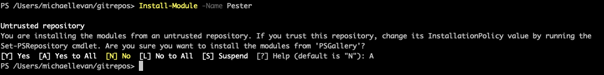
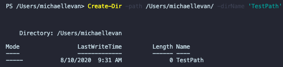
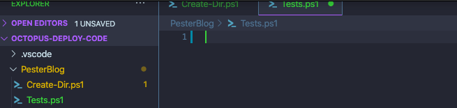
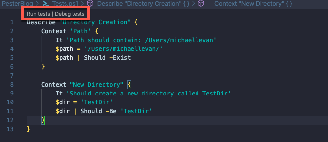
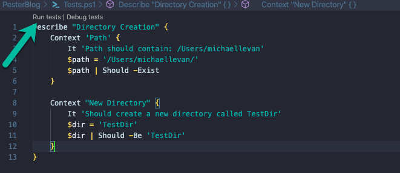
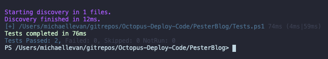

When you're working with any code, whether it's automation/scripting code or application/software code, it should be treated the same way. After-all, functions are still functions and variables are still variables. One of the many things that don't come up as often when you're automating/scripting vs when you're building application code is testing.

Unit testing and mock testing are extremely important in scripting and automation. Think about this scenario: *I tested the PowerShell function locally and it works! It did the exact thing I need it to do and now I'm going to store it in GitHub so it can be used later.*

It's good that it was tested locally, but the test you ran is now in the past. A few things can happen:

- New versions of the code can be created.
- Bugs can be introduced by changing the code.
- New features can be added.
- The code is used on a different system or operating system.
- The PowerShell module that you are using gets updated or changed.
- The API call the PowerShell module is making gets changed.

With the bullet points above, the test you ran locally is no longer valid. 

In this blog post, you're going to learn how to use the most popular testing framework for PowerShell called [Pester](https://github.com/pester/Pester).

## Prerequisites

To follow along in this blog post, you will need the following:

- An understanding of [unit testing](http://softwaretestingfundamentals.com/unit-testing/#:~:text=UNIT%20TESTING%20is%20a%20level,and%20usually%20a%20single%20output.) and what it's used for.
- A beginner to intermediate level knowledge of PowerShell.
- PowerShell Core installed on any operating system, which you can find [here](https://github.com/PowerShell/PowerShell).
- Visual Studio Code (VS Code) installed, which you can find [here](https://code.visualstudio.com/download).

## Installing Pester

If this is your first time run the Pester framework, depending on what operating system you're using, you most likely have to install it. The installation process is done with the `Install-Module` cmdlet, which is native in PowerShell across all operating systems.

To install Pester, run the following cmdlet.

```powershell
Install-Module -Name Pester
```

Once you run the cmdlet, you should see an output similar to the screenshot below.



Pester is now installed. To confirm the installation, run the following cmdlet:

```powershell
Get-InstalledModule -Name Pester
```

## Taking a Look at the PowerShell Code to Test

Before running any sort of Pester test, you'll need code for the Pester test use. To take a first-look at Pester, the test doesn't have to be complicated. It can be a simple, couple of line, PowerShell function. In this section, you're going to take a look at the code you'll use to test.

1. Open up VS Code and create a new file for the PowerShell function to exist in.

The PowerShell function below is doing the following:

- Creating a new function called `Create-Dir`
- Setting up a `cmdletbinding()[]` to turn the function into an advanced function. The advanced function gives you the ability to use Verbose, ErrorAction, etc.
- The param block sets up two parameters - the path where you want to create the new directory and the new directory name.
- The cmdlet used to create the path is `New-Item`

If you run the code below specifying a directory name and path, you will see that a new directory has been created.

```powershell
function Create-Dir {
    [cmdletbinding()]
    param(
        [string]$path,
        [string]$dirName
    )

    New-Item -Name $dirName -Path $path
}
```

If you run the code above, specifying a directory name and path, you will see that a new directory has been created.

The screenshot below shows an example of creating a directory called **TestPath** in the **/Users/michaellevan/** directory.



## Writing the First Test

In the previous section, you took a look at the function you will use to create a PowerShell pester test. Once you have the code in place, you can figure out what you want the test to look like. Pester tests vary based on not only length but functionality. In this section, you'll take a look at a basic Pester test to get you started.

There is a software development practice called [Test Driven Development](https://www.agilealliance.org/glossary/tdd/) (TTD), where you define tests first and then write code based on those tests. This blog post isn't following that methodology, but it's certainly an interesting topic.

1. Within VS Code, open up a new file and name it `Tests.ps1`. The `Tests` keyword lets PowerShell know that you're running a test and VS Code will give some extra capabilities, like being able to run the test right from the IDE.



  2. In the `Tests.ps1` file, paste in the following code, which is the test itself.

```powershell
Describe "Directory Creation" {
    Context 'Path' {
        It 'should contain: path_that_you_used_for_the_function'
        $path = 'path_that_you_used_for_the_function'
        $path | Should -Exist
    }

    Context "New Directory" {
        It 'Should create a new directory called TestDir'
        $dir = 'TestDir'
        $dir | Should -Be 'TestDir'
    }
}
```

Before running the test, let's go over it.

- You'll first start out with the `Describe` block. The Describe block defines a group of PowerShell tests. All Pester files have to contain at least one Describe lock.
- The second block you'll see is `Context`. The Context block defines subgroup tests inside of the Describe block. Context is handy because it allows you to write multiple blocks of tests.
- Within the Context block, you'll see a keyword called `It`. `It` is used to define a single test case. `It` is really great because you can make the code sound like a standard sentence. For example, a `It` test could say **It 'should contain: /Users/michaellevan'**. Of course, your path will be different, so that's just an example
- Under where you define the test, you will see `Should`. The `Should` command is used to define assertions, AKA, what you want the test to be doing with the information you give it.

Once the test is in the `Tests.ps1` file, you will see some options to run the test, as shown in the screenshot below.



## Running a Unit Test

In the previous section, you defined exactly what the test should look like. The test should have two individual tests - one to test the path and the other to test if the new directory is called **TestDir**. Defining the test before running it is crucial because you need the test to perform in the way you're expecting.

In this section, you'll learn how to run the test and what the output should look like.

Within the `Tests.ps1` file, click the **Run tests** button to run the test.



Once you run the test, you should see an output similar to the screenshot below.

As you can see, the test found the directory and confirmed that the new directory being created is **TestDir**.



Congrats! You have officially created and ran a test using Pester, the PowerShell testing framework.

## Conclusion

When you're writing any type of code, you could know what it looks like and how it functions at that point in time, but the future is untold. In a day, a week, a month, a year, etc. the code could change. If the code changes, there's the possibility of a functionality difference or even introducing bugs. When you fit testing into any code that's written, you run less risk of these things occurring.

In this blog post, you learned first-hand what Pester is, why you should use it, and how to use it. If you want to dive more into Pester, I recommend this book by Adam Bertram: [The Pester Book](https://leanpub.com/pesterbook)

If you would like to find the code used in this blog post, check out the GitHub repo [here](https://github.com/AdminTurnedDevOps/Octopus-Deploy-Code/tree/master/PesterBlog).