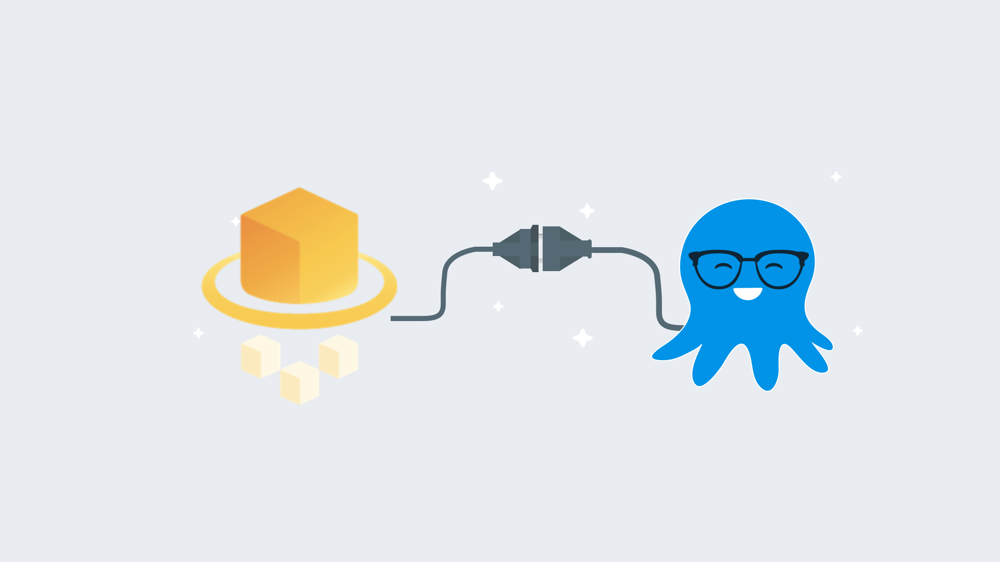

[Amazon Web Services (AWS) Fargate](https://aws.amazon.com/fargate/) has become a popular technology for deploying containerized applications without having to worry about back-end infrastructure management.  My team is often asked, can you use Octopus Deploy with AWS Fargate? The answer is, YES!  Not only can you use Fargate, but you can also use the AWS Elastic Container Registry (ECR) as an external feed to Octopus Deploy.  In this post, I demonstrate an entire CI/CD pipeline using TeamCity, ECR, Octopus Deploy, and Elastic Container Services (ECS) Fargate.

## Create AWS resources

For this post, we need to create some resources within AWS:
- Credentials
- ECR repo
- VPC
- Subnets
- Security group
- ECS cluster

### Create the AWS credentials

Both TeamCity and Octopus Deploy need credentials to work with the AWS services.  The first thing you need to do is log into the [AWS Management Console](https://aws.amazon.com/console/) and create an account using Identity and Access Management (IAM).  After the account has been created, click on the user, then **Security Credentials** to create an `Access Key`.

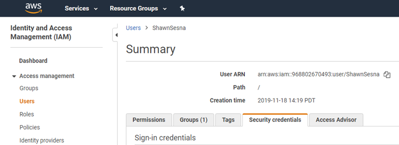

After the access key has been created, save the `Secret Key` as you will only be shown the value *once*.  The `Access Key` and `Secret Key` combination is used to authenticate with AWS.

:::hint
It is possible to use AWS IAM Roles for both TeamCity and Octopus Deploy for everything except the Octopus Deploy external feed to ECR.  For this reason, this post uses the access key/secret key method.
:::

### Retrieve the AWS ECR registry information

Each container that you create will end up in its own region-specific ECR repo. The URI for the repo consists of the following parts:

```text
<RegistryId>.dkr.ecr.<RegionName>.amazonaws.com/<RepoName>
```

The `RegistryId` and `RegionName` will be used for the connection that we’ll create in TeamCity, and the entire URI will be used when we tag our images.

To retrieve these values, navigate to **Elastic Container Registry** in the AWS console.

:::hint
Typing `ecr` into the **Find Services** box will get you there quicker.
:::

If you don’t have any ECR repositories, click on the **Get Started** button:


If you have existing ECR repositories, either click on the **Create repository** button or copy the URI for an existing repo:

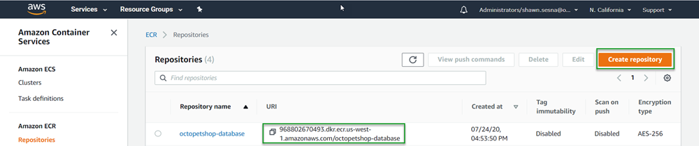

### Create or use an existing VPC

Fargate does not require a unique Virtual Private Cloud (VPC), so it is not necessary to create a new VPC; however, using an existing VPC will work just fine.  This post assumes that you already have some knowledge of AWS and know how to create VPC if needed.

### Create or use existing Subnets

Along with the VPC, Fargate does not require subnets to be defined. Just like the VPC, Fargate can use existing items.  Again, this post assumes you already know how to create subnets if needed.

### Create or use existing Security Groups

You might want to consider creating new security groups because you might need to define ports to access your containers that aren’t necessary for other AWS resources.

The Octo Pet Shop application is a .NET Core application where the web front-end uses the built-in Kestrel web server, which uses the default port `5000`.  The Octo Pet Shop front-end is configured to automatically redirect HTTP traffic to HTTPS and on port `5001`.  Those two ports aren’t used by any other resources, so I created a new Security Group for Octo Pet Shop.

To create a new Security Group, navigate to the **VPC** service within AWS Console and click on **Security Groups** on the left-hand side.  If you’re following along with this post, create two Inbound rules for ports `5000` and `5001`.

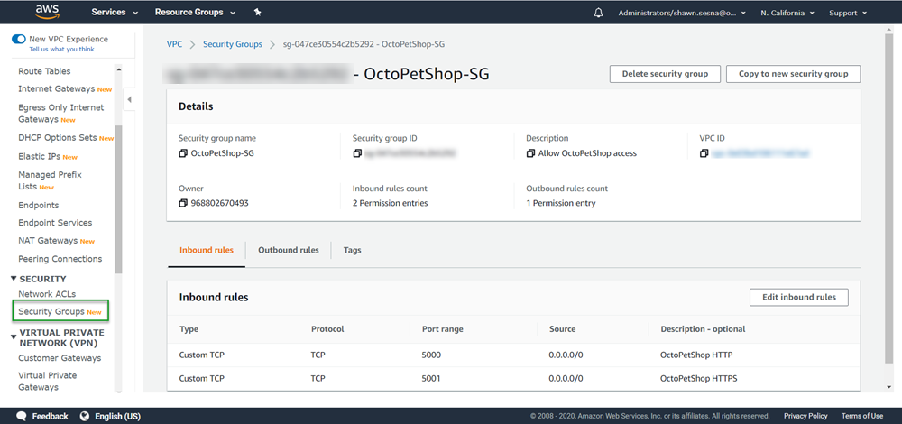

### Create an ECS Cluster

The final resource we need is an ECS cluster to host our containers.  

1. Navigate to ECS in the AWS Console.  
1. Select **Create cluster**.  
1. On the next screen, choose the **Networking only** template.
1. Click **Next step**.  
1. Give your cluster a name, then click **Create**.  

The process is pretty quick, so it should take at most a minute to complete.

With our AWS resources created, we can proceed to the build.

## Define our TeamCity build

For this post, I used TeamCity as a build server to build the Octo Pet Shop application as Docker containers and push them to AWS ECR.

### Create the project connection

In order to push our container images to ECR, we need to configure the TeamCity project with a connection to AWS ECR.  This is accomplished by following these steps:

1. Click **Projects**.
1. Select the project to add the connection to.
1. Click **Edit Project**.

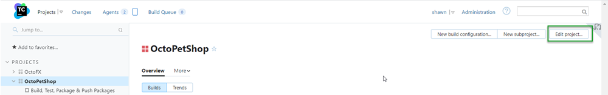

4. Click **Connections** then **Add Connection**.
5. Choose `Amazon ECR` from the drop-down menu and fill in the following values:
- AWS Region
- Access key ID
- Secret access key
- Registry Id

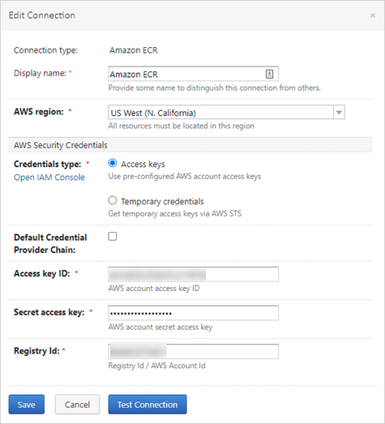

### Enable build feature

After you have created a build definition for your Docker containers, you need to enable the Docker Support Build Feature.  To do so, navigate to your build definition and click the **Build Features** tab.  Click the **Add build feature** button and choose **Docker Support**.  Choose the registry that you created for ECR and click **Save**.

### Add your build steps

The Octo Pet Shop application consists of four major components:
- Web front-end
- Product service
- Shopping Cart service
- DbUp database migrator

My build consists of only six steps:
1. Set the version number
1. Build Web
1. Build Product service
1. Build Shopping cart service
1. Build DbUp
1. Push Docker images to ECR

Steps two to five build their respective Docker images, then tag them using the following pattern `octopetshop-<component>:%build.number% 968802670493.dkr.ecr.us-west-1.amazonaws.com/octopetshop-<component>:%build.number%`.  For example, this is how the web front-end is tagged:

```
octopetshop-web:%build.number% 968802670493.dkr.ecr.us-west-1.amazonaws.com/octopetshop-web:%build.number%
```

Step six pushes the Docker images to ECR in a single step.  Instead of the `build` option, it uses the `push` option with the following:

```
968802670493.dkr.ecr.us-west-1.amazonaws.com/octopetshop-web:%build.number%
968802670493.dkr.ecr.us-west-1.amazonaws.com/octopetshop-productservice:%build.number%
968802670493.dkr.ecr.us-west-1.amazonaws.com/octopetshop-shoppingcartservice:%build.number%
968802670493.dkr.ecr.us-west-1.amazonaws.com/octopetshop-database:%build.number%
```

### Run the build

You should get output similar to this when the build is executed:

```
Step 6/6: Push OctoPetShop-Web (Docker)
15:57:57
  Starting: /bin/sh -c "docker push  968802670493.dkr.ecr.us-west-1.amazonaws.com/octopetshop-web:1.0.20226.225747 && docker push  968802670493.dkr.ecr.us-west-1.amazonaws.com/octopetshop-productservice:1.0.20226.225747 && docker push  968802670493.dkr.ecr.us-west-1.amazonaws.com/octopetshop-shoppingcartservice:1.0.20226.225747 && docker push  968802670493.dkr.ecr.us-west-1.amazonaws.com/octopetshop-database:1.0.20226.225747"
15:57:57
  in directory: /opt/buildagent/work/7f2634c2d5e5df05
15:57:57
  The push refers to repository [968802670493.dkr.ecr.us-west-1.amazonaws.com/octopetshop-web]
15:57:57
  dae5c6c2d080: Preparing
15:57:57
  92dbf6df1786: Preparing
15:57:57
  9d32e62891bc: Preparing
15:57:57
  b22206f4fa7b: Preparing
15:57:57
  b701a024aaa5: Preparing
15:57:57
  0b565516ff7f: Preparing
15:57:57
  91ab7edbc80b: Preparing
15:57:57
  9262398ff7bf: Preparing
15:57:57
  804aae047b71: Preparing
15:57:57
  5d33f5d87bf5: Preparing
15:57:57
  4e38024e7e09: Preparing
15:57:57
  0b565516ff7f: Waiting
15:57:57
  91ab7edbc80b: Waiting
15:57:57
  9262398ff7bf: Waiting
15:57:57
  804aae047b71: Waiting
15:57:57
  5d33f5d87bf5: Waiting
15:57:57
  4e38024e7e09: Waiting
15:58:00
  b22206f4fa7b: Pushed
15:58:01
  9d32e62891bc: Pushed
15:58:01
  dae5c6c2d080: Pushed
15:58:04
  92dbf6df1786: Pushed
15:58:16
  804aae047b71: Pushed
15:58:16
  91ab7edbc80b: Pushed
15:58:31
  5d33f5d87bf5: Pushed
15:58:52
  0b565516ff7f: Pushed
15:58:56
  9262398ff7bf: Pushed
15:59:02
  4e38024e7e09: Pushed
15:59:24
  b701a024aaa5: Pushed
```

With the images pushed to ECR, we can hop over to Octopus Deploy to create the deployment process.

## Octopus Deploy

To use the images that were pushed to ECR in our deployment process, we need to configure an external feed within Octopus Deploy that points to our ECR registry.

### Create ECR external feed

Creating an external feed in Octopus Deploy is quite easy.  First, navigate to **Library**, then choose **External Feeds**.  On the **External Feeds** screen, click **ADD FEED**.  Choose **AWS Elastic Container Registry** from the drop-down and fill in the following:

- Name
- Access Key
- Secret Key
- Region

Then click **SAVE**.

### Create an AWS account

Because I’m using the access key/secret key combination method for authenticating to AWS, I need to create an AWS account within Octopus to reference.  

1. Navigate to **Infrastructure** then click **Accounts**.  
1. On the **Accounts** screen, click the **ADD ACCOUNT** button and choose **AWS Account**.  
1. Fill in the required values:

- Name
- Access Key
- Secret Key

4. Click **SAVE**.

### Define the deployment process

This post assumes you are familiar enough with Octopus Deploy to create a [project](https://octopus.com/docs/projects) and will focus on the AWS Fargate specific components of the deployment.

#### Variables

Before we get started adding steps, we first need to add some variables to use in our process.  I created a library variable set to hold common variables for AWS:

- `AWS.Account`: This references the AWS account we created in the create AWS account section.
- `AWS.Region.name`: Name of the region we’re using.
- `AWS.SecurityGroup.Id`: ID of the security group we created for Octo Pet Shop.
- (Optional) `AWS.Subnet1.Id`: ID of subnet 1 to use.
- (Optional) `AWS.Subnet.Id`: ID of subnet 2 to use.

The remainder of the variables are project variables:

- `Project.AWS.ECS.Cluster.Name`: Name of the cluster (e.g., `OctpousSamples-ECS`).
- `Project.AWS.ECS.Service.Name`: Name of the service to create or update (e.g., `octopetshop`).
- `Project.AWS.Task.Database.Name`: Name of the database container for the task definition (e.g., `octopetshop-database`).
- `Project.AWS.Task.ProductService.Name`: Name of the product service container for the task definition (e.g., `octopetshop-productservice`).
- `Project.AWS.Task.ShoppingCartService.Name`: Name of the shopping cart service container for the task definition (e.g., `octopetshop-shoppingcartservice`).
- `Project.AWS.Task.Web.Name`: Name of the web container for the task definition (e.g., `octopetshop-web`).
- `Project.Container.Environment.ConnectionString`: Database connection string to be used as container environment variables (e.g., `Data Source=localhost;Initial Catalog=OctoPetShop; User ID=#{Project.Database.User.Name}; Password=#{Project.Database.User.Password}`).
- `Project.Database.User.Name`: Username for the database connection (e.g., `sa`).
- `Project.Database.User.Password`: Password for the database connection (e.g., `My$uper$3cretPassw0rd!`).

#### Steps

:::info
The following process can be replaced by using the [Deploy Amazon ECS Service](https://octopus.com/blog/octopus-release-2021-q4#ecs-integration) step (see our [Samples](https://samples.octopus.app/app#/Spaces-103/projects/aws-ecs/deployments/process) for details.)  The script steps below are kept for historical purposes.
:::

This deployment will consist of two steps, and they both use the **Run an AWS CLI script**.  At the time of this writing, there aren’t any ECS or Fargate specific templates available.
- Create task definition
- Run task

##### Create task definition

This step creates the task definition for ECS to run.  To deploy the images we uploaded to ECR, this step adds all of the images as package references.  This allows the images from ECR to be added to the Fargate Container Definition collection.  If the service that is referenced doesn’t exist, it will create it, but if it does exist, it updates the existing service.  After the task definition has been registered, it saves the `TaskDefinitionArn` to an output variable to be used in the next step:

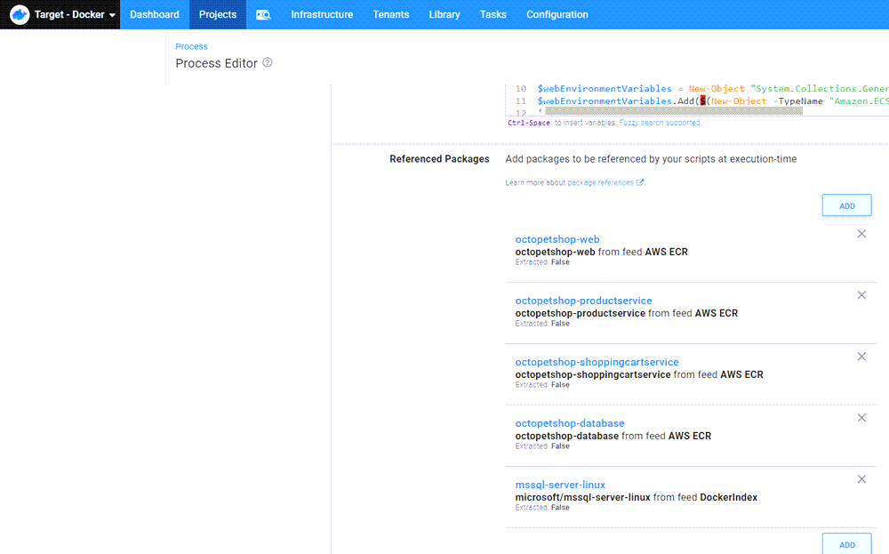

:::hint
When using Fargate, the HostPort and ContainerPort values *must* match, or an error will be reported.

When referencing the packages in the step, be sure to mark them as `The package will not be acquired`.
:::

```PowerShell
$Region = $OctopusParameters["Octopus.Action.Amazon.RegionName"]
$TaskName = $OctopusParameters["Project.AWS.Task.Web.Name"]
$ExecutionRole = $(Get-IAMRole -RoleName "ecsTaskExecutionRole").Arn

# Add web settings
$webPortMappings = New-Object "System.Collections.Generic.List[Amazon.ECS.Model.PortMapping]"
$webPortMappings.Add($(New-Object -TypeName "Amazon.ECS.Model.PortMapping" -Property @{ HostPort=5000; ContainerPort=5000; Protocol=[Amazon.ECS.TransportProtocol]::Tcp}))
$webPortMappings.Add($(New-Object -TypeName "Amazon.ECS.Model.PortMapping" -Property @{ HostPort=5001; ContainerPort=5001; Protocol=[Amazon.ECS.TransportProtocol]::Tcp}))

$webEnvironmentVariables = New-Object "System.Collections.Generic.List[Amazon.ECS.Model.KeyValuePair]"
$webEnvironmentVariables.Add($(New-Object -TypeName "Amazon.ECS.Model.KeyValuePair" -Property @{ Name="ProductServiceBaseUrl"; Value="http://localhost:5011"}))
$webEnvironmentVariables.Add($(New-Object -TypeName "Amazon.ECS.Model.KeyValuePair" -Property @{ Name="ShoppingCartServiceBaseUrl"; Value="http://localhost:5012"}))

$ContainerDefinitions = New-Object "System.Collections.Generic.List[Amazon.ECS.Model.ContainerDefinition]"
$ContainerDefinitions.Add($(New-Object -TypeName "Amazon.ECS.Model.ContainerDefinition" -Property @{ `
Name=$OctopusParameters['Project.AWS.Task.Web.Name'];`
Image=$OctopusParameters["Octopus.Action.Package[octopetshop-web].Image"]; `
PortMappings=$webPortMappings; `
Environment=$webEnvironmentVariables;}))

# Add product service settings
$productServicePortMappings = New-Object "System.Collections.Generic.List[Amazon.ECS.Model.PortMapping]"
$productServicePortMappings.Add($(New-Object -TypeName "Amazon.ECS.Model.PortMapping" -Property @{ ContainerPort=5011; Protocol=[Amazon.ECS.TransportProtocol]::Tcp}))

$serviceEnvironmentVariables = New-Object "System.Collections.Generic.List[Amazon.ECS.Model.KeyValuePair]"
$serviceEnvironmentVariables.Add($(New-Object -TypeName "Amazon.ECS.Model.KeyValuePair" -Property @{ Name="OPSConnectionString"; Value=$OctopusParameters['Project.Container.Environment.ConnectionString']}))

$ContainerDefinitions.Add($(New-Object -TypeName "Amazon.ECS.Model.ContainerDefinition" -Property @{ `
Name=$OctopusParameters['Project.AWS.Task.ProductService.Name']; `
Image=$OctopusParameters["Octopus.Action.Package[octopetshop-productservice].Image"]; `
PortMappings=$productServicePortMappings; `
Environment=$serviceEnvironmentVariables;}))

# Add shopping cart service settings
$shoppingCartServicePortMappings = New-Object "System.Collections.Generic.List[Amazon.ECS.Model.PortMapping]"
$shoppingCartServicePortMappings.Add($(New-Object -TypeName "Amazon.ECS.Model.PortMapping" -Property @{ ContainerPort=5012; Protocol=[Amazon.ECS.TransportProtocol]::Tcp}))

$ContainerDefinitions.Add($(New-Object -TypeName "Amazon.ECS.Model.ContainerDefinition" -Property @{ `
Name=$OctopusParameters['Project.AWS.Task.ShoppingCartService.Name']; `
Image=$OctopusParameters["Octopus.Action.Package[octopetshop-shoppingcartservice].Image"]; `
PortMappings=$shoppingCartServicePortMappings; `
Environment=$serviceEnvironmentVariables;}))

# Add sql server settings
$sqlPortMappings = New-Object "System.Collections.Generic.List[Amazon.ECS.Model.PortMapping]"
$sqlPortMappings.Add($(New-Object -TypeName "Amazon.ECS.Model.PortMapping" -Property @{ HostPort=1433; ContainerPort=1433; Protocol=[Amazon.ECS.TransportProtocol]::Tcp}))

$sqlEnvironmentVariables = New-Object "System.Collections.Generic.List[Amazon.ECS.Model.KeyValuePair]"
$sqlEnvironmentVariables.Add($(New-Object -TypeName "Amazon.ECS.Model.KeyValuePair" -Property @{ Name="ACCEPT_EULA"; Value="Y"}))
$sqlEnvironmentVariables.Add($(New-Object -TypeName "Amazon.ECS.Model.KeyValuePair" -Property @{ Name="SA_PASSWORD"; Value=$OctopusParameters['Project.Database.User.Password']}))

$ContainerDefinitions.Add($(New-Object -TypeName "Amazon.ECS.Model.ContainerDefinition" -Property @{ `
Name="sqlserver"; `
Image=$OctopusParameters["Octopus.Action.Package[mssql-server-linux].Image"]; `
PortMappings=$sqlPortMappings; `
Environment=$sqlEnvironmentVariables;}))

# Add DBUp project
$dbupEnvironmentVariables = New-Object "System.Collections.Generic.List[Amazon.ECS.Model.KeyValuePair]"
$dbupEnvironmentVariables.Add($(New-Object -TypeName "Amazon.ECS.Model.KeyValuePair" -Property @{ Name="DbUpConnectionString"; Value=$OctopusParameters['Project.Container.Environment.ConnectionString']}))

$ContainerDefinitions.Add($(New-Object -TypeName "Amazon.ECS.Model.ContainerDefinition" -Property @{ `
Name="octopetshop-database"; `
Image=$OctopusParameters["Octopus.Action.Package[octopetshop-database].Image"]; `
Essential=$false; `
Environment=$dbupEnvironmentVariables;}))

$TaskDefinition = Register-ECSTaskDefinition `
-ContainerDefinition $ContainerDefinitions `
-Cpu 512 `
-Family $TaskName `
-TaskRoleArn $ExecutionRole `
-ExecutionRoleArn $ExecutionRole `
-Memory 4096 `
-NetworkMode awsvpc `
-Region $Region `
-RequiresCompatibility "FARGATE"

if(!$?)
{
	Write-Error "Failed to register new task definition"
    Exit 0
}

$ClusterName = $OctopusParameters["Project.AWS.ECS.Cluster.Name"]
$ServiceName = $OctopusParameters["Project.AWS.ECS.Service.Name"]

# Check to see if there is a service already
$service = (Get-ECSService -Cluster $ClusterName -Service $ServiceName)

if ($service.Services.Count -eq 0)
{
	Write-Host "Service $ServiceName doesn't exist, creating ..."
    $ServiceCreate = New-ECSService `
    	-Cluster $ClusterName `
        -ServiceName $ServiceName `
        -TaskDefinition $TaskDefinition.TaskDefinitionArn `
        -DesiredCount 1 `
        -AwsvpcConfiguration_Subnet @($OctopusParameters['AWS.Subnet1.Id'], $OctopusParameters['AWS.Subnet2.Id']) `
        -AwsvpcConfiguration_SecurityGroup @($OctopusParameters['AWS.SecurityGroup.Id'])
}
else
{
    $ServiceUpdate = Update-ECSService `
        -Cluster $ClusterName `
        -ForceNewDeployment $true `
        -Service $ServiceName `
        -TaskDefinition $TaskDefinition.TaskDefinitionArn `
}

if(!$?)
{
	Write-Error "Failed to register new task definition"
    Exit 0
}

# Save task definition to output variable
Set-OctopusVariable -Name "TaskDefinitionArn" -Value $TaskDefinition.TaskDefinitionArn
```

##### Run task
With the task definition registered, we use another `Run an AWS CLI script` step to create the task to run in Fargate:

```PowerShell
# Assign local variables
$clusterName = $OctopusParameters['Project.AWS.ECS.Cluster.Name']
$securityGroups = @($OctopusParameters['AWS.SecurityGroup.Id'])
$subnets = @($OctopusParameters['AWS.Subnet1.Id'], $OctopusParameters['AWS.Subnet2.Id'])
$taskDefinitionArn = $OctopusParameters['Octopus.Action[Create task definition].Output.TaskDefinitionArn']

# Create launch type object
$launchType = $(New-Object -TypeName "Amazon.ECS.Launchtype" -ArgumentList "FARGATE")

# Create Public IP object
$assignPublicIp = $(New-Object -TypeName "Amazon.ECS.AssignPublicIp" -ArgumentList "ENABLED")

# Create new task
New-ECSTask -Cluster $clusterName `
	-AwsvpcConfiguration_SecurityGroup $securityGroups `
    -AwsvpcConfiguration_Subnet $subnets `
    -TaskDefinition $taskDefinitionArn `
    -LaunchType $launchType `
    -AwsvpcConfiguration_AssignPublicIp $assignPublicIp
```

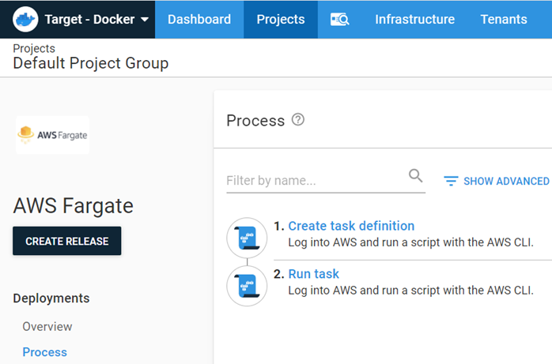

#### Deployment

When the deployment has finished, you will see the task summary of the deployment:

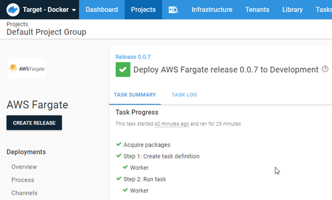

## Fargate

When the deployment has completed, the task will show a pending state. Give the task some time to reach the running state.  After the database container has reached a stopped state, the Octo Pet Shop application will be available.

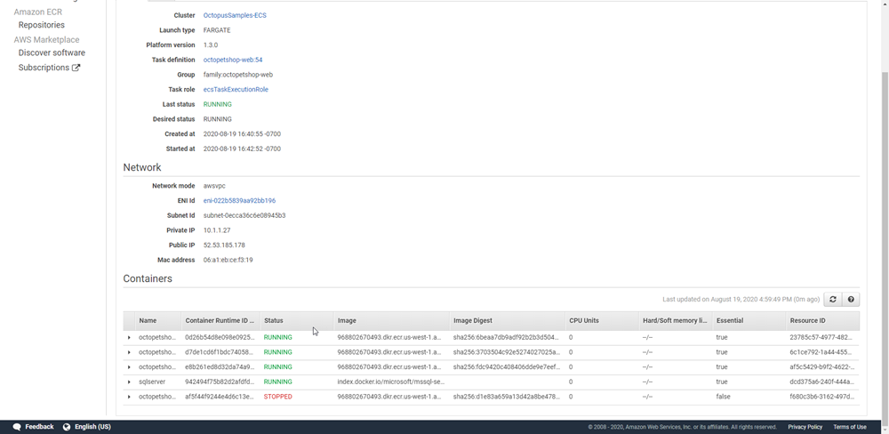

At this point, we can open a browser and go `http://[PublicIP]:5000`.  Navigating here will automatically redirect us to `https://[PublicIP]:5001`.  You’ll be presented with a warning about an invalid certificate, but Octo Pet Shop uses a self-signed certificate, so this warning is normal, and it is safe to proceed to the Octo Pet Shop!

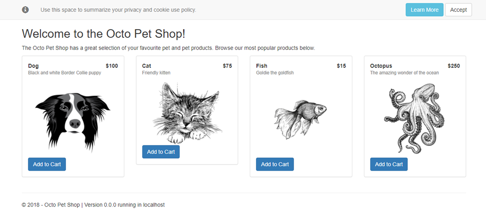

## Conclusion

In this post, I walked you through creating a CI/CD process that deploys the Octo Pet Shop application to AWS Fargate.  
Happy deployments!
