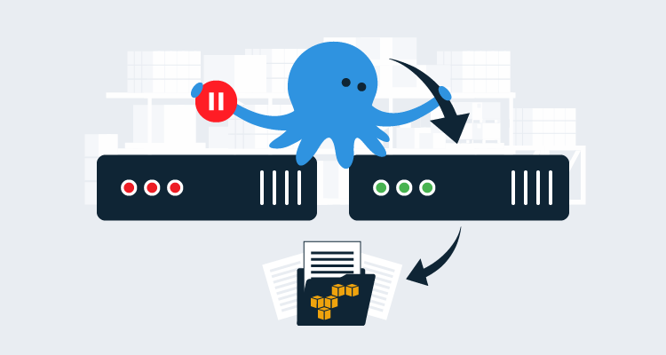
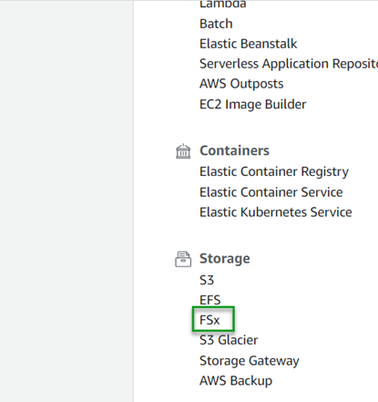
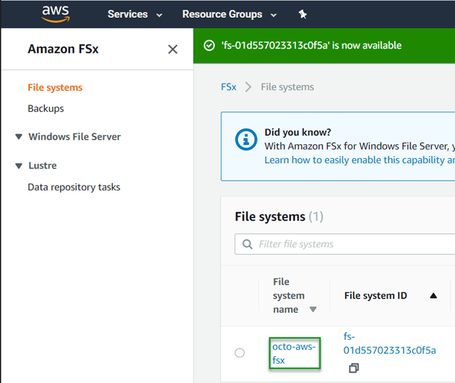
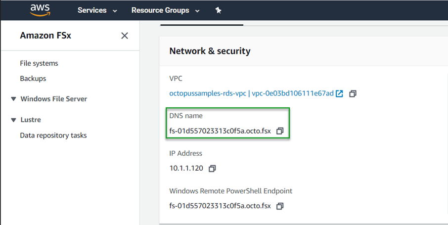
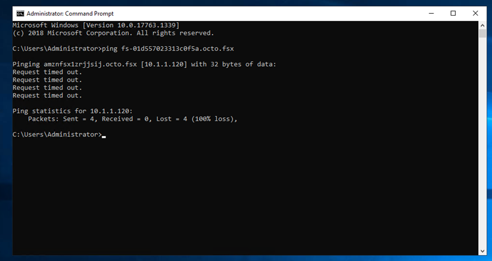

When you configure [High Availability on AWS](https://octopus.com/docs/administration/high-availability/configuring-octopus-for-high-availability#shared-storage-in-amazon-aws) for Octopus, you need something like Microsoft DFS for shared storage (as the documentation states) or you can use Amazon’s FSx. In this post, I demonstrate how to use FSx with Octopus Deploy installed on an EC2 instance.

## Amazon FSx
FSx is a network file system that comes in two flavors:
- [FSx for Windows File Server](https://aws.amazon.com/fsx/windows/)
- [FSx for Lustre](https://aws.amazon.com/fsx/lustre/)

In this post, we use FSx for Windows File Server.

## Configuring FSx
Like many of the other Amazon AWS offerings, FSx comes with a convenient, easy to use wizard for configuration.  To start, open your [AWS Management Console](https://aws.amazon.com/console) and click on FSx, located under the Storage category.

:::hint
Unlike the other file storage options that AWS has, the FSx for Windows File Server **requires** Active Directory. If you are creating an Active Directory, be aware that Active Directory services are not free, refer to their [pricing](https://aws.amazon.com/directoryservice/pricing/) page for details.
:::

### Step 1: Select file system type

The first step in this process is to select the file system type that you’re going to use.  As stated previously, your selections are:
- FSx for Windows File Server
- FSx for Lustre

This post uses FSx for Windows File Server.

### Step 2: Specify file system details
Next, you’ll define the file system details which consists of several sections.

#### File system details

This section defines the following:
- Deployment Type
- Storage Type
  - SSD
  - HDD (not supported for Single-AZ file systems)
- Storage capacity (minimum of 32 GB)

#### Network & security

In this section, you select the networking and security groups (firewall) components:
- VPC
- VPC Security Groups
- Subnet


#### Windows Authentication

For this section, you select your Active Directory details.  You can choose either:
- AWS Managed Microsoft Active Directory
- Self-managed Microsoft Active Directory

You will also have the ability to create a new Active Directory (if using AWS Managed Microsoft Active Directory).

#### Encryption

This is the section where you define your encryption key so that your data is protected at rest.  Your options are:
- aws/fsx
- ARN

The next two sections are optional:
- Backup and maintenance preferences
- Tags

### Step 3: Review and create

The final step in the process is to review the options you have chosen for your file server before creating.  On this page, it will show you which options can be changed after the file system has been created, and which ones cannot be edited.  Click **Create file system** when you are satisfied with your choices.

## Connecting to the share

After the FSx file system has been created, it will be available on the Active Directory network.

### Get the DNS name

In order to connect to the share, we need to know what the endpoint is.  After the file system has been created, click on `FSx` under the `Storage` category:



Locate the file system you created and click on the name link:



Copy the DNS name of the file system share:



### Connect to FSx
Now that we have the DNS name of the FSx file system, we can connect to it using the DNS name.

RDP to the Octopus Server. When you’re logged in, open a command prompt and make sure the FSx file system can be reached by pinging the DNS name:



Depending on your security groups, the ping command may fail, but we can see that it resolved to the correct IP address.  Now that we know the EC2 instance can find the FSx file system, open a file explorer window and UNC to FSx.  The default share name of FSx is simply `share`, so your UNC command will look like this:

```
\\fs-01d557023313c0f5a.octo.fsx\share
```

## Configure Octopus Deploy to use FSx

Once configured, FSx acts just like a file server.  This means that your domain-joined EC2 instance can reference it via UNC.  Using the directions for configuring [High Availability (HA)](https://octopus.com/docs/administration/high-availability/configuring-octopus-for-high-availability) shared storage, we can move where Octopus stores artifacts, tasklogs, the built-in repository, and telemetry off the EC2 instance and on to FSx.  There are two options for configuring shared storage: 
- Setting the root shared storage directory. 
- Setting each directory individually.

To set the root shared storage directory:

```
Octopus.Server.exe path --clusterShared \\fs-01d557023313c0f5a.octo.fsx\share
```

To set each folder individually:

```
Octopus.Server.exe path --artifacts \\fs-01d557023313c0f5a.octo.fsx\share\Artifacts
Octopus.Server.exe path --taskLogs \\fs-01d557023313c0f5a.octo.fsx\share\TaskLogs
Octopus.Server.exe path --nugetRepository \\fs-01d557023313c0f5a.octo.fsx\share\Packages
Octopus.Server.exe path --telemetry \\fs-01d557023313c0f5a.octo.fsx\share\Telemetry
```
:::hint
If your Octopus Server is not a brand new instance, you will need to copy the contents from the artifacts, tasklogs, and packages folders to the new locations for them to show up in Octopus.
:::

With your Octopus Server now using the share locations, you’re in a good position to add new nodes to configure HA!

## Conclusion
In this post, I showed you how to create and configure AWS FSx and connect it with Octopus Deploy.  Happy Deployments!
