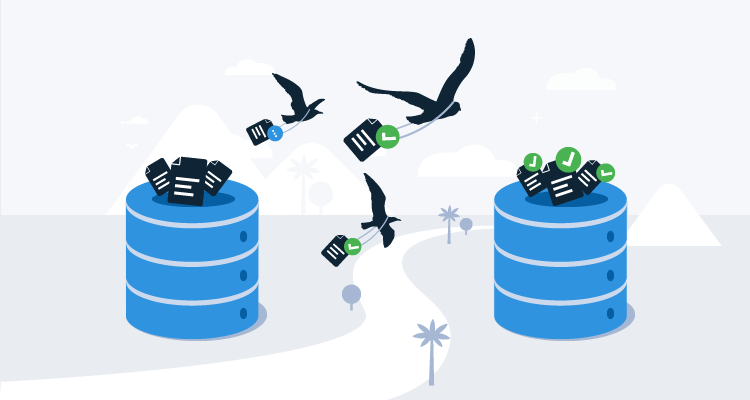
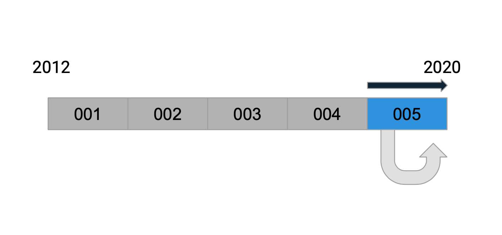
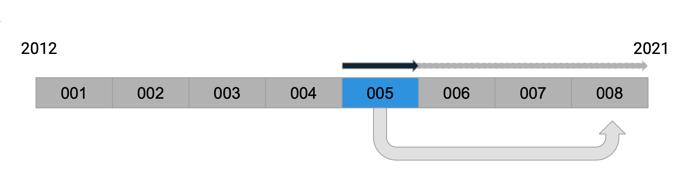

Database migrations are a popular way to update application databases in a controlled way that keeps the risk to a minimum. This approach is also known as schema migrations, database upgrade scripts, change driven, or script based updates. Octopus Deploy has used database migrations since the beginning of the product, and we’ve learned a lot as Octopus has grown in size and complexity. 

In this post, I’ll introduce database migrations, share some common frameworks and cover our lessons learned from nearly ten years of experience. 

## What are database migrations?

Most applications need to persist information about the state of the application, either in files or databases. The shape of the objects almost always evolves and changes over time, which means some kind of migration code or script is required to keep the shape of the persisted data in-sync (or consistent). Without them, the application code would need to deal with all possible versions of the documents from the beginning of time.

Most frameworks support this concept by providing a way for you to supply migration scripts to manipulate the database. Some even let you specify a rollback action. Typically, they keep track of the scripts that have been applied in a table.

There are numerous options for almost every platform and each one generally has some unique attributes:

**NodeJS**

* [db-migrate](https://github.com/db-migrate/node-db-migrate)
* [Sequelize](https://sequelize.org/)
* [Knex.js](http://knexjs.org/)

**Python**

* [Django migrations](https://docs.djangoproject.com/en/3.1/topics/migrations/)
* [alembic](https://github.com/sqlalchemy/alembic)
* [Flask-Migrate](https://flask-migrate.readthedocs.io/en/latest/#)

**Ruby**

* [Rails migrations](https://guides.rubyonrails.org/v3.2/migrations.html)
* [Data Migrate](https://github.com/ilyakatz/data-migrate)

**.NET**

* [DbUp](https://github.com/dbup/dbup)
* [Dapper](https://github.com/StackExchange/Dapper)
* [Entity Framework Code First](https://docs.microsoft.com/en-us/ef/core/managing-schemas/migrations/)
* [Fluent Migrator](https://github.com/fluentmigrator/fluentmigrator)

**Java**

* [Flyway](https://flywaydb.org/)
* [liquibase](https://www.liquibase.org/)

## Lessons Learned

### Lesson 1: Keep your migration scripts away from your production code {#keep-your-scripts-separate}

As software developers, we’ve been trained to reuse and avoid duplicating code. This is the one time where we _want_ to duplicate code, since we want the behavior of our migration script to be _snapshotted in time_.

An example is described in the following illustrations. Each script (numbered 001 to 005) is responsible for changing the database state from **A** to **B**. If the script references a constant or function (say a function that generates the default value of a new property) that is in production code, that script will still work as expected at the time of writing.

_It might work now..._

If the referenced code changes in a few months time (say the constant’s value changes), then the script is actually taking a dependency on the future. This change in behavior is subtle and hard to detect, _only surfacing when a customer upgrades directly from an old version before the script was first introduced_.

_But will it work later?_

### Lesson 2: Keep it low-tech, don’t deserialize {#keep-it-low-tech}

:::hint
This step applies to teams using object relational mappers (ORM) or document databases (i.e., NoSQL). Octopus uses a micro-ORM called [Nevermore](https://github.com/OctopusDeploy/Nevermore) that treats SQL Server as a document store.
:::

You might be tempted to deserialize database records so that you can work with objects where code completion (i.e., IntelliSense) or type safety are available. In reality, you’re exposing yourself to complexities around serialization and type converters.

The upgrade script will be simpler if you work directly with the text or document model. This often means you need to work with abstractions for different formats. For example, Octopus is written using .NET Core and this means we work directly with `JObject` for `JSON` documents or `XElement` for `XML` documents. Other platforms use the equivalent concepts and frameworks.

### Lesson 3: Write tests to exercise each migration script individually {#write-tests}

Having tests that exercise a single script greatly increases the confidence in the migration script. Migrations are a pain to test manually because you need to take a snapshot of the database and restore it after testing.

You might also want to run the complete migration over backups of a sample of old databases to catch any unexpected data or bad assumptions that won’t be covered by the individual test.

### 4. Consider running long migrations online {#consider-running-long-migrations-online}

Octopus Server runs its migration scripts synchronously during startup. This has the benefit of leaving the database in a known predictable state when the application starts. The downside of course, is that running migrations over large tables incurs a long downtime, and this has meant we avoid certain structural changes involving large tables.

We have started experimenting with running large migration jobs asynchronously in the background when the application is up and running. This means there is less downtime and customers can resume using the application sooner, but it also introduces new problems:

1. The application has to support the database in both the old and new state 
2. The upgrade job might be affected when you introduce subsequent changes to the same table. You will then need to either support the database in all three possible states or force the customer to upgrade to an intermediate version.

This is something we don’t have concrete advice on yet but we’re continuing to evaluate.

### 5. Consider versioning your documents {#consider-versioning-your-documents}

:::hint
Similar to [Lesson 2 (Keep it low-tech)](/blog/2020-09/database-migrations-lessons-learned/index.md#keep-it-low-tech), this step applies to teams using object relational mappers (ORM) or document databases.
:::

Although it’s convenient to use migration scripts to update database schema changes as well as document properties, you will gain some flexibility if you separate the two concerns. For example, if you versioned your documents and upgraded the document structure separately, then you can reuse that same upgrade code to import those same documents from a file.

## Conclusion

The crucial takeaway from these lessons is to isolate your upgrade scripts from the main production code so that its behavior is _snapshotted in time_.

In summary, our database migration lessons learned are:

* Keep your migration scripts away from your production code.
* Keep it low-tech, don’t deserialize.
* Write tests to exercise each migration script individually.
* Consider running long migrations online.
* Consider versioning your documents.
