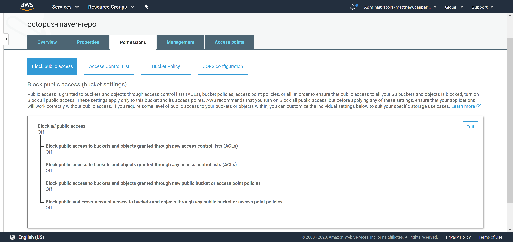
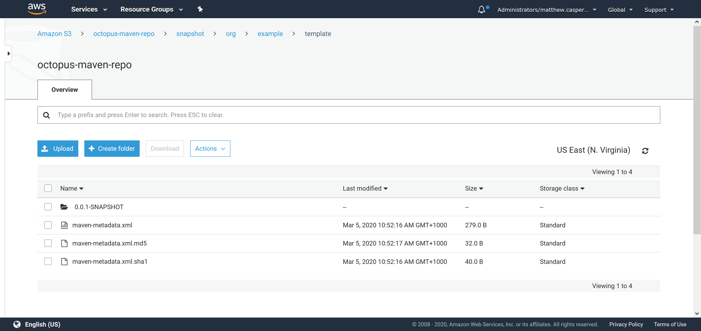
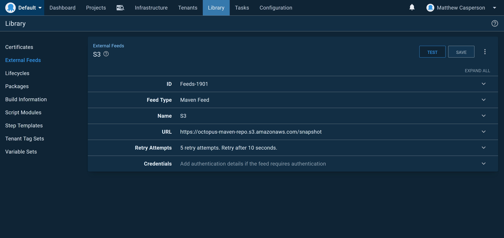
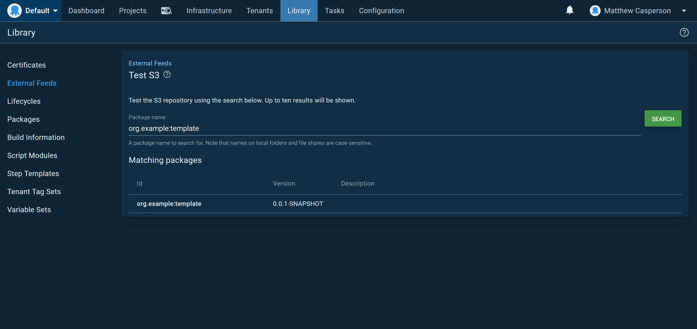

Package repositories are a central requirement in any CI/CD pipeline, as repeatable deployments require properly versioned artifacts shared between tools using standard APIs.

Although Maven is synonymous with Java, a Maven repository provides a very flexible solution for almost any kind of artifact. Maven repositories typically store JAR and WAR files, but they can just as easily store ZIP or TAR.GZ files.

Maven repositories are somewhat unique in that they have no server side service or API, but instead, they are made up of static files that are parsed by the client. This means a Maven repository can be hosted by almost any file system including HTTP, FTP, WebDAV, or SVN.

Maven exposes this file handling through an abstract interface called [Maven Wagon](https://maven.apache.org/wagon/). For this blog post, we'll use a third party library called [S3StorageWagon](https://github.com/gkatzioura/CloudStorageMaven/tree/master/S3StorageWagon) to upload files to a Maven repository in AWS S3.

## Compiling the code

If you are interested in integrating the S3StorageWagon into your Maven projects, this [blog post](https://egkatzioura.com/2018/04/09/host-your-maven-artifacts-using-amazon-s3/) explains the process, but we'll do something slightly different and use the [deploy:deploy-file](http://maven.apache.org/guides/mini/guide-3rd-party-jars-remote.html) to copy individual files to a Maven repo in S3 without a complete Maven project.

The first step is to clone the S3StorageWagon source code from [GitHub](https://github.com/gkatzioura/CloudStorageMaven). Compile the project and collect the dependencies with the command:

```
mvn "-Dmaven.javadoc.skip=true" "-DskipTests" package dependency:copy-dependencies
```

Inside the `CloudStorageMaven\S3StorageWagon\target` directory you'll find the file `s3-storage-wagon-2.3.jar`. Copy this to `${maven.home}/lib`.

We also need a number of additional dependencies copied alongside the `s3-storage-wagon-2.3.jar` file. The `dependency:copy-dependencies` goal appended to the build command placed all the dependencies into the `CloudStorageMaven/S3StorageWagon/dependencies` directory.

In a perfect world, we could just copy all the JAR files from `CloudStorageMaven/S3StorageWagon/dependencies` into `${maven.home}/lib`, but it turns out, doing so introduces some conflicts. Through a process of trial and error, I found these JAR files need to be copied:

* cloud-storage-core-2.3.jar
* aws-java-sdk-core-1.11.595.jar
* aws-java-sdk-kms-1.11.595.jar
* aws-java-sdk-s3-1.11.595.jar
* aws-java-sdk-sts-1.11.595.jar
* jackson-annotations-2.6.0.jar
* jackson-core-2.6.7.jar
* jackson-databind-2.6.7.2.jar
* jackson-dataformat-cbor-2.6.7.jar
* httpclient-4.5.5.jar
* httpcore-4.4.10.jar
* joda-time-2.8.1.jar

It is possible the specific versions of these JAR files have changed since this blog post was published, but the libraries will remain much the same.

## Defining the repository

The next step is to define the repository in the Maven `settings.xml` file. This file is typically found under `~/.m2/settings.xml`. An example is shown below:

```
<settings xmlns="http://maven.apache.org/SETTINGS/1.0.0"
  xmlns:xsi="http://www.w3.org/2001/XMLSchema-instance"
  xsi:schemaLocation="http://maven.apache.org/SETTINGS/1.0.0
                      http://maven.apache.org/xsd/settings-1.0.0.xsd">

  <activeProfiles>
    <activeProfile>s3</activeProfile>
  </activeProfiles>

  <profiles>
    <profile>
      <id>s3</id>
      <repositories>
        <repository>
            <id>octopus-s3-repo</id>
            <url>s3://octopus-maven-repo/snapshot</url>
        </repository>
      </repositories>
    </profile>
  </profiles>

  <servers>
    <server>
      <id>octopus-s3-repo</id>
      <username>AWS ACCESS KEY</username>
      <password>AWS SECRET KEY</password>
      <configuration>
		    <region>us-east-1</region>
		    <publicRepository>true</publicRepository>
	    </configuration>
    </server>
  </servers>
</settings>
```

These are the important settings:

* The URL defined as `<url>s3://octopus-maven-repo/snapshot</url>` includes the `s3` protocol, which means the S3 wagon library is used for any transfers.
* The AWS credentials defined as `<username>AWS ACCESS KEY</username>` and `<password>AWS SECRET KEY</password>` are the IAM credentials of a user that has access to the S3 bucket. This user is created in later steps.
* Defining the repository as public with the value `<publicRepository>true</publicRepository>` means anyone can download artifacts from the repo via HTTP.

## Creating the S3 bucket and user

We need to create an S3 bucket called `octopus-maven-repo`, and create a user that can access the files in the bucket. The following IAM policy grants an IAM user full access to the `octopus-maven-repo` bucket:

```
{
    "Version": "2012-10-17",
    "Statement": [
        {
            "Sid": "VisualEditor0",
            "Effect": "Allow",
            "Action": "s3:*",
            "Resource": [
                "arn:aws:s3:::octopus-maven-repo",
                "arn:aws:s3:::octopus-maven-repo/*"
            ]
        }
    ]
}
```

Keep in mind the S3 bucket names are globally unique, and you will have to give your bucket a unique name.

Download the access and secret keys for the IAM user and replace the values in the `<username>AWS ACCESS KEY</username>` and `<password>AWS SECRET KEY</password>` elements in the `settings.xml` file.

## Fixing public permissions

AWS has recently locked down public S3 buckets with an additional security layer that blocks all public access by default. If your repository is going to allow public access, you need to disable the settings preventing public access. In the screenshot below, you can see the `Block all public access` setting has been turned off for the S3 bucket:



## Uploading a file

The final step is to upload a file to the new repository. The following command uploads the `template.zip` file as an artifact with the group `org.example`, ID `template`, and version `0.0.1-SNAPSHOT`:

```
mvn deploy:deploy-file \
  "-DgroupId=org.example" \
  "-DartifactId=template" \
  "-Dversion=0.0.1-SNAPSHOT" \
  "-Dpackaging=zip" \
  "-Dfile=template.zip" \
  "-DrepositoryId=octopus-s3-repo" \
  "-Durl=s3://octopus-maven-repo/snapshot"
```

The resulting file is then saved in S3 as a versioned artifact:



## Consuming the feed in Octopus

The nice thing about using S3 as a Maven repository is that clients can access it via HTTP. Because we configured our repository
to be public, Maven clients (like Octopus) can access artifacts via the HTTP URL https://octopus-maven-repo.s3.amazonaws.com/snapshot.





## Conclusion

Using S3 to host a Maven repository is a quick way to create a public repository without any special software or hosting solutions. By making use of custom Wagon providers to upload artifacts to S3, and then accessing the same files via HTTP, we can create a fully functional Maven repository that can be consumed by Octopus.
