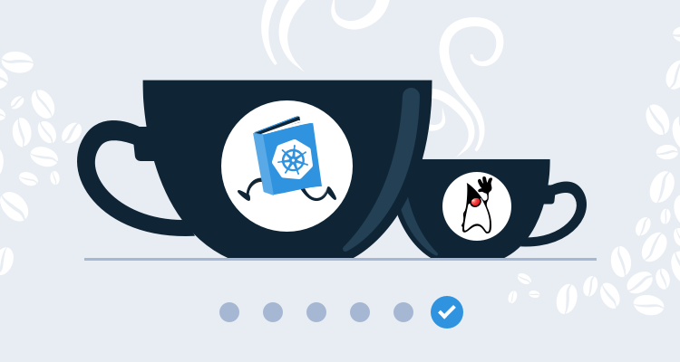

This post is part of a series that demonstrates a sample deployment pipeline with Jenkins, Docker, and Octopus:

!include <java-ci-cd-toc>


[In the previous blog post](/blog/2020-09/java-ci-cd-co/from-ci-to-cd/index.md), we integrated Jenkins and Octopus to trigger a deployment to Kubernetes after the Docker image was pushed to Docker Hub. We also added additional environments in Octopus to represent the canonical {{ Dev, Test, Prod }} progression. This left us with a [deployment pipeline](https://octopus.com/devops/continuous-delivery/what-is-a-deployment-pipeline/) with automated (if not necessarily automatic) release management between environments.

While a traditional deployment pipeline ends with a deployment to production, Octopus provides a solution for the operate phase of the DevOps lifecycle with runbooks. By automating common tasks like database backups, log collection, and service restarts with runbooks, the combination of Jenkins and Octopus provides a complete deployment and operations pipeline covering the entire lifecycle of an application.

## Add a database

Before we can create runbooks for database backups, we need a database.

You would typically use a hosted service like RDS in a production setting. RDS provides out-of-the-box high availability, backups, maintenance windows, security, and more, all of which requires a significant effort to replicate with a local database. However, for the demonstration purposes of this blog, we’ll deploy MySQL to EKS and point our PetClinic application to it. We can then script common management tasks against the database to demonstrate the kind of continuous operations that keep a production deployment running.

We’ll use the official [MySQL](https://hub.docker.com/_/mysql) Docker image, but we also need some additional tools on the image to allow us to transfer a backup to a second location. Since we are using AWS to host our Kubernetes cluster, we’ll backup our database to S3. This means we need the AWS CLI included in the MySQL Docker image to transfer a database backup.

Adding new tools to an image is easy. We take the base **mysql** image and run the commands required to install the AWS CLI. Our [Dockerfile](https://github.com/mcasperson/mysqlwithawscli/blob/master/Dockerfile) looks like this:

```dockerfile
FROM mysql
RUN apt-get update; apt-get install python python-pip -y
RUN pip install awscli
```

We then build this image, push it to Docker Hub, and create and deploy a release in Octopus with the following [Jenkinsfile](https://github.com/mcasperson/mysqlwithawscli/blob/master/Jenkinsfile). You will note that this `Jenkinsfile` is almost an exact copy of the [previous one](/blog/2020-09/java-ci-cd-co/from-ci-to-cd/index.md), with changes to the name of the Docker image and the Octopus project that is deployed:

```groovy
pipeline {
    agent {
        label 'docker'
    }
    //  parameters here provide the shared values used with each of the Octopus pipeline steps.
    parameters {
        // The space ID that we will be working with. The default space is typically Spaces-1.
        string(defaultValue: 'Spaces-1', description: '', name: 'SpaceId', trim: true)
        // The Octopus project we will be deploying.
        string(defaultValue: 'MySQL', description: '', name: 'ProjectName', trim: true)
        // The environment we will be deploying to.
        string(defaultValue: 'Dev', description: '', name: 'EnvironmentName', trim: true)
        // The name of the Octopus instance in Jenkins that we will be working with. This is set in:
        // Manage Jenkins -> Configure System -> Octopus Deploy Plugin
        string(defaultValue: 'Octopus', description: '', name: 'ServerId', trim: true)
    }
    stages {
        stage ('Add tools') {
            steps {
                tool('OctoCLI')
            }
        }
        stage('Building our image') {
            steps {
                script {
                    dockerImage = docker.build "mcasperson/mysqlwithawscli:$BUILD_NUMBER"
                }
            }
        }
        stage('Deploy our image') {
            steps {
                script {
                    // Assume the Docker Hub registry by passing an empty string as the first parameter
                    docker.withRegistry('' , 'dockerhub') {
                        dockerImage.push()
                    }
                }
            }
        }
        stage('deploy') {
            steps {                                
                octopusCreateRelease deployThisRelease: true, environment: "${EnvironmentName}", project: "${ProjectName}", releaseVersion: "1.0.${BUILD_NUMBER}", serverId: "${ServerId}", spaceId: "${SpaceId}", toolId: 'Default', waitForDeployment: true                
            }
        }
    }
}
```

The MySQL Kubernetes deployment YAML is also very similar to our [previous example](/blog/2020-09/java-ci-cd-co/from-ci-to-cloud/index.md), with a new image name and the addition of two environment variables to configure the database credentials and create an initial database:

```YAML
apiVersion: apps/v1
kind: Deployment
metadata:
  name: mysql
spec:
  replicas: 1
  strategy:
    type: Recreate
  template:
    spec:
      containers:
        - name: mysql
          image: mcasperson/mysqlwithawscli
          ports:
            - name: sql
              containerPort: 3306
          env:
            - name: MYSQL_ROOT_PASSWORD
              value: Password01!
            - name: MYSQL_DATABASE
              value: petclinic
```

Because we don’t need to access the database publicly, we expose the MySQL instance with a cluster IP service, which allows other pods to access the database, but will not create a public load balancer:

```YAML
apiVersion: v1
kind: Service
metadata:
  name: mysql
spec:
  type: ClusterIP
  ports:
    - name: sql
      port: 3306
      protocol: TCP
```

Deploying the resources created by the YAML above results in a MySQL instance accessible from other pods in the cluster using the hostname `mysql`.

To configure PetClinic to use the MySQL database we need to define four environment variables. These variables are used to configure the settings in the [application-mysql.properties](https://github.com/mcasperson/spring-petclinic/blob/main/src/main/resources/application-mysql.properties) configuration file:

* `MYSQL_URL`, which is the JDBC URL to the MySQL database.
* `MYSQL_USER`, which is the MySQL user to connect as, set to `root`.
* `MYSQL_PASS`, which is the MySQL password, set to the password we defined in the `MYSQL_ROOT_PASSWORD` environment variable on the MySQL pod.
* `SPRING_PROFILES_ACTIVE`, which defines the profile that Spring will use to configure the application, set to mysql to load the [application-mysql.properties](https://github.com/mcasperson/spring-petclinic/blob/main/src/main/resources/application-mysql.properties) configuration file.

The YAML for our new PetClinic deployment is shown below:

```YAML
apiVersion: apps/v1
kind: Deployment
metadata:
  name: petclinic
spec:
  replicas: 1
  template:
    spec:
      containers:
        - name: petclinic
          image: mcasperson/petclinic
          ports:
            - name: web
              containerPort: 8080
          env:
            - name: MYSQL_URL
              value: 'jdbc:mysql://mysql/petclinic'
            - name: SPRING_PROFILES_ACTIVE
              value: mysql
            - name: MYSQL_USER
              value: root
            - name: MYSQL_PASS
              value: Password01!
```

We now have a MySQL database and have configured PetClinic to use it as a data store.

## Backup the database

Perhaps one of the most obvious tasks to perform in the continuous operations phase of a DevOps lifecycle is backing up the database. 

The [MySQL Docker image](https://hub.docker.com/_/mysql) documentation provides an example command to backup the database with `mysqldump` run inside the active container with `docker exe`. We’ll take that example and rewrite it as a call to `kubectl exe` to perform the backup on a running pod.

The PowerShell script below finds the name of the MySQL pod (which, due to the fact the pod is created as part of a deployment, has a random name), calls `mysqldump` to create a backup of the database, and then calls `aws s3 cp` to upload the backup to S3:

```powershell
# Get the list of pods in JSON format
kubectl get pods -o json |
# Convert the output to an object
ConvertFrom-Json |
# Get the items property
Select -ExpandProperty items |
# Limit the items to those with the name starting with "mysql"
? {$_.metadata.name -like "mysql*"} |
# We only expect to find 1 such pod
Select -First 1 |
# Execute mysqldump on the pod to perform a backup
% {
    Write-Host "Performing backup on pod $($_.metadata.name)"
    kubectl exec $_.metadata.name -- /bin/sh -c 'mysqldump -u root -p#{MySQL Password} petclinic > /tmp/dump.sql 2> /dev/null'
    kubectl exec $_.metadata.name -- /bin/sh -c 'AWS_DEFAULT_REGION=us-east-1 AWS_ACCESS_KEY_ID=#{AWS.AccessKey} AWS_SECRET_ACCESS_KEY=#{AWS.SecretKey} aws s3 cp /tmp/dump.sql s3://mattc-deployment-backup/dump.sql'    
}
```

This script is executed in a **Run a kubectl CLI Script** step added to a runbook:


*The kubectl script performing the database backup.*


*The result of executing the database backup.*

We don’t want to manually backup the database, so Octopus allows runbooks to be scheduled. Here we have a trigger to perform a daily backup:


*A scheduled backup.*

While it took some processing to find the name of the pod to perform the backup, this script is not particularly complicated, and seasoned system administrators have no doubt seen far more intricate management scripts than this. Nor is the ability to run a script on a schedule all that ground breaking. 

The real advantage of this approach becomes clear when you consider the different teams who will need to interact with this infrastructure over the lifecycle of the application.

Because Octopus has already deployed to our infrastructure, we don't need to duplicate credentials or other settings like URLs to manage the infrastructure. It's all already in Octopus.

Runbooks eliminate the need for additional tools and configuration settings that might be otherwise maintained on a specialized support laptop, meaning on call support personnel can execute these runbooks from a web browser (on their phone if necessary) with a click of a button. Because the execution of these runbooks is captured in audit logs, and the output of the steps is captured in the history of the runbook runs, you don't experience the same difficulties uncovering the root cause of issues, that you would if the operations team had to run ad-hoc scripts from their own workstations.

An added benefit is that runbooks are aware of our multiple environments, so just as our application code must progress through multiple environments before it is deemed ready for a production release, so too our runbooks can be tested and validated in non-production environments to ensure they can be trusted in production.

All this means the business knowledge required to support production systems is now captured in testable and repeatable runbooks, making support handover easier as all teams share the same toolbox.

When saved in a runbook, those dozen lines of PowerShell represent a shared, verifiable, audited, easily accessed, and centralized unit of business knowledge designed to keep your systems running at their best.

## Restarting pods

Let’s take a look at another example, this time restarting the PetClinic application.

The script below finds pods whose names start with **petclinic** and deletes them. Because these pods were created by a Kubernetes deployment, they will be recreated automatically, essentially performing a pod restart:

```powershell
# Get the list of pods in JSON format
kubectl get pods -o json |
# Convert the output to an object
ConvertFrom-Json |
# Get the items property
Select -ExpandProperty items |
# Limit the items to those with the name starting with "mysql"
? {$_.metadata.name -like "petclinic*"} |
# Delete the pod to have the deployment recreate it
% { kubectl delete pod $_.metadata.name}
```

Commands like `kubectl delete` can be daunting if you’re not familiar with Kubernetes. It just so happens that because of the way our application was deployed, this action will restart the pods rather than delete them permanently. But how would a new member of the DevOps team know that this command is safe?

By adding descriptions to runbooks we can provide guidance on when and where runbooks can be run. In the screenshot below you can see the description of the **Restart PetClinic** runbook makes it clear that this is something that can be run in production:


*Runbooks with descriptions to help the operations team understand when and where to run them.*

Going further, we could use permissions in Octopus to restrict access to runbooks that may require a deeper understanding of the infrastructure to run safely, or use manual interventions to get approval before any action is taken.

Again, this is an example of encapsulating business knowledge in a runbook to reduce the support burden of your infrastructure.

## Conclusion

Traditional deployment pipelines end with the deployment, but in reality what happens after a deployment is as critical as the deployment itself. This is where the idea of Continuous Operations comes in. Runbooks gives your team the tools they need to support applications from the first code commit to weeks, months, or years after a production deployment. Because Octopus already understands your infrastructure and how to deploy to it, runbooks can easily take advantage of the existing credentials, targets, and environments to implement the operations stage of the DevOps lifecycle.

Fundamentally, runbooks treat the scripts and workflows that keep deployments running as a valuable product in their own right. Taking the best practices from continuous delivery and extending them to operations tasks ensures that the entire application lifecycle is managed in a cohesive way by your DevOps teams.

With this blog post we end our journey from a locally built legacy Java application to a complete deployment pipeline integrating Jenkins, Octopus, Docker, and AWS EKS. I hope the examples have provided a useful insight into how each of these tools integrates with one another, and that this example pipeline provides a useful foundation on which to implement CI, release management, and operations in your own organization.

Happy deployments!
