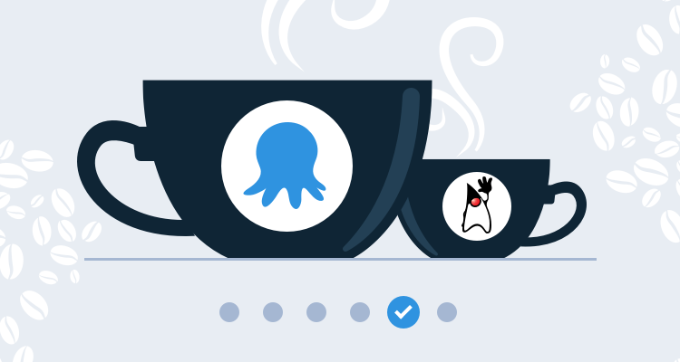
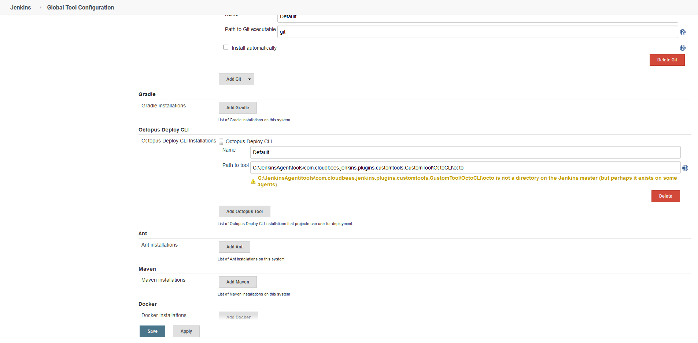

This post is part of a series that demonstrates a sample deployment pipeline with Jenkins, Docker, and Octopus:

!include <java-ci-cd-toc>


[In the previous blog post](/blog/2020-09/java-ci-cd-co/from-ci-to-cloud/index.md), we used Octopus to build a Kubernetes cluster in AWS using EKS, and then deployed the Docker image created by Jenkins as a Kubernetes deployment and service.

However, we still don’t have a complete [deployment pipeline](https://octopus.com/devops/continuous-delivery/what-is-a-deployment-pipeline/) solution, as Jenkins is not integrated with Octopus, leaving us to manually coordinate builds and deployments.

In this blog post, we’ll extend our Jenkins build to call Octopus and initiate a deployment when our Docker image has been pushed to Docker Hub. We will also create additional environments, and manage the release from a local development environment to the final production environment.

## Install the Jenkins plugins

Octopus provides a plugin for Jenkins that exposes integration steps in both freestyle projects and pipeline scripts. This plugin is installed by navigating to **{{ Manage Jenkins, Manage Plugins }}**. From here, you can search for "Octopus" and install the plugin.

The Octopus plugin uses the [Octopus CLI](https://octopus.com/docs/octopus-rest-api/octopus-cli) to integrate with the Octopus Server. We can install the CLI manually on the agent, but for this example we’ll use the **Custom Tools** plugin to download the Octopus CLI and push it to the agent:


*Install the custom tools plugin.*

## Configure the Octopus Server and tools

We add the Octopus Server, our pipeline will connect with, by navigating to **{{ Manage Jenkins, Configure System }}**:


*Define the Octopus Server.*

We then need to define a custom tool under **{{ Manage Jenkins, Global Tool Configuration }}**. The custom tool has the name **OctoCLI**, and because in my case the agent is running on Windows, the Octopus CLI will be downloaded from https://download.octopusdeploy.com/octopus-tools/7.4.1/OctopusTools.7.4.1.win-x64.zip. For the latest version of the CLI, and for binaries supporting other operating systems, see the [Octopus download page](https://octopus.com/downloads/octopuscli):


*Define the Octopus CLI custom tool.*

Further down on the **Global Tool Configuration** page we define the path to the Octopus CLI. The custom tools plugin installs the Octopus CLI to the directory `<jenkins home>/tools/com.cloudbees.jenkins.plugins.customtools.CustomTool/OctoCLI`, where `<jenkins home>` is the home directory of the Jenkins server or the agent performing the build. In my case, the agent home directory is `C:\JenkinsAgent`, so the Octopus CLI will be available from `C:\JenkinsAgent\tools\com.cloudbees.jenkins.plugins.customtools.CustomTool\OctoCLI\octo`. The name of the tool is left as **Default**:


*Define the Octopus CLI path.*

With these tools configured we can update the pipeline script to initiate a deployment in Octopus after the Docker image has been pushed to Docker Hub.

## Update the Jenkins pipeline

Our existing pipeline was configured to build and push the Docker image to Docker Hub. We will retain those steps, and add additional steps to install the Octopus CLI as a custom tool and then create and deploy a release in Octopus after the Docker image has been pushed. Let’s look at the complete pipeline:

```groovy
pipeline {
    agent {
        label 'docker'
    }
    parameters {
        string(defaultValue: 'Spaces-1', description: '', name: 'SpaceId', trim: true)
        string(defaultValue: 'Petclinic', description: '', name: 'ProjectName', trim: true)
        string(defaultValue: 'Dev', description: '', name: 'EnvironmentName', trim: true)
        string(defaultValue: 'Octopus', description: '', name: 'ServerId', trim: true)
    }
    stages {
        stage ('Add tools') {
            steps {
                tool('OctoCLI')
            }
        }
        stage('Building our image') {
            steps {
                script {
                    dockerImage = docker.build "mcasperson/petclinic:$BUILD_NUMBER"
                }
            }
        }
        stage('Deploy our image') {
            steps {
                script {
                    // Assume the Docker Hub registry by passing an empty string as the first parameter
                    docker.withRegistry('' , 'dockerhub') {
                        dockerImage.push()
                    }
                }
            }
        }
        stage('deploy') {
            steps {                                
                octopusCreateRelease deployThisRelease: true, environment: "${EnvironmentName}", project: "${ProjectName}", releaseVersion: "1.0.${BUILD_NUMBER}", serverId: "${ServerId}", spaceId: "${SpaceId}", toolId: 'Default', waitForDeployment: true                
            }
        }
    }
}
```

This pipeline has some new settings to support integration with Octopus.

We start by defining common parameters. These parameters will be referenced when we create and deploy a release in Octopus, and they provide a nice way to decouple the Octopus details from any specific instance, while also providing sensible default values:

```groovy
    parameters {
        string(defaultValue: 'Spaces-1', description: '', name: 'SpaceId', trim: true)
        string(defaultValue: 'Petclinic', description: '', name: 'ProjectName', trim: true)
        string(defaultValue: 'Dev', description: '', name: 'EnvironmentName', trim: true)
        string(defaultValue: 'Octopus', description: '', name: 'ServerId', trim: true)
    }
```

In order for the custom tools plugin to extract the Octopus CLI in the agent’s home directory, we need to call `tool('OctoCLI')`:

```
        stage ('Add tools') {
            steps {
                tool('OctoCLI')
            }
        }
```

The final stage makes a call to `octopusCreateRelease` to both create a release and deploy it to the first environment in Octopus. By default, Octopus will create the deployment with the latest version of the packages referenced in the deployment steps, which means that we will deploy the Docker image that Jenkins uploaded to Docker Hub in the previous stage:

```
        stage('deploy') {
            steps {                                
                octopusCreateRelease deployThisRelease: true, environment: "${EnvironmentName}", project: "${ProjectName}", releaseVersion: "1.0.${BUILD_NUMBER}", serverId: "${ServerId}", spaceId: "${SpaceId}", toolId: 'Default', waitForDeployment: true                
            }
        }
```

With these changes to the pipeline we rerun the project in Jenkins, and from the console logs we can see that Jenkins has successfully triggered a deployment in Octopus:


*Jenkins project build logs showing the Octopus deployment output.*

Here is the corresponding deployment in Octopus:


*The Octopus deployment.*

## Continuous Deployment vs Continuous Delivery

Over the years, the [CD half of the acronym CI/CD](https://octopus.com/devops/continuous-delivery/what-is-continuous-deployment/) has settled on two definitions:

* Continuous Deployment, which means a completely automatic deployment pipeline where each commit goes to production, assuming all tests and other automated requirements are met.
* Continuous Delivery, which means each commit *could* go to production through an automated, but not necessarily automatic, deployment pipeline. The decision to promote through environments (or not) is still made by a human.

While Continuous Deployment, by its very definition, removes all the friction from a deployment process, there are many valid reasons to implement Continuous Delivery. For example, you may need to orchestrate deployments with other teams, product owners may need to sign off new features, regulatory requirements may demand that production infrastructure not be modified by developers without some review process, or you may simply want to retain the ability to manually test and verify a release before it goes to production.

:::hint
If you read blog posts on best practices concerning CI/CD, you may be left with the impression that Continuous Deployment is something that you *must* strive to implement. While the practices that allow for a true Continuous Deployment pipeline will have value, most of the development teams we talk to report that Continuous Delivery works for them.
:::

For this blog, we will create a Continuous Delivery pipeline that manages releases to multiple environments through the Octopus dashboard.

## Add the environments

We only have the one environment in Octopus called **Dev**. However, a typical workflow will promote a deployment through multiple environments on the way to production. To implement this, we need to create more environments in Octopus which we will call **Test** and **Prod**:


*Add the Test and Prod environments.*

We need to ensure our Kubernetes target is placed within these new environments as well:


*Add the Kubernetes target to the new environments.*

We now have the ability to promote releases from the **Dev** environment to the **Test** environment through the Octopus dashboard:


*The Octopus dashboard showing the next environment to deploy to.*

Promoting the release to the **Test** environment, we can see our Kubernetes resources being created in the **petclinic-test** namespace. If you recall from the previous blog post, we configured our Kubernetes steps to deploy to a namespace called **petclinic-#{Octopus.Environment.Name | ToLower}**, which is why deployments to a new environment have been placed in a new namespace:


*A deployment to the Test environment.*

To prove this, we can rerun the runbook **Get Service** in the **Test** environment. We can see that a new load balancer host name has been created for the new service resource:


*The details of the load balancer service created in the Test environment.*

And with that, we have a complete deployment pipeline.

## Conclusion

In this post, we triggered a deployment in Octopus after Jenkins finished building and pushing the Docker image. This means we have implemented Continuous Integration with Jenkins testing, building, and publishing the Docker image, and Continuous Delivery with Octopus providing automatic deployment to a development environment, with an automated process ready to be manually triggered in other environments.

We can now promote a change from the application source code to production with a few simple button clicks. Those responsible for release management need no special tools other than a web browser. Each build and deployment is tracked, audited, and summarized in the Jenkins and Octopus dashboards.

But those who have seen their code put in customers’ hands know that while nothing inspires more confidence than the first 10 minutes of a production deployment, the following hours and days are hard. Database backups need to be managed, operating system updates need to be scheduled, logs need to be collected to diagnose support issues, and some good, old-fashioned turning-it-off-and-on-again will need to be performed.

In the [next blog post](/blog/2020-09/java-ci-cd-co/from-cd-to-co/index.md), we’ll show examples of these maintenance processes implemented in runbooks to complete the final stage of our pipeline: operations.
