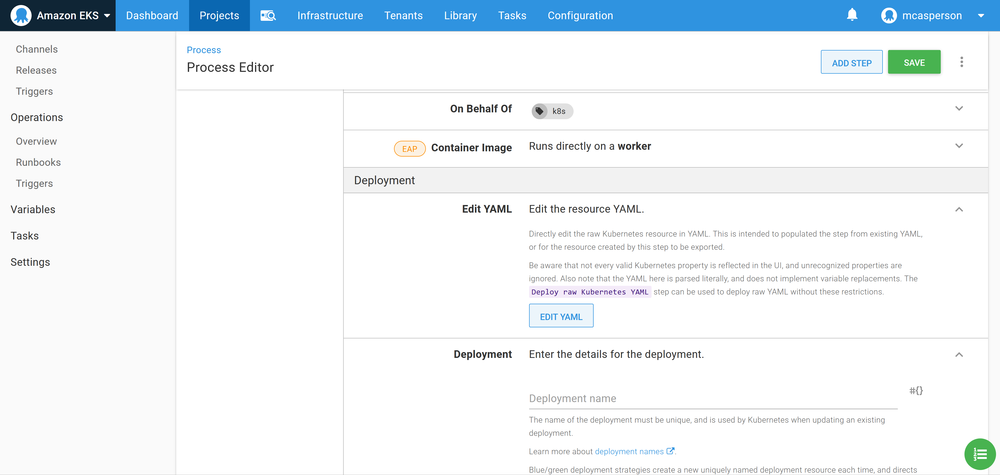

This post is part of a series that demonstrates a sample deployment pipeline with Jenkins, Docker, and Octopus:

!include <java-ci-cd-toc>

[In the previous blog post](/blog/2020-09/java-ci-cd-co/from-local-to-ci/index.md)  we configured a CI server with Jenkins that provided a central location from which to build and publish our Docker image. The image is now publicly available from Docker Hub, and the next step is to create infrastructure that can host our Docker container.

In this post, we’ll create an Elastic Kubernetes Service (EKS) instance in AWS from Octopus.

## Getting an Octopus Cloud instance

We’ll use Octopus to script the creation of the EKS cluster. The easiest way to get access to Octopus is to sign up for a free instance of [Octopus Cloud](https://octopus.com/free). It only takes a few minutes to get an instance up and running.

The first step is to create an AWS account in Octopus that will be used to create and then connect to the EKS cluster. AWS accounts consist of an account key and a secret key:


*An example AWS account.*

The community step called **eksctl - Create Cluster (bash)** can be added to a runbook to quickly create an EKS cluster and the associated Kubernetes target in Octopus. This script executes the [EKS CLI tool](https://aws.amazon.com/blogs/opensource/eksctl-eks-cli/) to create an EKS cluster:


*The community step to create an EKS cluster.*

To make it easy to use the **ekscli** tool, Octopus supports running a step inside a Docker container based on an image, and [provides images](https://hub.docker.com/r/octopusdeploy/worker-tools) with a wide selection of common cloud tools, including **ekscli**.

:::hint
To use the Docker image from Octopus Cloud, we need to select the Ubuntu dynamic workers:


:::

To make use of the worker tools image, we select it in the **Container image** section:


Populate the step with the details of the EKS cluster to create. For this example, the following **eksctl config** YAML creates a cluster with two t3a.small nodes:

```YAML
apiVersion: eksctl.io/v1alpha5
kind: ClusterConfig

metadata:
  name: k8s-cluster
  region: us-east-1

nodeGroups:
  - name: ng-1
    instanceType: t3a.small
    desiredCapacity: 2
    volumeSize: 80
```


*The populated step.*

:::hint
If you get a `UnsupportedAvailabilityZoneException` error in `us-east-1`, try another availability zone. The [eksctl documentation](https://eksctl.io/usage/creating-and-managing-clusters/) notes that `us-east-1` is susceptible to this error.
:::

Before the runbook is executed, we need to allow dynamically created targets to be placed in the destination environment, called **Dev** in this example. Enabling this setting allows script steps, like the community step template we just configured, to create Octopus targets:


*Enabling dynamic infrastructure in the Dev environment.*

Now execute the runbook. When the runbook has completed, a new Kubernetes target is created that we can deploy our application to:


*The Octopus Kubernetes target.*


*The EKS cluster.*

## Create the Docker feed

In order to consume Docker images, we need to create a Docker feed in Octopus. This feed points to https://index.docker.io, which is the URL of the Docker Hub registry:


*The Docker Hub feed in Octopus.*

We can then test the feed to ensure that Octopus can find our **Petclinic** image:


*Test the Docker feed.*

## Deploy the image to Kubernetes

We now have all the configuration in place to deploy to the Kubernetes cluster. We’ll use the **Deploy Kubernetes containers** step to configure a Kubernetes deployment resource and expose it through a load balancer service:


*The Deploy Kubernetes containers step.*

You can interact with this step in two ways.

The first way is to use the UI to build up the Kubernetes deployment. This is convenient when you are not intimately familiar with Kubernetes YAML properties as you can build out the resource via the dedicated form fields.

The second way to use the step is to edit the values via the YAML representation that is shown when you click the **EDIT YAML** button:


*The Edit YAML section.*

You can then edit the deployment resources directly as YAML, which is convenient as copying and pasting existing YAML populates the step in one operation. By pasting the YAML below into the text box, we create a deployment that references our Docker image:

```YAML
apiVersion: apps/v1
kind: Deployment
metadata:
  name: petclinic
spec:
  selector:
    matchLabels:
      octopusexport: OctopusExport
  replicas: 1
  strategy:
    type: RollingUpdate
    rollingUpdate: {}
  template:
    metadata:
      labels:
        octopusexport: OctopusExport
    spec:
      containers:
        - name: petclinic
          image: mcasperson/petclinic
          ports:
            - name: web
              containerPort: 8080
```


*Editing the step via YAML.*

We want to place our deployments into a separate namespace for each environment. This is done by setting the **Namespace** field to **petclinic-#{Octopus.Environment.Name | ToLower}**:


In the same way we configured the deployment, we can populate the details of the service with the YAML below. This YAML creates a load balancer service which will result in an Elastic Load Balancer (ELB) being created to expose the deployment. This ELB has a public hostname we can access from our web browser:

```YAML
apiVersion: v1
kind: Service
metadata:
  name: petclinic
spec:
  type: LoadBalancer
  ports:
    - name: web
      port: 80
      targetPort: 8080
      protocol: TCP
```


*The service YAML.*

With these settings in place we can deploy to the EKS cluster. The logs show that the Kubernetes deployment and service resources were successfully created:


*PetClinic has been successfully deployed.*

So the only question now is *how do we access the application?*

## Query the cluster

We’ll frequently need to query the cluster to find the information we need to move forward, or to debug a problem. Normally, whoever is setting up the deployment will configure kubectl locally and quickly query the state of the cluster with ad-hoc commands.

While this works, and is indeed sometimes necessary, executing ad-hoc commands like this ignores the fact that if these commands were necessary to get the initial deployment to succeed, they are likely to also be necessary to resolve issues with the deployment in future.

Finding the hostname of the load balancer we just created is a perfect example. We could get this information any number of ways, either from the AWS console or with a call to kubectl. However, for the benefit of those who will be maintaining this cluster when we are done, we’ll instead find this information through another runbook.

To get the service information, create a runbook with the community step template called **Kubernetes - Inspect Resources**:


*The Kubernetes - Inspect Resources community step template.*

Configure the step to get the service resources from the **petclinic-#{Octopus.Environment.Name | ToLower}** namespace:


*Getting the service details.*

Running the runbook will query the cluster with kubectl on our behalf, showing the hostname of the load balancer in the response:


*The service details.*

This process was slightly less convenient than jumping into a console and running kubectl directly, but the benefit is we’ve started a runbook library that includes steps we know were useful for working with our cluster. This library will be incredibly valuable as we look to hand support of this infrastructure to another team. This is especially true when you consider that the next team only need the appropriate access to Octopus, and do not need kubectl or any credentials, which is welcome when your pager goes off at 3 in the morning.

Now that we know the hostname of our ELB, we can access our publicly hosted application:


*PetClinic live and public.*

## Conclusion

In this post, we created a Kubernetes cluster in AWS using the EKS service and deployed our PetClinic application to it via Octopus. We also committed ourselves to debugging the cluster via runbooks, which provides a small but important foundation that we can pass to the team that will eventually be responsible for this cluster after we have moved on.

We are not quite at the point of having implemented continuous deployments, since there is no integration between Jenkins and Octopus. In the [next post](/blog/2020-09/java-ci-cd-co/from-ci-to-cd/index.md) we’ll hook up our pipeline to achieve a complete CI/CD pipeline.
