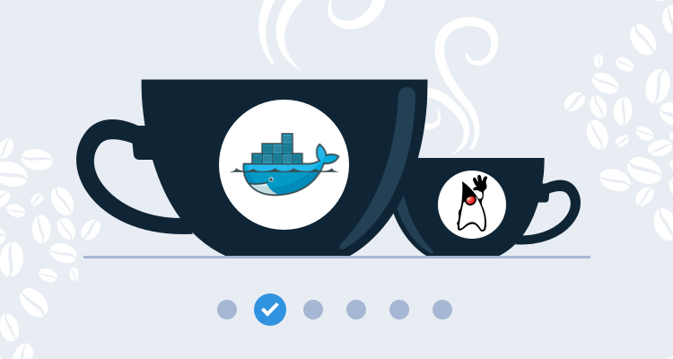

This post is part of a series that demonstrates a sample deployment pipeline with Jenkins, Docker, and Octopus:

!include <java-ci-cd-toc>


There is perhaps no public project that better exemplifies a long-lived Java application than [Spring PetClinic](https://projects.spring.io/spring-petclinic/). It started life way back in the early 2000s, and is still proudly featured on the Spring website.

Our journey through the [DevOps lifecycle](https://octopus.com/devops/) starts with a local build of PetClinic on a local workstation. By the end of this blog post, we’ll have containerized this application with Docker to provide a [repeatable build and execution environment](https://octopus.com/devops/continuous-delivery/what-is-a-deployment-pipeline/).

## Start with a local build

To get started, we clone the PetClinic GIT repository and use the Maven wrapper checked in alongside the application source code to build and run a local JAR file:

```
git clone https://github.com/spring-projects/spring-petclinic.git
cd spring-petclinic
./mvnw spring-boot:run
```

This initial build will take some time as Maven downloads the various Spring libraries that make up the application. Thankfully these libraries are cached, so subsequent builds will complete much faster.

To view the application, open http://localhost:8080:


*PetClinic running locally.*

To create a distributable JAR file, run the command:

```
./mvnw package
```

This runs the unit tests and then creates a single, self-contained JAR file under the `target` directory called something like `petclinic.2.3.1.BUILD-SNAPSHOT.jar`. We can run this file with the command:

```
java -jar .\target\petclinic.2.3.1.BUILD-SNAPSHOT.jar
```

This process of testing, building, and running locally is where every application starts. 

To be fair, PetClinic implements a number of features to make these builds repeatable and the results easily distributable. The `mvnw` script is the [Maven Wrapper](https://github.com/takari/maven-wrapper), which provides cross platform scripts designed to be checked into source control that downloads the appropriate version of Maven if the local machine does not have it installed. Spring boot then creates self-contained JAR files that are easy to version, copy, and deploy.

However, you still need the Java Developer Kit (JDK) to build the application, and either the JDK or Java Runtime Environment (JRE) to run it. PetClinic relies on a quite old version of Java, and given that a new version of Java is released every six months, it’s not hard to imagine developers having to juggle Java installations to perform a local build.

To provide a truly self-contained build and execution environment, we’ll migrate this application to Docker.

## Self-contained builds and execution with Docker

One of the main features of Docker is its ability to bundle an entire application ecosystem in a self-contained image that can be run in an isolated environment. For us, this means we can build and distribute a Docker image with the required version of Java and our compiled application, and anyone with Docker installed will be able to run it.

A fork of the PetClinic repo has been created in [GitHub](https://github.com/mcasperson/spring-petclinic) with the code below for easy access.

A Docker image is defined by the steps listed in a file called `Dockerfile`. The contents of our `Dockerfile` are shown below:

```
FROM maven:3.6.3-jdk-8 AS build-env
WORKDIR /app

COPY pom.xml ./
RUN mvn dependency:go-offline
RUN mvn spring-javaformat:help

COPY . ./
RUN mvn spring-javaformat:apply
RUN mvn package -DfinalName=petclinic

FROM openjdk:8-jre-alpine
EXPOSE 8080
WORKDIR /app

COPY --from=build-env /app/target/petclinic.jar ./petclinic.jar
CMD ["/usr/bin/java", "-jar", "/app/petclinic.jar"]
```

This `Dockerfile` makes use of a feature called [multistage builds](https://docs.docker.com/develop/develop-images/multistage-build/). This allows us to create a smaller final Docker image for distribution by not including the tools that are only required to build the application.

We base our build on an existing Docker image provided by the Maven team. This image has the JDK and Maven tools preinstalled:

```
FROM maven:3.6.3-jdk-8 AS build-env
```

We then create and move into a directory called `/app`:

```
WORKDIR /app
```

The Maven `pom.xml` file is copied into the `/app` directory:

```
COPY pom.xml ./
```

We then run the Maven `dependency:go-offline` goal, which downloads most of the libraries and Maven plugins we need to build the application.

Because of the way Docker caches builds, so long as the `pom.xml` file doesn’t change, any subsequent rebuilds of this image will reuse the downloads performed by this execution of Maven. For the PetClinic application, this can save several minutes and many hundreds of megabytes:

```
RUN mvn dependency:go-offline
```

Spring includes a source code formatting tool that ensures all the code has a consistent style. We’ll call the help function to ensure that Maven downloads the plugin, which means Docker, in turn, will cache the download. This will save us one more download with subsequent rebuilds of the Docker image:

```
RUN mvn spring-javaformat:help
```

We can now copy the rest of the application source code. Docker detects when the source code being copied has changed and reruns the image building process from this step to capture the changes. However, all the application dependencies have been cached, so the build process from this step will be relatively quick:

```
COPY . ./
```

Copying source code from a Windows workstation to a Linux Docker image would normally cause the formatting plugin to complain about line endings. Here we run the formatting plugin to automatically fix any issues with the copied files:

```
RUN mvn spring-javaformat:apply
```

We can now build the application with the Maven `package` goal. Note that we have also set the `finalName` variable to `petclinic`. This overrides the default file name of `petclinic.2.3.1.BUILD-SNAPSHOT.jar` to produce a consistent file called `petclinic.jar`:

```
RUN mvn package -DfinalName=petclinic
```

Our application is now built, and we move to the next stage of the multistage build to produce the Docker image that we want to distribute. This image is based on the OpenJDK JRE. 

:::warning
The JRE can run a compiled application but does not include the tools required to compile applications. This reduces the size of the final image.
:::

```
FROM openjdk:8-jre-alpine
```

We expose port `8080`, which is the port our Spring application listens to:

```
EXPOSE 8080
```

We create and move into a directory called `/app`:

```
WORKDIR /app
```

The JAR file compiled in the previous stage is copied into the current image:

```
COPY --from=build-env /app/target/petclinic.jar ./petclinic.jar
```

We then instruct the image to execute the JAR file when it is run:

```
CMD ["/usr/bin/java", "-jar", "/app/petclinic.jar"]
```

To build the Docker image, run the command:

```
docker build . -t petclinic
```

This will build the Docker image and assign it the tag `petclinic:latest`. Note that `latest` is applied by default if no other tags are specified.

Finally, run the Docker image with the command:

```
docker run petclinic
```

As before, the application is available at http://localhost:8080.

We now have a `Dockerfile` that includes all the steps required to build and run our application. This application can now be built from source without any other tools than Docker. We now have a truly self-contained build process.

## Distributing Docker images

Docker images can be shared online with a number of Docker registries. The most popular is [Docker Hub](https://hub.docker.com/), which provides free accounts for hosting publicly available Docker images.

To share the PetClinic Docker image, we need to sign up for a Docker Hub account. My account is called `mcasperson`.

After you have created an account, sign in to Docker Hub with the command `docker login`:

```
docker login
Login with your Docker ID to push and pull images from Docker Hub. If you don't have a Docker ID, head over to https://hub.docker.com to create one.
Username: mcasperson
Password:
Login Succeeded
```

To share the image it needs to be tagged with your username. In my case, I need to build an image called `mcasperson/petclinic` (where `mcasperson` is my Docker Hub username):

```
docker build . -t mcasperson/petclinic
```

The build should complete quickly, as no files have changed and all steps are cached from earlier.

To upload the image, run the following command, replacing `mcasperson` with your Docker Hub username:

```
docker push mcasperson/petclinic
```

The image is now [shared online](https://hub.docker.com/r/mcasperson/petclinic) for anyone to access.

To run the public image, execute the command:

```
docker run -p 8080:8080 mcasperson/petclinic
```

Docker will download the image if it is not available locally, and then run it as we did before. The option `-p 8080:8080` explicitly maps the local port 8080 to the container port 8080.

## Conclusion

In this post, we took a typical Java application and containerized it as a Docker image. This image was uploaded to a Docker registry making it publicly available.

With these changes, we have created a [repeatable build and execution process](https://octopus.com/devops/continuous-delivery/what-is-a-deployment-pipeline/) anyone can use with only Docker installed. If we switch to a newer version of Java, or even switch languages completely, the application can still be built and run with the same Docker commands.

While the build process may be conveniently encapsulated by Docker, there is no guarantee that the source code compiles or that the tests all pass. As more developers begin working on an application, the health of the codebase is something that needs to be shared by a central _source of truth_ so everyone knows the state of the application. This is where a [Continuous Integration](https://octopus.com/devops/continuous-delivery/continuous-delivery-capabilities/) (CI) server comes in. 

In the [next post](/blog/2020-09/java-ci-cd-co/from-local-to-ci/index.md) we’ll configure our application to be built by the popular and open source CI server Jenkins.
