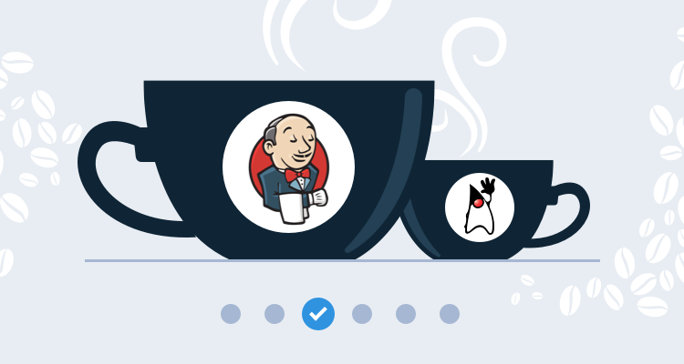
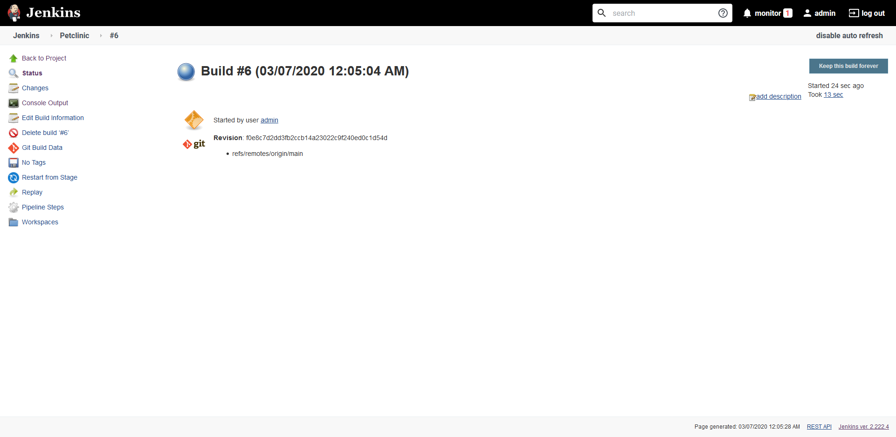

This post is part of a series that demonstrates a sample deployment pipeline with Jenkins, Docker, and Octopus:

!include <java-ci-cd-toc>


[In the previous post](/blog/2020-09/java-ci-cd-co/from-jar-to-docker/index.md), we took a typical Java application and created a `Dockerfile` that takes care of building the code and running the resulting JAR file. By leveraging the existing Docker images provided by tools like Maven and Java itself, we created a repeatable and self-contained build process, and the resulting Docker image can be executed by anyone with only Docker installed.

This is a solid foundation for our build process. However, as more developers start working on a shared codebase, testing requirements expand, and the resulting packages grow in size, teams require a central shared server to manage builds. This is the role of a Continuous Integration (CI) server.

There are many CI servers available. One of the most popular is [Jenkins](https://www.jenkins.io/), which is free and open source. In this blog post, we’ll learn how to configure Jenkins to build and publish our Docker image.

## Getting started with Jenkins

The easiest way to get started with Jenkins is to use their [Docker image](https://hub.docker.com/r/jenkins/jenkins/). Just as we created a self-contained image for our own application in the previous blog post, the Jenkins Docker image provides us with the ability to launch Jenkins in a pre-configured and self-contained environment with just a few commands.

To start, we download the latest long term support (LTS) version of the Jenkins Docker image with the command:

```
docker pull jenkins/jenkins:lts
```

We then launch Jenkins with the command:

```
docker run -p 8081:8080 -p 50000:50000 -v jenkins_home:/var/jenkins_home jenkins/jenkins:lts
```

The `-p` argument binds a port from the local workstation to a port exposed by the image. Here we use the argument `-p 8081:8080` to bind local port `8081` to the container port `8080`. Note that because our own PetClinic application also listens to port `8080` by default, we’ve chosen the next available port of `8081` for Jenkins. It is entirely up to you which local port is mapped to the container port. The argument `-p 50000:50000` exposes a port used by Jenkins agents, which we will configure to perform our build later in the post.

The `-v` argument mounts a [Docker volume](https://docs.docker.com/storage/volumes/) to a path in the container. While a Docker container can modify data while it runs, it is best to assume you will not be able to retain those changes. For example, each time you call `docker run` (which you may do to use an updated version of the Jenkins Docker image), a new container is created without any of the data that was modified by a previous container. Docker volumes allow us to retain modified data by exposing a persistent file system that can be shared between containers. In this example, we have created a volume called `jenkins_home` and mounted it to the directory `/var/jenkins_home`. This means that all of the Jenkins data is captured in a persistent volume.

When the Docker image is run you will be presented with the log output. As part of the initial boot, Jenkins generates a random password and displays it in the logs like this:

```
*************************************************************
*************************************************************
*************************************************************

Jenkins initial setup is required. An admin user has been created and a password generated.
Please use the following password to proceed to installation:

4b9e47bcd9ea469687dc39f23b0adb08

This may also be found at: /var/jenkins_home/secrets/initialAdminPassword

*************************************************************
*************************************************************
*************************************************************
```

When you open http://localhost:8081, you will be prompted to enter this password to unlock Jenkins:


*Unlock Jenkins with the generated password.*

Jenkins will prompt you to either install a list of common plugins or just those that you select. The **Install suggested plugins** option contains most of the plugins we need.

It will take a minute or so for the plugins to download:


*The plugins installing.*

When that is done, create the first admin user, and click **Save and Continue**.

Finally, define the Jenkins URL and click **Save and Finish**.

Jenkins is now configured and ready to use, just click **Start using Jenkins**.

## Create an agent

An issue we need to address is the fact that we are running Jenkins in a Docker container, and also want Jenkins itself to use Docker to build a Docker image. This creates a scenario where we want to use Docker in Docker.

Running [Docker in Docker](https://hub.docker.com/_/docker) is possible, but is not supported out of the box with the Jenkins image we have run. A number of third party tools have been created, like [Kaniko](https://github.com/GoogleContainerTools/kaniko) and [Buildah](https://github.com/containers/buildah), that support building Docker images without relying on the Docker daemon. These solutions are reasonably advanced though.

An easier solution is to run a Jenkins agent outside of the Jenkins Docker container. This agent will run on the host operating system and have access to the Docker daemon to create Docker images.

To create an agent, click **{{ Manage Jenkins, Manage Nodes and Clouds }}**:


*Jenkins Management options.*

Click the **New Node** link, and give the new node a name, for instance *Builder*, and click **OK**:

Enter a path for the **Remote root directory**. Because I am running the node on Windows, the path is something like `C:\JenkinsAgent`. Then enter `docker` as the node label and click **Save**:


*Configuring the new node.*

The node is now configured in Jenkins, but since there is no node running it is shown as disconnected.

If you click the new node, you'll see a screen that provides instructions for running the agent. Click the **agent.jar** link to download the agent file and run the command shown on the screen to connect the agent to Jenkins:


*Instructions for connecting a node.*

The node is now connected, and we have an agent connected to Jenkins that has the ability to build Docker images.

## Install the Docker Pipeline plugin

The initial configuration of Jenkins installed a number of common plugins. However, to build Docker images we need one more plugin called **Docker Pipeline**. This is done via **{{ Manage Jenkins, Manage Plugins }}** and searching for the **Docker Pipeline** plugin in the **Available** tab.

The plugin will take a few seconds to download and install:


*Downloading the plugin.*

## Add the DockerHub credentials

To allow our project to publish the Docker image to Docker Hub, we need to define the Docker Hub credentials in Jenkins.

1. Navigate to the credentials section by clicking **{{ Manage Jenkins, Manage Credentials }}**.
1. Select **Jenkins**, and click **Global credentials**.
1. Click **Add Credentials**, and enter the Docker Hub credentials, set the **ID** to **dockerhub**, and click the **OK** button:


*Define the Docker Hub credentials.*

We now have everything we need to build Docker images in Jenkins. The next step is to define the Jenkins project.

## Define the Jenkins project

At a high-level, Jenkins provides two types of projects. 

The first format, known as a freestyle project, is defined in the Jenkins UI. While it is possible to export and share a freestyle project, it’s tricky to do as the underlying data format is not designed to be edited by hand.

The second format, known as a pipeline, is essentially a script that is designed to be created and managed much like the code in your applications. The pipeline can be saved alongside your project code in a file called `Jenkinsfile`, which keeps your application code and the build definition in the same place.

We’ll create a `Jenkinsfile` for our project to build and publish our Docker image with the following code:

```
pipeline {
    agent {
        label 'docker'
    }
    stages {
        stage('Building our image') {
            steps {
                script {
                    dockerImage = docker.build "mcasperson/petclinic:$BUILD_NUMBER"
                }
            }
        }
        stage('Deploy our image') {
            steps {
                script {
                    // Assume the Docker Hub registry by passing an empty string as the first parameter
                    docker.withRegistry('' , 'dockerhub') {
                        dockerImage.push()
                    }
                }
            }
        }
    }
}
```

Let’s break this file down.

All declarative pipelines start with `pipeline`:

```
pipeline {
```

The agent this build is run with is defined in the `agent` section. Here we have configured the build to run on any agent with the label `docker`. This ensures that the build is run on our external node, which has access to the Docker daemon, rather than on the Jenkins server itself, which does not have access to Docker:

```
    agent {
        label 'docker'
    }
```

The stages that make up a pipeline are contained in a `stages` section:

```
stages {
```

The first stage builds the docker image. We make use of the [script](https://www.jenkins.io/doc/book/pipeline/syntax/#script) step to call the Docker Pipeline plugin we installed earlier to build the image. The result of this build is saved in a variable called `dockerImage`. Note the use of the `$BUILD_NUMBER` variable to assign a new version as the image tag with each build. This ensures that each execution of this pipeline will build a new distinct Docker image:

```
        stage('Building our image') {
            steps {
                script {
                    dockerImage = docker.build "mcasperson/petclinic:$BUILD_NUMBER"
                }
            }
        }
```

The second stage pushes the newly created image to Docker Hub. The `withRegistry` method takes the Docker registry as the first parameter, or if that is left blank, defaults to Docker Hub. The second parameter is the name of the credential that we created earlier in Jenkins:

```
        stage('Deploy our image') {
            steps {
                script {
                    // Assume the Docker Hub registry by passing an empty string as the first parameter
                    docker.withRegistry('' , 'dockerhub') {
                        dockerImage.push()
                    }
                }
            }
        }
```

This file is [committed alongside our application code](https://github.com/mcasperson/spring-petclinic/blob/main/Jenkinsfile). The next step is to create a Jenkins project to checkout this code and run the pipeline.

## Create a pipeline project

From the Jenkins dashboard, click the **New Item** link. Enter **Petclinic** as the item name and select the **Pipeline** option:


*New project creation.*

Under the **Pipeline** section, select **Pipeline script from SCM**, enter the Git repository URL (https://github.com/mcasperson/spring-petclinic.git in this example) and select the branch to build (**main** in this example). Then click **Save**:


*Define the pipeline GIT repository.*

From the project dashboard, click the **Build Now** link to manually run a build, and click the build link icon:


*A Jenkins project build.*

Click the **Console Output** link to view the build output:


*Jenkins project build console output.*

When the build completes, the Docker image is built on the Jenkins node and pushed to [Docker Hub](https://hub.docker.com/r/mcasperson/petclinic/tags) with a tag based on the build number:


*The resulting image in Docker Hub.*

With this, we have successfully configured Jenkins to compile and test the application code, then build and push the Docker image to Docker Hub.

## Conclusion

Jenkins provides a central platform through which multiple developers can have their code built, tested, and distributed. Jenkins maintains a history of the changes and whether they resulted in successful builds, maintains the credentials required to distribute Docker images, and removes the need for individuals to upload what could be potentially large Docker images with each build.

In this post, we stepped through the process of running Jenkins as a Docker container, connecting a node to perform the builds, and wrote a Jenkins pipeline to define how Jenkins will build and push the Docker image. The end result of this is a Continuous Integration system that can automatically build and publish our application, removing the need for individual developers to manually manage this process. We have achieved Continuous Integration.

The [next step](/blog/2020-09/java-ci-cd-co/from-ci-to-cloud/index.md) is to deploy our newly created Docker images somewhere. To do this we will configure a Kubernetes cluster in AWS.
