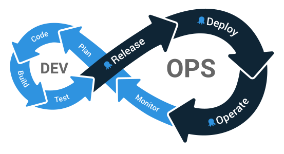

[DevOps](https://octopus.com/devops/) is a popular, high-level term that describes practices relating to how applications and their infrastructure are created and maintained, but how does the DevOps lifecycle relate to the day-to-day tools your teams use?

In this blog series, we walk through configuring Jenkins, Octopus, and Kubernetes to build, release, deploy, and maintain a legacy Java application. Each post takes you one step further through the DevOps lifecycle with practical examples, real-world advice, and example code you can use in your projects:

!include <java-ci-cd-toc>
