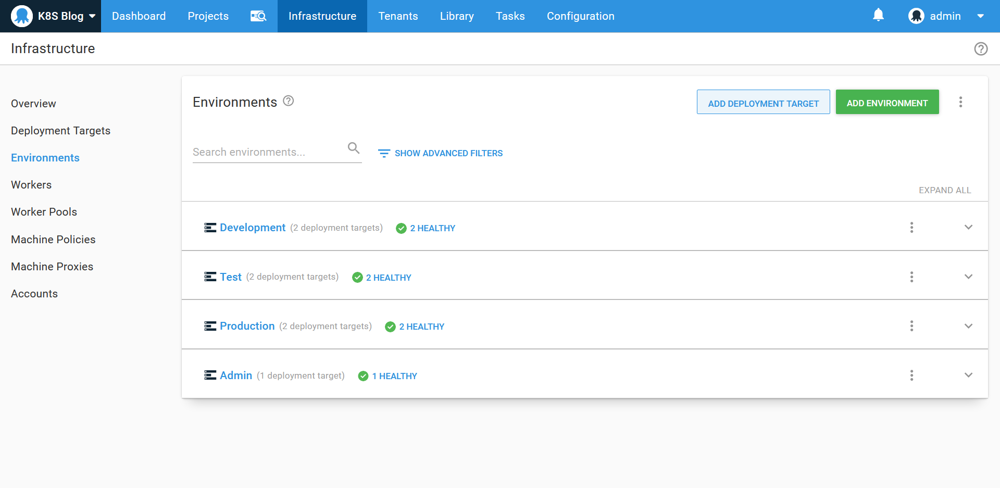
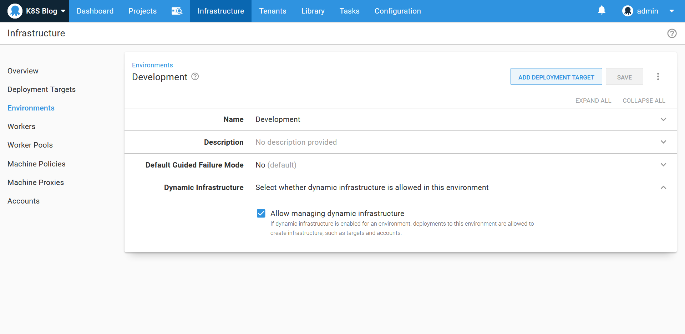
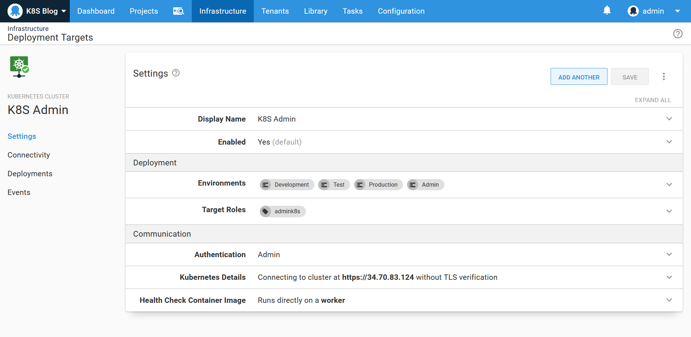
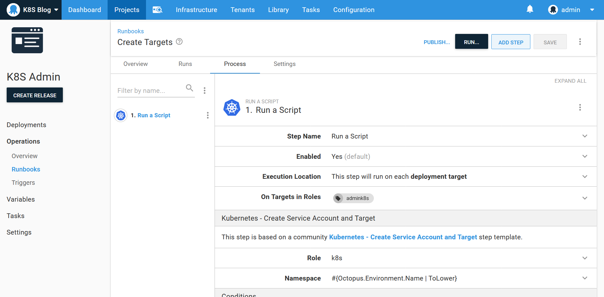
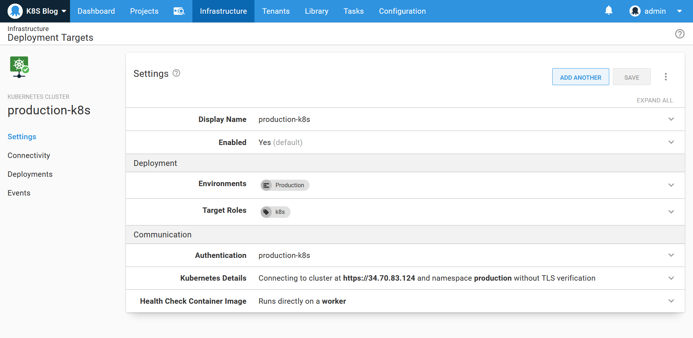
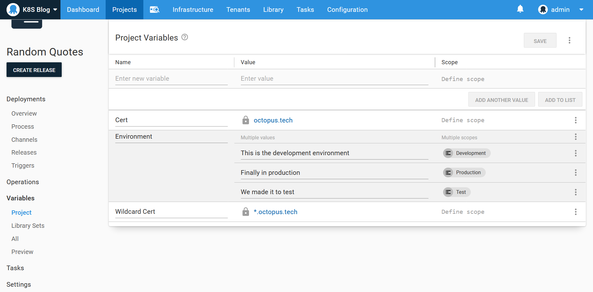
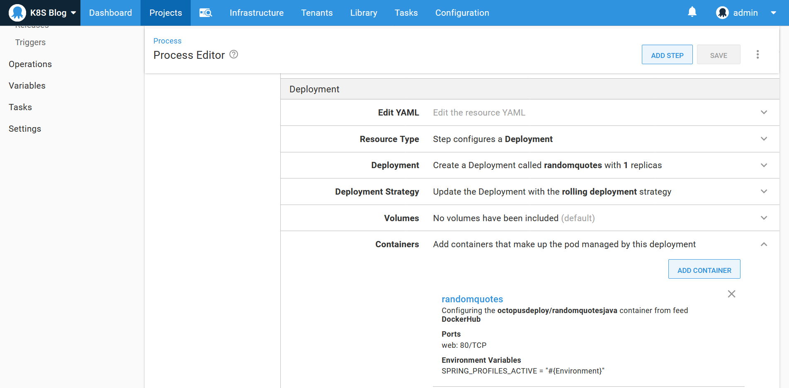
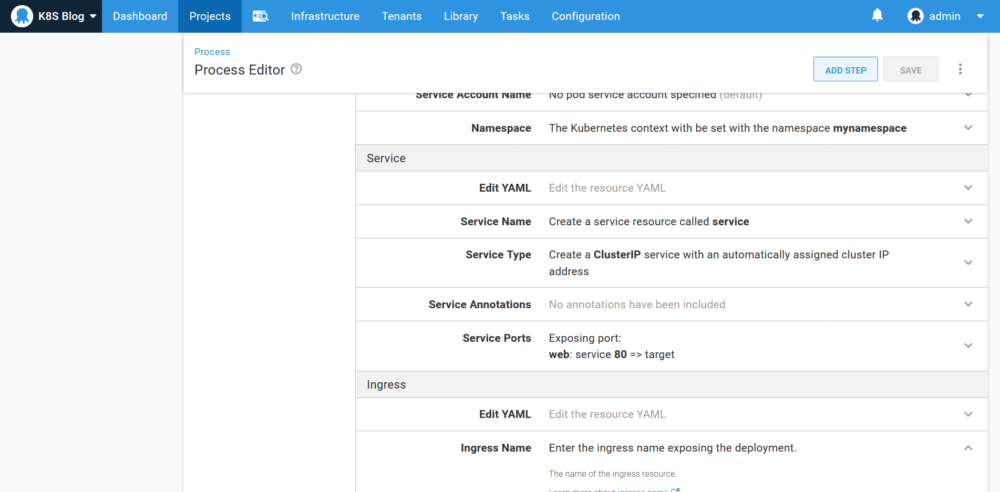
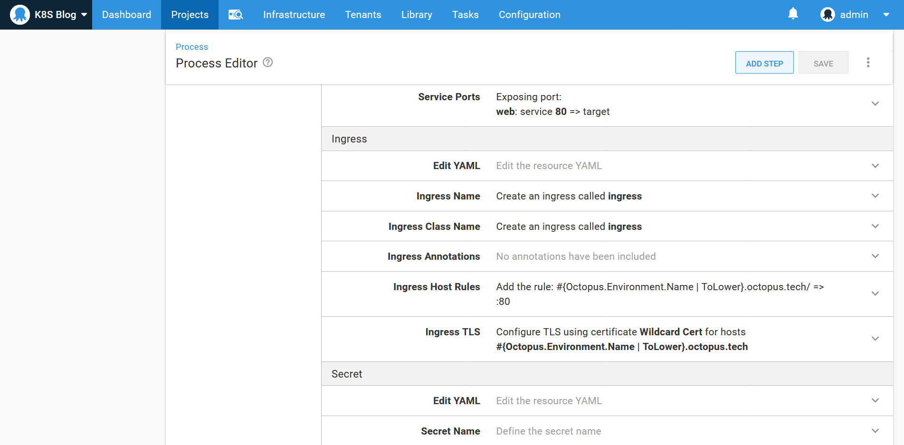

The declarative nature of Kubernetes resources provides a convenient way to describe the desired state of your cluster. However, Kubernetes has no native concept of environments. While namespaces provide a natural mechanism for partitioning your cluster, it is difficult to get a sense of what has been deployed where just by running `kubectl` or looking at traditional Kubernetes dashboards.

By managing Kubernetes deployments through Octopus, applications can be progressed through distinct environments (represented by namespaces and namespace restricted service accounts), and the current environment state is summarized by the Octopus dashboard.

In this blog post and screencast we'll look at how Kubernetes deployments can be progressed through multiple environments. We'll also create a number of runbooks to manage and inspect the cluster, providing a base set of automated tools for anyone tasked with supporting the deployments and cluster in future.

## Screencast

<iframe width="1280" height="720" src="https://www.youtube.com/embed/WexwK4ro9Bs" frameborder="0" allow="accelerometer; autoplay; encrypted-media; gyroscope; picture-in-picture" allowfullscreen></iframe>

## The environments

We have three environments to represent the progression of our deployed application: **Development**, **Test** and **Production**. We then have an environment called **Admin** that is used when managing cluster wide resources:

The **Development**, **Test** and **Production** environments all have the **Dynamic Infrastructure** option enabled:

## The admin target

We need a Kubernetes target with administrative privileges as the starting point. This target will be used to install and inspect cluster wide tools, like ingress controllers, as well as creating the environment specific targets:

## The deployment targets

Conceptually a Kubernetes target in Octopus is a security boundary for deployments to a specific environment. For this example where we are creating multiple environments in a single cluster, the security boundary is defined by a namespace and a service account that has access to only that namespace. The namespace then represents the environment, and the limited scope of the service account prevents deployments for that namespace/environment from modifying any other namespace/environment.

To create a service account limited to a specific namespace, you need to create three Kubernetes resources: a service account, a role and a role binding. The service account then creates a secret containing a generated token that is used for authentication.

Fortunately, a community step template available in Octopus called **Kubernetes - Create Service Account and Target** does the hard work of creating these Kubernetes resources for you, as well as creating the Octopus token account and the Kubernetes target itself. Here we configure this step as part of a runbook to create targets with the role of **k8s** linked to the lowercase name of the environment:

Running the runbook in the **Development**, **Test** and **Production** environments results in three new Kubernetes targets being created. Here is the production deployment target:

## The deployment process

We will deploy the random quotes sample application to the cluster. The source code for this Spring Boot application can be found on [GitHub](https://github.com/OctopusSamples/RandomQuotes-Java), and the Docker image is available on [DockerHub](https://hub.docker.com/r/octopusdeploy/randomquotesjava).

To demonstrate environment specific variables being passed down to each deployment, we'll create a variable called **Environment** with three values scoped to the **Development**, **Test** and **Production** environments:

We then deploy this image using the **Deploy Kubernetes containers** step. This step provides an opinionated and UI driven interface for creating Kubernetes resources, and in this example we will create a deployment, service and ingress resource.

The deployment resource creates a pod with a container exposing port 80, and mapping the **Environment** variable to an environment variable called **SPRING_PROFILES_ACTIVE**. This sets the Spring active profile name, which will be displayed on the screen, allowing us to verify that the correct Octopus variable was applied for each environment:

The cluster IP service then exposes port 80 internally in the cluster:

The ingress exposes the service to any request on the host **#{Octopus.Environment.Name | ToLower}.octopus.tech**. It also assigns a HTTPS certificate to that same hostname:

