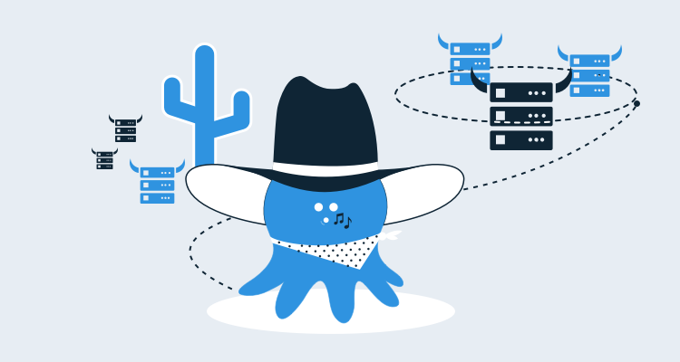
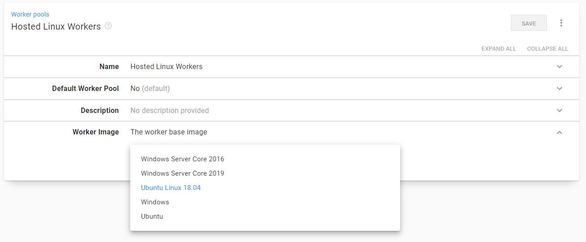
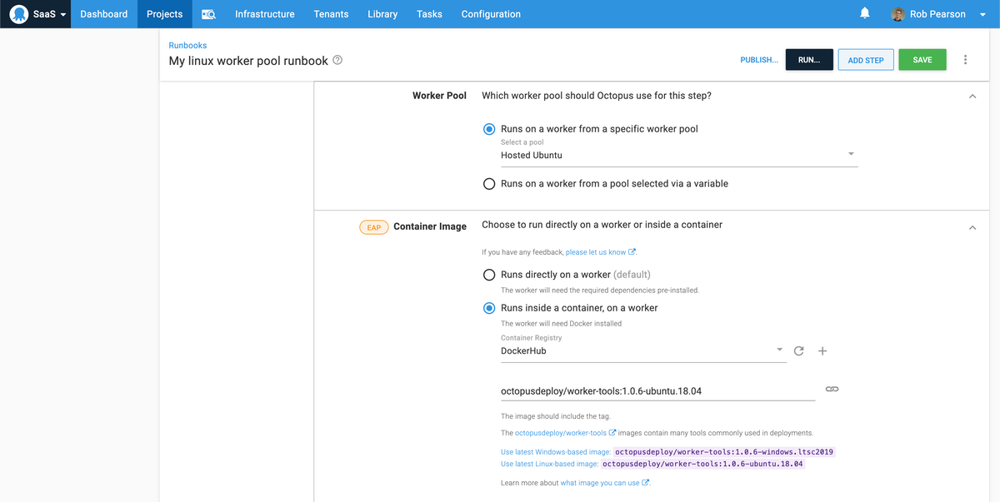
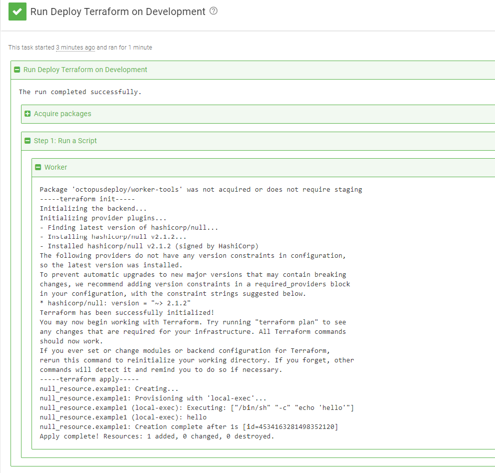

With Octopus-hosted [dynamic worker pools](https://octopus.com/docs/infrastructure/workers/dynamic-worker-pools), you can spin up an [Octopus Cloud](https://octopus.com/pricing/cloud) instance and run PowerShell deployment or runbook steps on a Windows machine in minutes. Unfortunately, running a bash script on a Linux machine wasn't always as easy.

The lack of support for Linux workers on Octopus Cloud has made us a little sad ever since we launched. You've been able to add your own Linux workers, but it hasn't felt as natural as the built-in support for dynamic workers provided for Windows.

## Ubuntu 18.04 workers now available

As of today, I'm happy to announce we support Ubuntu workers on Octopus Cloud. This is a step forward for us on our journey to being the best deployment tool for your Windows workloads and for your Linux workloads.



## Windows 2019 workers now available

I'm also happy to share, we've launched Windows 2019 workers. We're still in the process of switching everyone over, but you can opt-in to using the new worker images with your instance by navigating to **{{Infrastructure > Worker Pools}}**.

## Docker now pre-installed

A big positive of switching to the Windows 2019 workers is that Docker is installed as well, so you can make your builds sparkle with your own custom docker images; the only limit is your imagination (oh, and the DockerHub download times).

One thing we're really excited about is that adding support for Docker really opens up our [execution containers feature](https://octopus.com/blog/execution-containers) which has been behind a feature flag for a while. This feature is now available for everyone as a part of our early access program.

## New worker tools container version

One last thing, our [worker tools containers](https://hub.docker.com/r/octopusdeploy/worker-tools) have also been updated and now support the [Terraform 0.13](https://www.hashicorp.com/blog/announcing-hashicorp-terraform-0-13/) version that was just released. Check out [PR #20](https://github.com/OctopusDeploy/WorkerTools/pull/20) for all the details of available versions.

## Walk though

The next section provides a walk through of running a bash script on a Linux worker. For added points, we'll execute Terraform from inside a container to show how easy it is to use the newest version.

### Configure an external feed for DockerHub

If you don't yet have a feed configured for DockerHub, go to **{{Library > External Feeds}}** and hit the **Add Feed** button. Select **Docker Container Registry** in the **Feed Type** field, and give it a name, I called mine **Docker Hub**.

### Create a new runbook

After you've created your new worker pool, go to the projects tab, and create a new project. From there, go to **Runbooks** and hit the **Add Runbook** button and give it a name.

On the process tab, add a new **Run a Script** step. Choosing **Run once on a worker** will let you choose your new worker pool and expose a new section called **Container Image**.



Choose your Docker Hub feed, and then click the `Use latest Linux-based image` link at the bottom. This will populate the field with the latest version automatically.

Finally, for the script, choose **Bash** and enter the following script:

```bash
cat <<EOT > main.tf
resource "null_resource" "example1" {
  provisioner "local-exec" {
    command = "echo 'hello'"
  }
}
EOT

echo "-----terraform init-----"
terraform init -no-color

echo "-----terraform apply-----"
terraform apply -no-color -auto-approve
```

Hitting **Save** then **Run** will execute the script:



While this script doesn't exactly do much (it `echo`'s out "hello"), it highlights how easy it is to run a bash script and use the latest Terraform version.

## Conclusion

We hope you're as excited as we are about these new capabilities. Give it a bash today (pun fully intended) and let us know what you think!

Happy deployments!
