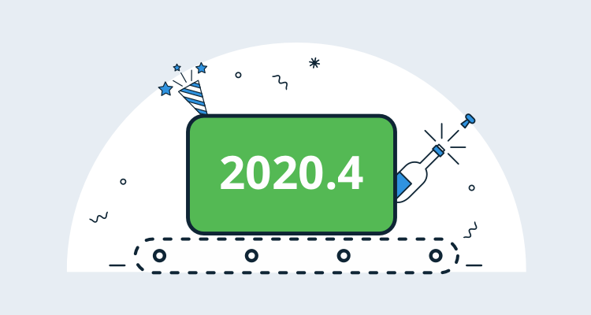
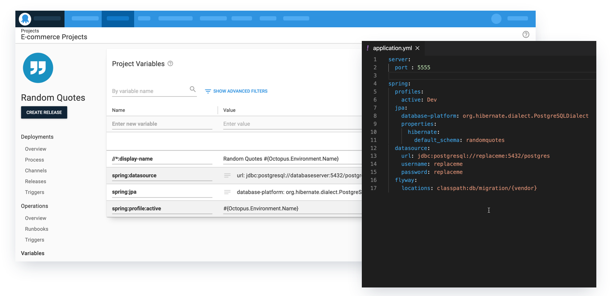
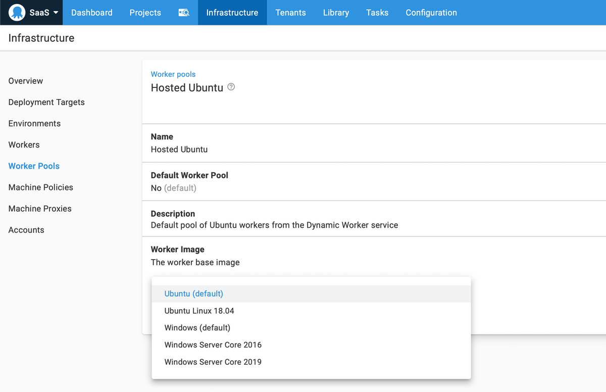
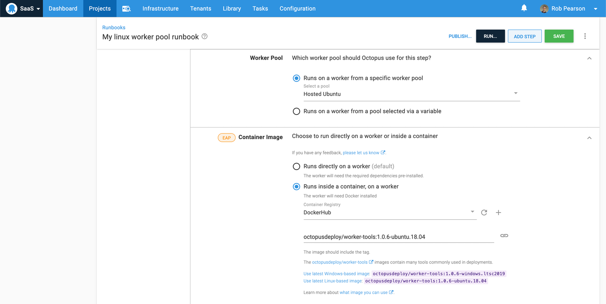

I’m thrilled to share that we’ve shipped Octopus 2020.4. This release brings together a couple of features that have been in development for a while. Together, they make it easier for teams to deploy and maintain web applications and services on Windows and Linux written in Java, NodeJS, Python, Ruby, and more.

* **[Better configuration file updates for Java, NodeJS, Ruby, and more](/blog/2020-09/octopus-release-2020-4/index.md#variables)**: is an update to our JSON configuration variable replacement support that makes it far more useful. It now supports JSON, YAML, XML, and Java Properties files. This is a huge improvement for numerous platforms, but it’s especially valuable for teams building apps with Java.

* **[Octopus Cloud: Built-in Worker Pools for Windows and Linux, and simpler dependency management](/blog/2020-09/octopus-release-2020-4/index.md#cross-platform-worker-pools)**. Octopus Cloud provides dynamic workers to execute scripts against your services and infrastructure. This update adds better cross-platform support with images for modern Windows and Linux operating systems. All Worker images support execution containers, which let you execute deployment work in isolation without the need to manage dependencies and containers.

This release is the [fourth of six in 2020](/blog/2020-03/releases-and-lts/index.md), and it includes six months of long-term support. The following table shows our current versions with long-term support:

| Release               | Long-term support  | LTS end date |
| --------------------- | ------------------ | ------------ |
| Octopus 2020.4        | Yes                | 2021-03-21   |
| Octopus 2020.3        | Yes                | 2021-01-20   |
| Octopus 2020.2        | Yes                | 2020-09-30   |
| Octopus 2020.1        | Expired            | 2020-08-24   |

Keep reading to learn more about the updates.

## Better configuration file updates for Java, NodeJS, Ruby, and more {#variables}

One of Octopus’s most powerful features is how it can automatically update your configuration files as you promote your applications to production. Historically, this supported a number of Microsoft configuration file formats, primarily Microsoft specific XML transformations and .NET configuration files, as well as some general approaches like JSON support and token replacement. This was fantastic; however, if you weren’t using XML or JSON files, you needed to insert and maintain tokens in your configuration files. 

With this release, we’re introducing structured variable replacement which supports nearly all modern configuration file formats, including:

* YAML
* JSON 
* XML 
* Java Properties files

For other configuration files formats, our token replacement support, via the *substitute variables in files* feature, has you covered. 

The benefit of config file updates with our structured variable replacement is that it’s automatic and convention based. Configure it once, and Octopus will automatically update configuration settings with names that match your project variables. The magic of this feature is that you can scope your variables to environments, so deploying releases to Dev, Test, Staging, and Production environments is repeatable and reliable.

This update makes it far easier to configure automated deployments for Java applications like Spring web apps and services, web apps written in Python, NodeJS services, Ruby on Rails web apps, and more.

[Learn more](/blog/2020-11/spring-environment-configuration/index.md)

## Octopus Cloud: Built-in Windows and Linux Worker Pools, and simpler dependency management {#cross-platform-worker-pools}

Octopus 2020.4 now includes built-in Worker Pools with dynamic workers running modern Windows and Linux images, including full support for Execution Containers.

:::hint
Workers enable you to run DevOps automation work on machines running in pools for specific purposes like executing scripts and deploying to Kubernetes, interacting with cloud platforms like Azure or AWS, as well as database management. You can create a pool of dedicated workers that can be utilized by multiple projects and teams. They’re a great tool for scaling your deployments and runbooks.

See [our documentation](https://octopus.com/docs/infrastructure/workers) for more information.
:::

## Built-in Windows and Linux Worker Pools

Octopus Cloud provides built-in Worker Pools that allow you to execute scripts against your services and infrastructure without the need to manage your own virtual machines or other compute resources. This simplifies the ability to execute automation scripts, deployment or runbook, against cloud platforms, databases, or Kubernetes clusters. 

With Octopus 2020.4, we have improved the cross-platform support for dynamic workers by providing built-in Worker Pools running modern Windows and Linux operating systems:
* Windows 2019
* Ubuntu 18.04

Octopus Cloud launched with support for Windows 2016 that is still available, and our focus now is on supporting more modern operating systems moving forward.

The workers are virtual machines which are bootstrapped with basic tooling, including the following: 

* Docker
* Bash
* PowerShell Core
* Python
* Octopus CLI

If you need additional tools, you can install them as a part of the script or build your own customer worker pools with your own machines. 

[Learn more](/blog/2020-09/octopus-cloud-built-in-linux-worker-pools/index.md)

## Execution Containers for Workers

With this update, our Execution Containers for workers feature is now available for everyone. This feature lets you execute automation work in isolated containers on workers and reduces the need to manage automation tooling and dependencies.

Previously, you needed to ensure the machines in your worker pools, including dynamic workers, had the necessary tools required for your automated processes, and you needed to maintain their OS and tool versions. This approach could also be problematic if different teams required different versions of specific tools that don’t install side by side. Octopus bundled some tools, but it was still a challenge to keep them up to date.

Execution containers for workers make this easier.

* **Isolated and fast execution of deployment work**. Octopus is using Docker to execute your scripts or other deployment work in the context of a container. This method provides fast and efficient execution in complete isolation.
* **Simplified dependency management** with pre-built Octopus tooling container images. There is now far less friction required to ensure you’re using the right versions of the tooling that you need for your deployments.

Octopus Deploy now supports execution containers on-premises with Octopus Server and hosted with Octopus Cloud. We ship and maintain a collection of official container images bootstrapped with common tooling, and it’s also possible to extend and customize these images to suit your team’s needs. 

[Learn more](/blog/2020-06/execution-containers/index.md)

## Breaking changes

This release doesn’t include any breaking changes.

## Upgrading

Octopus Cloud users are already running this release, and self-hosted Octopus customers can [download](https://octopus.com/downloads/2020.4.0) the latest version now.  

As usual, the [steps for upgrading Octopus Deploy](https://octopus.com/docs/administration/upgrading) apply. Please see the [release notes](https://octopus.com/downloads/compare?to=2020.4.0) for further information.

## What’s coming in Octopus 2020.5?

Check out our [public roadmap](https://octopus.com/roadmap) to see what’s coming next and register for updates. That said, we’re planning to launch our Config as Code early access preview (EAP), so stay tuned for more information on that. 

## Conclusion

Octopus 2020.4 is now generally available, and it includes improved configuration file updates, better cross-platform support for Octopus Cloud, including support for execution containers for workers. We hope you enjoy it! 

Feel free to leave a comment, and let us know what you think! Happy deployments!

## Related posts

* [Spring configuration strategies across environments](/blog/2020-11/spring-environment-configuration/index.md)
* [Announcing Linux worker pools on Octopus Cloud](/blog/2020-09/octopus-cloud-built-in-linux-worker-pools/index.md)
* [Java CI/CD: Octopus, Jenkins, Java, Kubernetes, and the DevOps lifecycle](/blog/2020-09/java-ci-cd-co/index.md)
