Automating your server provisioning with runbooks is a great way to manage IT infrastructure. This approach gives you better control over your cloud service expenditure and it allows you to  safely spin up infrastructure on-demand in a controlled, gated and auditable process. 

In this blog post, we will create serveral automated runbook processes to spin-up and tear down infrastructure in [Amazon Web Services (AWS)](https://aws.amazon.com). We'll also look at how to configure a schedule to automatically execute our runbooks to create or destory our infrastucture.

NOTE: This blog post is focused on infrastructure provisioning with AWS but the concepts are easily applied to [Microsoft's Azure platform](https://azure.microsoft.com/) or [Google's Cloud Platform](https://cloud.google.com).

## Create Octopus Resources

* Teams 
* Environments

### Create Octopus Teams

I want to control who can and can't spin up infrastucutre in AWS or at least provide a way of notifying a controlling team. To do this I need a new team in Octopus with the users that the abilisty to approve my Runbook runs.
 
THIS NEEDS WORK

### Create Octopus Environments 

I want to create infrastructure for different environments for my application lifecycle, so I'll need some environments in Octopus to do so. 

You might already have Octopus environments set up, and you can skip this step, but if you're new to Octopus, you can find out how to create them [here](https://octopus.com/docs/infrastructure/environments).

In my instance, I have three environments, Development, Test, and Production.

## Create AWS resources

* Credentials 
* Key Pair

### Create AWS Key Pair

A key pair is a private and public key used to prove your identity when connecting to EC2 instances.

In the AWS Management Console, navigate to **{{EC2, Key Pairs, Click *Create key pair*, Name your key pair, click Create Key Pair}}**

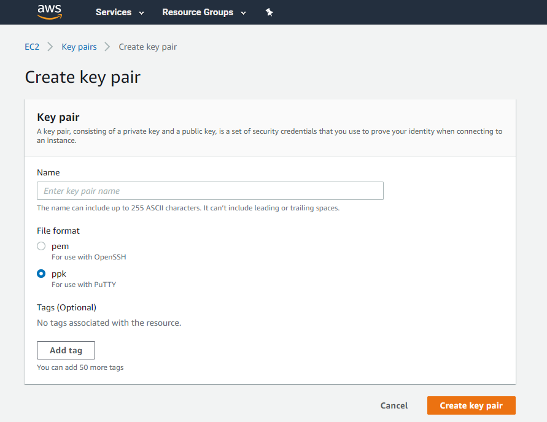

:::hint
AWS will automaticly download a .ppk file to your machine. Save this and it can be used later to SSH onto your running instances.
:::

### Create the AWS credentials

The first thing you need is an AWS Access key and Secret key. To get this log into the [AWS Management Console](https://aws.amazon.com/console/) and create an account using Identity and Access Management (IAM).  After the account has been created, click on the user, then **Security Credentials** to create an `Access Key`.

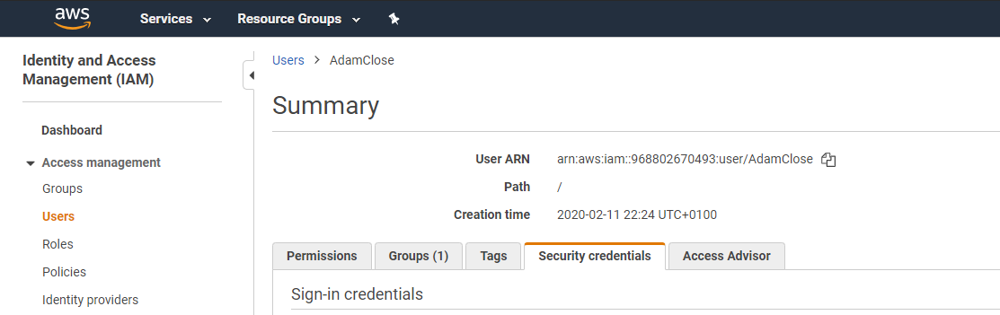

After the access key has been created, save the `Secret Key` as you will only be shown the value *once*.  The `Access Key` and `Secret Key` combination is used to authenticate with AWS.

### Create AWS Account

To deploy CloudFormation templates in Octopus you need to setup an AWS account.

Using your `Access Key` and `Secret Key` [create an AWS account in Octopus](https://octopus.com/docs/infrastructure/deployment-targets/aws#create-an-aws-account).

:::hint
It is possible to AWS IAM roles rather than the IAM credentials. If the Octopus server built in worker or external worker deploying the steps have an IAM role attached then it's possible to use the IAM role rather than the `Access Key` and `Secret Key`.
:::

## Create Octopus Project

Now we have all our resources created. We can go ahead and start configuring our Octopus Project and Runbooks to provision our infrastructure.

If you're new to Octopus and don't have any projects, you will need to create a new one, and you can find information on how to do this [here](https://octopus.com/docs/projects). If you have an existing project that you want to use, you can skip this step.   

### Create Project Variables

Before we start creating our Runbooks, it's handy to create some variables for values we need later on when adding steps to our Runbook process.

| Parameter  | Description | Example |
| ------------- | ------------- | ------------- |
| Project.Octopus.Thumbprint | Octopus Instance Thumbprint | 7F226XXXXXXXX |
| Project.Octopus.key | Octopus API Key | API-XXXXXXXX |
| Project.AWS.Account | Octopus AWS Account | MyAccount |
| Project.AWS.KeyPair | AWS Key Pair Name | MyKeyPairName |
| Project.AWS.Region | Name of AWS region| eu-west-2 |
| Project.AWS.StackName | Name cloudformaton stack| octopus-blog-random-quotes-#{Octopus.Environment.Name} |

## Create Runbooks

We need two Runbooks, one to spin up our infrastructure and another to tear it down. Inside our project, to create the Runbooks, navigate to **{{Project, Operations, Runbooks, Add Runbook}}**. Give the Runbook a suitable name. In my case, I'm going to call it **Spin Up Infrastructure**. Go back to the Runbooks screen and create a second Runbook call **Tear Down Infrastructure**

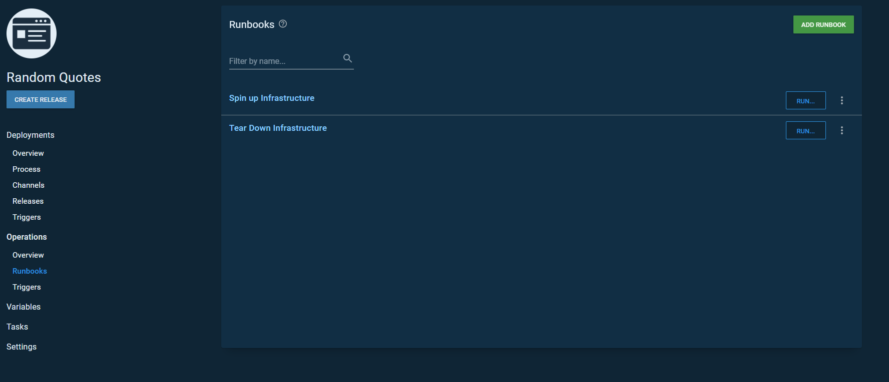


## Build the spin up infrastucture process 

In this section, we will start building out our Runbook process by adding Octopus built-in and community steps to provision our infrastructure.

### Step one Manaul Intervention

While it's great to provide self-service access to provisioning infrastructure, sometimes teams still need the ability to approve it. Octopus comes with a built-in step pause the Runbooks process to get approval from another team built into Octopus. 

Click on the Runbook and click **DEFINE YOUR RUNBOOK PROCESS** , Click **ADD STEP**, Search for **manual intervention**, click **Manual Intervention Required** from the list of installed step templates and click **ADD**.

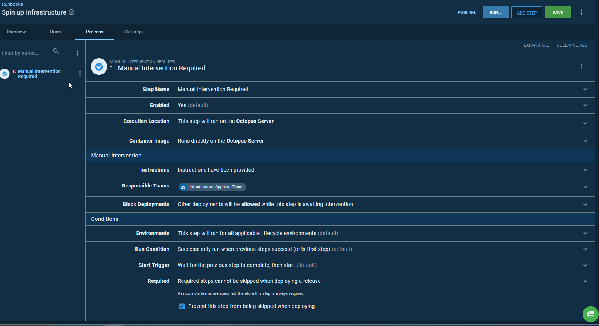


### Step two Deploy an AWS CloudFormation template

Next, we need to add a step to deploy our CloudFormation Template. Octopus has first-class support for AWS CloudFormation and has built-in steps to deploy, update and delete CloudFormation Stacks.

 Click **ADD STEP**, Search for **CloudFormation**, click **Deploy an AWS CloudFormation template** from the list of installed step templates and click **ADD**.

There are several feature settings to configure, and you can find information on each feature setting [here](https://octopus.com/docs/deployment-examples/aws-deployments/cloudformation).

You can use the AWS Account we created eariler in the AWS Account section.

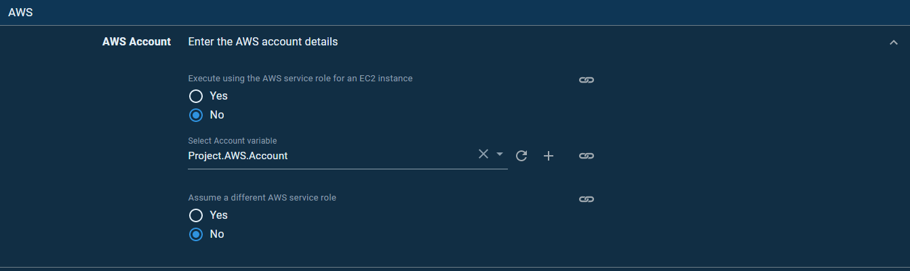

:::hint
It's possible to use [variable scoping](https://octopus.com/docs/projects/variables#scoping-variables) to using diffrent account when deploying to diffrent environments.
:::


Again you can use variables we created eailer to fill out the CloudFormation Template.

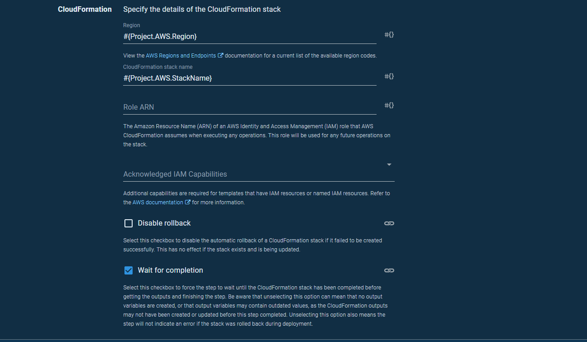

In the template section, you need a CloudFormation template that will provision resources in AWS. In this case, I have a template to deploy a Linux EC2 Instance that runs a bash script to install a listening tentacle. In the next step, we will register the tentacle in Octopus. 


```YAML

AWSTemplateFormatVersion: 2010-09-09
Parameters:
  InstanceTypeParameter:
    Type: String
    Default: t3a.medium
    Description: Enter instance size. Default is t3a.medium.
  WorkstationIp:
    Type: String
    Description: The IP address of the workstation that can SSH into the instance.
  AMI:
    Type: String
    Default: ami-08f3d892de259504d
    Description: The Linux AMI to use.
  Key:
    Type: String
    Description: The key used to access the instance.
Resources:
  VPC:
    Type: AWS::EC2::VPC
    Properties:
      CidrBlock: 10.0.0.0/16
      EnableDnsSupport: true
      EnableDnsHostnames: true
      InstanceTenancy: default
      Tags:
        - Key: Name
          Value: Linux VPC
  InternetGateway:
    Type: AWS::EC2::InternetGateway
  VPCGatewayAttachment:
    Type: AWS::EC2::VPCGatewayAttachment
    Properties:
      VpcId: !Ref VPC
      InternetGatewayId: !Ref InternetGateway
  SubnetA:
    Type: AWS::EC2::Subnet
    Properties:
      AvailabilityZone: us-east-1a
      VpcId: !Ref VPC
      CidrBlock: 10.0.0.0/24
      MapPublicIpOnLaunch: true
  RouteTable:
    Type: AWS::EC2::RouteTable
    Properties:
      VpcId: !Ref VPC
  InternetRoute:
    Type: AWS::EC2::Route
    DependsOn: InternetGateway
    Properties:
      DestinationCidrBlock: 0.0.0.0/0
      GatewayId: !Ref InternetGateway
      RouteTableId: !Ref RouteTable
  SubnetARouteTableAssociation:
    Type: AWS::EC2::SubnetRouteTableAssociation
    Properties:
      RouteTableId: !Ref RouteTable
      SubnetId: !Ref SubnetA
  InstanceSecurityGroup:
    Type: AWS::EC2::SecurityGroup
    Properties:
      GroupName: "Internet Group"
      GroupDescription: "SSH and web traffic in, all traffic out."
      VpcId: !Ref VPC
      SecurityGroupIngress:
        - IpProtocol: tcp
          FromPort: '10933'
          ToPort: '10933'
          CidrIp:  20.188.245.156/32
        - IpProtocol: tcp
          FromPort: '10933'
          ToPort: '10933'
          CidrIp:  52.147.25.42/32 
        - IpProtocol: tcp
          FromPort: '10933'
          ToPort: '10933'
          CidrIp:  52.147.31.180/32 
        - IpProtocol: tcp
          FromPort: '10933'
          ToPort: '10933'
          CidrIp:  20.188.244.132/32 
        - IpProtocol: tcp
          FromPort: '10933'
          ToPort: '10933'
          CidrIp:  52.147.25.94/32 
        - IpProtocol: tcp
          FromPort: '10933'
          ToPort: '10933'
          CidrIp:  52.147.25.173/32 
        - IpProtocol: tcp
          FromPort: '10933'
          ToPort: '10933'
          CidrIp:  20.188.245.171/32 
        - IpProtocol: tcp
          FromPort: '10933'
          ToPort: '10933'
          CidrIp:  20.188.245.7/32
        - IpProtocol: tcp
          FromPort: '10933'
          ToPort: '10933'
          CidrIp:  20.188.244.147/32
        - IpProtocol: tcp
          FromPort: '10933'
          ToPort: '10933'
          CidrIp:  20.188.244.240/32
        - IpProtocol: tcp
          FromPort: '22'
          ToPort: '22'
          CidrIp:  !Sub ${WorkstationIp}/32
      SecurityGroupEgress:
        - IpProtocol: -1
          CidrIp: 0.0.0.0/0
  ElasticIP:
    Type: AWS::EC2::EIP
    Properties:
      Domain: vpc
      InstanceId: !Ref Linux
  Linux:
    Type: 'AWS::EC2::Instance'
    Properties:
      SubnetId: !Ref SubnetA
      ImageId: !Ref AMI
      InstanceType:
        Ref: InstanceTypeParameter
      KeyName: !Ref Key
      SecurityGroupIds:
        - Ref: InstanceSecurityGroup
      BlockDeviceMappings:
        - DeviceName: /dev/xvda
          Ebs:
            VolumeSize: 250
      Tags:
        -
          Key: Appplication
          Value: Linux Server
        -
          Key: Domain
          Value: None
        -
          Key: Environment
          Value: Test
        -
          Key: LifeTime
          Value: Transient
        -
          Key: Name
          Value: Linux Server
        -
          Key: OS
          Value: Linux
        -
          Key: OwnerContact
          Value: "@adamclose"
        -
          Key: Purpose
          Value: Support Test Instance
        -
          Key: Source
          Value: CloudForation Script in Octopus Deploy
      UserData:
        Fn::Base64: |
          #cloud-boothook
          #!/bin/bash
            configFilePath="#{Project.LinuxTentacle.ConfigFilePath}"
            applicationPath="/home/Octopus/Applications/"
            thumbprint="#{AWS.Octopus.Thumbprint}"

            sudo apt-key adv --fetch-keys https://apt.octopus.com/public.key
            sudo add-apt-repository "deb https://apt.octopus.com/ stretch main"
            sudo apt-get update
            sudo apt-get install tentacle

            /opt/octopus/tentacle/Tentacle create-instance --config "$configFilePath"
            /opt/octopus/tentacle/Tentacle new-certificate --if-blank
            /opt/octopus/tentacle/Tentacle configure --reset-trust
            /opt/octopus/tentacle/Tentacle configure --trust "$thumbprint"
            /opt/octopus/tentacle/Tentacle configure --port 10933 --app "$applicationPath" --noListen False
            /opt/octopus/tentacle/Tentacle service --install --start                                     
            
            wget -q https://packages.microsoft.com/config/ubuntu/18.04/packages-microsoft-prod.deb -O packages-microsoft-prod.deb
            sudo dpkg -i packages-microsoft-prod.deb
            sudo add-apt-repository universe
            sudo apt-get update
            sudo apt-get -y install apt-transport-https
            sudo apt-get update
            sudo apt-get -y install dotnet-sdk-3.1
Outputs:
  PublicIp:
    Value:
      Fn::GetAtt:
        - Linux
        - PublicIp
    Description: Server's PublicIp Address
```

Any parameters you have in your CloudFormation template will be shown under the parameters section.

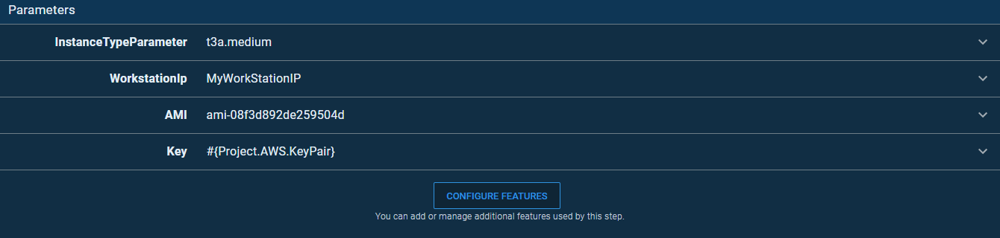

:::hint
You can find the AMI for linux and your region [here](https://docs.aws.amazon.com/AWSEC2/latest/UserGuide/finding-an-ami.html)
:::


## Build the tear-down infrastructure process 

We now need to define our Runbook process for our Tear down runbook. 

### Step one Manaul Intervention

Again we will use a manual interention to approve the Runbook run however I'm only going to have this step run for the production environment. The reason for this is so that someone doesn't accidently destory our production infrastcture and have an intervetion prevents that from happening.

When I add the step I can set a run condtion to only run for a particular environment and this case it will be production.

Click on the Runbook and click **DEFINE YOUR RUNBOOK PROCESS** , Click **ADD STEP**, Search for **manual intervention**, click **Manual Intervention Required** from the list of installed step templates and click **ADD**.

In the condtions environment section, click **Run only for specific environments** and choose production.

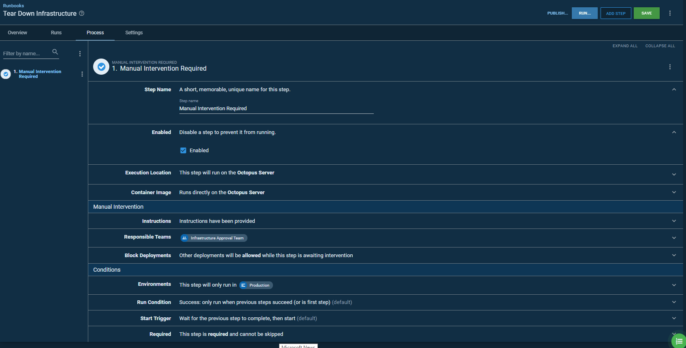


### Step two Delete CloudFormation Template

 Click **ADD STEP**, Search for **CloudFormation**, click **Delete an AWS CloudFormation template** from the list of installed step templates and click **ADD**.

The steps requires you to fill in the CloudFormation stack name and you can use the same variable we used when deploying the stack.


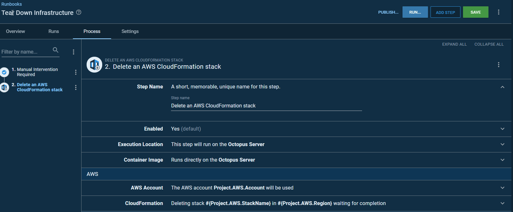


### Step three Delete Octopus Target

Now that the resources are deleted in AWS we need to delete the target from Octopus. 

 Click **ADD STEP**, Search for **delete target**, click **Delete Target or Worker Registration From Octopus** from the list of installed step templates and click **ADD**.

 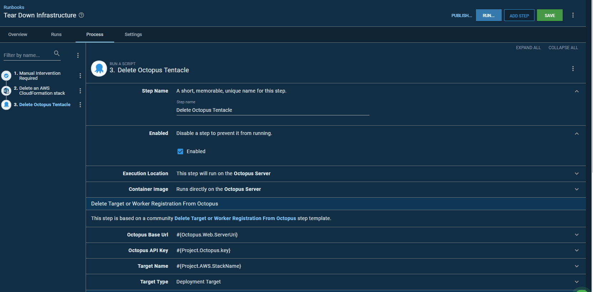

## Publishing our Runbooks

The concept of a published snapshot is designed to help avoid confusion when selecting a version of the runbook you're supposed to run if you're not the author. You can think of it as the "Production" ready version of the runbook, which has been approved for general use.

Publishing makes a runbook available to scheduled triggers and consumers (anyone with an appropriately scoped RunbookRun permission, but without the RunbookEdit permission). Triggers and consumers will always execute the published snapshot.

The published snapshot contains the process, variables, and packages. This allows editing and testing the runbook without impacting the published version.

To publish a snapshot, click the publish button on the task page after executing a runbook, or click publish on the runbook's process page.

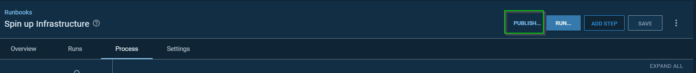

## Tear down on a scheduled trigger

Often, when people create infrastructure, it can be forgotten about, leading to some pretty hefty bills from their cloud provider. Having a Runbook to automate the teardown of development and testing infrastructure is excellent, but if you forget to run it, it's still going to run up costs with your cloud provider. 

In Octopus, you can schedule runs of your runbook and to ensure infrastructure is powered down when it's not needed. For example, if your test team only work 9AM to 5PM, then typically their infrastructure isn't needed outside those hours.


:::warning
Runbooks are only available to triggers when they have been published.
:::

To setup a trigger navigate to **{{Project, Operations, Runbooks, Triggers}}** and click **ADD SCHEDULED TRIGGER** 

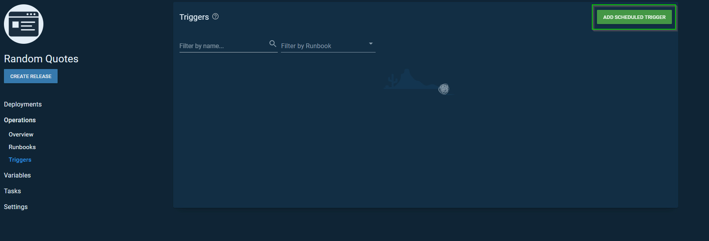

You can then custimize the trigger to run your Runbook.

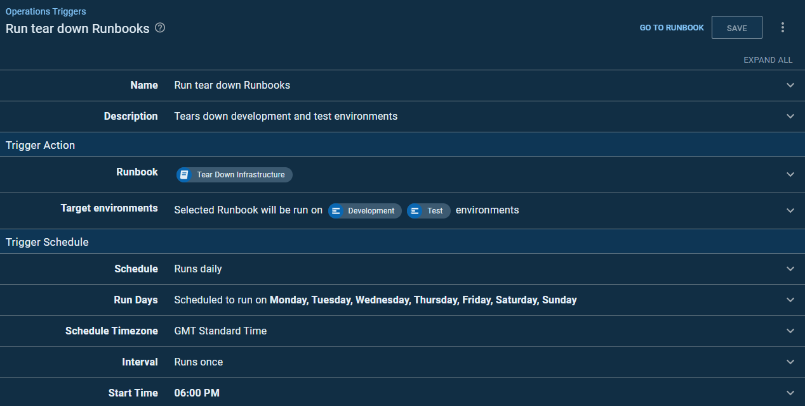

## Conclusion 

In this blog post, I showed you how to use runbook automation in Octopus to provision and tear down infrastructure in AWS. We added addtional 