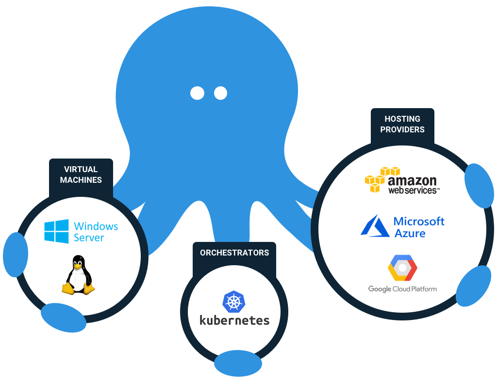
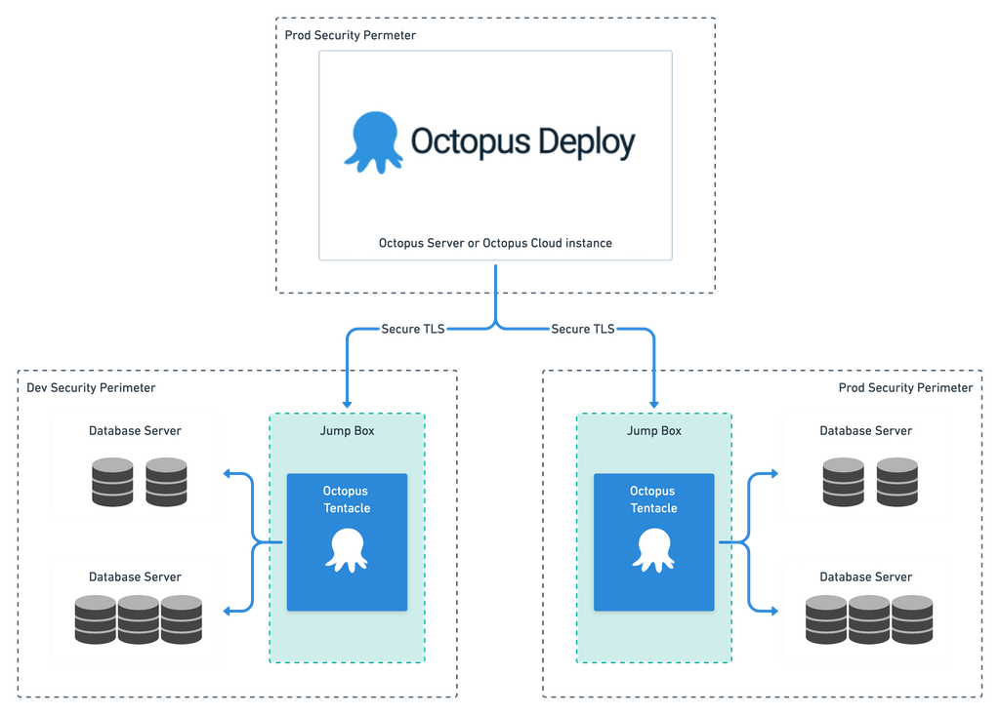

It’s been decided: your company is going to start using Octopus Deploy for database deployments.

Perhaps you were on board with the idea, perhaps not, but that ship has sailed. A tsunami of frequent releases is heading towards your database, and it’s your job to ensure that data is stowed safely and to avoid a breach.

In this post, I’m going to address the data guardians directly and explain what they need to know to ensure the data is safe. My hope is that while those data guardians may have initially read this title and imagined Octopus Deploy as a threatening monster hellbent on attacking their data, by the end of this post, they will instead imagine the kraken as a powerful yet faithful servant, vigilantly protecting their treasured data and using its awesome power to unlock previously unimagined riches.

## Before we start: Breathe. Everything is going to be OK.

The primary objective of Octopus Deploy is to make deployments easier, more reliable, and more secure. By using Octopus Deploy to make changes, you get a few significant security benefits:

1. **More reliable deployments:** Many deployments fail due to human error. When folks switch to automated deployments, most see an order of magnitude improvement to change failure rates and “Mean Time To Recovery” (MTTR).
1. **Lock down production:** When regular deployments are going through Octopus, it may well be possible to conduct a cull of production database users. 
1. **Separation of duties:** If separation of duties is important for you, you can configure your Octopus Deploy users so that it is impossible (for example) for the same user to create a release and deploy it to production, or for any production deployment to be executed without an audited approval from a specific group or person. Before going down this road, please read [Change Advisory Boards Don’t Work](https://octopus.com/blog/change-advisory-boards-dont-work).
1. **Audit:** Every task completed by Octopus Deploy is effectively version controlled and logged. Auditors love this.

That said, any tool is only as good as the person using it. Octopus Deploy is a powerful beast, but it will be most effective when its handlers understand it and control its power effectively.

Dear data guardian, whether you are a DBA, Developer, Architect, SysAdmin, CISO, DPO, or otherwise, if you understand your data and have a passion for keeping it safe, you want to take an active role in understanding how Octopus Deploy is configured and secured. You are likely to be uniquely qualified to keep Octopus Deploy honest by reviewing implementation/security plans and ensuring that important checks are conducted as part of the pipeline, possibly manually to begin with, but ideally automatically in the long run.

As the data guardian, you understand more than anyone why deployments fail and how your data can be compromised. Your team needs your expertise to ensure those mistakes are avoided, not just within a single deployment but every deployment.

## Step 1: Understand how Octopus Deploy works

In order to contribute to the safe implementation of Octopus Deploy, it’s important to first understand how it works – with a special focus on security.

Octopus Deploy gets its name because its architecture resembles that of an octopus, with a “Server” at the center, which sends packages and deployment scripts to various targets where files are deployed and commands are executed.

Octopus users can interact with the server through the Octopus Web Portal or with scripts, typically using PowerShell, a [REST API](https://octopus.com/blog/change-advisory-boards-dont-work) or the [Octopus CLI](https://octopus.com/docs/octopus-rest-api/octopus-cli).
 

There are various types of [deployment targets](https://octopus.com/docs/infrastructure/deployment-targets). The most common is an Octopus “Tentacle” (or Agent), which is a service that runs on a target Machine. For example, on a server, VM, or container, etc. Tentacles can run on [Windows](https://octopus.com/docs/infrastructure/deployment-targets/windows-targets) or [Linux](https://octopus.com/docs/infrastructure/deployment-targets/linux/tentacle) on your own infrastructure or your preferred cloud provider.

The communication between the Octopus Server and Tentacle uses a secure TLS connection on a specific port, using public-key cryptography. [More detail available here](https://octopus.com/docs/security/octopus-tentacle-communication). This avoids the need to use passwords. As long as the private keys are kept safe, it should be impossible for another system to impersonate either the Server or Tentacle.

The Octopus Server probably lives outside your production security perimeter because it is likely to also be responsible for deployments to lower environments (Dev, Test, etc.). More information about where to [install your Octopus Server can be found here](https://octopus.com/docs/security/exposing-octopus).

However, the Tentacles need to live within the security perimeter of each environment (Dev, Test, Prod) so that they can communicate freely with your target database(s); you will probably need to set a firewall rule on a specific port to allow traffic between the Octopus Server and the Octopus Tentacle(s).

If at any time you are concerned that the security of your Server or Agent has been compromised, you can cut off the communication between them by deleting the firewall rule.

The Octopus Deploy Server also needs its own SQL Server database. This database should be considered a production database, and it should be administered as you would any other production database that contains critical administration data. Learn more about the [Octopus database](https://octopus.com/docs/administration/data/octopus-database).

Most of the Octopus Deploy configuration data is stored in the Octopus Deploy database in plain text, but sensitive data is [encrypted using a “Master Key”](https://octopus.com/docs/security/data-encryption), which is available on the Octopus Deploy Server itself. It's impossible to restore backups of the Octopus Deploy backup without this master key, so it’s important to:

- Save the master key in a secure password manager in case your Octopus Server dies.
- Manage who has access to the Octopus Deploy database as if it is one of your production databases.
- Strictly manage access to the machine that the Octopus Deploy software is running on since this is where the master key is stored. Note, this is different from managing who is registered as a regular Octopus Deploy user and can access the Web Portal.

## Step 2: Use jump-boxes

For most stuff, folks tend to install the Tentacle on the server that’s hosting your stuff. This makes the transferring of files and the execution of scripts much simpler, which is ideal for deploying web applications. However, for databases, it’s common to use “jump-boxes”. A jump-box is a separate machine that lives close to your target database and has all the necessary tooling installed to execute the deployment.

Jump-boxes are useful for database deployments because database deployments are typically driven by executing deployment scripts, rather than copying files. Since those deployment scripts don’t need to be executed from the database server itself, there isn’t an advantage to running the Tentacles on the database servers. In contrast, there are some benefits to using jump-boxes:

1. **An extra layer of security:** The user that the Tentacle runs as on the jump-box will need access to run scripts against the target database in order to execute the deployment. However, by using a jump-box, none of the Octopus components (Server or Tentacle) need any access to the database server’s host machine. This allows DB admins more granularity with the permissions they grant to Octopus Deploy, and it allows admins to revoke that access with a simple setting on the database server itself, without needing to deal with firewalls or Octopus directly.
1. **Improved database performance and protection:** Complicated, risky or resource intensive operations (such as schema comparisons) can be executed on the jump-box, rather than the database server. This avoids hogging system resources on the database host server and protects the database from failures. If something goes wrong, it’s much better to crash the jump-box than the database server!

You will need to grant access for the Tentacle to update your databases. Typically, this is done by creating an “octopus” user (or similar) that has the appropriate credentials to deploy your databases. For SQL Server, running on Windows, this would probably be an Active Directory user with `db_owner` permissions against the appropriate target databases, and it would authenticate using Windows Authentication. However, if you can get away with fewer permissions for your use case, great.

The whole process might look like this:

 
## Step 3: Lock it down

I mentioned earlier that the Octopus Deploy Server probably lives outside your production security perimeter, but the eagle-eyed reader will have noticed that the diagram above lists it within its own “PROD” security perimeter. The Octopus Server needs to be able to deploy to all environments, so it cannot live wholly within just one. However, since it can be used to update production it should also be considered a production asset and secured as such.

This raises a couple of points that need to be addressed.

- **Octopus Deploy is neither solely a “Dev tool” nor solely an “Ops tool”**
  DevOps, by definition, is about the collaboration between different functional groups. It’s about “optimizing for the whole”, rather than any specific functional silo, making it necessary for this blog post’s hero, the data guardian, to take an active role in the security of the Octopus Deploy Server, and to collaborate with folks who they might not often work closely with to ensure that it’s set up to be both secure and practical for folks to make regular deployments.
- **The push for over-isolation of environments is a harmful and immature symptom of [Zero-Risk Bias](https://en.wikipedia.org/wiki/Zero-risk_bias)**
  While isolating your environments from each other is undoubtedly a wise security step, sometimes over-zealous security folks make the mistake of denying the Server/Tentacle communication over the firewall. This makes it impossible to transfer and execute a consistent set of deployment resources to each environment. This leads to inconsistency, headaches, and failures. It also makes it much more likely that deployments will be handled manually by individuals who have the appropriate access to the isolated environments, increasing the risk of human error and creating deployment bottlenecks and delays. Rather than seeing the uniform deployment service as a risk factor, it should be seen as a risk mitigator.

You will need to manage who has the rights to make those changes using the Octopus Deploy [Users and Roles functionality](https://octopus.com/docs/security/users-and-teams/user-roles). These roles can be [mapped to Active Directory user accounts and groups](https://octopus.com/docs/security/authentication/active-directory#:~:text=Octopus%20Deploy%20can%20use%20Windows,or%20can%20be%20configured%20later.&text=When%20you%20go%20through%20the,Windows%20as%20a%20domain%20user.). For example, you could configure it so that different users are granted permissions to deploy to different environments, enforcing separation of duty.

While in some ways, Octopus is opening doors and allowing new people to make changes to your databases in new ways, it also provides an opportunity to close doors. Once all or most deployments are going through Octopus Deploy, there should be far less need for folks to have direct access to the production database. A common step in the roll-out of Octopus Deploy is to perform a massive cull of users on production.

This is a trade-off. On the one hand, we are granting users more freedom to deploy in smaller iterations, as long as all changes have been through the automated tests, and they have been successfully deployed to lower environments. What’s more, all deployments are audited, and failures will ring alarm bells. On the other hand, we are revoking the permissions for folks to log on to the servers directly, in an uncontrolled fashion, with the ability to run whatever SQL they’ve managed to hack together.

We are creating an environment where the “lazy path” for developers is to do the right things rather than the wrong things. The new world is much safer than the old.

## Step 4: Understand the deployment process

Octopus Deploy does not have the smarts to deploy databases out of the box. Instead, Octopus Deploy acts as an orchestrator, transferring all the required files to the jump-box and running whatever commands are required to instruct your preferred database deployment tool to perform the database update.

There are several tools and techniques that you can use to perform the deployment. Back in March [I reviewed the most popular options among Octopus Deploy users for deploying SQL Server databases](https://octopus.com/blog/sql-server-deployment-options-for-octopus-deploy). For SQL Server there are a selection of Microsoft, third-party, and open source options that can generally be categorized as “migrations-based” or “model-based” solutions.

Whichever tool you use, it’s likely that you’ll either want to pre-install your database tooling on the jump-box or that you’ll want to automate the install/update as part of the deployment process. Pre-installing the tools might be easier in the short term and can speed up your deployments, but it also comes with an administrative overhead and makes your deployment process less portable. For that reason, I generally advocate for installing and updating whatever database deployment tools you are using as part of the deployment or on a regular schedule using an [Octopus Runbook](https://octopus.com/docs/runbooks). Note, this may well require some level of Internet access on the jump-box.

If you often need to deploy to multiple databases at the same time within a single environment, you might want to consider using [workers](https://octopus.com/docs/infrastructure/workers) for your jump-boxes. For example, if you run many copies of the production database within the same security perimeter, you might find it beneficial to have a pool of workers within each environment. This allows for the efficient scaling out of database deployments across multiple deployment jump-boxes. However, in this scenario, each jump-box requires access to each target database.

## Step 5: Reviewing deployments

Last month, I told a story about a DBA who got the blame whenever problems occurred with the production database. In order to keep it running, the DBA wanted to be consulted about each deployment. Since this turned the DBA into a bottleneck, the “rock star” developers grew frustrated with the slow process and tried to sneak around the DBA. At the same time the developers weren’t interested in “DBA stuff”, and they lacked the DBAs knowledge and experience.

It was a train wreck. But it’s a train wreck that a lot of folks recognize. Many of us have either been that DBA or that “rock star” developer at some point in our past.

The fact is, when folks start performing manual approvals and eyeballing scripts on a regular basis, they will find that most of the time, they are simply working through a mental checklist of tests and checks. For example, [check out the responses to this tweet](https://twitter.com/_AlexYates_/status/1298940180418752512).

I also encourage you to listen to [Jeffery Smith talking about Change Management Anti-Patterns with Corey Quinn earlier this year on Screaming in the Cloud](https://www.lastweekinaws.com/podcast/screaming-in-the-cloud/overcoming-change-management-anti-patterns-through-automation-with-jeffery-smith/) where he describes the manual change review process as a mental playbook (6:30-9:30) that is probably easier to automate than you think. This prompts an excellent debate with the snarky host!

After you’ve explored the twitter responses or listened to Jeffery and Corey “fight” about DevOps, [have a read of Bob Walker’s March blog post about automating approvals](https://octopus.com/blog/autoapprove-database-deployments). Many of the things that data guardians tend to be looking for (such as the word “DROP”, “TRUNCATE”, “CURSOR”, “NOLOCK”, or the ability to successfully roll the deployment back) could be checked and verified automatically (by performing dry runs or code analysis within the deployment pipeline). If any of those checks fail, the automated process could either be set to fail or to request a manual review.

This approach is simultaneously a more reliable way of consistently catching those common issues and a more efficient route to production for daily changes. It might also prove an efficient way of teaching the developers about the sorts of things that are safe to deploy and the sorts of things that are dangerous.

This approach is actually better aligned with ITIL than many ITIL practitioners would care to admit. ITIL differentiates between “standard” and “normal” changes, with significant review efforts spent on “normal” changes. “Standard” changes, in contrast, are considered routine and get to bypass the bureaucracy. The ITIL framework recognizes that “normal” changes have a significant overhead and advocates for measures that can reduce the risk for particular types of changes so that they can be reclassified as “standard” changes. That’s exactly what we are trying to achieve.

However, it takes the expertise of the data guardians to do this effectively. Consider this a call to arms to all data guardians to stop thinking about manually eyeballing every individual deployment and to start thinking about how to more efficiently and more thoroughly validate *ALL* deployments. This will save you time in the long run, which you can dedicate to adding more tests to your deployment pipeline, further hardening it, or conducting more thorough manual reviews of the riskiest deployments.

## A case study: A reason for hope 
I’d like to finish with a case study to demonstrate the relative safety of automated database deployments and cross-functional collaboration.

Back in 2017, Farm Credit Mid-America were looking for improved governance and stability with their database deployments. I worked with a cross-functional team that included (from left to right) a DBA, DevOps Engineer, Data Architect, and .NET Dev Lead.
 

Within a week, we produced three separate proof of concepts, each using Octopus Deploy and a different deployment tool running on the jump-box. The team had unanimously agreed on their preferred option, and we created a plan to roll it out. We even managed to get our proposal (which included a not insignificant financial investment) approved by a frugal senior leadership committee. One significant reason why this approval was granted was that folks from different silos, who often disagreed, were united and enthusiastic that the solution would benefit everyone.

A few months later, one of the initially more skeptical team members sent me the following progress report. Given their error rates and governance issues before Octopus, the 100% successful deployment record through the pipeline, combined with the significantly improved collaboration and productivity benefits, stands out as one of the single most satisfying achievements of my career.

A well-trained kraken makes a powerful ally.

*“In September 2017, as part of a wider DevOps transformation, DLM Consultants ran a Database Lifecycle Management (DLM) Health Check with us where we tested out three database source control and deployment proof of concept (POC) solutions that would enable us to deliver database updates more regularly and more reliably. This made it easy for us to select the best strategy for our databases. Over the following months DLM Consultants helped us to roll it out.*

*It’s now working really well and delivering enormous value for us. We now deploy our database updates at the click of a button and we’ve not had a single failed deployment through the new process.*

*Our implementation of DLM ranks as the most beneficial infrastructure project that I’ve witnessed in my 26-year IT career. Database deployments no longer represent a bottleneck in our software delivery process. The process improvements realized by this technology touch all team members. Developers, QAs & DBAs communicate as releases move through the pipeline. DLM makes us more productive.”*

**Steve Cornwell**, *Enterprise Database Developer at Farm Credit Mid-America, ex-Microsoft employee.*

---

To learn more about DLM Consultants’ DLM Health Check: [https://dlmconsultants.com/dlm-health-check/](https://dlmconsultants.com/dlm-health-check/)
To learn more about security in Octopus Deploy: [https://octopus.com/docs/security](https://octopus.com/docs/security)

---

Alex Yates has been helping organisations to apply DevOps principles to their data since 2010. He’s most proud of helping Skyscanner develop the ability to  [deploy 95 times a day](https://www.youtube.com/watch?v=sNsPnCv7hHo) and for supporting the United Nations Office for Project Services with their release processes. Alex has worked with clients on every continent except Antarctica – so he’s keen to meet anyone who researches penguins.
 
A keen community member, he co-organises [Data Relay](https://datarelay.co.uk/), is the founder of [www.SpeakingMentors.com](http://www.speakingmentors.com/) and has been recognised as a  [Microsoft Data Platform MVP](https://mvp.microsoft.com/en-us/PublicProfile/5002655?fullName=Alex%20Yates) since 2017.
 
Alex is the founder of [DLM Consultants](https://dlmconsultants.com/), an official Octopus Deploy partner. He enjoys mentoring, coaching, training and consulting with customers who want to achieve better business outcomes through improved IT and database delivery practices.
 
If you would like to work with Alex, email: [enquiries@dlmconsultants.com](mailto:enquiries@dlmconsultants.com) 