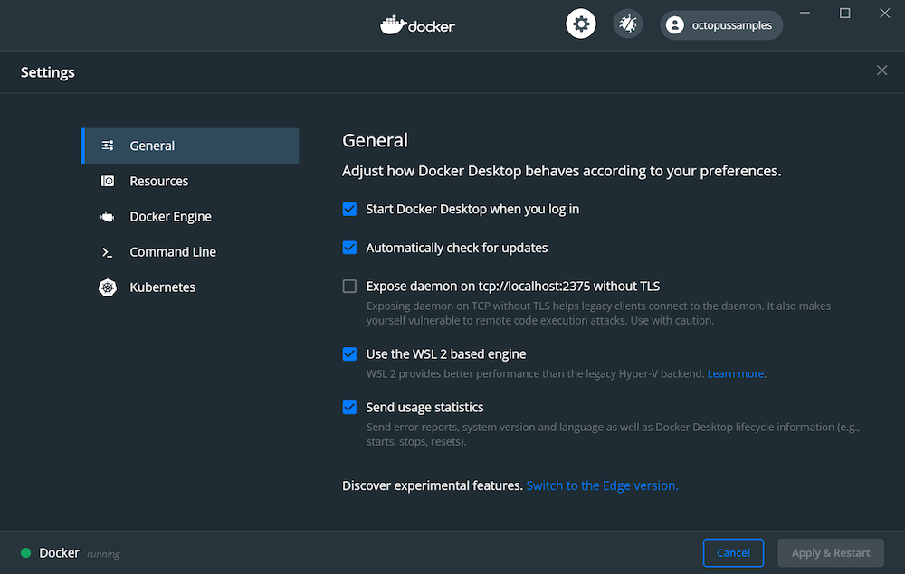
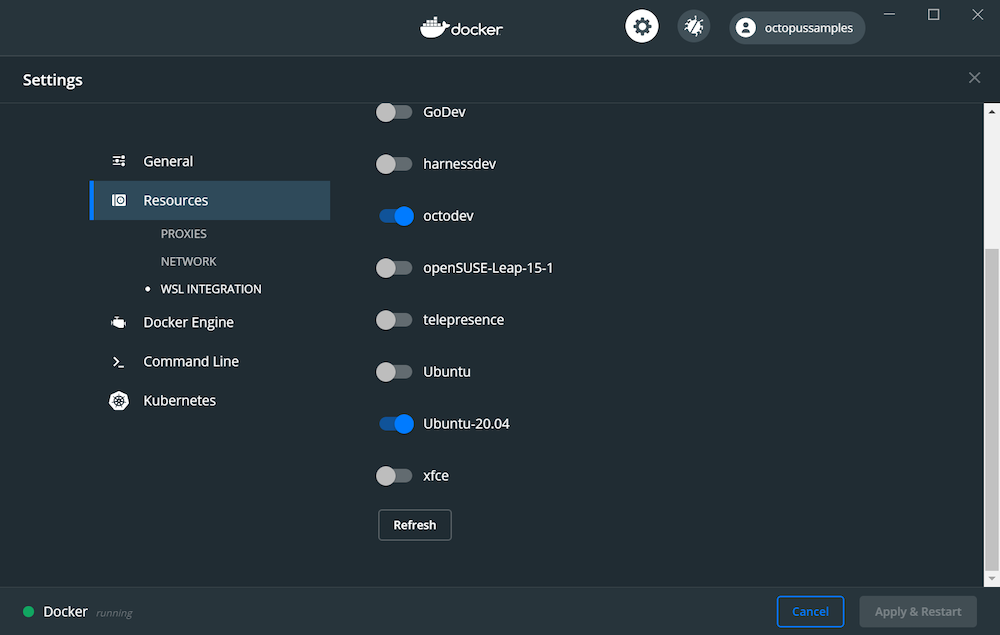
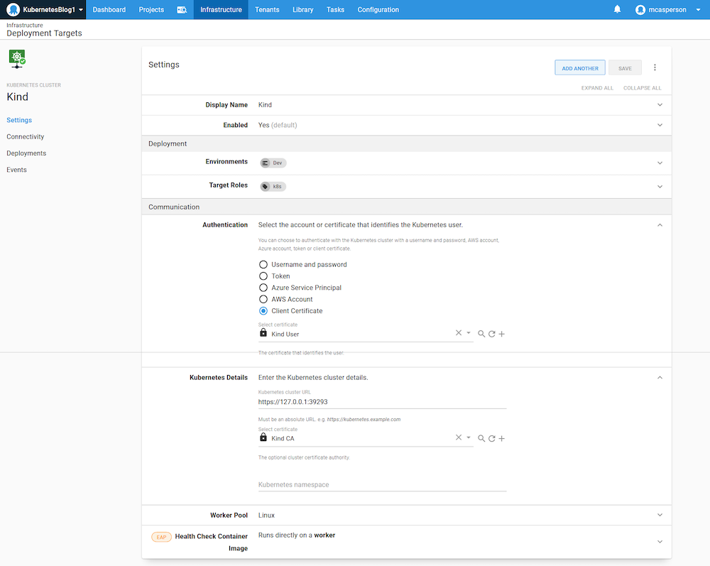
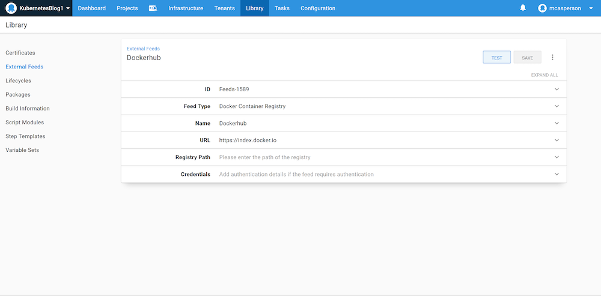
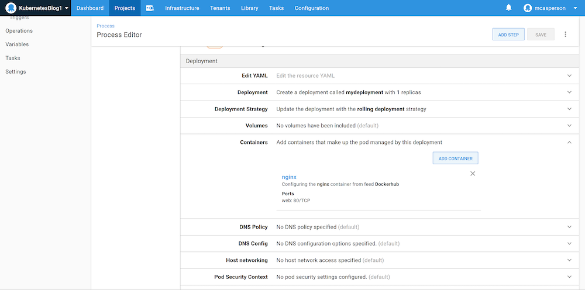
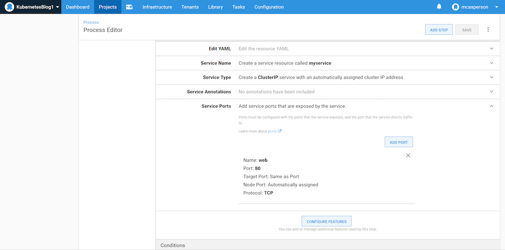
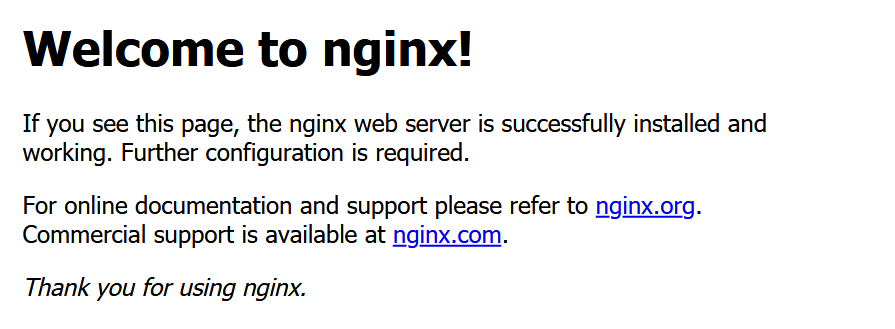

Getting started with Kubernetes can be a little overwhelming. With so many tools like [Minikube](https://kubernetes.io/docs/tasks/tools/install-minikube/), [K3s](https://k3s.io/), [Docker Desktop](https://docs.docker.com/docker-for-windows/kubernetes/), [MicroK8s](https://microk8s.io/), and [Kind](https://kind.sigs.k8s.io/), even knowing which test distribution to use is not an easy choice.

For local development, I find myself using Kind. It is quick to boot and integrates well with WSL2 allowing me to quickly switch between Windows and Linux development.

In this blog post and the associated screencast, I show you how to quickly get up and running with a local development Kubernetes cluster using Kind and a hosted instance of Octopus.

## Screencast

The video below demonstrates the process of deploying a web application to a development Kubernetes cluster created by Kind. The remainder of the post provides links to additional resources and copies of the scripts used in this demo:

<iframe width="560" height="315" src="https://www.youtube.com/embed/sMt2-enODC0" frameborder="0" allow="accelerometer; autoplay; clipboard-write; encrypted-media; gyroscope; picture-in-picture" allowfullscreen></iframe>

## Enable WSL2 Docker integration

To use Kind from a WSL2 instance, Docker Desktop needs to enable WSL2 integration. This is done by selecting the **Use the WSL2 based engine** option:



Docker is then exposed in the target WSL2 instances:



## Install Kind

Kind is a self-contained Linux executable that is downloaded and placed into the PATH for easy access. The [Kind quick start docs](https://kind.sigs.k8s.io/docs/user/quick-start/) provide instructions on installing Kind, which in my WSL2 Ubuntu instance was achieved by running:

```
curl -Lo ./kind https://kind.sigs.k8s.io/dl/v0.8.1/kind-linux-amd64
chmod +x ./kind
sudo mv ./kind /usr/local/bin
```

:::hint
The Kind documentation has links to the latest release, which will likely have been updated from the URL above.
:::

## Creating the cluster

A new development cluster is created with the command:

```
kind create cluster
```

This cluster is then made accessible with the configuration stored in the `~/.kube/config` file, created by Kind when the cluster was created. An example of this file is shown below:

```yaml
apiVersion: v1
clusters:
- cluster:
    certificate-authority-data: LS0tLS1CRUdJTiBDRVJUSUZJQ0FURS0tLS0tCk1JSUN5RENDQWJDZ0F3SUJBZ0lCQURBTkJna3Foa2lHOXcwQkFRc0ZBREFWTVJNd0VRWURWUVFERXdwcmRXSmwKY201bGRHVnpNQjRYRFRJd01Ea3hOREF4TXpBd04xb1hEVE13TURreE1qQXhNekF3TjFvd0ZURVRNQkVHQTFVRQpBeE1LYTNWaVpYSnVaWFJsY3pDQ0FTSXdEUVlKS29aSWh2Y05BUUVCQlFBRGdnRVBBRENDQVFvQ2dnRUJBS0xPCmV3Y3BBbThwNzB1UnBLSDBJV0Zod043MFJTNTZDTTVXd2xGR0d4YmZaZ0s4endiQmY4aWRzUS9hK1lHK1RWR3gKazBQZDdma0NIVG9yU1I5ajlhSEZLQVlpN3VDbkJoVGVmNjgxVHBJWFBtU3lqUFVpbkxrSG4yRXVNNitESWRTVwpMd2ExaUNwVVVqc0pTOTZ6UnViM2dOdHdvUndCZEo0d3J3SitYUm95VFpIREhtalZkZFJ5Qk1YRGN3dzNNS1BRCmFaRzA0dUtwRlRNeEgyakNrQm9sMW9zNTByRWJrdXY2TVhTVGdvbEpzMEVsSTZXckVpNk00cXdGRWFDWmpBcisKcmtyZUZvdDdXeVpPc3N1Rk91azk4ZS9sb0tvMmtOMVhwcVZKSk55c3FRbmNqRHIzV044VHowZTJOWjZndm9ZWgpNc1RsbTJCTFFqUnFRTllqU3FrQ0F3RUFBYU1qTUNFd0RnWURWUjBQQVFIL0JBUURBZ0trTUE4R0ExVWRFd0VCCi93UUZNQU1CQWY4d0RRWUpLb1pJaHZjTkFRRUxCUUFEZ2dFQkFFSkNzUTg4Rk5MdjJPc0h5Zk96elFPSzdzRVUKVU5jVDhLa3EvbWE2SjkrSWsxY0ZpOHdhdnFZdi93SkNMS2xPc1FML3FUZ2tQSldlb05NV0YwYitMYU5INnUxTgp4NDF2aGNzYjI5Nks0d3orUi9uQzBZWkd1VStSMzFCaHRaS3p2ckI2L1dCSGZLSkYxVlQxOExxcTFvMkRKM1paCno0a1d2UGdEeEc3UjU1eGVTcWkxc2pZWDJmSnRpajNBREhBSGRwRmN4TldUVmNJVm4zMzJNczlCcEtBK1kxbkcKb1pXeXd5Rm8xektDdmNZeEltU2FabXYzTmpiQytlU0VrU1RrdjFCTmt6Z0lMVWtrbUNFOFdWMXMvWDVmN3V3eApNR1d4YVVMWDRvRFJ5Z1FCaitvL09Eb0lTQU5HZDRUWXFxcHVBS29IdC9jZ1VPSWl6NkNzdGp1dElWVT0KLS0tLS1FTkQgQ0VSVElGSUNBVEUtLS0tLQo=
    server: https://127.0.0.1:39293
  name: kind-kind
contexts:
- context:
    cluster: kind-kind
    user: kind-kind
  name: kind-kind
current-context: kind-kind
kind: Config
preferences: {}
users:
- name: kind-kind
  user:
    client-certificate-data: LS0tLS1CRUdJTiBDRVJUSUZJQ0FURS0tLS0tCk1JSUM4akNDQWRxZ0F3SUJBZ0lJUzViczdNb0pEbmt3RFFZSktvWklodmNOQVFFTEJRQXdGVEVUTUJFR0ExVUUKQXhNS2EzVmlaWEp1WlhSbGN6QWVGdzB5TURBNU1UUXdNVE13TURkYUZ3MHlNVEE1TVRRd01UTXdNVEZhTURReApGekFWQmdOVkJBb1REbk41YzNSbGJUcHRZWE4wWlhKek1Sa3dGd1lEVlFRREV4QnJkV0psY201bGRHVnpMV0ZrCmJXbHVNSUlCSWpBTkJna3Foa2lHOXcwQkFRRUZBQU9DQVE4QU1JSUJDZ0tDQVFFQW5xM0VDSFYwc0RmOXJIQnUKS09jelQ4L2pmcVkrbzU5Rm5MZWJZNUFRQVBLeWhCVm1vR3ZTaUVQSzhYUm5EMjA1dWFiTlBteFVLQmhBVFBjcApobXpFa2pVNjAwQkVCcnN6ZDJ6KzlmalUxQlFrUU9vL0ljSkM5YnBwdXhvbnNxVjhvWmY3L0R2OUpGamVIOTU3CkdDR1FsWXBwM2trb1kzc2VVaG9wOFY5SzJrYzJGa2srZjVpRXpIUFdiZkNsYTRpK01scVVxU21iakVYUGlvWnQKYUprMWxQbExLMVRZWER3QjI2N2ZYWnhsZU9Vcm5uem51Y0hJQTBLYjlnRFE5K25STFBWYm5yOU1wM2IzVG5RdwpKbno3bGpvclE2Y1htQmJ5b293dXZMTzZqMkpNcjhYOFZSUlgzMCtFOWNkVXpCSXRySUkyK0krekF6a3FsTWl3CllkUlVMd0lEQVFBQm95Y3dKVEFPQmdOVkhROEJBZjhFQkFNQ0JhQXdFd1lEVlIwbEJBd3dDZ1lJS3dZQkJRVUgKQXdJd0RRWUpLb1pJaHZjTkFRRUxCUUFEZ2dFQkFGRGI1Q0thV0ZEc2RlV0xBS2plT0MyL0xlRnhYbUNzL2JuYgoxcGxIc0Z1Vmc0U3FlVmFVTGlidkR2bkd3Q3pEbUJuWFovNkxqUDhrWW9Wa3pobkYvS0paLys1dzJTelhEYzVECnFRaHhhWWlaclRQUlBsVmxpWWxTRy9XS3dlMTRxTEMvY01Ed1AxYU9aRXVPQ1huVnFZN1IwVlRydVJYTFREbW8KRjRVWHBicmw0R0t5V04zUWo3eXBKWkVqenFYeVJJWHJwNVpyQjF1WDQ0RzVqeUlEYXpIZXNRdk1mQnlPYTBHSgpMbUMvWDR1dFRaUEk1VTZRQWdjNzdaVGNoNkVUSXVjLzNZT3N5c1JHZWZXNUhpVFBESjFhNWQ3TkViT09HQ1N5CkN0UStiL2ljbGtHTHBDbmltb0RUdkp4QzNrSjNTZjJJKzlGQ1F2V0NzWU0vYnpZOWxHYz0KLS0tLS1FTkQgQ0VSVElGSUNBVEUtLS0tLQo=
    client-key-data: LS0tLS1CRUdJTiBSU0EgUFJJVkFURSBLRVktLS0tLQpNSUlFb3dJQkFBS0NBUUVBbnEzRUNIVjBzRGY5ckhCdUtPY3pUOC9qZnFZK281OUZuTGViWTVBUUFQS3loQlZtCm9HdlNpRVBLOFhSbkQyMDV1YWJOUG14VUtCaEFUUGNwaG16RWtqVTYwMEJFQnJzemQyeis5ZmpVMUJRa1FPby8KSWNKQzlicHB1eG9uc3FWOG9aZjcvRHY5SkZqZUg5NTdHQ0dRbFlwcDNra29ZM3NlVWhvcDhWOUsya2MyRmtrKwpmNWlFekhQV2JmQ2xhNGkrTWxxVXFTbWJqRVhQaW9adGFKazFsUGxMSzFUWVhEd0IyNjdmWFp4bGVPVXJubnpuCnVjSElBMEtiOWdEUTkrblJMUFZibnI5TXAzYjNUblF3Sm56N2xqb3JRNmNYbUJieW9vd3V2TE82ajJKTXI4WDgKVlJSWDMwK0U5Y2RVekJJdHJJSTIrSSt6QXprcWxNaXdZZFJVTHdJREFRQUJBb0lCQUFlQ0YxMkRHVU5oVXRwKwo4MmR5RVNaOG9yb1NhYkphVGZQdGFDZmM0RFQ3UnVFakZoa1BJUVlibHhXM3VVeXNrV2VzY2RlN1Rud2JNYWV5CnBqOWJGQzRLNEw2d01zZlN3Y3VyMTZDUjVwZ21YOVRHZ0xnN05lbmtxUzRXUGJ5aFFmVnZlSmZseXNPV2hPUWoKSmRYdGVLYnF4cm1pNG90YWZ3UEpneVNOcXNBTFBYblFDRzZMTnRBdWJrTXA0Qm94dE82MVBCZkN1QzlUZ3BpMQovVkIzTTdTQnJWcW4wUTkySzVzNWpvRnlSZ2dUMlRaUHZXT0NqWnVRZDNLWWIwT1NaZHhBbjY2ZVRJbks4bVlECnVqMFE2eE9KZGllZHl5a2dpc2pwZ0hMZUY3c3ZZTWRrZXI5SGhvOXBtRkNzY0VRMmF0TFZyZjRacjRHNXgwVDkKOExzSldKa0NnWUVBdzNjQ1BndDA1T1NSK202RlFlK3dsaURxWnhKTWFxa3lLcGJuNHVjMTRQMk1uN25BckVZNApaMllNUVZGVGpYai9hYXdpSzNPUSs2eCszZDliVkN6amxzZ05wcXlBeTczOUpDN2xObG5vL3hpdDBWTE5mSE9SClNGalRxdzNlWFRaYVZKcVJQaDgvaEs1ZlJvZDhCOThsM0hFZ3BsVjU1M0hnQXMwVDdUa2FTR3NDZ1lFQXo5SkEKOUlTdDM0VzBsVWhOcGErMFBDMVQ0T1dpMUd3NVlMNW4rSU1wWFFrOEk3S0k0c0ZMYTNRaXczSFlIamxkYjkveQo2RUU5LzBQYWhzV3JzTTB5MnFrT0JHMEE1OFJKV1lZK3k0RGM4OGpnSzBxWEt4K1g2cm1qN2J2L1ZjLzdnYU1ECk12WW80TkZUL2RuM0JJM3Q5eVVNeTlpd2M0Zi9BYjNkWnQyWXBFMENnWUVBbTlZVUNaZGt1T0NxcWJqWHNUd0IKMDQrbWtrcDZka2N5NGRXeVJxc0R2NzhtRUdvdC9LdDNhS2hwZU9IMzlVRFVrVkZWWk1NY2dpcUNjeTRTU0VnSgpvenNYOXh4dEN3TU1BWDhKNjQwL1A3SlRVaUhzQmg2MVk3SzkveEJ0aW04OUVWcXlGWThnT3c0eWs2Nk02bEcwCmc4NEZzOWROKzRKRWtMY2ovZXVhMHNVQ2dZQk1xRE9KZmo5Y2ljYzRvWGp5dXNMeXg0MS9FWFZrZ1o4UWptdHYKZ1lJS2JWT2ZuMFZhenczd3p0L2IwK3h5Q1pycm4ySE1SZlNHYWhMN1Q0S3JMcVdwZmw1TFI2SGoyOFZxbmxnZgpYS01qMFY3TzJTNjFtMnZBQzBYcWRVUVQ5U25DZ2N5MlNaSitpdmcrVk40RzhndHE5R0dwOTMzdXY2VlNrU1JQCncwR0FxUUtCZ0FYcDBKaXZEMmVvcmtTVzdtZFdpcHB4Q25sOGRyMGJ6WUg5Vm1HUEJoR2dnWTdPeUd4WXBJWEoKUzFicS9Bd3kxdlVUVTVpcGJha3dXYzlkbEdLWnczRXUvVDZwWEFQdklIeUNNc2xIWDdxVjFFSXQxekI4SFd1MgpyeTVpRWVhTDc2VU1Dc1NDTFdpYkk0RHJBUjJwQ2NMOUFxYU1DMTQ1YllFQS9oWVdTSDlCCi0tLS0tRU5EIFJTQSBQUklWQVRFIEtFWS0tLS0tCg==
```

## Extracting the certificates

The script below extracts the `client-certificate-data` and `client-key-data` fields into a single PFX file and the `certificate-authority-data` field into a plain text file.

:::hint
Note that you will need the `jq` and `openssl` applications installed for this script to work.
:::

```bash
#!/bin/bash

CONTEXT="kind-kind"

CERTIFICATE=$(kubectl config view --raw -o json | jq -r '.users[] | select(.name == "'${CONTEXT}'") | .user."client-certificate-data"')
KEY=$(kubectl config view --raw -o json | jq -r '.users[] | select(.name == "'${CONTEXT}'") | .user."client-key-data"')
CLUSTER_CA=$(kubectl config view --raw -o json | jq -r '.clusters[] | select(.name == "'${CONTEXT}'") | .cluster."certificate-authority-data"')

echo ${CERTIFICATE} | base64 -d > client.crt
echo ${KEY} | base64 -d > client.key

openssl pkcs12 -export -in client.crt -inkey client.key -out client.pfx -passout pass:

rm client.crt
rm client.key

echo ${CLUSTER_CA} | base64 -d > cluster.crt
```

Here is a similar script in PowerShell:

```Powershell
param($username="kind-kind")

kubectl config view --raw -o json |
  ConvertFrom-JSON |
  Select-Object -ExpandProperty users |
  ? {$_.name -eq $username} |
  % {
  	[System.Text.Encoding]::ASCII.GetString([System.Convert]::FromBase64String($_.user.'client-certificate-data')) | Out-File -Encoding "ASCII" client.crt
  	[System.Text.Encoding]::ASCII.GetString([System.Convert]::FromBase64String($_.user.'client-key-data')) | Out-File -Encoding "ASCII" client.key
    & "C:\Program Files\OpenSSL-Win64\bin\openssl" pkcs12 -export -in client.crt -inkey client.key -out client.pfx -passout pass:
    rm client.crt
    rm client.key
  }

  kubectl config view --raw -o json |
  ConvertFrom-JSON |
  Select-Object -ExpandProperty clusters |
  ? {$_.name -eq $username} |
  % {
  	[System.Text.Encoding]::ASCII.GetString([System.Convert]::FromBase64String($_.cluster.'certificate-authority-data')) | Out-File -Encoding "ASCII" cluster.crt
  }
```

## Installing the Octopus worker

To connect a local development machine to an Octopus instance, a polling worker needs to be installed. A polling worker reaches out to the Octopus Server and allows communication when the target machine does not have a static IP address.

The Tentacle is installed using [these instructions from the Octopus website](https://octopus.com/docs/infrastructure/deployment-targets/linux/tentacle#installing-and-configuring-linux-tentacle). For my Ubuntu based WSL2 instance, the installation was done with the commands:

```
sudo apt-key adv --fetch-keys https://apt.octopus.com/public.key
sudo add-apt-repository "deb https://apt.octopus.com/ stretch main"
sudo apt-get update
sudo apt-get install tentacle
```

The Tentacle instance is then configured with the command:

```
sudo /opt/octopus/tentacle/configure-tentacle.sh
```

Because WSL2 doesn’t support systemd, we need to run the Tentacle manually with the command:

```
sudo /opt/octopus/tentacle/Tentacle run --instance Tentacle
```

## Uploading the certificates

The two certificate files created from the Kind Kubernetes configuration file are uploaded into Octopus:


## Creating the target

After the certificates are uploaded, a new Kubernetes target is created using the **Kind User** certificate for authentication, and the **Kind CA** certificate to trust the HTTPS API endpoint:



## Creating the feed

The Docker image being deployed is hosted on DockerHub, which must be configured as an external feed:



## Creating the deployment

We then deploy the `nginx` container with the **Deploy Kubernetes containers** step.

The deployment is configured with a single container exposing port 80:



The pods created by the deployment are exposed with a service accessed on port 80:



## Accessing the service

Kind only exposes the Kubernetes API endpoint, and so the service is not accessible outside of the cluster. To open NGINX from our browser, we need to use `kubectl` to forward traffic from a local port into the cluster. This is done with the command:

```
kubectl port-forward svc/myservice 8081:80
```

NGINX is then available on the URL http://localhost:8081. Here is the welcome page displayed by the default NGINX container:



## Conclusion

The combination of Kind and WSL2 provides a convenient way to create a local development Kubernetes cluster that can be exposed to Octopus via a polling worker.

In this post and screencast, we saw how to configure a development Kubernetes cluster in WSL2, extract the certificates used by the HTTPS endpoint and user authentication, connect to the cluster via a polling Tentacle, and create a Kubernetes target that can be used to perform deployments.

Happy deployments!
