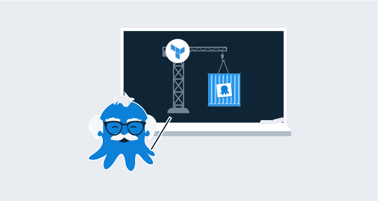

Infrastructure as code ([IaC](https://searchitoperations.techtarget.com/definition/Infrastructure-as-Code-IAC#:~:text=Infrastructure%20as%20code%2C%20also%20referred,hardware%20devices%20and%20operating%20systems.)) allows teams to create infrastructure resources (i.e. virtual machines, storage, network resources etc) without repeated mouse clicks.  Hashicorp's [Terraform](https://www.terraform.io) is quickly becoming the go to infrastructure as code solution. Terraform is an open-source IaC solution that allows you to define your infrastructure using a functional-based programming language called [Hashicorp Configuration Language (HCL)](https://github.com/hashicorp/hcl). 

Octopus is proud to announce our official [Terraform provider](TODO: Find the official home). This project started as a [community initiative](https://github.com/MattHodge) by [Matthew Hodgkins](https://github.com/MattHodge/) who built it to suit the needs of the company he worked for. Down the track, [Mark Henderson](https://github.com/mhenderson-so) contributed to the project for the needs of StackExchange. We’re indebted to Matt and Mark for their efforts since the project started in 2018. Making this an official supported provider brings significant advantages, as we can keep the plugin up-to-date and add great new features.

In this blog post, I'll introduce the Terraform provider for Octopus Deploy, and share a practical example of how to get started with it. 

## Why Infrastructure as Code?

The further the world goes down the DevOps and automation path, the clearer it is that we cannot continue creating infrastructure manually. Not only does it take a long time, but it's prone to failures. There's no one person in the world that can say they've never done *something* by mistake when creating a resource manually. Whether it was something as small as a typo, as humans, we're prone to mistakes.

When it comes to IaC, mistakes can still be made in code, but they're much less. When you're writing code and storing it in source control, you can do things to prevent mistakes as much as possible such as:

- Code reviews
- Automated testing to ensure the code works as expected
- A secure place to store the desired state
- A place where everyone can see what's being worked on and collaboration can take place

## Getting started with the Terraform provider for Octopus Deploy

Our Terraform provider allows teams to provision and configure Octopus instances via the Octopus REST API. It does this via an intermediate Octopus client written in [Go](https://golang.org). The provider is near feature complete which means you can define and configure most resources in Octopus. 

## Octopus Deploy Go Client
You can find the client SDK [here](https://github.com/OctopusDeploy/go-octopusdeploy).

We've also done extensive testing so 

TODO: Talk about how it powers Octopus Cloud.

### Prerequisites

Our Terraform provider requires:

* Terraform v

### Useful Example 1

TODO

### Useful Example 2

TODO

## How is this different to Config as Code?

A big push this year for Octopus Deploy has of course been config as code, so what happens to that since there is a Terraform provider? Well, nothing. Config as Code is still 100% needed. The Terraform provider handles everything before getting to the project.

Config as Code picks up where the Terraform provider leaves off and gives you the ability to manage the Project with code. 

The idea of the Terraform provider is to fill the part of the automated deployments before reaching the project.

## Conclusion

Infrastructure as code using Terraform and the power of a fully functional-based programming language under the hood is an ideal scenario for software-defined infrastructure. It gives you the ability to not only automate the work you're doing, but ensure quality and value for everyone using the code.

We're thrilled to share our Terraform provider and we hope it helps teams manage their Octopus instances in a declarative "Infrastructure as Code" way. 