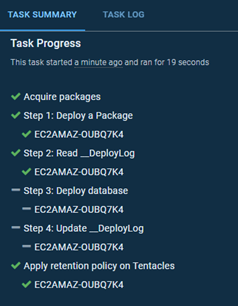

<h2>Skipping unnecessary schema compares in tightly coupled systems</h2>


!toc

## The problem: Tightly coupled systems 

One question I’m often asked is whether all the databases on a server should go into one repo/Octopus Deploy project, or if they should go into separate repos/projects. Another related question is whether the DB and application should go into the same repo/project or not. These questions don’t have simple answers. As a consultant, I begin my response with “it depends”.

Next, I’ll ask whether they use a distributed source control system (git) or a centralized source control system (TFS, SVN, etc.). It’s important to understand this so that I can calibrate my answer. Git is generally better suited to many small repos than a giant monolith, but the same cannot be said for many centralized source control systems.

Then I’ll ask the more important question: “How tightly coupled are the databases/applications?” If they ask for clarification, I’ll ask questions like:

- How many dependencies are there between the databases? Do you have an architecture diagram? (I can dream, can’t I?)
-	Can the DBs be built in isolation, or do they need to be built/deployed together in a certain order? (I’d pray that there aren’t any circular dependencies!)
-	Is a single work item likely to require changes to multiple databases?
-	Could a bad change to one database cause problems for another database?
-	What would be the consequences if one database got out of sync with another by a few versions?
-	When someone “deploys the database” are they typically referring to a single database, or might they need to deploy changes to multiple databases?

In an ideal world, architecture would be loosely coupled. This would allow folks to split up the databases into separate smaller repos that can be managed independently. The more granularity, the better. While this might impose some strict architectural rules and introduce some local complexities, it would significantly reduce the global complexity and reduce the risk of each deployment. This could also significantly reduce the technical and bureaucratic challenges associated with getting work done.

Essentially, loosely coupled systems allow folks to scale out development efforts much more linearly, rather than scaling them up, which comes with astronomical and often under-appreciated managerial costs and challenges. Attempts to scale up development efforts tend to collapse into a cesspit of politics, delays, and problems. Read [The Phoenix Project](https://www.amazon.com/Phoenix-Project-Devops-Helping-Business/dp/1942788290/) and most folks will recognize that they already work for a classic case study of this phenomenon.

That’s all well and good, folks might say, but it doesn’t help me. I already have a monolith. I didn’t build it and I can’t change it quickly. Perhaps there are other reasons that are too long or complicated to cover here that have resulted in tightly coupled systems.

In this scenario, while I might advocate for taking steps to decouple the systems, I would recognize that’s unlikely to be a quick or cheap fix. In the meantime, it’s important to effectively source control and deploy the thing, even if it’s a monolith. And in those situations, it’s possible to end up with giant source control repos and deployment projects that need to coordinate the deployment of many related parts.

## The symptom: Monolithic repos and deployment projects

I have a couple of customers who work on business intelligence systems. They have up to a dozen databases that read from each other. The first is typically responsible for loading the raw source data from various sources. This is often heavily normalized and optimized for storage and durability. It’s followed by various intermediate databases where the data is gradually cleaned up and transformed until it eventually ends up in various data warehouses and data marts, which are optimized for analysis.

In general, the databases can be deployed in a certain order. The data warehouses read from the intermediate databases, and those intermediate databases read from the source database. Hence, in theory, we can deploy sources first, then the intermediate databases in order, and eventually the data warehouse last.

However, the real world isn’t always that simple. For various reasons, there are a few dependencies that don’t fit that model and refactoring them would be very difficult. While we can generally deploy in a specified order, there are some cross-database dependencies that sometimes mean the order needs to change, and the Octopus Deploy projects are not smart enough to figure this out in advance.

One customer uses a bit of a hack to get around this. The last step in their deployment is a [Deploy a Release](https://octopus.com/docs/projects/coordinating-multiple-projects/deploy-release-step) step, which is set to re-run the deployment if any of the database deployment steps fail as a result of a broken dependency. This process will potentially re-run the deployment as many times as there are databases (the max number of re-runs is controlled using [output variables](https://octopus.com/docs/projects/variables/output-variables)). As long as at least one database is successfully deployed during each iteration, Octopus keeps trying until they are all deployed, so if there is any order in which that databases can be deployed, Octopus will eventually find it. It’s ugly but it works.

The biggest practical problem with this is how long it all takes. The customer uses a state-based deployment process. This means each time a database is deployed, the database comparison software (either Redgate or SSDT) is performing a full compare. This typically takes a minute or two per database, but it varies. For the largest databases, it can be over 5 minutes. 12 databases times 12 attempts, can routinely add up.

But it’s even worse than that. This BI system isn’t an in-house system, it’s a service that my customer sells to their customers. They maintain an instance of this set of databases per customer. When they deploy to production they aren’t just deploying once, they are deploying many times, and often during strict deployment windows. If the deployment takes too long and they miss their window, the customers won’t be happy. Some customers are deployed in bulk, and others have their own unique contracts that require more complicated and less frequent deploys. Less frequent deploys result in bigger deploys, which are more likely to require many re-runs.

The duration, risk, and complexity is multiplying across multiple axes.

The team is also resource constrained. A lot of the processing is being forced through a small number of [workers](https://octopus.com/docs/infrastructure/workers) which are often bottlenecks. It’s a perfect storm. Did I mention that monolithic systems really are horrible?

The really frustrating thing is while we might be doing hundreds of database compares, the vast majority are a waste of time since we know nothing has actually changed. Even when the deployments work first time, the chances are that only one or two of the databases have been updated, but all the databases are compared in sequence anyway. Deployments that only need to take a minute or two can take hours.

## How to treat the symptoms

There is an argument that running the compares, even when nothing has changed, is still valuable. It protects you from [drift](https://www.cmcrossroads.com/article/pushing-back-against-database-drift). By enforcing all databases to be redeployed from source control every time it ensures that source control remains the truth, and it reduces the chances of failures due to unexpected changes in production.

In general, I agree with this principle, but for my customer, the cost of running all these compares was crippling them. It’s also especially difficult to justify redeploying databases at the 2nd or 3rd attempt if they were already successfully deployed at the first attempt. While redeploying all the databases might be valuable, short deployment times are also valuable, so ultimately, folks need to make a trade off.

I proposed to my customer that they should design their deployment process to only deploy the database if the package number had incremented. This meant two things:

1.	We needed to change the build process in order to ensure new NuGet packages were only created if the DB schema had actually changed. (All the DBs were in a single git repo. The build process originally built and packaged all the databases for each commit, verifying all the dependencies. However, this resulted in painfully long (1hr+) build times. It wasn’t as straightforward as you might think to only build the databases that had been updated because, due to the dependencies, when two databases were updated at the same time, they needed to be built in the correct order. I wrote more about how we solved that problem last year on my personal blog: [http://workingwithdevs.com/azure-devops-services-api-powershell-hosted-build-agents/](http://workingwithdevs.com/azure-devops-services-api-powershell-hosted-build-agents/)).
1.	We needed to change our deployment process to recognize whether the current package had already been deployed. This was also harder than you might expect, and I’m grateful to Bob Walker for taking some time to discuss various options and pitfalls with me. It’s this part that I’m going to focus on for the rest of this blog post.

At first, I underestimated the complexity of this task. I planned to use the Octopus.Tentacle.PreviousInstallation.PackageVersion [system variable](https://octopus.com/docs/projects/variables/system-variables) to determine the previously deployed package. I could write a simple PowerShell script to compare the previous package number to the current package number, and if they were the same, I could skip the deployment.

However, this was problematic. What if the previous deployment had failed? What if the package had been deployed to the Tentacle, but the subsequent database schema comparison step which read the files from the package hadn’t executed?  What if I was running the task on a worker from a pool? What if I was running this on a [dynamic worker](https://octopus.com/docs/infrastructure/workers/dynamic-worker-pools)? Before I knew it, I was making a lot more API calls than I had originally anticipated, and the code was beginning to look annoyingly complicated.

After some reflection, I decided to borrow a trick from [migrations-based deployment tools](http://workingwithdevs.com/delivering-databases-migrations-vs-state/). I created a \__DeployLog table on each target database. Following each deployment, I logged the package and release numbers to that table, along with a timestamp, the user ID, deployment status, and any error messages.

With the data about previous deployments now stored safely on the database itself, it becomes possible to wrap all the long database deployment steps with a few quick SQL commands to verify if the package in the current release is already deployed to the target database. These additional queries will increase the total duration of the deployment slightly, but each skipped deployment will reduce the overall deployment time significantly. Hence, for projects with many state-based database deploy steps, the net result is likely to be significantly reduced deployment times. For my customer, this slashed regular deployment times by roughly a factor of 10, and thanks to the re-runs issue, the most challenging deployments were reduced by a factor of around 100.

The consequence was that rather than missing a production deployment window with a single, painfully long, deployment attempt, the team could try the deployment multiple times, with plenty of time in between to investigate any issues. Within the dev and test domain there was a massive boost to productivity. Developers could run a deployment against the test servers and see the result in minutes, rather than hours. Apart from significantly improving the feedback loop for developers, it also significantly reduced resource hogging issues on shared environments.

And on top of all this, that \__DeployLog table proved popular with both internal and customer operations folks who had a neat and reliable audit log in the database itself. 


 
## The code

To do the same thing in your own deployment projects, you’ll want to use some code that looks like this at the beginning of your process to read the \__DeployLog to determine whether it’s necessary to deploy the database. You could either run it as a separate deployment step for each database, or you could add it to the top of an existing script that deploys your database.

<script src="https://gist.github.com/Alex-Yates/042ebe90f7a1586dd39d9739eca377db.js"></script>

Notice that at the top of the script there are a few variables that need to be declared. This task is left for the user. I recommend using [Octopus variables](https://octopus.com/docs/projects/variables) for this if you can, rather than hardcoding the values into the script.

Also note the final line:

```
Set-OctopusVariable -name "Deploy:$DLM_ServerInstance-$DLM_Database" -value $deployRequired
```

This code assumes that the script is running as a separate deployment step from your existing database deployment step, and it sets an [output variable](https://octopus.com/docs/projects/variables/output-variables) that determines whether the database deployment steps should be executed.

If you are running this as a separate step, you do not need to alter this code. However, if you have copied the code to the top of an existing database deployment script, you’ll want to delete the line above and instead move your database code into an if statement that looks something like this:

```
If ($deployRequired){
  # put your existing db deploy code here
}
Else {
  Write-Output “Skipping database deployment.”
}
```

Assuming you have created a separate step to read the \__DeployLog, your existing database deployment steps should be updated to use the following [variable expression](https://octopus.com/docs/projects/variables/variable-substitutions#VariableSubstitutionSyntax-Conditionalsconditionals) as a [run condition](https://octopus.com/docs/deployment-process/conditions). This reads the output variable and uses it to decide whether to execute the database deployment:

```
#{if Octopus.Action[Read \__DeployLog].Output.Deploy:sql01-db== "True"}true#{/if}
```


:::hint
Remember to replace “sql01” and “db” with your own SQL Server instance and database names.
:::

Following your database deployment, you’ll want to add the following script to update the \__DeployLog with the package number and deployment status. If you simply copy the code to your database deployment script, you’ll want to wrap it into the same if condition. If you’re running it as a separate step, you’ll want to use the same run condition as above. You don’t want to update the \__DeployLog unless the database deployment actually executed.

<script src="https://gist.github.com/Alex-Yates/04ba6cfde9ebe1e3e40a341f80a5c7c9.js"></script>

And finally, to make all this as easy as I can, I’ve just published a couple of Octopus Deploy Step Templates to the community library:

- [SQL Server \__DeployLog: Read](https://library.octopus.com/step-templates/8a446e55-6554-40fa-bbd9-70bd2a69a13e/actiontemplate-sql-server-__deploylog:-read)
- [SQL Server \__DeployLog: Update](https://library.octopus.com/step-templates/a9f7644c-3e27-4e46-a591-eee7f3542032/actiontemplate-sql-server-__deploylog:-update)


The final process might look something like this:


 
Now, if the package number has not changed since the last successful deployment, it won’t be redeployed:


 
## Treating the underlying problem

I’m fully aware that this blog post is only a treatment for the symptom, rather than a cure for the underlying problem. And there are side-effects to be aware of.

It’s possible that database drift might go longer before being noticed, which is not ideal. It’s also possible that some dependencies might be broken since we aren’t routinely rebuilding/deploying all the databases. It would be healthy to consider running full builds and end to end deployments and integration tests on some test or staging environment, perhaps on a nightly basis, to ensure no dependencies are being missed. 

There’s also the unintuitiveness problem. Since this is a slightly unusual and complicated way to handle deployments, there’s a bigger cognitive and operational cost associated with maintaining this process. This raises the likelihood of misunderstandings, which could lead to problems.

However, the real problem here is that the databases are tightly coupled with circular dependencies. That’s a more difficult and more expensive problem to solve, and I’m not sure I can solve that problem with a single blog post.

Then again, I don’t believe that anyone reading this works with a perfect system. For the majority of us it’s trade-offs, mistakes and “this seemed like a good idea at the time” all the way down. For all those who are just trying to keep the servers running, without the support or investment you need to “do it properly”, I salute you, and I hope this was useful.

---

Alex Yates has been helping organisations to apply DevOps principles to their data since 2010. He’s most proud of helping Skyscanner develop the ability to  [deploy 95 times a day](https://www.youtube.com/watch?v=sNsPnCv7hHo) and for supporting the United Nations Office for Project Services with their release processes. Alex has worked with clients on every continent except Antarctica – so he’s keen to meet anyone who researches penguins.
 
A keen community member, he co-organises [Data Relay](https://datarelay.co.uk/), is the founder of [www.SpeakingMentors.com](http://www.speakingmentors.com/) and has been recognised as a  [Microsoft Data Platform MVP](https://mvp.microsoft.com/en-us/PublicProfile/5002655?fullName=Alex%20Yates) since 2017.
 
Alex is the founder of [DLM Consultants](http://dlmconsultants.com/), an official Octopus Deploy partner. He enjoys mentoring, coaching, training and consulting with customers who want to achieve better business outcomes through improved IT and database delivery practices.
 
If you would like to work with Alex, email: [enquiries@dlmconsultants.com](mailto:enquiries@dlmconsultants.com) 