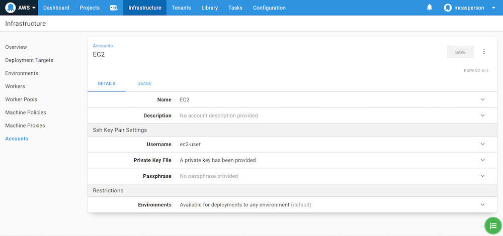

Managing credentials for cloud providers is a challenge, especially when you consider that you don’t have the luxury of physical security, meaning one leaked admin key could grant access to your entire account from anywhere in the world. Nor are cloud accounts immune from the proverbial "rm -rf" scenario where an admin account accidentally deletes resources they shouldn’t.

IAM roles can be used to provide task specific authorization, and when a role is assigned to an EC2 instance, users with access to that VM can inherit the role.

In this blog post, we’ll take a look at IAM roles in AWS and learn how they can be used in Octopus.

## Create a role

Roles can be created in the AWS IAM console. When you create a new role, you will be presented with a list of services that the role will apply to. With the default selection of **AWS service** selected, click the **EC2** link:


We won’t attach any permissions or tags to this role, so skip to the end, give the role a name and create it:


Open the newly created role, click the **Trust relationships** tab, and click **Edit trust relationship**:


The trust relationship is a JSON structure that configures which service or user can inherit the role. Because we selected the EC2 service when creating the role, the EC2 service has been granted the ability to assume it:

```
{
  "Version": "2012-10-17",
  "Statement": [
    {
      "Effect": "Allow",
      "Principal": {
        "Service": "ec2.amazonaws.com"
      },
      "Action": "sts:AssumeRole"
    }
  ]
}
```

## Assign a role to an EC2 instance

The role can be assigned to a new EC2 instance when it is created:


When you log in to this instance, the name of the role assigned to the VM is available from the [instance metadata](https://docs.aws.amazon.com/AWSEC2/latest/UserGuide/ec2-instance-metadata.html) HTTP interface with the command:

```
curl http://169.254.169.254/latest/meta-data/iam/security-credentials/
```

We can also verify the role through the AWS CLI with the command:

```
aws sts get-caller-identity
```

In both cases we see the role **mytestrole**:


What this means is that tools that are aware of the instance metadata HTTP interface can operate with the role assigned to the EC2 instance. As long as you have access to the VM, you can interact with AWS with the associated IAM role.

The AWS CLI is one example of a tool that is aware of the instance metadata, and Octopus Tentacles and Workers are another. We can take advantage of the EC2 IAM roles and Octopus Workers to run commands against AWS services without any AWS credentials.

## EC2 as Octopus Worker

To connect to the Linux VM we need to create an **SSH Key Pair** account with the certificate used when the VM was created. For VMs created with Amazon AMIs, the username is **ec2-user**:



We can then create an SSH Worker and connect to the VM:


Now we can add a **Run an AWS CLI Script** step, set the script to run on the worker pool containing the Worker we just created, and select the option to **Execute using the AWS service role for an EC2 instance**:


Now if we run the command `aws sts get-caller-identity` in this script, we see the same results as before:


We now have the ability to perform deployments and execute scripts without needing to share AWS credentials via the Worker and the IAM role it assumes from the underlying VM.

## Assuming roles for Kubernetes targets

With Octopus 2020.4.0 it is also possible to interact with an EKS cluster using an IAM role associated with a VM.

However, for an IAM role to have any permissions inside the Kubernetes cluster, we need to map the IAM role to a Kubernetes role. This mapping is done in the `aws-auth` config map in the `kube-system` namespace.

The default contents of this file will look something like the example below. Note, however, that the existing role mapping is specific to each EKS cluster, as it allows the roles assigned to the nodes to access the cluster. You will need to modify the config map from your cluster rather than copy and paste the one shown below, as using this example directly will cause errors:

```YAML
apiVersion: v1
data:
  mapRoles: |
    - groups:
      - system:bootstrappers
      - system:nodes
      rolearn: arn:aws:iam::968802670493:role/eksctl-k8s-cluster-nodegroup-ng-1-NodeInstanceRole-1FI6JXPS9MDWK
      username: system:node:{{EC2PrivateDNSName}}
  mapUsers: |
    []
kind: ConfigMap
metadata:
  name: aws-auth
  namespace: kube-system
```

In my example, I add a new role mapping between the `mytestrole` IAM role and the Kubernetes `system:masters` role:

```YAML
apiVersion: v1
data:
  mapRoles: |
    - groups:
      - system:bootstrappers
      - system:nodes
      rolearn: arn:aws:iam::968802670493:role/eksctl-k8s-cluster-nodegroup-ng-1-NodeInstanceRole-1FI6JXPS9MDWK
      username: system:node:{{EC2PrivateDNSName}}
    - rolearn: arn:aws:iam::968802670493:role/mytestrole
      username: admin
      groups:
        - system:masters
  mapUsers: |
    []
kind: ConfigMap
metadata:
  name: aws-auth
  namespace: kube-system
```

After this config map is applied, we can configure our Kubernetes target to **Execute using the AWS service role for an EC2 instance**:


We also need to ensure that the target uses the Worker connecting to the EC2 instance with the IAM role applied:


Our Kubernetes target will now complete a health check without any AWS credentials, and instead, using the IAM role assigned to the VM, the Worker connects to:


## Conclusion

In this post, we created an IAM role that can be assigned to an EC2 instance. We logged into the EC2 instance and verified that the AWS CLI showed the local user as having the EC2 role. We then connected a Worker to the EC2 instance and ran both AWS CLI scripts and a Kubernetes health check from Octopus that also assumed the role assigned to the EC2 instance.

Assigning roles to EC2 instances is a convenient way to remove the need to share AWS credentials, and with Octopus 2020.4, full support for assuming those roles is available in steps and Kubernetes targets.
