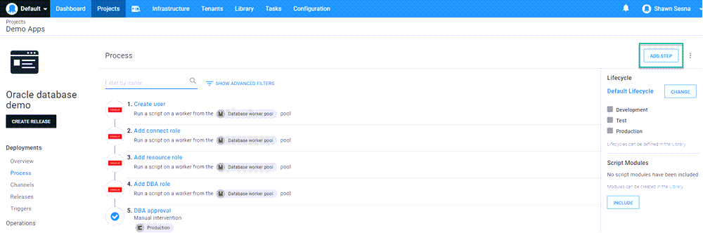
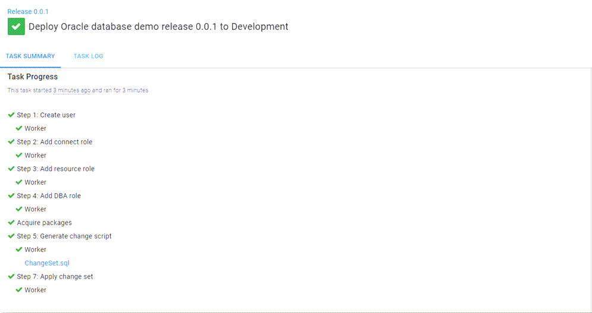

A customer recently asked if it's possible to deploy to an Oracle database with Liquibase using Octopus Deploy. In this post, I'll demonstrate how to do it.

## Liquibase

[Liquibase](https://www.liquibase.org/) is a migrations-based database deployment tool similar to [Flyway](https://flywaydb.org/), [DbUp](https://dbup.readthedocs.io/en/latest/), and [RoundhousE](https://github.com/chucknorris/roundhouse).  The differentiating feature of Liquibase is how you define your migrations.  Whereas Flyway, DbUp, and RoundhousE rely on the user writing the SQL scripts themselves, Liquibase allows the user to define migrations in XML, JSON, YAML, as well as SQL in what is called a `changelog`.  Liquibase will convert the changelog to SQL statements during the deployment process.

### Sample project: Sakila

[Sakila](https://dev.mysql.com/doc/sakila/en/) is a sample database originally developed for MySQL.  This project contains a number of different database objects, including tables, views, stored procedures, and functions making it a well-rounded example.  To support other database technologies, I created a repo in our [Samples BitBucket instance](https://bitbucket.org/octopussamples/sakila/src/master/), which contains the Sakila project in a number of different database technologies and methods.

### Changelog

The [step template for Liquibase](https://library.octopus.com/step-templates/6a276a58-d082-425f-a77a-ff7b3979ce2e/actiontemplate-liquibase-apply-changeset) in Octopus Deploy works in one of two ways:
- With Liquibase included in the package.
- With only the changelog file.

For this post, we package the change log file:

<details>
  <summary>dbchangelog.xml</summary>
  
  ```xml
<?xml version="1.1" encoding="UTF-8" standalone="no"?>
<databaseChangeLog xmlns="http://www.liquibase.org/xml/ns/dbchangelog" xmlns:ext="http://www.liquibase.org/xml/ns/dbchangelog-ext" xmlns:pro="http://www.liquibase.org/xml/ns/pro" xmlns:xsi="http://www.w3.org/2001/XMLSchema-instance" xsi:schemaLocation="http://www.liquibase.org/xml/ns/dbchangelog-ext http://www.liquibase.org/xml/ns/dbchangelog/dbchangelog-ext.xsd http://www.liquibase.org/xml/ns/pro http://www.liquibase.org/xml/ns/pro/liquibase-pro-3.9.xsd http://www.liquibase.org/xml/ns/dbchangelog http://www.liquibase.org/xml/ns/dbchangelog/dbchangelog-3.9.xsd">
    <changeSet author="Shawn.Sesna (generated)" id="1599867429412-1">
        <createTable tableName="FILM_CATEGORY" tablespace="USERS">
            <column name="FILM_ID" type="NUMBER(*, 0)">
                <constraints nullable="false" primaryKey="true" primaryKeyName="PK_FILM_CATEGORY"/>
            </column>
            <column name="CATEGORY_ID" type="NUMBER(*, 0)">
                <constraints nullable="false" primaryKey="true" primaryKeyName="PK_FILM_CATEGORY"/>
            </column>
            <column name="LAST_UPDATE" type="date">
                <constraints nullable="false"/>
            </column>
        </createTable>
    </changeSet>
    <changeSet author="Shawn.Sesna (generated)" id="1599867429412-2">
        <createTable tableName="STAFF" tablespace="USERS">
            <column name="STAFF_ID" type="NUMBER(*, 0)">
                <constraints nullable="false" primaryKey="true" primaryKeyName="PK_STAFF"/>
            </column>
            <column name="FIRST_NAME" type="VARCHAR2(45 BYTE)">
                <constraints nullable="false"/>
            </column>
            <column name="LAST_NAME" type="VARCHAR2(45 BYTE)">
                <constraints nullable="false"/>
            </column>
            <column name="ADDRESS_ID" type="NUMBER(*, 0)">
                <constraints nullable="false"/>
            </column>
            <column name="PICTURE" type="BLOB"/>
            <column name="EMAIL" type="VARCHAR2(50 BYTE)"/>
            <column name="STORE_ID" type="NUMBER(*, 0)">
                <constraints nullable="false"/>
            </column>
            <column defaultValueNumeric="1" name="ACTIVE" type="NUMBER(*, 0)">
                <constraints nullable="false"/>
            </column>
            <column name="USERNAME" type="VARCHAR2(16 BYTE)">
                <constraints nullable="false"/>
            </column>
            <column name="PASSWORD" type="VARCHAR2(40 BYTE)"/>
            <column name="LAST_UPDATE" type="date">
                <constraints nullable="false"/>
            </column>
        </createTable>
    </changeSet>
    <changeSet author="Shawn.Sesna (generated)" id="1599867429412-3">
        <createTable tableName="STORE" tablespace="USERS">
            <column name="STORE_ID" type="NUMBER(*, 0)">
                <constraints nullable="false" primaryKey="true" primaryKeyName="PK_STORE"/>
            </column>
            <column name="MANAGER_STAFF_ID" type="NUMBER(*, 0)">
                <constraints nullable="false"/>
            </column>
            <column name="ADDRESS_ID" type="NUMBER(*, 0)">
                <constraints nullable="false"/>
            </column>
            <column name="LAST_UPDATE" type="date">
                <constraints nullable="false"/>
            </column>
        </createTable>
    </changeSet>
    <changeSet author="Shawn.Sesna (generated)" id="1599867429412-4">
        <createTable tableName="CUSTOMER" tablespace="USERS">
            <column name="CUSTOMER_ID" type="NUMBER(*, 0)">
                <constraints nullable="false" primaryKey="true" primaryKeyName="PK_CUSTOMER"/>
            </column>
            <column name="STORE_ID" type="NUMBER(*, 0)">
                <constraints nullable="false"/>
            </column>
            <column name="FIRST_NAME" type="VARCHAR2(45 BYTE)">
                <constraints nullable="false"/>
            </column>
            <column name="LAST_NAME" type="VARCHAR2(45 BYTE)">
                <constraints nullable="false"/>
            </column>
            <column name="EMAIL" type="VARCHAR2(50 BYTE)"/>
            <column name="ADDRESS_ID" type="NUMBER(*, 0)">
                <constraints nullable="false"/>
            </column>
            <column defaultValue="Y" name="ACTIVE" type="CHAR(1 BYTE)">
                <constraints nullable="false"/>
            </column>
            <column name="CREATE_DATE" type="date">
                <constraints nullable="false"/>
            </column>
            <column name="LAST_UPDATE" type="date">
                <constraints nullable="false"/>
            </column>
        </createTable>
    </changeSet>
    <changeSet author="Shawn.Sesna (generated)" id="1599867429412-5">
        <createTable tableName="INVENTORY" tablespace="USERS">
            <column name="INVENTORY_ID" type="NUMBER(*, 0)">
                <constraints nullable="false" primaryKey="true" primaryKeyName="PK_INVENTORY"/>
            </column>
            <column name="FILM_ID" type="NUMBER(*, 0)">
                <constraints nullable="false"/>
            </column>
            <column name="STORE_ID" type="NUMBER(*, 0)">
                <constraints nullable="false"/>
            </column>
            <column name="LAST_UPDATE" type="date">
                <constraints nullable="false"/>
            </column>
        </createTable>
    </changeSet>
    <changeSet author="Shawn.Sesna (generated)" id="1599867429412-6">
        <createSequence maxValue="9999999999999999999999999999" sequenceName="INVENTORY_SEQUENCE" startValue="1"/>
    </changeSet>
    <changeSet author="Shawn.Sesna (generated)" id="1599867429412-7">
        <createSequence maxValue="9999999999999999999999999999" sequenceName="COUNTRY_SEQUENCE" startValue="1"/>
    </changeSet>
    <changeSet author="Shawn.Sesna (generated)" id="1599867429412-8">
        <createSequence maxValue="9999999999999999999999999999" sequenceName="LANGUAGE_SEQUENCE" startValue="1"/>
    </changeSet>
    <changeSet author="Shawn.Sesna (generated)" id="1599867429412-9">
        <createSequence maxValue="9999999999999999999999999999" sequenceName="STORE_SEQUENCE" startValue="1"/>
    </changeSet>
    <changeSet author="Shawn.Sesna (generated)" id="1599867429412-10">
        <createSequence maxValue="9999999999999999999999999999" sequenceName="FILM_SEQUENCE" startValue="1"/>
    </changeSet>
    <changeSet author="Shawn.Sesna (generated)" id="1599867429412-11">
        <createSequence maxValue="9999999999999999999999999999" sequenceName="PAYMENT_SEQUENCE" startValue="1"/>
    </changeSet>
    <changeSet author="Shawn.Sesna (generated)" id="1599867429412-12">
        <createSequence maxValue="9999999999999999999999999999" sequenceName="CITY_SEQUENCE" startValue="1"/>
    </changeSet>
    <changeSet author="Shawn.Sesna (generated)" id="1599867429412-13">
        <createTable tableName="LANGUAGE" tablespace="USERS">
            <column name="LANGUAGE_ID" type="NUMBER(*, 0)">
                <constraints nullable="false" primaryKey="true" primaryKeyName="PK_LANGUAGE"/>
            </column>
            <column name="NAME" type="CHAR(20 BYTE)">
                <constraints nullable="false"/>
            </column>
            <column name="LAST_UPDATE" type="date">
                <constraints nullable="false"/>
            </column>
        </createTable>
    </changeSet>
    <changeSet author="Shawn.Sesna (generated)" id="1599867429412-14">
        <createSequence maxValue="9999999999999999999999999999" sequenceName="ACTOR_SEQUENCE" startValue="1"/>
    </changeSet>
    <changeSet author="Shawn.Sesna (generated)" id="1599867429412-15">
        <createSequence maxValue="9999999999999999999999999999" sequenceName="CATEGORY_SEQUENCE" startValue="1"/>
    </changeSet>
    <changeSet author="Shawn.Sesna (generated)" id="1599867429412-16">
        <createTable tableName="FILM" tablespace="USERS">
            <column name="FILM_ID" type="NUMBER(*, 0)">
                <constraints nullable="false" primaryKey="true" primaryKeyName="PK_FILM"/>
            </column>
            <column name="TITLE" type="VARCHAR2(255 BYTE)">
                <constraints nullable="false"/>
            </column>
            <column name="DESCRIPTION" type="CLOB"/>
            <column name="RELEASE_YEAR" type="VARCHAR2(4 BYTE)"/>
            <column name="LANGUAGE_ID" type="NUMBER(*, 0)">
                <constraints nullable="false"/>
            </column>
            <column name="ORIGINAL_LANGUAGE_ID" type="NUMBER(*, 0)"/>
            <column defaultValueNumeric="3" name="RENTAL_DURATION" type="NUMBER(*, 0)">
                <constraints nullable="false"/>
            </column>
            <column defaultValueNumeric="4.99" name="RENTAL_RATE" type="NUMBER(4, 2)">
                <constraints nullable="false"/>
            </column>
            <column name="LENGTH" type="NUMBER(*, 0)"/>
            <column defaultValueNumeric="19.99" name="REPLACEMENT_COST" type="NUMBER(5, 2)">
                <constraints nullable="false"/>
            </column>
            <column defaultValue="G" name="RATING" type="VARCHAR2(10 BYTE)"/>
            <column name="SPECIAL_FEATURES" type="VARCHAR2(100 BYTE)"/>
            <column name="LAST_UPDATE" type="date">
                <constraints nullable="false"/>
            </column>
        </createTable>
    </changeSet>
    <changeSet author="Shawn.Sesna (generated)" id="1599867429412-17">
        <createSequence maxValue="9999999999999999999999999999" sequenceName="CUSTOMER_SEQUENCE" startValue="1"/>
    </changeSet>
    <changeSet author="Shawn.Sesna (generated)" id="1599867429412-18">
        <createSequence maxValue="9999999999999999999999999999" sequenceName="ADDRESS_SEQUENCE" startValue="1"/>
    </changeSet>
    <changeSet author="Shawn.Sesna (generated)" id="1599867429412-19">
        <createTable tableName="RENTAL" tablespace="USERS">
            <column name="RENTAL_ID" type="NUMBER(*, 0)">
                <constraints nullable="false" primaryKey="true" primaryKeyName="PK_RENTAL"/>
            </column>
            <column name="RENTAL_DATE" type="date">
                <constraints nullable="false"/>
            </column>
            <column name="INVENTORY_ID" type="NUMBER(*, 0)">
                <constraints nullable="false"/>
            </column>
            <column name="CUSTOMER_ID" type="NUMBER(*, 0)">
                <constraints nullable="false"/>
            </column>
            <column name="RETURN_DATE" type="date"/>
            <column name="STAFF_ID" type="NUMBER(*, 0)">
                <constraints nullable="false"/>
            </column>
            <column name="LAST_UPDATE" type="date">
                <constraints nullable="false"/>
            </column>
        </createTable>
    </changeSet>
    <changeSet author="Shawn.Sesna (generated)" id="1599867429412-20">
        <createTable tableName="CATEGORY" tablespace="USERS">
            <column name="CATEGORY_ID" type="NUMBER(*, 0)">
                <constraints nullable="false" primaryKey="true" primaryKeyName="PK_CATEGORY"/>
            </column>
            <column name="NAME" type="VARCHAR2(25 BYTE)">
                <constraints nullable="false"/>
            </column>
            <column name="LAST_UPDATE" type="date">
                <constraints nullable="false"/>
            </column>
        </createTable>
    </changeSet>
    <changeSet author="Shawn.Sesna (generated)" id="1599867429412-21">
        <createSequence maxValue="9999999999999999999999999999" sequenceName="RENTAL_SEQUENCE" startValue="1"/>
    </changeSet>
    <changeSet author="Shawn.Sesna (generated)" id="1599867429412-22">
        <createTable tableName="COUNTRY" tablespace="USERS">
            <column name="COUNTRY_ID" type="NUMBER(*, 0)">
                <constraints nullable="false" primaryKey="true" primaryKeyName="PK_COUNTRY"/>
            </column>
            <column name="COUNTRY" type="VARCHAR2(50 BYTE)">
                <constraints nullable="false"/>
            </column>
            <column name="LAST_UPDATE" type="date"/>
        </createTable>
    </changeSet>
    <changeSet author="Shawn.Sesna (generated)" id="1599867429412-23">
        <createTable tableName="CITY" tablespace="USERS">
            <column name="CITY_ID" type="NUMBER(*, 0)">
                <constraints nullable="false" primaryKey="true" primaryKeyName="PK_CITY"/>
            </column>
            <column name="CITY" type="VARCHAR2(50 BYTE)">
                <constraints nullable="false"/>
            </column>
            <column name="COUNTRY_ID" type="NUMBER(*, 0)">
                <constraints nullable="false"/>
            </column>
            <column name="LAST_UPDATE" type="date">
                <constraints nullable="false"/>
            </column>
        </createTable>
    </changeSet>
    <changeSet author="Shawn.Sesna (generated)" id="1599867429412-24">
        <createTable tableName="PAYMENT" tablespace="USERS">
            <column name="PAYMENT_ID" type="NUMBER(*, 0)">
                <constraints nullable="false" primaryKey="true" primaryKeyName="PK_PAYMENT"/>
            </column>
            <column name="CUSTOMER_ID" type="NUMBER(*, 0)">
                <constraints nullable="false"/>
            </column>
            <column name="STAFF_ID" type="NUMBER(*, 0)">
                <constraints nullable="false"/>
            </column>
            <column name="RENTAL_ID" type="NUMBER(*, 0)"/>
            <column name="AMOUNT" type="NUMBER(5, 2)">
                <constraints nullable="false"/>
            </column>
            <column name="PAYMENT_DATE" type="date">
                <constraints nullable="false"/>
            </column>
            <column name="LAST_UPDATE" type="date">
                <constraints nullable="false"/>
            </column>
        </createTable>
    </changeSet>
    <changeSet author="Shawn.Sesna (generated)" id="1599867429412-25">
        <createTable tableName="ADDRESS" tablespace="USERS">
            <column name="ADDRESS_ID" type="NUMBER(*, 0)">
                <constraints nullable="false" primaryKey="true" primaryKeyName="PK_ADDRESS"/>
            </column>
            <column name="ADDRESS" type="VARCHAR2(50 BYTE)">
                <constraints nullable="false"/>
            </column>
            <column name="ADDRESS2" type="VARCHAR2(50 BYTE)"/>
            <column name="DISTRICT" type="VARCHAR2(20 BYTE)">
                <constraints nullable="false"/>
            </column>
            <column name="CITY_ID" type="NUMBER(*, 0)">
                <constraints nullable="false"/>
            </column>
            <column name="POSTAL_CODE" type="VARCHAR2(10 BYTE)"/>
            <column name="PHONE" type="VARCHAR2(20 BYTE)">
                <constraints nullable="false"/>
            </column>
            <column name="LAST_UPDATE" type="date">
                <constraints nullable="false"/>
            </column>
        </createTable>
    </changeSet>
    <changeSet author="Shawn.Sesna (generated)" id="1599867429412-26">
        <createTable tableName="ACTOR" tablespace="USERS">
            <column name="ACTOR_ID" type="NUMBER(*, 0)">
                <constraints nullable="false" primaryKey="true" primaryKeyName="PK_ACTOR"/>
            </column>
            <column name="FIRST_NAME" type="VARCHAR2(45 BYTE)">
                <constraints nullable="false"/>
            </column>
            <column name="LAST_NAME" type="VARCHAR2(45 BYTE)">
                <constraints nullable="false"/>
            </column>
            <column name="LAST_UPDATE" type="date">
                <constraints nullable="false"/>
            </column>
        </createTable>
    </changeSet>
    <changeSet author="Shawn.Sesna (generated)" id="1599867429412-27">
        <createTable tableName="FILM_ACTOR" tablespace="USERS">
            <column name="ACTOR_ID" type="NUMBER(*, 0)">
                <constraints nullable="false" primaryKey="true" primaryKeyName="PK_FILM_ACTOR"/>
            </column>
            <column name="FILM_ID" type="NUMBER(*, 0)">
                <constraints nullable="false" primaryKey="true" primaryKeyName="PK_FILM_ACTOR"/>
            </column>
            <column name="LAST_UPDATE" type="date">
                <constraints nullable="false"/>
            </column>
        </createTable>
    </changeSet>
    <changeSet author="Shawn.Sesna (generated)" id="1599867429412-28">
        <createSequence maxValue="9999999999999999999999999999" sequenceName="STAFF_SEQUENCE" startValue="1"/>
    </changeSet>
    <changeSet author="Shawn.Sesna (generated)" id="1599867429412-29">
        <createView fullDefinition="true" viewName="FILM_LIST">CREATE OR REPLACE FORCE VIEW "FILM_LIST" ("FID", "TITLE", "DESCRIPTION", "CATEGORY", "PRICE", "LENGTH", "RATING", "ACTORS") AS SELECT film.film_id AS FID,
       film.title AS title,
       film.description AS description,
       category.name AS category,
       film.rental_rate AS price,
       film.length AS length,
       film.rating AS rating,
       actor.first_name||' '||actor.last_name AS actors
FROM category LEFT JOIN film_category ON category.category_id = film_category.category_id LEFT JOIN film ON film_category.film_id = film.film_id
        JOIN film_actor ON film.film_id = film_actor.film_id
    JOIN actor ON film_actor.actor_id = actor.actor_id</createView>
    </changeSet>
    <changeSet author="Shawn.Sesna (generated)" id="1599867429412-30">
        <createView fullDefinition="true" viewName="SALES_BY_FILM_CATEGORY">CREATE OR REPLACE FORCE VIEW "SALES_BY_FILM_CATEGORY" ("CATEGORY", "TOTAL_SALES") AS SELECT
c.name AS category 
, SUM(p.amount) AS total_sales 
FROM payment p
INNER JOIN rental r ON p.rental_id = r.rental_id
INNER JOIN inventory i ON r.inventory_id = i.inventory_id
INNER JOIN film f ON i.film_id = f.film_id
INNER JOIN film_category fc ON f.film_id = fc.film_id
INNER JOIN category c ON fc.category_id = c.category_id
GROUP BY c.name</createView>
    </changeSet>
    <changeSet author="Shawn.Sesna (generated)" id="1599867429412-31">
        <createView fullDefinition="true" viewName="STAFF_LIST">CREATE OR REPLACE FORCE VIEW "STAFF_LIST" ("ID", "NAME", "ADDRESS", "ZIP_CODE", "PHONE", "CITY", "COUNTRY", "SID") AS SELECT s.staff_id AS ID,
       s.first_name||' '||s.last_name AS name,
       a.address AS address,
       a.postal_code AS zip_code,
       a.phone AS phone,
       city.city AS city,
       country.country AS country,
       s.store_id AS SID
FROM staff s JOIN address a ON s.address_id = a.address_id JOIN city ON a.city_id = city.city_id
    JOIN country ON city.country_id = country.country_id</createView>
    </changeSet>
    <changeSet author="Shawn.Sesna (generated)" id="1599867429412-32">
        <createView fullDefinition="true" viewName="SALES_BY_STORE">CREATE OR REPLACE FORCE VIEW "SALES_BY_STORE" ("STORE_ID", "STORE", "MANAGER", "TOTAL_SALES") AS SELECT
  s.store_id
 ,c.city||','||cy.country AS store
 ,m.first_name||' '||m.last_name AS manager
 ,SUM(p.amount) AS total_sales
FROM payment p
INNER JOIN rental r ON p.rental_id = r.rental_id
INNER JOIN inventory i ON r.inventory_id = i.inventory_id
INNER JOIN store s ON i.store_id = s.store_id
INNER JOIN address a ON s.address_id = a.address_id
INNER JOIN city c ON a.city_id = c.city_id
INNER JOIN country cy ON c.country_id = cy.country_id
INNER JOIN staff m ON s.manager_staff_id = m.staff_id
GROUP BY  
  s.store_id
, c.city||','||cy.country
, m.first_name||' '||m.last_name</createView>
    </changeSet>
    <changeSet author="Shawn.Sesna (generated)" id="1599867429412-33">
        <createView fullDefinition="true" viewName="CUSTOMER_LIST">CREATE OR REPLACE FORCE VIEW "CUSTOMER_LIST" ("ID", "NAME", "ADDRESS", "ZIP_CODE", "PHONE", "CITY", "COUNTRY", "NOTES", "SID") AS SELECT cu.customer_id AS ID,
       cu.first_name||' '||cu.last_name AS name,
       a.address AS address,
       a.postal_code AS zip_code,
       a.phone AS phone,
       city.city AS city,
       country.country AS country,
       decode(cu.active, 1,'active','') AS notes,
       cu.store_id AS SID
FROM customer cu JOIN address a ON cu.address_id = a.address_id JOIN city ON a.city_id = city.city_id
    JOIN country ON city.country_id = country.country_id</createView>
    </changeSet>
    <changeSet author="Shawn.Sesna (generated)" id="1599867429412-34">
        <createSequence sequenceName="ROUNDHOUSE_SCRIPTSRUNERRORSID" startValue="1"/>
    </changeSet>
    <changeSet author="Shawn.Sesna (generated)" id="1599867429412-35">
        <createSequence sequenceName="ROUNDHOUSE_SCRIPTSRUNID" startValue="1"/>
    </changeSet>
    <changeSet author="Shawn.Sesna (generated)" id="1599867429412-36">
        <createSequence sequenceName="ROUNDHOUSE_VERSIONID" startValue="21"/>
    </changeSet>
    <changeSet author="Shawn.Sesna (generated)" id="1599867429412-37">
        <createTable tableName="FILM_TEXT" tablespace="USERS">
            <column name="FILM_ID" type="NUMBER(*, 0)">
                <constraints nullable="false" primaryKey="true" primaryKeyName="PK_FILM_TEXT"/>
            </column>
            <column name="TITLE" type="VARCHAR2(255 BYTE)">
                <constraints nullable="false"/>
            </column>
            <column name="DESCRIPTION" type="CLOB"/>
        </createTable>
    </changeSet>
    <changeSet author="Shawn.Sesna (generated)" id="1599867429412-38">
        <createTable tableName="ROUNDHOUSE_SCRIPTSRUN" tablespace="USERS">
            <column name="ID" type="NUMBER(19, 0)">
                <constraints nullable="false" primaryKey="true" primaryKeyName="SYS_C007548"/>
            </column>
            <column name="VERSION_ID" type="NUMBER(19, 0)"/>
            <column name="SCRIPT_NAME" type="VARCHAR2(255 BYTE)"/>
            <column name="TEXT_OF_SCRIPT" type="CLOB"/>
            <column name="TEXT_HASH" type="VARCHAR2(512 BYTE)"/>
            <column defaultValueNumeric="0" name="ONE_TIME_SCRIPT" type="NUMBER(1, 0)"/>
            <column defaultValueComputed="CURRENT_TIMESTAMP" name="ENTRY_DATE" type="date">
                <constraints nullable="false"/>
            </column>
            <column defaultValueComputed="CURRENT_TIMESTAMP" name="MODIFIED_DATE" type="date">
                <constraints nullable="false"/>
            </column>
            <column name="ENTERED_BY" type="VARCHAR2(50 BYTE)"/>
        </createTable>
    </changeSet>
    <changeSet author="Shawn.Sesna (generated)" id="1599867429412-39">
        <createTable tableName="ROUNDHOUSE_SCRIPTSRUNERRORS" tablespace="USERS">
            <column name="ID" type="NUMBER(19, 0)">
                <constraints nullable="false" primaryKey="true" primaryKeyName="SYS_C007553"/>
            </column>
            <column name="REPOSITORY_PATH" type="VARCHAR2(255 BYTE)"/>
            <column name="VERSION" type="VARCHAR2(35 BYTE)"/>
            <column name="SCRIPT_NAME" type="VARCHAR2(255 BYTE)"/>
            <column name="TEXT_OF_SCRIPT" type="CLOB"/>
            <column name="ERRONEOUS_PART_OF_SCRIPT" type="CLOB"/>
            <column name="ERROR_MESSAGE" type="VARCHAR2(255 BYTE)"/>
            <column defaultValueComputed="CURRENT_TIMESTAMP" name="ENTRY_DATE" type="date">
                <constraints nullable="false"/>
            </column>
            <column defaultValueComputed="CURRENT_TIMESTAMP" name="MODIFIED_DATE" type="date">
                <constraints nullable="false"/>
            </column>
            <column name="ENTERED_BY" type="VARCHAR2(50 BYTE)"/>
        </createTable>
    </changeSet>
    <changeSet author="Shawn.Sesna (generated)" id="1599867429412-40">
        <createTable tableName="ROUNDHOUSE_VERSION" tablespace="USERS">
            <column name="ID" type="NUMBER(19, 0)">
                <constraints nullable="false" primaryKey="true" primaryKeyName="SYS_C007544"/>
            </column>
            <column name="REPOSITORY_PATH" type="VARCHAR2(255 BYTE)"/>
            <column name="VERSION" type="VARCHAR2(35 BYTE)"/>
            <column defaultValueComputed="CURRENT_TIMESTAMP" name="ENTRY_DATE" type="date">
                <constraints nullable="false"/>
            </column>
            <column defaultValueComputed="CURRENT_TIMESTAMP" name="MODIFIED_DATE" type="date">
                <constraints nullable="false"/>
            </column>
            <column name="ENTERED_BY" type="VARCHAR2(50 BYTE)"/>
        </createTable>
    </changeSet>
    <changeSet author="Shawn.Sesna (generated)" id="1599867429412-42">
        <createIndex indexName="IDX_ACTOR_LAST_NAME" tableName="ACTOR">
            <column name="LAST_NAME"/>
        </createIndex>
    </changeSet>
    <changeSet author="Shawn.Sesna (generated)" id="1599867429412-43">
        <createIndex indexName="IDX_CUSTOMER_FK_ADDRESS_ID" tableName="CUSTOMER">
            <column name="ADDRESS_ID"/>
        </createIndex>
    </changeSet>
    <changeSet author="Shawn.Sesna (generated)" id="1599867429412-44">
        <createIndex indexName="IDX_CUSTOMER_FK_STORE_ID" tableName="CUSTOMER">
            <column name="STORE_ID"/>
        </createIndex>
    </changeSet>
    <changeSet author="Shawn.Sesna (generated)" id="1599867429412-45">
        <createIndex indexName="IDX_CUSTOMER_LAST_NAME" tableName="CUSTOMER">
            <column name="LAST_NAME"/>
        </createIndex>
    </changeSet>
    <changeSet author="Shawn.Sesna (generated)" id="1599867429412-46">
        <createIndex indexName="IDX_FK_CITY_ID" tableName="ADDRESS">
            <column name="CITY_ID"/>
        </createIndex>
    </changeSet>
    <changeSet author="Shawn.Sesna (generated)" id="1599867429412-47">
        <createIndex indexName="IDX_FK_COUNTRY_ID" tableName="CITY">
            <column name="COUNTRY_ID"/>
        </createIndex>
    </changeSet>
    <changeSet author="Shawn.Sesna (generated)" id="1599867429412-48">
        <createIndex indexName="IDX_FK_CUSTOMER_ID" tableName="PAYMENT">
            <column name="CUSTOMER_ID"/>
        </createIndex>
    </changeSet>
    <changeSet author="Shawn.Sesna (generated)" id="1599867429412-49">
        <createIndex indexName="IDX_FK_FILM_ACTOR_ACTOR" tableName="FILM_ACTOR">
            <column name="ACTOR_ID"/>
        </createIndex>
    </changeSet>
    <changeSet author="Shawn.Sesna (generated)" id="1599867429412-50">
        <createIndex indexName="IDX_FK_FILM_ACTOR_FILM" tableName="FILM_ACTOR">
            <column name="FILM_ID"/>
        </createIndex>
    </changeSet>
    <changeSet author="Shawn.Sesna (generated)" id="1599867429412-51">
        <createIndex indexName="IDX_FK_FILM_CATEGORY_CATEGORY" tableName="FILM_CATEGORY">
            <column name="CATEGORY_ID"/>
        </createIndex>
    </changeSet>
    <changeSet author="Shawn.Sesna (generated)" id="1599867429412-52">
        <createIndex indexName="IDX_FK_FILM_CATEGORY_FILM" tableName="FILM_CATEGORY">
            <column name="FILM_ID"/>
        </createIndex>
    </changeSet>
    <changeSet author="Shawn.Sesna (generated)" id="1599867429412-53">
        <createIndex indexName="IDX_FK_FILM_ID" tableName="INVENTORY">
            <column name="FILM_ID"/>
        </createIndex>
    </changeSet>
    <changeSet author="Shawn.Sesna (generated)" id="1599867429412-54">
        <createIndex indexName="IDX_FK_FILM_ID_STORE_ID" tableName="INVENTORY">
            <column name="STORE_ID"/>
            <column name="FILM_ID"/>
        </createIndex>
    </changeSet>
    <changeSet author="Shawn.Sesna (generated)" id="1599867429412-55">
        <createIndex indexName="IDX_FK_LANGUAGE_ID" tableName="FILM">
            <column name="LANGUAGE_ID"/>
        </createIndex>
    </changeSet>
    <changeSet author="Shawn.Sesna (generated)" id="1599867429412-56">
        <createIndex indexName="IDX_FK_ORIGINAL_LANGUAGE_ID" tableName="FILM">
            <column name="ORIGINAL_LANGUAGE_ID"/>
        </createIndex>
    </changeSet>
    <changeSet author="Shawn.Sesna (generated)" id="1599867429412-57">
        <createIndex indexName="IDX_FK_STAFF_ADDRESS_ID" tableName="STAFF">
            <column name="ADDRESS_ID"/>
        </createIndex>
    </changeSet>
    <changeSet author="Shawn.Sesna (generated)" id="1599867429412-58">
        <createIndex indexName="IDX_FK_STAFF_ID" tableName="PAYMENT">
            <column name="STAFF_ID"/>
        </createIndex>
    </changeSet>
    <changeSet author="Shawn.Sesna (generated)" id="1599867429412-59">
        <createIndex indexName="IDX_FK_STAFF_STORE_ID" tableName="STAFF">
            <column name="STORE_ID"/>
        </createIndex>
    </changeSet>
    <changeSet author="Shawn.Sesna (generated)" id="1599867429412-60">
        <createIndex indexName="IDX_FK_STORE_ADDRESS" tableName="STORE">
            <column name="ADDRESS_ID"/>
        </createIndex>
    </changeSet>
    <changeSet author="Shawn.Sesna (generated)" id="1599867429412-61">
        <createIndex indexName="IDX_RENTAL_FK_CUSTOMER_ID" tableName="RENTAL">
            <column name="CUSTOMER_ID"/>
        </createIndex>
    </changeSet>
    <changeSet author="Shawn.Sesna (generated)" id="1599867429412-62">
        <createIndex indexName="IDX_RENTAL_FK_INVENTORY_ID" tableName="RENTAL">
            <column name="INVENTORY_ID"/>
        </createIndex>
    </changeSet>
    <changeSet author="Shawn.Sesna (generated)" id="1599867429412-63">
        <createIndex indexName="IDX_RENTAL_FK_STAFF_ID" tableName="RENTAL">
            <column name="STAFF_ID"/>
        </createIndex>
    </changeSet>
    <changeSet author="Shawn.Sesna (generated)" id="1599867429412-64">
        <createIndex indexName="IDX_RENTAL_UQ" tableName="RENTAL" unique="true">
            <column name="RENTAL_DATE"/>
            <column name="INVENTORY_ID"/>
            <column name="CUSTOMER_ID"/>
        </createIndex>
    </changeSet>
    <changeSet author="Shawn.Sesna (generated)" id="1599867429412-65">
        <createIndex indexName="IDX_STORE_FK_MANAGER_STAFF_ID" tableName="STORE">
            <column name="MANAGER_STAFF_ID"/>
        </createIndex>
    </changeSet>
    <changeSet author="Shawn.Sesna (generated)" id="1599867429412-66">
        <createIndex indexName="flyway_schema_history_s_idx" tableName="flyway_schema_history">
            <column name="success"/>
        </createIndex>
    </changeSet>
    <changeSet author="Shawn.Sesna (generated)" id="1599867429412-67">
        <addForeignKeyConstraint baseColumnNames="CITY_ID" baseTableName="ADDRESS" constraintName="FK_ADDRESS_CITY" deferrable="false" initiallyDeferred="false" onDelete="RESTRICT" onUpdate="RESTRICT" referencedColumnNames="CITY_ID" referencedTableName="CITY" validate="true"/>
    </changeSet>
    <changeSet author="Shawn.Sesna (generated)" id="1599867429412-68">
        <addForeignKeyConstraint baseColumnNames="COUNTRY_ID" baseTableName="CITY" constraintName="FK_CITY_COUNTRY" deferrable="false" initiallyDeferred="false" onDelete="RESTRICT" onUpdate="RESTRICT" referencedColumnNames="COUNTRY_ID" referencedTableName="COUNTRY" validate="true"/>
    </changeSet>
    <changeSet author="Shawn.Sesna (generated)" id="1599867429412-69">
        <addForeignKeyConstraint baseColumnNames="ADDRESS_ID" baseTableName="CUSTOMER" constraintName="FK_CUSTOMER_ADDRESS" deferrable="false" initiallyDeferred="false" onDelete="RESTRICT" onUpdate="RESTRICT" referencedColumnNames="ADDRESS_ID" referencedTableName="ADDRESS" validate="true"/>
    </changeSet>
    <changeSet author="Shawn.Sesna (generated)" id="1599867429412-70">
        <addForeignKeyConstraint baseColumnNames="STORE_ID" baseTableName="CUSTOMER" constraintName="FK_CUSTOMER_STORE" deferrable="false" initiallyDeferred="false" onDelete="RESTRICT" onUpdate="RESTRICT" referencedColumnNames="STORE_ID" referencedTableName="STORE" validate="true"/>
    </changeSet>
    <changeSet author="Shawn.Sesna (generated)" id="1599867429412-71">
        <addForeignKeyConstraint baseColumnNames="ACTOR_ID" baseTableName="FILM_ACTOR" constraintName="FK_FILM_ACTOR_ACTOR" deferrable="false" initiallyDeferred="false" onDelete="RESTRICT" onUpdate="RESTRICT" referencedColumnNames="ACTOR_ID" referencedTableName="ACTOR" validate="true"/>
    </changeSet>
    <changeSet author="Shawn.Sesna (generated)" id="1599867429412-72">
        <addForeignKeyConstraint baseColumnNames="FILM_ID" baseTableName="FILM_ACTOR" constraintName="FK_FILM_ACTOR_FILM" deferrable="false" initiallyDeferred="false" onDelete="RESTRICT" onUpdate="RESTRICT" referencedColumnNames="FILM_ID" referencedTableName="FILM" validate="true"/>
    </changeSet>
    <changeSet author="Shawn.Sesna (generated)" id="1599867429412-73">
        <addForeignKeyConstraint baseColumnNames="CATEGORY_ID" baseTableName="FILM_CATEGORY" constraintName="FK_FILM_CATEGORY_CATEGORY" deferrable="false" initiallyDeferred="false" onDelete="RESTRICT" onUpdate="RESTRICT" referencedColumnNames="CATEGORY_ID" referencedTableName="CATEGORY" validate="true"/>
    </changeSet>
    <changeSet author="Shawn.Sesna (generated)" id="1599867429412-74">
        <addForeignKeyConstraint baseColumnNames="FILM_ID" baseTableName="FILM_CATEGORY" constraintName="FK_FILM_CATEGORY_FILM" deferrable="false" initiallyDeferred="false" onDelete="RESTRICT" onUpdate="RESTRICT" referencedColumnNames="FILM_ID" referencedTableName="FILM" validate="true"/>
    </changeSet>
    <changeSet author="Shawn.Sesna (generated)" id="1599867429412-75">
        <addForeignKeyConstraint baseColumnNames="LANGUAGE_ID" baseTableName="FILM" constraintName="FK_FILM_LANGUAGE" deferrable="false" initiallyDeferred="false" onDelete="RESTRICT" onUpdate="RESTRICT" referencedColumnNames="LANGUAGE_ID" referencedTableName="LANGUAGE" validate="true"/>
    </changeSet>
    <changeSet author="Shawn.Sesna (generated)" id="1599867429412-76">
        <addForeignKeyConstraint baseColumnNames="ORIGINAL_LANGUAGE_ID" baseTableName="FILM" constraintName="FK_FILM_LANGUAGE_ORIGINAL" deferrable="false" initiallyDeferred="false" onDelete="RESTRICT" onUpdate="RESTRICT" referencedColumnNames="LANGUAGE_ID" referencedTableName="LANGUAGE" validate="true"/>
    </changeSet>
    <changeSet author="Shawn.Sesna (generated)" id="1599867429412-77">
        <addForeignKeyConstraint baseColumnNames="FILM_ID" baseTableName="INVENTORY" constraintName="FK_INVENTORY_FILM" deferrable="false" initiallyDeferred="false" onDelete="RESTRICT" onUpdate="RESTRICT" referencedColumnNames="FILM_ID" referencedTableName="FILM" validate="true"/>
    </changeSet>
    <changeSet author="Shawn.Sesna (generated)" id="1599867429412-78">
        <addForeignKeyConstraint baseColumnNames="STORE_ID" baseTableName="INVENTORY" constraintName="FK_INVENTORY_STORE" deferrable="false" initiallyDeferred="false" onDelete="RESTRICT" onUpdate="RESTRICT" referencedColumnNames="STORE_ID" referencedTableName="STORE" validate="true"/>
    </changeSet>
    <changeSet author="Shawn.Sesna (generated)" id="1599867429412-79">
        <addForeignKeyConstraint baseColumnNames="CUSTOMER_ID" baseTableName="PAYMENT" constraintName="FK_PAYMENT_CUSTOMER" deferrable="false" initiallyDeferred="false" onDelete="RESTRICT" onUpdate="RESTRICT" referencedColumnNames="CUSTOMER_ID" referencedTableName="CUSTOMER" validate="true"/>
    </changeSet>
    <changeSet author="Shawn.Sesna (generated)" id="1599867429412-80">
        <addForeignKeyConstraint baseColumnNames="RENTAL_ID" baseTableName="PAYMENT" constraintName="FK_PAYMENT_RENTAL" deferrable="false" initiallyDeferred="false" onDelete="SET NULL" onUpdate="RESTRICT" referencedColumnNames="RENTAL_ID" referencedTableName="RENTAL" validate="true"/>
    </changeSet>
    <changeSet author="Shawn.Sesna (generated)" id="1599867429412-81">
        <addForeignKeyConstraint baseColumnNames="STAFF_ID" baseTableName="PAYMENT" constraintName="FK_PAYMENT_STAFF" deferrable="false" initiallyDeferred="false" onDelete="RESTRICT" onUpdate="RESTRICT" referencedColumnNames="STAFF_ID" referencedTableName="STAFF" validate="true"/>
    </changeSet>
    <changeSet author="Shawn.Sesna (generated)" id="1599867429412-82">
        <addForeignKeyConstraint baseColumnNames="CUSTOMER_ID" baseTableName="RENTAL" constraintName="FK_RENTAL_CUSTOMER" deferrable="false" initiallyDeferred="false" onDelete="RESTRICT" onUpdate="RESTRICT" referencedColumnNames="CUSTOMER_ID" referencedTableName="CUSTOMER" validate="true"/>
    </changeSet>
    <changeSet author="Shawn.Sesna (generated)" id="1599867429412-83">
        <addForeignKeyConstraint baseColumnNames="INVENTORY_ID" baseTableName="RENTAL" constraintName="FK_RENTAL_INVENTORY" deferrable="false" initiallyDeferred="false" onDelete="RESTRICT" onUpdate="RESTRICT" referencedColumnNames="INVENTORY_ID" referencedTableName="INVENTORY" validate="true"/>
    </changeSet>
    <changeSet author="Shawn.Sesna (generated)" id="1599867429412-84">
        <addForeignKeyConstraint baseColumnNames="STAFF_ID" baseTableName="RENTAL" constraintName="FK_RENTAL_STAFF" deferrable="false" initiallyDeferred="false" onDelete="RESTRICT" onUpdate="RESTRICT" referencedColumnNames="STAFF_ID" referencedTableName="STAFF" validate="true"/>
    </changeSet>
    <changeSet author="Shawn.Sesna (generated)" id="1599867429412-85">
        <addForeignKeyConstraint baseColumnNames="VERSION_ID" baseTableName="ROUNDHOUSE_SCRIPTSRUN" constraintName="FK_SCRIPTSRUN_VERSION_VID" deferrable="false" initiallyDeferred="false" onDelete="RESTRICT" onUpdate="RESTRICT" referencedColumnNames="ID" referencedTableName="ROUNDHOUSE_VERSION" validate="true"/>
    </changeSet>
    <changeSet author="Shawn.Sesna (generated)" id="1599867429412-86">
        <addForeignKeyConstraint baseColumnNames="ADDRESS_ID" baseTableName="STAFF" constraintName="FK_STAFF_ADDRESS" deferrable="false" initiallyDeferred="false" onDelete="RESTRICT" onUpdate="RESTRICT" referencedColumnNames="ADDRESS_ID" referencedTableName="ADDRESS" validate="true"/>
    </changeSet>
    <changeSet author="Shawn.Sesna (generated)" id="1599867429412-87">
        <addForeignKeyConstraint baseColumnNames="STORE_ID" baseTableName="STAFF" constraintName="FK_STAFF_STORE" deferrable="false" initiallyDeferred="false" onDelete="RESTRICT" onUpdate="RESTRICT" referencedColumnNames="STORE_ID" referencedTableName="STORE" validate="true"/>
    </changeSet>
    <changeSet author="Shawn.Sesna (generated)" id="1599867429412-88">
        <addForeignKeyConstraint baseColumnNames="ADDRESS_ID" baseTableName="STORE" constraintName="FK_STORE_ADDRESS" deferrable="false" initiallyDeferred="false" onDelete="RESTRICT" onUpdate="RESTRICT" referencedColumnNames="ADDRESS_ID" referencedTableName="ADDRESS" validate="true"/>
    </changeSet>
    <changeSet author="Shawn.Sesna (generated)" id="1599867429412-89">
        <addForeignKeyConstraint baseColumnNames="MANAGER_STAFF_ID" baseTableName="STORE" constraintName="FK_STORE_STAFF" deferrable="false" initiallyDeferred="false" onDelete="RESTRICT" onUpdate="RESTRICT" referencedColumnNames="STAFF_ID" referencedTableName="STAFF" validate="true"/>
    </changeSet>
</databaseChangeLog>

  ```
</details>

## Octopus Deploy

Using Octopus Deploy, you can include the Liquibase step template to automate your deployments to Oracle.  This post assumes you're already familiar with creating a project in Octopus Deploy and will cover the steps specific to Liquibase.

### Liquibase step template

To add the Liquibase template, click the **ADD STEP** button in the Process tab of your Octopus project.



Then filter by `liquibase`.  The template will appear in the Community Contributed Step Templates section.  Click **INSTALL AND ADD** (or **ADD** if it is already installed).


The Liquibase template is specifically designed to support running on a Worker with the capability to download everything it needs to run, including Java.  With the template added, fill in the fields for the template.

#### Database type

Select the database type that you are deploying to.  The currently supported types are:
- MariaDB
- MySQL
- Oracle
- PostgreSQL
- SqlServer

Liqbuibase itself supports [more types](https://www.liquibase.org/get-started/databases), but they have not been included in the template yet.

#### Changelog file name

This is the name and or relative location within the package of the changelog file.  For example:
- dbchangelog.xml
- /subfolder/mychangelog.JSON

#### Server name
Name, DNS, or IP address of the server to deploy to.

#### Server port
Port number the database server is listening on.

#### Database name
Name of the database to deploy to.

#### Username
Username of the account with permissions to the database.

#### Password
Password of the account with permissions to the database.

#### Connection query string parameters
Specify any additional query string parameters for the connection string.  For example: `?useUnicode=true`.

#### Database driver path
Path to the database driver jar file within the package to use for connecting to the database server.  Not used when the **Download Liquibase** option is checked.

#### Executable file path
Path to the Liquibase executable within the package.  Not used when `Download Liquibase` option is checked.

#### Report only?
This checkbox is used when you only want to see the SQL that is going to be used for the deployment.  When using this option, the step template will automatically attach the .sql file as an artifact of the deployment.  This option is useful when you require someone to review the changes prior to deployment.

#### Download Liquibase?
Use this option when not including Liquibase itself in your deployment package.  This option will download the community version of Liquibase, Java, and the databased type .jar file necessary to perform the deployment.  This post uses this option.

#### Liquibase version
This option is only used with the `Download Liquibase` option.  This specifies the version of Liquibase to download. Leave blank to use the latest.

#### Changeset package
This is the package selector for deployment.

When done, it should look something like this:


### Deployment process

For this post, I added a few other steps to the process to mimic what a real-world deployment might look like:

- **Create user**: Creates the database user if it doesn't exist.
- **Add connect role**: Adds the CONNECT role to the above user.
- **Add resource role**: Adds the RESOURCE role to the above user.
- **Add DBA role**: Adds the DBA role to the above user.
- **Generate change script**: Liquibase step with Report Only checked to generate what will be run.
- **DBA Approval**: Requests DBA approval only in production.
- **Apply change set**: Liquibase step that applies the changes.


### The deployment
When executed, the deployment results will look something like this:



As you can see, the Report Only step attached the `ChangeSet.sql` file as an artifact, which can be reviewed prior to approval.  Expanding the `Apply changeset` step shows:


### Oracle

If we log into Oracle, we can see that our database updates have been applied:


## Conclusion

Octopus Deploy supports deploying to many database technologies (Microsoft SQL Server, MariaDB, MySQL, Oracle, PostgreSQL, etc.) as well as many different deployment methods (DACPAC, DbUp, Flyway, Liquibase, RoundhousE, etc.).  I hope this post has helped you understand how you can use Octopus Deploy to deploy to an Oracle database using Liquibase.
