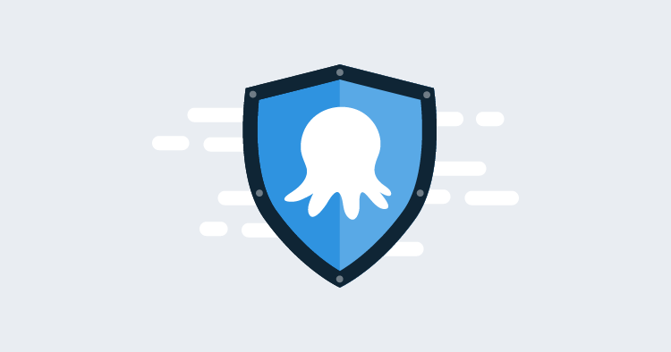
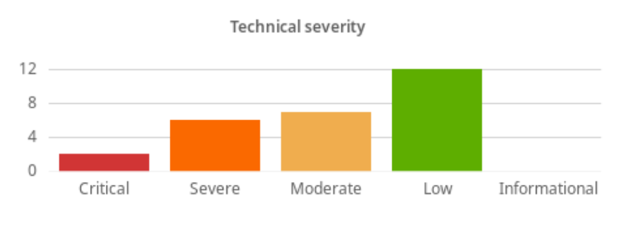
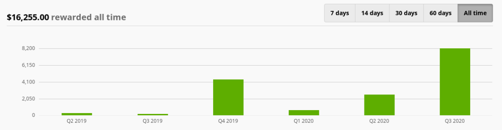

We’ve been running a private bug bounty program with Bugcrowd for over 12 months now, and we’re pleased to announce that we’re making it a public program that anybody can join. In this post, I’ll explain why we did this, and what numbers we’re seeing out of the program to date, and how you can join in.

Most teams with any online presence are familiar with security researchers stopping by to report something that isn’t quite right. Naturally, when they find important problems, we want to say “thanks!” for helping to make our website a safer place for everyone. 

We’ve always had a policy on [responsible disclosure](https://octopus.com/docs/security#disclosure-policy) to support this, and personally, I have a lot of time for bounty hunters and researchers, as I consider myself one!

Rewarding people fairly can be tricky to manage, though, and as traffic to your site increases, so can the number of people looking for that “thank you” feeling. We weren’t really set up to manage payments and the policies & procedures that are necessary for that. 

We already throw a lot of resources at keeping ourselves secure and writing good code, but striking up a relationship with Bugcrowd to produce a bounty program has allowed us to retain that positive feedback cycle, reduce any ‘noise reports’ and enables us to focus on the things we do best+.

## Our bug bounty journey so far

We reasoned this approach should run alongside our existing, regular penetration testing and not replace it. Deciding to start small and only focus researcher attention on our website (i.e., excluding the parts that run our Octopus instances) meant that we could learn how to manage the load as we turned up the number of researchers invited to the program.

Our private program kicked off in Q2 2019, and as of this writing, we’ve been helped by 883 researchers. Together, they hit us pretty hard and created over 200 submissions, 27 of which were serious enough to be in scope for a reward. The majority of these (12) were low severity; AKA P4 in Bugcrowd’s rating system. We chose not to reward P5 “informational” findings.

## Our current bug bounty statistics

Critical issues averaged at under 2 days to fix, with an overall average of 18 days when you include the low severity findings. Not bad, but room to improve!

We’ve rewarded over $16,000 in that time, and as you can see, it rises and falls a bit, mainly due to the number of researchers that get involved. 

## Join our bug bounty program today

Today we’re proud to announce we’re making our bounty program public to any and all who have the time and desire to help us out, and we commit to providing a safe harbor for researchers who follow our scope and Bugcrowd’s rules. We’d also like to thank the nearly 900 researchers who have joined over the past 12 months to help us get better and also to learn how to handle this kind of activity.

If you’d like to join in the fun, you can head on over to Bugcrowd and find us there in their researcher portal. There you will find our scope and rewards scheme, but I’ll save you some clicks and give you the low down here too:

### Scope

Our scope is strictly limited to our dedicated security testing environment: https://bc.octopus.com. Any testing outside of this scope will not be rewarded. We’ve kept our product (including the cloud product) out of this scope for now, but we’re considering how we can manage including it in the future. For now, we have regular external audits for the product.

For the full list of inclusions and exclusions [check the full brief on our Bugcrowd page](https://bugcrowd.com/octopus-og).

### Rewards

Rewards range from $150-$3000 depending on the severity of the findings, and we use the Bugcrowd VRT and CVSS scoring to help us make consistent judgments about that.

## Help us make Octopus safer

If you’re interested in helping keep Octopus secure, and you’d want some recognition for that work, I encourage you to check out our bounty program on Bugcrowd and join in! If you have any feedback on how we’re running this program, or if you’d like to report a vulnerability that is out of scope for this bounty program, please drop us a line over at security@octopus.com. 
