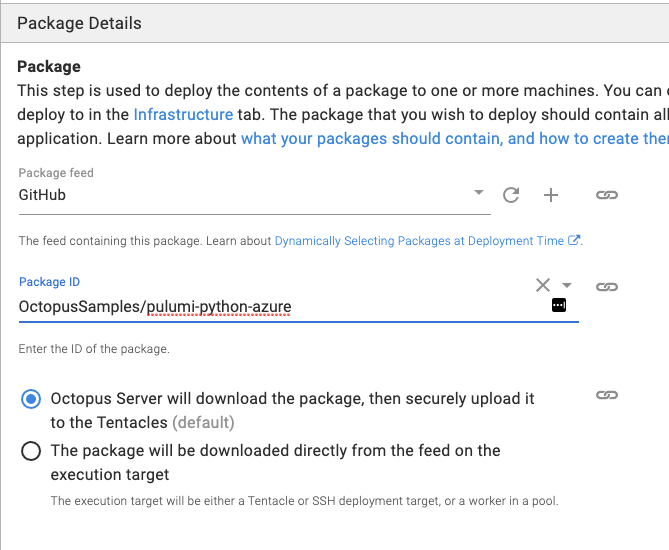

Creating software-defined infrastructure comes in many different shapes and sizes, including popular IaS tools like Terraform and configuration management tools like Ansible. One thing holds true throughout any tool - you want the ability to write the code in a language that you prefer.

That's where [Pulumi](https://www.pulumi.com/) comes into play.

In this blog post, you're going to learn how to utilize the power of Pulumi and Octopus Deploy to create an Azure Kubernetes Services (AKS) cluster using Python.

## Prerequisites

To follow along with this blog post, you should have the following:

- A Pulumi project already created, with specifications to point to Azure and Python.
- An Azure account. If you don't already have one, you sign can up for a 30-day free trial [here](https://azure.microsoft.com/en-us/free/).
- An Azure app registration. If you don't know how to create one, you can follow the instructions found [here](https://docs.microsoft.com/en-us/azure/active-directory/develop/howto-create-service-principal-portal).
- Intermediate level knowledge of Python.
- A GitHub account that you can start the Python code in that's shown in the upcoming section **The Code**.
- An external GitHub feed. If you do not have one set up, you can follow these [instructions](https://octopus.com/docs/packaging-applications/package-repositories/github-feeds).

## The Code

The first portion of having the ability to deploy code is writing the code and storing it somewhere. Depending on what you're using Pulumi for, there could be many software-defined infrastructure scenarios. The one thing that's always true, regardless of what the code is creating, it must be written and stored somewhere.

### Writing the Constants

When you're using Pulumi, you have a few options to pass in arguments at runtime:

- A config file
- From the command line
- Hard-coded in the code.

I like to take a bit of a different approach by creating a constants file. Think of it like a *parameters at runtime* file. It allows you to not hard-code the values into the code and have a standard location where you can change the values.

With the Pulumi project that you created per the prerequisites, create a new file called `aksParamConstants.py`

Once you create the constants file, you can add in the new constants. Keep the `keys` the same, but the `values` should change based on the environment you're working in.

```python
name = ('octoaks92')
location = ('eastus')
resource_group_name = ('resource_group')
dns_prefix = ("dns_prefix")
min_count = (1)
max_count = (1)
vm_size = ('Standard_D12_v2')
auto_scaling = (True)
clientID = ("azure_app_registration_client_id")
```

### Writing the Function

The Python code will utilize the Pulumi Azure Python SDK.

First, you'll start off by importing the packages that you'll need to create an AKS cluster.

The first library is for logging, which will be used to output any errors that occur. The second import is the Pulumi SDK itself. The third is the `[aksParamConstants.py](http://aksparamconstants.py)` file you created in the previous section, Finally, you're importing the core components from the `pulumi_azure` library to manage containers in Azure.

```python
import logging
import pulumi
import aksParamConstants as constants
from pulumi_azure import containerservice, core
```

The next portion of the code is the Python function itself.

The function calls the `KubernetesCluster` class that exists in the SDK and uses a few of the properties that you can initiate and assign values to.

```python
def createAKSCluster():
    config = pulumi.Config()

    if containerservice == None:
        logging.warning("Check to ensure the containerservice import is accurate")
    
    else:
        try:
            containerservice.KubernetesCluster(
                resource_name = constants.name,
                default_node_pool={
                    'min_count': constants.min_count,
                    'max_count': constants.max_count,
                    'name': constants.name,
                    'vm_size': constants.vm_size,
                    'enable_auto_scaling': constants.auto_scaling
                },
                dns_prefix=constants.dns_prefix,    
                resource_group_name=constants.resource_group_name,
                service_principal={
                    'client_id': constants.clientID,
                    'client_secret': config.require_secret('clientSecret')
                    }
                )

        except Exception as e:
            logging.error(e)
```

For a pull list of the properties that you can use, take a look at the SDK itself under the `KubernetesCluster` class, which you can find [here](https://github.com/pulumi/pulumi-azure/blob/master/sdk/python/pulumi_azure/containerservice/kubernetes_cluster.py).

The `__main__.py` in the Pulumi project should look like the following:

```python
import logging
import pulumi
import aksParamConstants as constants
from pulumi_azure import containerservice, core
    

def createAKSCluster():
    config = pulumi.Config()

    if containerservice == None:
        logging.warning("Check to ensure the containerservice import is accurate")
    
    else:
        try:
            containerservice.KubernetesCluster(
                resource_name = constants.name,
                default_node_pool={
                    'min_count': constants.min_count,
                    'max_count': constants.max_count,
                    'name': constants.name,
                    'vm_size': constants.vm_size,
                    'enable_auto_scaling': constants.auto_scaling
                },
                dns_prefix=constants.dns_prefix,    
                resource_group_name=constants.resource_group_name,
                service_principal={
                    'client_id': config.require('clientID'),
                    'client_secret': config.require_secret('clientSecret')
                    }
                )

        except Exception as e:
            logging.error(e)

createAKSCluster()
```

### Storing the Code in GitHub

Because Octopus Deploy needs to retrieve and pull the Pulumi project from a feed and eventually push that code to a deployment target, you can push the Pulumi project to a GitHub repo.

For example, below is a screenshot of my GitHub repo that is storing the Pulumi project.


Once you add the Pulumi package to GitHub, you'll want to create a new release of the code in GitHub. Octopus Deploy looks for specific release versions when using external feeds to pull in code.

## Setting up the Deployment in Octopus Deploy

Now that the code is written and stored in GitHub via the Pulumi package, it's time to deploy the package via Octopus Deploy.

### Authentication

The Pulumi step relies on having either an Azure account or an AWS account in the project variables for authentication to either cloud platform. Because of that, you'll need to add in a project variable of type Azure Account.

If you don't already have an Azure account added in Octopus Deploy, you can learn about how to do it [here](https://octopus.com/docs/infrastructure/deployment-targets/azure).

1. Go to the project variables.
2. Create a new variable and name is Azure.
3. Under value, go to CHANGE TYPE —> Azure Account.
4. Choose an Azure account that you want to use for authentication.

## Pulumi Secret Variable

When you authenticate to Azure from the Pulumi code, one of the mandatory parameters you need to pass in for AKS is an Azure app registration and client secret. Because the client secret is sensitive, you want a place to store it where the password will be safe.

1. Go to Project —> Variables.
2. Create a new variable called `clientSecret`.
3. Ensure that the type is Sensitive.
4. Add in the value of the Azure app registration client secret. 

### The Package Step

1. Open up a web browser and go to the Octopus Deploy portal.
2. Create a new project that you want to use to deploy the Pulumi package.
3. Go to Deployments —> Process.
4. Click the **ADD STEP** button.

The first step you'll want to add is the **DEPLOY A PACKAGE** step. What this will allow you to do is specify the external GitHub feed, point to the GitHub repo that the Pulumi package exists in, and push it to the deployment target.

For example:




  5. Under `.NET Configuration Transforms`, click the **CONFIGURE FEATURES** button.

  6. Uncheck the .NET options and select **Custom Installation Directory.** The Custom Installation Directory is where the Pulumi package will be pushed to and stored so the next step in the process can use it.

  7. Save the step.

### Installing the Pulumi SDK

Before running any Pulumi package, you need to ensure that the Pulumi SDK exists. The Pulumi SDK is what will also contain the Azure for Pulumi SDK

1. Create a new step to run an install. The step you'll want to use is **Run a Script**.
2. Under the **Inline Source Code** section, add in the following code under Bash: `pip install pulumi`

### The Pulumi Step

Next, it's time to add in the first Pulumi step. The Pulumi step is what will be used to create a secret and the AKS cluster. Instead of using a third-party step template, you're going to us the **RUN A SCRIPT** template to utilize the Pulumi commands in Bash.

For the RUN A SCRIPT step, you'll want to add in the standard parameters - step name, enabled, target roles, etc. The real action occurs when you get to the **Inline Source Code** section under **Script**.

There will be four lines of code you'll use:

1. First, you change directory (`cd`) into the directory where the Pulumi code exists.

```bash
cd /home/mike/pulumiaks/AKS-Create
```

  2. Next, you set up the secret variable and set the Pulumi configuration to use the secret variable that you set up in the section Pulumi Secret Variable.

```bash
secret=$(get_octopusvariable "clientSecret")
sudo /root/.pulumi/bin/pulumi config set --secret clientSecret $secret
```

  3. Last but not least, you run the `up` command.

```bash
sudo /root/.pulumi/bin/pulumi up --yes
```

### Running the Deployment

It's now time to run the deployment.

1. Click the green SAVE button.
2. Create a new release.
3. Save the release.
4. Choose a lifecycle and deployment where you would like to deploy the Pulumi package to.
5. Click the green **DEPLOY TO some_environment** button.
6. Click the green **DEPLOY** button.

Congrats! You have successfully created an AKS cluster using infrastructure-as-software.

## Conclusion

Infrastructure as software, AKA, what Pulumi does, has been a concept in the making for a while. You can think of SDKs like [Boto3](https://aws.amazon.com/sdk-for-python/), which is AWS's Python SDK to manage AWS services. The problem was that there was no way to store the state of the infrastructure, which made SDKs like Boto3 *hard to sell* to management.

With the power of Pulumi allowing you to not only define infrastructure and services with general-purpose programming language, but also giving you the ability to store state and the power of deployments with Octopus Deploy, we're slowly moving into a new age of infrastructure development.