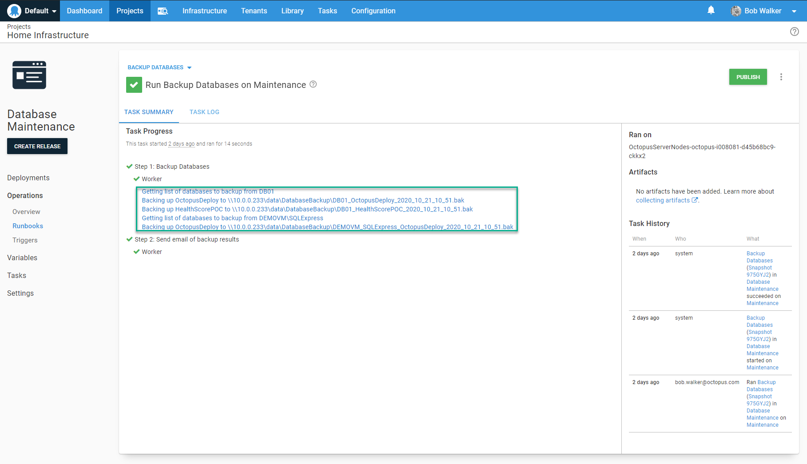

Since runbooks was releasd I've had the chance to create a number of them.  In doing so, I've learned some lessons I want to share.  In this article, I am going to create a runbook from scratch, and while doing so, I will walk through some recommendations and best practices based on those lessons.

## Defining the problem to solve

At Octopus Deploy we use AWS and Azure for our infrastructure.  In fact, at the time of this writing, the only infrastructure in the home office in Brisbane is a Wifi router and a network switch.  Despite being such heavycloud users, a number of us are running a hypervisor of some kind in our home offices.  This allows us to have a similar setup as our customers running all the time without costing the company a fortune.  For example, I have two permenant VMs, one running SQL 2019, another is a Domain Controller, DNS and DHCP server.  I'll spin up and down other VMs as I need them.  

The problem to solve: I have a couple SQL Servers running at the moment and I want to backup a number databases on each server to my NAS. 

## Designing the runbook process

Now that I have defined the problem, that doesn't mean it is time to start writing scripts or adding steps to Octopus Deploy.  Before doing that, I like to take a moment and answer these questions.

- What are the use cases and requirements?  Any gotchas to look out for?
- Has this been tried before?  If so, what worked and what didn't work?
- Where should the runbook run?
- Who will invoke and how will this runbook be invoked?  
- Should running the runbook require an approval?
- Should there be a notification?  If so, when should they go out and what information should be included?  How can I maintain a high signal to noise ratio?
- Is the runbook project specific?  Or is it generic?  
- Is there any information needing to be captured and retained?  What should the retention policy be?  Should I push anything to another service?

:::highlight
**Recommendation:** Take the time to go through a similar process.  A little prep work goes a long way.
:::

## Use cases, gotchas, and requirements

This is not the first time I've used Octopus Deploy to backup a set of databases.  In an earlier attempt I used the library step template, [SQL - Backup Database](https://library.octopus.com/step-templates/34b4fa10-329f-4c50-ab7c-d6b047264b83/actiontemplate-sql-backup-database).  It worked...okay, the main problem was the library step only supports one database.  To backup multiple databases I had to have multiple steps.  This resulted in a process I had to constantly tweak each time I added a new database.  It also uses SQL Management Objects [SMO](https://docs.microsoft.com/en-us/sql/relational-databases/server-management-objects-smo/sql-server-management-objects-smo-programming-guide?view=sql-server-ver15) which meant I had to install additional software.

Based on that past experience, my requirements are:
- Adding a database to a server means it is automatically added to this process.
- It should be easy to exclude databases from the process.  
- Backing up system databases should be optional.
- Outside of the tentacle, the VM running this process shouldn't require any additional software.
- It should be trivial to add a new server to the process.
- The SQL Server user performing the backup should only have permissions to do backups.  No schema changes, or writes allowed.
- The backup will be placed on a file share, not the VM's local drive.
- The process should clean any backups over a week old.

Before moving on, let's quickly examine the script that this runbook will run.  In order to solve a number of those requirements I need to be able to store some configuration options.  One of the little known features of Octopus Deploy is the ability to store JSON as a variable.  Being able to store JSON like this is great because I can define an object for my script to use.  You can do something similar in your instance by clicking on the `Open Editor` link.


The editor modal window allows you to select the type of text in the top right corner.  This will add syntax highlighting to the value window making it easier to see if the JSON is syntatically correct.


The script itself isn't super complex.  For each object in the array it will:

- Connect to the server
- Pull back a list of databases
- Check each database name against the list of databases to exclude and if they are a system database
- If the database isn't excluded it will run a simple backup command
- Finally it will clean up old database backups

```
$backupFolderLocation = $OctopusParameters["Project.Backup.FilePath"]
$backupFileDate = $(Get-Date).ToString("yyyy_MM_dd_HH_mm")
$backupItemList = $($OctopusParameters["Project.Backup.Information"]) | ConvertFrom-Json
$notificationContent = [System.Text.StringBuilder]::new()

foreach ($backupitem in $backupItemList)
{	
	$notificationContent.AppendLine("Server: $($backupItem.Server)")
    $connectionString = "Server=$($backupItem.Server);Database=master;integrated security=true;"    

	try
    {
      $sqlConnection = New-Object System.Data.SqlClient.SqlConnection
      $sqlConnection.ConnectionString = $connectionString

      $command = $sqlConnection.CreateCommand()
      $command.CommandType = [System.Data.CommandType]'Text'
      $command.CommandTimeout = 60000

      $command.CommandText = "select Name from sys.databases"
      $tablesToBackupDataAdapter = New-Object System.Data.SqlClient.SqlDataAdapter $command
      $tablesToBackupDataSet = New-Object System.Data.DataSet

      Write-Host "Opening the connection to $($backupItem.Server)"
      $sqlConnection.Open()

      Write-Highlight "Getting list of databases to backup from $($backupItem.Server)"
      $tablesToBackupDataAdapter.Fill($tablesToBackupDataSet)
      $databaseToBackupList = @()
      foreach ($row in $tablesToBackupDataSet.Tables[0])
      {
          $databaseNameToCheck = $row["Name"]        

          if ($backupitem.DatabasesToExclude -contains $databaseNameToCheck)
          {
              Write-Host "The database $databaseNameToCheck was found in the exclusion list, excluding this database"
              continue
          }

          if ($backupitem.ExcludeSystemDatabases -eq $true -and ($databaseNameToCheck -eq "master" -or $databaseNameToCheck -eq "model" -or $databaseNameToCheck -eq "tempdb" -or $databaseNameToCheck -eq "msdb"))
          {
              Write-Host "The database $databaseNameToCheck is a system database and exclude system databases is set to true, excluding this database"
              continue
          }

          $databaseToBackupList += $databaseNameToCheck
      }    

      Write-Host "The list of databases that will be backed up on $($backupItem.Server) is $databaseToBackupList"
      foreach ($databaseToBackup in $databaseToBackupList)    
      {
          $backupFileName = "$($backupFolderLocation)\$($backupItem.Server.Replace("\", "_"))_$($databaseToBackup)_$($backupFileDate).bak"

          $message = "Backing up $databaseToBackup to $backupFileName"
          Write-Highlight $message
          $notificationContent.AppendLine("    $message")
          $command.CommandText = "BACKUP DATABASE [$($databaseToBackup)]
          TO DISK = '$backupFileName'
             WITH FORMAT;"
          $command.ExecuteNonQuery()

          Write-Host "Backup complete, removing any backups a week old"
          $fileToRemoveList = Get-ChildItem -Path "$($backupFolderLocation)" -Filter "$($backupItem.Server.Replace("\", "_"))_$($databaseToBackup)_*"
          foreach ($fileToRemove in $fileToRemoveList)
          {
              $dateDiff = $(Get-Date) - $fileToRemove.CreationTime
              if ($dateDiff.TotalDays -gt 7)
              {
                  $message = "Removing $($FileToRemove.FullName) because it is $($dateDiff.TotalDays) days old"
                  Write-Host $message
                  $notificationContent.AppendLine("    $message")

                  Remove-Item $fileToRemove.FullName
              }
          }
      }

      $sqlConnection.Close()
    }
    catch
    {
    	$notificationContent.AppendLine($_.Exception.Message)
    }
    
    $notificationContent.AppendLine("")
    $notificationContent.AppendLine("")
}

Set-OctopusVariable -name "NotificationContent" -value $($notificationContent.ToString())
```

## Where should the runbook run?

The runbook will invoke `t-sql` commands over port 1433 to back up the database.  This means tentacles don't have to be installed directly on the SQL Server (in fact our [docs](https://octopus.com/docs/deployment-examples/database-deployments/configuration/tentacle-and-worker-installation) recommend NOT installing a tentacle on the same server as SQL Server).  

One of the requirements is the user performing the backup should only have permissions to do the backup.  In addition, several requirements indicate this process should be easy to use and trivial to maintain.  Both of those requirements can be solved by running the tentacle as a [domain account](https://octopus.com/docs/infrastructure/deployment-targets/windows-targets/running-tentacle-under-a-specific-user-account).  That domain account will be assigned `db_backupoperator` and `db_datareader` [roles](https://docs.microsoft.com/en-us/sql/relational-databases/security/authentication-access/database-level-roles?view=sql-server-ver15#fixed-database-roles).  

And just like the [docs](https://octopus.com/docs/deployment-examples/database-deployments/configuration/tentacle-and-worker-installation recommend, tentacle will be registered with Octopus Deploy as a [worker](https://octopus.com/docs/infrastructure/workers).  To isolate these workers from normal database deployment workers, I'll create a new worker pool `Database Backup Worker Pool`.  


:::highlight
**Recommendation:** Run runbooks on workers as close to the destination as possible.  If you're in Azure, run the worker on an Azure VM.  If you're in AWS, then have an EC2 instance hosting a worker.  If you're running on-premise, then have a worker running on-premise.  Runbooks can be used to perform very low-level tasks.  Configuring workers like this will help you lock them down.
:::

## Invoking the runbook

I don't want to think about backups, they should happen automaticaly.  A trigger will run the runbook every night at 9 PM.  That's the easy part.  The tricky part is the environment.  This is a runbook that will be cross-cutting across all environments.  To keep it simple, I'll create a new environment `Maintenance` for this runbook.  I could've used `Production` but that would've been confusing as it would've connected to a SQL Server in the `Test` environment.  


:::highlight
**Recommendation:**  A maintenance environment can be handy for other cross-cutting runbooks.  However, this means there is a process with the ability to touch both `Test` and `Production` environments.  Do a security review of the process to make sure you aren't accidentially exposing yourself to additional risk.
:::

## Approvals and Notifications

This runbook is designed to be hands off.  An approval is the opposite of handsoff.  But I would still like to be notified of the status.  Especially if there is an error.  The process will always send out an email when it is finished.  Even if it fails.  That can be accomplished by setting the run condition to be `Always Run`.


Although it is hands-off, in a real-world use case, it might make sense to require approval if a person triggers the runbook.  Thankfully, approvals can be conditional in Octopus Deploy using variable run conditions.  The syntax to trigger a manual intervention when a person invokes the runbook is `#{unless Octopus.Deployment.Trigger.Name}True#{/unless}`.  What this is saying in normal people terms is unless this is triggered by a well a trigger, then run this step.


:::highlight
**Recommendation:** Leverage variable run conditions and [output variables](https://octopus.com/docs/projects/variables/output-variables) to help enforce business rules.  When business rules aren't met an approval is required.  If all the rules are met, the run is auto approved.  This helps keep the signal-to-noise ratio high for the approvers.  See my blog post on running [ad hoc SQL Scripts](https://octopus.com/blog/database-deployment-automation-adhoc-scripts-with-runbooks) for a real-world example.
:::

## A generic runbook

No surprise here, this is a generic runbook, not a project specific runbook.  A project specific runbook is one that is designed to work with only one project.  It runs on targets with specific roles.  An example of a project specific runbook would be one to refresh the cache of a web application.  Some applications expose endpoints to refresh the cache, others require the application pool to be reset.  

:::highlight
**Recommendation:** Group similar generic runbooks into runbook only project(s).  Place those runbook only projects into a unique project group.  In the screenshot below each project has 1 to N runbooks.  The hypervisor project has runbooks for managing the hypervisor, the NAS project has runbooks for backing up files onto the NAS and from the NAS to Azure file storage.
:::


## Logs and retention policy

The eagle eyed reader will notice the script is capturing logs and setting an output variable.  The contents of that output variable is sent in the results email.  It also uses [write-highlight](https://octopus.com/docs/deployment-examples/custom-scripts/logging-messages-in-scripts) to add text to the task summary.  



When combined with the audit log this perfect for my use case.    

As this backup is happening each day, I don't need to keep these logs around for very long.  I reduced the retention policy from the default of 100 to 10.


This will delete the run, but not the task in the audit log.  If I need to look at the run history I can go to the audit log and find it using advanced filters and some date filters.


:::highlight
**Recommendation:** Retention policies are configured per runbook.  Double check with your company's audit policy to ensure Octopus Deploy doesn't clean up a run before it is supposed to.
:::

## Conclusion

Runbooks are a great tool to enable self-service DevOps.  Like any tool it is possible to mis-use it.  My hope is these recommendations help you design runbooks you can use in your Octopus Deploy instance.  

One final point before signing off.  Runbooks shouldn't be designed in a silo.  If you are a developer collaborate with the appropriate operations person (or vice versa).  Start that collaboration during the design phase.  This ensures as many requirements are known at the start, and you end up with a process everyone is comfortable supporting.  

Until next time, Happy Deployments!