## Tl;dr

I wanted to write about self-service database environment creation.

It’s crucial to any development process and has an enormous impact on productivity, quality, and security. It’s also a fascinating technical challenge, often combining infrastructure-as-code, test data management, automation, and interesting data virtualization techniques. And since theory is largely hypothetical unless it’s turned into practice, I wanted to include a step-by-step walk-through so that you can create your own proof of concept.

Needless to say, this post got a bit long. To break it down, I followed [Simon Sinek’s *Why? How? What?*](https://www.ted.com/talks/simon_sinek_how_great_leaders_inspire_action?language=en) concept to split it into bite-sized sections. You can start at whichever part interests you the most:

- [**Why?** This is important](#why) 
- [**How?** Introducing the tech](#how) 
- [**Walk-through:** Using Octopus Runbooks and SQL Clone to provision development and test databases](#what) 

## Why? This is important {#why}

In 2018 Nicole Forsgren, Gene Kim, and Jez Humble gave us [Accelerate](https://www.amazon.co.uk/Accelerate-Software-Performing-Technology-Organizations/dp/1942788339). The book articulates 4 key metrics demonstrated to predict superior IT performance and positive business outcomes (including profitability, market share, and productivity) in any organization. Those metrics are:

- Deployment frequency
- Lead time
- Mean time to restore (MTTR)
- Change failure percentage

The authors clearly explain how, by focusing on these metrics, businesses invert the core chronic conflict between dev and ops (between speed and safety) and create a virtuous cycle of smaller, more regular, and safer releases. This results in better agility, innovation, and consequently, better business outcomes.

To improve lead time, it's necessary to understand all the work required to get a task from the backlog into production. There's always a bottleneck or constraint somewhere in the process creating delays, crippling lead time, and resulting in significantly larger amounts of work in progress (WIP), bigger and more complicated releases, and more frequent disasters.

In [Beyond the Phoenix Project](https://www.audible.co.uk/pd/Beyond-the-Phoenix-Project-Audiobook/B07B7CH7FQ?source_code=M2M30DFT1BkSH11221601A7&&ipRedirectOverride=true), Gene Kim remarks that:

> What I find so amazing, is that as an organization goes from code deployment lead times that are measured in months, maybe even in quarters, down to minutes, the constraint moves in some pretty predictable ways.

He goes on to tell us that the constraint tends to land in the following places, in order:

1. Environment creation
1. Code deployment
1. Testing
1. Architecture
1. Innovation

I help people to manage their database code. From where I’m sitting, Gene is bang on the money.

Many folks are lumbered with shared dev databases. For these folks, managing the concurrent development of multiple pieces of work is a grisly quagmire of unnecessary bureaucracy, tedious processes, and expensive mistakes. This is exacerbated by poor lead times and large amounts of WIP.

Old test code and big, complicated, and/or long-since abandoned or unfinished pieces of work hang around on the dev and test databases. At the same time, production hotfixes are often missing. This undermines all testing, and any attempts at deployment automation are hamstrung by the requirement to leave all that garbage alone – just in case. This simultaneously makes the deployment process (whether it’s manual or automated) more complicated and more unreliable, further feeding the core chronic conflict.

To break this vicious cycle, and achieve faster lead time and deployment frequency, it's essential to move to a model where disposable dev and test environments, including databases, are available to developers and testers on-demand and discarded after the work has been completed. This ensures everyone is looking at a true version of the code, uninfected with the garbage that typifies shared environments.

This has a transformative effect on your IT performance because (for most organizations) it helps to solve many of the challenges associated with the first 3 bottlenecks, which results in order of magnitude improvements to lead time. What inevitably follows is a big improvement to deployment frequency.

What’s more, by making significant progress against Accelerate’s first 2 (speed-oriented) key metrics, you almost certainly witness simultaneous improvements against the second 2 (safety-oriented) metrics. These metrics replace the core chronic conflict with a virtuous cycle where speed enhances safety, and safety enhances speed.

However, self-service provisioning of disposable databases often feels like the hardest problem to solve, especially if you have large and/or sensitive data to consider. At the same time, it’s possibly your best opportunity to significantly improve the performance of your IT team and, consequently, your business outcomes.

This post introduces you to some of the tech that might help. I finish with a walk-through to set up a proof of concept solution using Octopus Deploy and [Redgate SQL Clone](https://www.red-gate.com/products/dba/sql-clone/). If you're not already using Octopus, you can [start a free trial](https://octopus.com/start). [Redgate SQL Clone](https://www.red-gate.com/products/dba/sql-clone/) comes with a free trial too.

## How? Introducing the tech {#how}

[Rob published a great overview of operations runbooks](https://octopus.com/blog/operations-runbooks).

Octopus Runbooks are a way to organize, audit, and share the scripts and processes for performing regular operations tasks. They aid efficiency, knowledge sharing, and reduce errors. It's a platform to schedule tasks or to enable users to trigger them on demand without needing personal access to the associated servers, scripts, or other artifacts.

This is a great platform to build a self-service environment creation process for a developer or tester.

For example, runbooks allow a DBA to curate a source data image and provisioning process at a time that suits them. The source data image would be appropriate for developers or testers to use, and the developers/testers could consume the source image on their own schedule, without bothering the DBA who might be (for example) busy working on a sev-1 outage. This simultaneously reduces delays for dev teams and interruptions for ops folks. Fewer support tickets is a win for everyone. More importantly, we just removed the first major constraint in Gene Kim’s list (above).

Runbooks by themselves, however, don’t have any database smarts. The user needs to figure out how to create a source image and how to automate its provision to an appropriate dev/test instance. That’s a challenge for a couple of reasons.

For example, you might start by using a production backup for the source image and a runbook to restore that backup to the developer’s workstation. This immediately throws up a couple of challenges:

- **Data protection:** Restoring sensitive production data indiscriminately around your dev and test estates, and potentially on developer workstations, is the sort of bad practice that data breaches are made of.
- **Disk space:** If your production database is any larger than about 100GB you'll either be tempted to use a shared dev/test instance (don’t do this, see above) or you’ll need to rent/buy a lot of infrastructure to host all these dev/test databases. That has the potential for a high up-front cost as well as a painful administrative overhead. You’ll also waste a lot of time and bandwidth copying all those 1s and 0s all over the place.

Enter third-party database masking and cloning tools like [dbaclone](https://github.com/sqlcollaborative/dbaclone) (open source) and [Redgate SQL Provision](https://www.red-gate.com/products/dba/sql-provision/).

Redgate SQL Provision has two components: [Data Masker for SQL Server](https://www.red-gate.com/products/dba/data-masker/) (to solve the data protection problem) and [SQL Clone](https://www.red-gate.com/products/dba/sql-clone/) (to solve the disk space problem).

dbaclone is a free alternative to Redgate SQL Clone, and it works in broadly the same way. However, it lacks various significant features, including the user friendly UI, the fine-grained user permissions, and (at the time of writing) there isn’t an Octopus Deploy step template for it. It doesn’t include any data masking functionality, but it is designed to be used in collaboration with [dbatools](https://dbatools.io/), [which does](https://docs.dbatools.io/#Invoke-DbaDbDataMasking).

For simplicity, for the rest of this post, I use SQL Clone instead of dbaclone, but if you want to try dbaclone instead, you should find the general patterns and practices advocated here work for you too. You just need to write your own PowerShell scripts instead of using the SQL Clone step templates that you’ll read about below. (And when you do, why not be a good citizen and publish your step templates to the public [Octopus Deploy Library](https://library.octopus.com/listing) so others can benefit.)

There’s [a detailed explanation of how SQL Clone works](https://documentation.red-gate.com/clone/getting-started/how-sql-clone-works) on the Redgate documentation site which I encourage you to read if you invest in either SQL Clone or dbaclone (which works the same way).

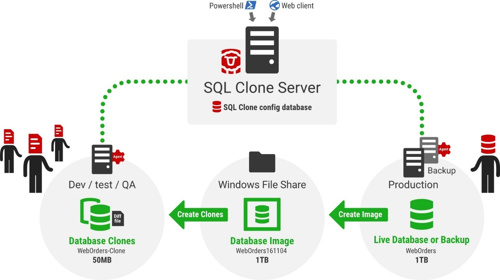

The short version is that SQL Clone reads a source database or backup file, that can be anywhere up to 64TB, and restores it into a Virtual Hard Disk (VHD) on a file share which your developers should have read access to. That process is slow, and the VHD needs to be big enough to hold the full database.

When you have your VHD, it’s lightning-fast and requires next to zero disk space to create a _Differencing VHD_ (or _diff file_), which is effectively a fancy redirect back to the source VHD. However, it has one important difference. Any changes you make to the database are stored in the local diff file, not the source VHD on the fileshare. This means each developer can write to the database without effecting the source image or any other developers. They effectively have their own mini sandbox, which we call a “clone”. 

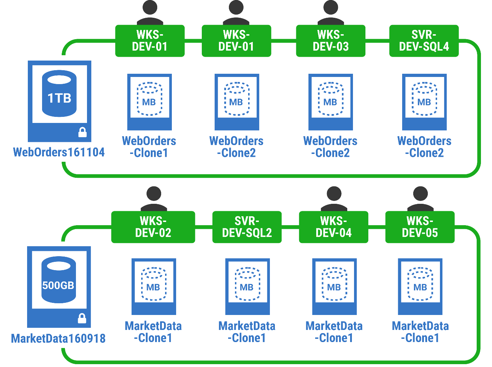
 
Since it’s so easy to respawn a clone, even if the source database is enormous, it doesn’t matter if the developer breaks anything. They simply delete it and pull down a new clone, a bit like a local git repo. It only takes a few seconds and barely takes up any space on disk. This is a safe place for development, testing, troubleshooting, or experimenting.

It feels like magic when you start using it, but it’s the same underlying technology or concept that VMs, containers, and data centers use to make efficient use of the available system resources.

The catch is that if the developer starts rebuilding big tables, the changes will be stored in the local _diff file_. That developer will quickly run out of disk space. That makes this a great solution for the development and testing of most schema changes, but not for bulk data operations, such as testing full ETL loads or data masking operations.

This means that the data masking process needs to run either before or during the creation of your source image and not on the clone itself. This also has the benefit of being a much more reliable and manageable foundation for any serious data governance since the sensitive data never needs to leave the production environment.

I’m not going to discuss data masking here. It’s a big enough topic to deserve its own blog post; [which I wrote here](https://www.red-gate.com/blog/audit-and-compliance/traditional-database-security-doesnt-protect-data). For more information about Data Masking with SQL Provision, check out the [Redgate University](https://www.red-gate.com/hub/university/courses/sql-provision/sql-provision/introduction-to-sql-clone/creating-clones).

You also want to ensure the clone is located physically close to the source image. As a thought exercise, let’s imagine that your company decided to ask all your developers to work from home for an extended period of time. You might want to consider whether it would be wiser for developers to use centrally located infrastructure for hosting their development sandboxes, rather than relying on a flaky VPN and your developers’ home Wi-Fi to handle the connection between the VHD and the _diff file_. [Chris Unwin talks in more detail about that](https://chrisunwin.home.blog/2020/04/16/cloning-from-home-a-consideration/).)

To summarize, Octopus Runbooks and SQL Provision are a perfect match for managing this dev/test database provisioning process for various reasons:

- **Separation of duties:** DBAs, ops, or data governance folks can curate the masking and imagine process, but dev and test folks pull the trigger to deploy/provision the databases.
- **Defending the security perimeter:** The fact that security can be managed independently in SQL Clone and in Octopus Deploy means that there is minimal chance that developers will be accidentally granted access to any production data. The security in SQL Clone will be based entirely on data governance concerns, whereas the security in Octopus will be based on development requirements.
- **Self-service:** Dev and test folks can instantly access the databases and data they need to do their work without hand-offs, delays, or interruptions.
- **Breaking the constraint:** At the time of writing, Octopus Deploy and Redgate SQL Provision are the best tools to help you to solve the self-service database provisioning problem and break the most common first constraint (environment creation) that results in poor lead times and fuels the core chronic conflict.

## Walk-through: Using Octopus Runbooks and SQL Clone to provision development and test databases {#what}

This post now assumes that you have Octopus Deploy and SQL Clone installed. If you haven’t, follow these instructions before continuing:

- [Installing Redgate SQL Clone](https://documentation.red-gate.com/clone4/sql-clone-installation-architecture)
- [Installing Octopus Deploy](https://octopus.com/docs/installation)

### Prep work in SQL Clone

This post also assumes you already created an image.

If you haven’t done this yet, you can try it with any database you like. However, if possible, I recommend using [the public StackOverflow database](https://www.brentozar.com/archive/2015/10/how-to-download-the-stack-overflow-database-via-bittorrent/) for your first proof of concept since it’s easy to get hold of, large enough to see the benefit of the cloning technology, but small enough to avoid significant challenges. In a real-world set-up, I'd use a recent production backup as the source for my image.

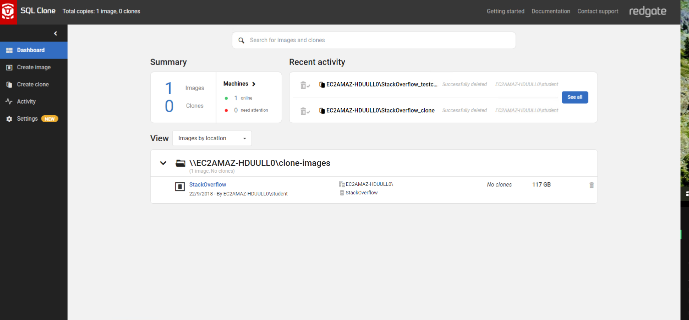
 
If your source database contains sensitive data that shouldn't exist in the development or test domains, consider running a SQL script or Redgate masking set as part of the imaging process to ensure that the image is appropriately anonymized. I won't cover masking in this post since it’s a big topic in its own right, and the StackOverflow database only contains public data.

If you have not yet produced an image with SQL Clone, follow these instructions:

- [Creating a Masking Set with Redgate Data Masker (optional)](https://www.red-gate.com/hub/university/courses/sql-provision/sql-provision/data-masker-user-interface/creating-saving-masking-set)
- [Creating a SQL Clone Image (required)](https://www.red-gate.com/hub/university/courses/sql-provision/sql-provision/introduction-to-sql-clone/creating-images)

After you create your image, create a clone for your image using the SQL Clone UI before starting your runbook. 

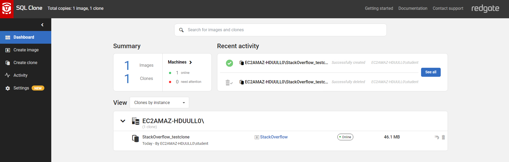
 
This is a good idea for a few reasons:

1. It will help you to understand how the cloning process works. (It pays to understand how to perform a task manually before you try and automate it. For example, you get practice with the terminology in a contextual UI, before you abstract the config away into Octopus Deploy variables.)
1. Some of the steps, such as adding a target server instance, need to be performed once from the UI before they can be automated using the PowerShell cmdlets. By creating a clone using the UI first, that should flush out all those issues.
1. If you hit any issues, it’s easier to fix them if you are closer to the thing that’s failing. When you get started, as you're still learning the ropes, it's probably easier to troubleshoot SQL Clone from inside the SQL Clone UI.

You can create your first clone using the UI by following these instructions:

- [Creating your first clone using the SQL Clone UI](https://www.red-gate.com/hub/university/courses/sql-provision/sql-provision/introduction-to-sql-clone/creating-clones)

When you know you can create a clone from your image using SQL Clone, you're in a good position to try automating it using Octopus Deploy.

### Prep work in Octopus Deploy

This post assumes you have a working knowledge of Octopus Deploy environments, Tentacles, and deployment targets ([documentation](https://octopus.com/docs/infrastructure)).

Configure a deployment target that has a network connection and can authenticate against SQL Clone. Give this target the role `sqlclone` and add the target to one or more environments (e.g., dev/test).
 
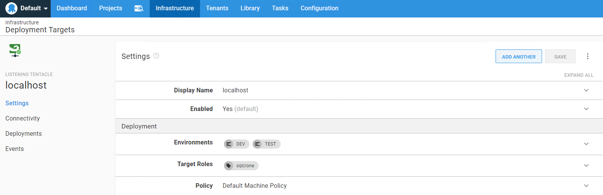

To test the connectivity in advance, try running the Connect-SqlClone PowerShell cmdlet manually from the VM your Tentacle is running on ([documentation](https://documentation.red-gate.com/clone/automation/powershell-cmdlet-reference/connect-sqlclone)). Try running the command as the user that your Octopus Tentacle runs as. If you have any issues connecting, check your network, firewall, and SQL Clone credentials.

Alternatively, simply push on to the next step. You'll find out soon enough if you have any connectivity issues.

### Creating the runbook

If you already have a project to deploy your database, you can add your runbook there. If not, create a project for your database in Octopus Deploy ([see these instructions for help](https://octopus.com/docs/projects)).

Now you can create a runbook in your project. Select **Runbooks** from the menu on the left, and then click the green **ADD RUNBOOK** button in the top right corner.
 
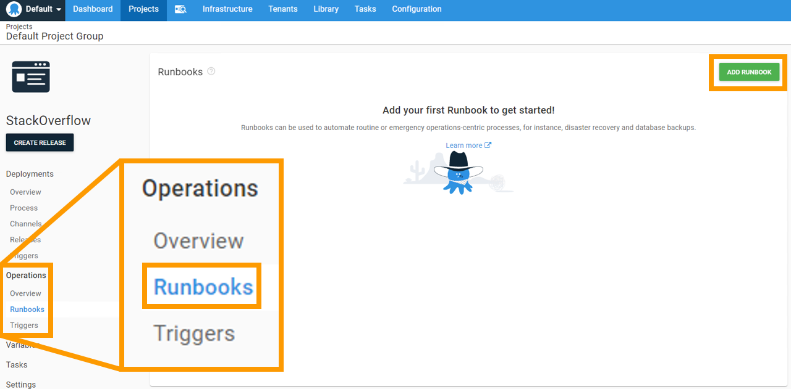

Give the runbook a name and a suitable description:

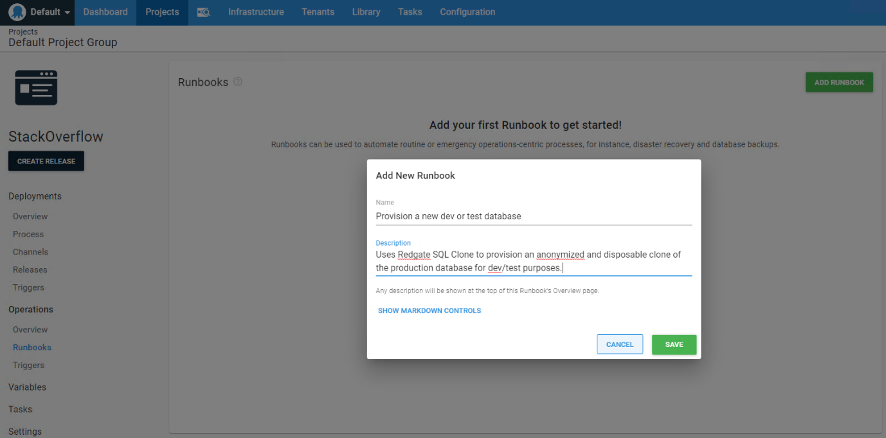

Next, define your runbook process. A process is a list of automated steps that Octopus executes on an Octopus Tentacle to complete the task at hand. (Similar to a process for a regular deployment.)

Click **DEFINE YOUR RUNBOOK PROCESS** and then **ADD STEP**. You're presented with a bunch of off-the-shelf steps that you can add to your runbook process. Type `redgate sql clone` into the search bar and tap enter. You should find a bunch of SQL Clone step templates from the [Octopus Deploy Community Step Template Library](https://library.octopus.com/listing).

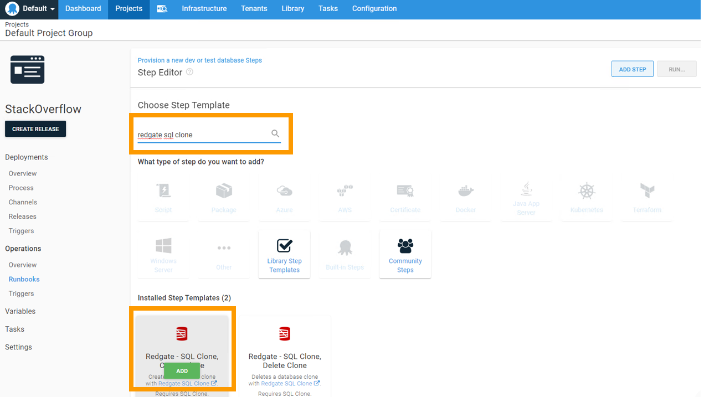
 
Hover over the **Redgate – SQL Clone, Create Clone** step template, and you either see a green button that says **ADD** or **INSTALL AND ADD**, depending on whether or not the step template is already installed on your Octopus Deploy server. Click the green button.

([If you want to inspect the code before installing, you can do so here](https://library.octopus.com/step-templates/96d88bbf-2e0a-4630-b4b6-bd179effedd7/actiontemplate-redgate-sql-clone,-create-clone). All 4 SQL Clone step templates are mostly copy/paste jobs from the example PowerShell snippets on [the Redgate documentation pages](https://documentation.red-gate.com/clone4/automation/powershell-worked-examples).)

In the Step Editor, enter `sqlclone` for **On Targets in Roles**:

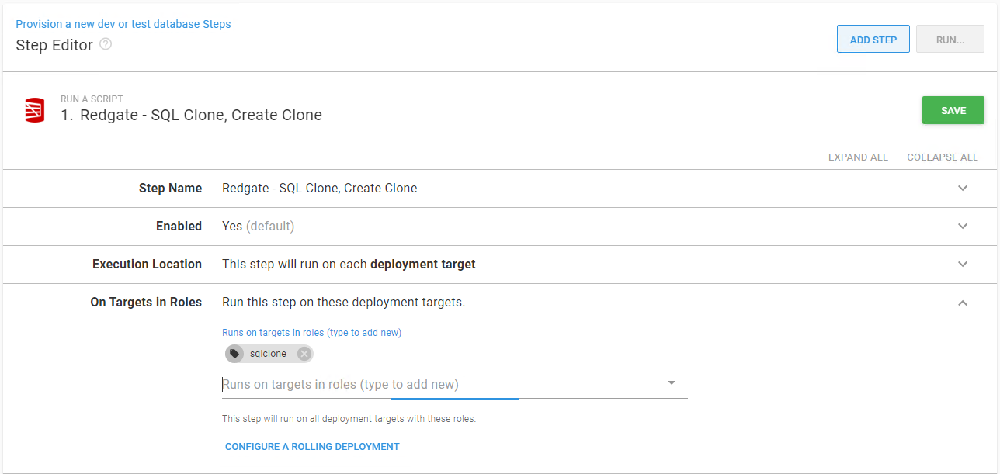
 
For the SQL Clone parameters, try to use variables to simplify the config. In my case, I’m using Windows Auth to authenticate against SQL Clone, so I left the **SQL Clone User** and **SQL Clone Password** fields blank.

I didn't use a **SQL Clone Template** ([documentation](https://documentation.red-gate.com/clone/modifications-during-provisioning/clone-modifications)). However, these might be useful for tasks such as:

- Inserting some dev/test friendly test cases into some of my tables.
- Modifying the database security depending on whether this is being run in the dev or the test environment, especially if the image only includes the production database users and role members, etc.

Remember, the template is executed against the clone, not the image, so it inflates the size of the _diff file_. Do not make bulk changes to the data or rebuild indexes on any large tables in a template file or your developer’s hard drives will pay the price.

Generally, your clones will want to use the production database name, however, in some cases, that can cause issues. For example, to create multiple clones on the same instance, you need to give them different names. You wouldn’t want to accidentally replace any pre-existing dev/test databases. For this reason, I used special variables for `SQL Server` and `Clone Name`.

Here’s my config:

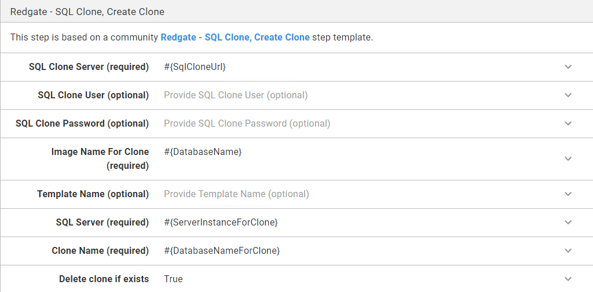
 
Note that if your developers are working on their own instances, they'll want to set the `SQL Server` variable at run time. Similarly, if your developers are all going to be building their clones on a shared dev/test instance, or if they're likely to want to use multiple clones at the same time, (for example because they are working on a couple of tasks concurrently or they want to compare a few different solutions to a problem), they might want to select a custom `Clone Name` at run time.

For that reason, you shortly set the 	`#{ServerInstanceForClone}` and `#{DatabaseNameForClone}` variables to be settable at runtime. But before you do, you must set your step **Conditions**. I only want to run this in dev or test, so I specified accordingly:

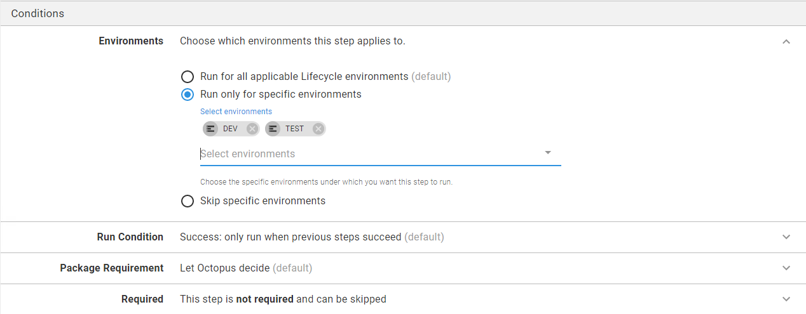
 
Review all your step config and click the green **SAVE** button in the top right corner.

Your process is now complete. However, before you can run it, you need to go back and set your variables. Select **Variables** from the menu on the left and provide values for each of the variables we used above. Here are mine:
 
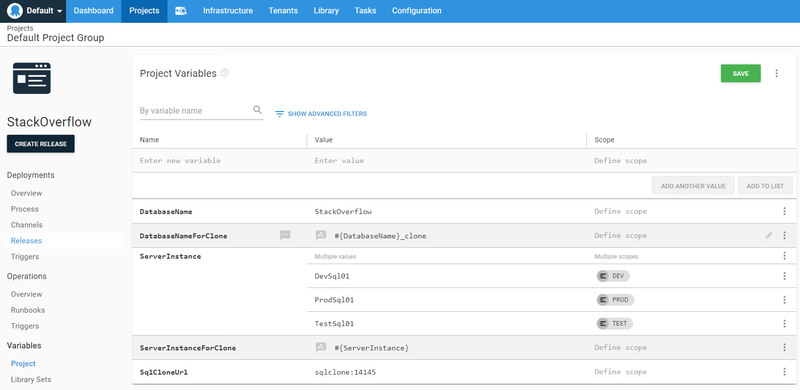

Since I was adding this runbook to an existing project, I already had the `#{DatabaseName}` and `#{ServerInstance}` variables, but I needed to add the `#{SqlCloneUrl}`, `#{DatabaseNameForClone}` and `#{ServerInstanceForClone}` variables. For the latter 2, as I was typing the value I clicked the **OPEN EDITOR** option:

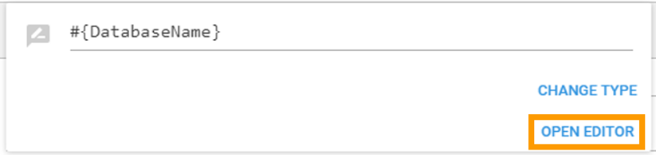
 
From the full editor, I can select the **Prompt for value** checkbox. This will ensure the values are settable at runtime.

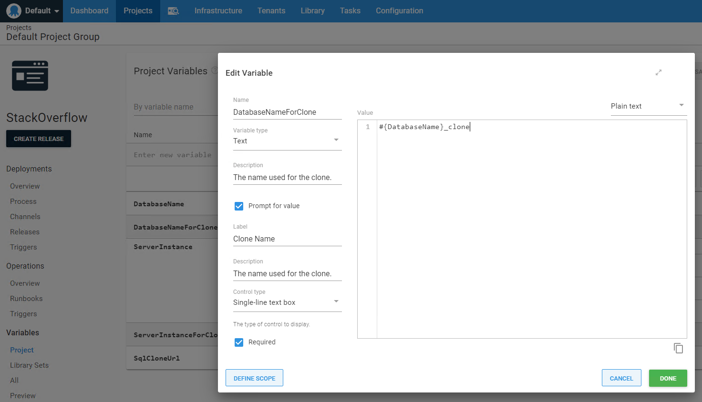
 
### Running your runbook:

After you set all your variables, you're ready to run your runbook.

From your project, select **Runbooks** from the menu on the left-hand side, and then click the **RUN** button next to your runbook.

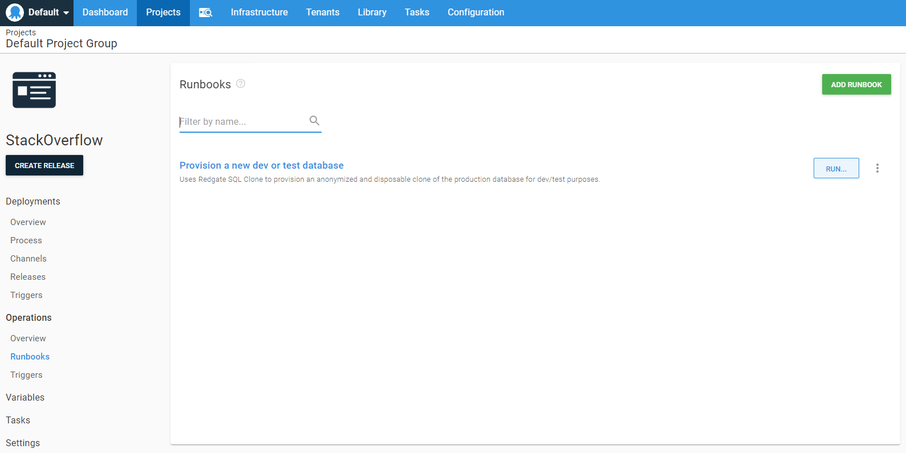

Provide the desired environment and prompted variables. With luck, you see green:
  
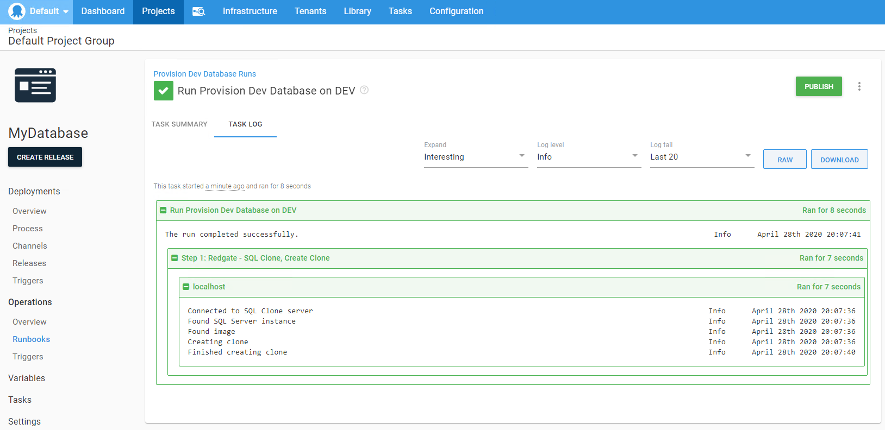

It’s now super easy for your team to provision their own 64TB development and test databases on demand on a commodity laptop or a cheap VM.

### Extensions:

After you’ve created your runbook for creating clones, 2 further runbooks spring to mind.

1. You probably want a similar runbook to delete clones. (Check out the [Delete Clone step template](https://library.octopus.com/step-templates/b13ba90b-3e67-4175-aad4-9531783c4c11/actiontemplate-redgate-sql-clone,-delete-clone).)
1. You probably want a runbook to create a new SQL Clone image and to purge old images. (Check out the [Create Image](https://library.octopus.com/step-templates/4ff62eff-f615-453e-9a14-ca7bf67cb586/actiontemplate-redgate-sql-clone,-create-image) and [Delete Image](https://library.octopus.com/step-templates/5ba6d0f2-04f1-4b52-adbf-9cf23b12ee58/actiontemplate-redgate-sql-clone,-delete-image) step templates.)

Here’s my completed list:

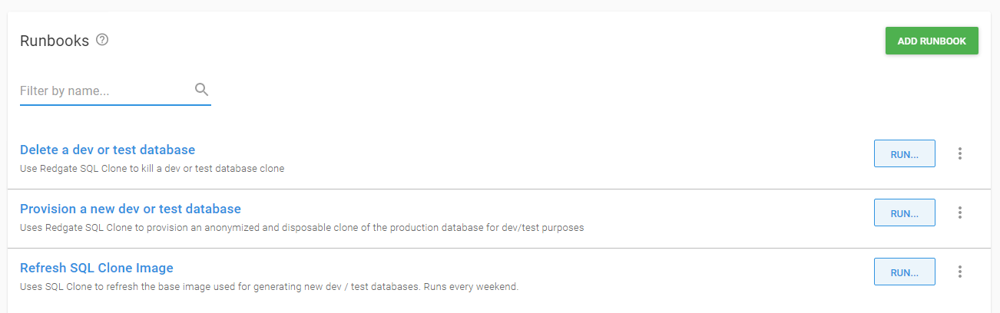
 
What’s more, you probably want to set the **Refresh SQL Clone Image** runbook to run on a schedule ([documentation](https://octopus.com/docs/projects/project-triggers/scheduled-runbook-trigger)) to ensure clones are always using relatively up to date data. Note that while creating clones should be lightning fast, the image creation tends to take longer. That means it’s typically an overnight/weekend job. 

You should agree the cadence for the image refresh with your dev/test teams. This is important as they need to re-provision their clones after each refresh. It might be convenient for them to run the image refresh at the end of each week or dev sprint so that they can start each new week/sprint with a fresh clone.

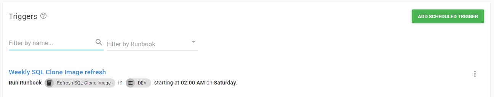
 
This enforces various good practices, such as ensuring all code is committed to source control reasonably frequently and that dev/test databases remain reasonably consistent. Also, each time a developer deploys their latest dev or test source code to a new clone, you're effectively practicing your production deployment, so you find that deployment issues tend to be caught much earlier - “on my machine”.

Of course, this entire post is based on a single database for simplicity. In a real world scenario, you might have multiple databases, often with cross-database dependencies (ouch). The beauty of combining SQL Clone and Runbooks is that your runbook can provision all the required databases, so you know you're never missing a dependency.

And all those databases/clones need to live on a SQL Instance, which needs to live on a VM or container somewhere. And those VMs and containers need to live on some infrastructure either with your cloud provider or on your own bare metal.

It would be a great idea to either extend these runbooks, or combine them with other runbooks so that you can effectively respawn your entire dev, test, and production environments at the click of a button. If that interests you, here’s some further reading: 

- [Using Infrastructure as Code with Operations Runbooks](https://octopus.com/blog/runbooks-with-infrastructure-as-code)
- [Automating SQL Server Developer installation](https://octopus.com/blog/automate-sql-server-install)

## What's next?

If you’ve made it this far, I hope you’ve been inspired to action.

To learn more about database environment creation, and how it fits into the broader DevOps strategy, you may enjoy my blog series about safe schema updates. It starts with [Database delivery hell](https://octopus.com/blog/safe-schema-updates-1-delivery-hell).

In particular, you may be interested in [Part 6](https://octopus.com/blog/safe-schema-updates-6-provisioning-databases), which tackles database environment provisioning.

!include <q2-2022-newsletter-cta>

Happy deployments!