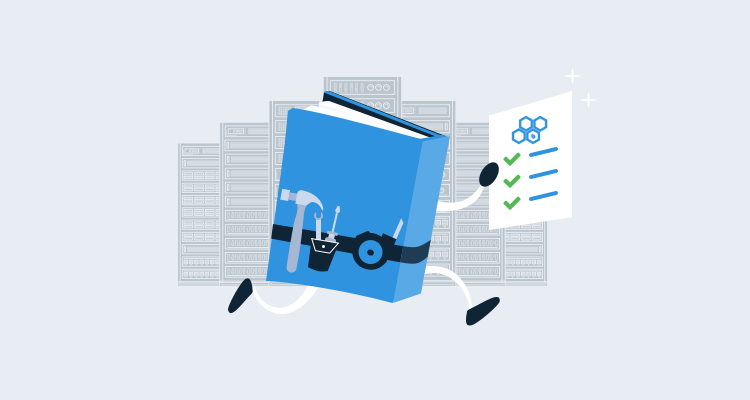

Breaking down the barriers between developers and operations is the cornerstone of the DevOps philosophy.  Developers want to deliver their code quickly and safely, and in order to do so, they need to perform common administrative tasks that are often firmly in the realm of operations.  Security, auditing, and how to properly perform the operation are the most common reasons that prevent a developer from being able to do these tasks.  

In this post, I cover some example [runbooks](https://octopus.com/docs/runbooks) that give developers access to self-service tasks that will keep them moving without granting them additional permissions they don't need. Using runbooks means the infrastructure changes they make are captured and auditable.

## Auditing and security

Out of the box, Octopus Deploy provides a robust auditing mechanism for runbooks, capturing who did what and when.  Along with auditing, there are runbook specific user roles that can be assigned and scoped to environments:

- **Runbook consumer**: Runbook consumers can view and execute runbooks.
- **Runbook producer**: Runbook producers can edit and execute runbooks.

Using these roles along with scoping, you can give a developer the ability to execute a runbook, for instance, in development and test, but not staging or production.

## Examples of self-service tasks

Below is a list of some of the types of activities that can be implemented for self-service.  This is by no means an exhaustive list, but I hope it gives you a starting point for what is possible.

### Restarting web applications

Developers typically have elevated or even administrator rights to their development environment.  Once their application has been deployed to a server, permissions are usually restricted to simulate a production-like environment.  IIS has the ability to grant [remote administrative permissions](https://docs.microsoft.com/en-us/iis/manage/remote-administration/remote-administration-for-iis-manager); however, this is to the whole IIS instance and not granular to a specific site/application.  Using a runbook, you can create project specific processes that only start/stop the applications that are related to the Octopus project.
- [Example for IIS](https://octopus.com/docs/runbooks/runbook-examples/routine/iis-maintenance).
- [Example for Tomcat](https://octopus.com/docs/runbooks/runbook-examples/routine/restarting-tomcat).

### Restarting services

Bugs discovered during testing can lead to services becoming unresponsive.  The ability to restart a service usually requires a rather high level of permission.  Using a runbook, it is possible to give a developer the ability to restart a service on a server without having any additional permissions assigned to them.  This helps eliminate the need to submit a support ticket and wait for operations staff to perform the task.

- [Example for Windows](https://octopus.com/docs/runbooks/runbook-examples/services/windows-services).
- [Example for Ubuntu](https://octopus.com/docs/runbooks/runbook-examples/services/restart-linux-service).

### Backing up a database

Testing database updates is usually a one way trip.  Unless you execute everything within the same transaction and roll it back, the changes are permanent and often difficult to revert.  The path of least resistance is to back up the database before starting, so you have something to go back to.  Backup operations on database servers often require elevated database server permissions.  Database Administrators (DBA) usually have established backup procedures, sometimes involving third-party tools to help manage them.  Using a runbook, the DBA could create or at least provide input into how a database backup should be done and give the developer the ability to backup the database whenever they need to.

- [Example for SQL Server](https://octopus.com/docs/runbooks/runbook-examples/databases/backup-mssql-database).
- [Example for MySQL](https://octopus.com/docs/runbooks/runbook-examples/databases/backup-mysql-database).
- [Blog post using runbooks with Redgate SQL Clone](https://octopus.com/blog/self-service-database-provisioning-with-octopus-runbooks-and-redgate-sql-clone).

### Restoring a database

Along with the ability to backup a database, having the ability to restore a database without needing to wait for a DBA, or filling out a support ticket could drastically reduce development lead times.  Using a runbook, you can not only restore a backup, but you can also provide a method for restoring a database from a different environment, such as restoring a production copy to test.

- [Example for SQL Server](https://octopus.com/docs/runbooks/runbook-examples/databases/restore-mssql-database).
- [Example for SQL Server, restoring to different environments](https://octopus.com/docs/runbooks/runbook-examples/databases/restore-mssql-database-to-environment).
- [Blog post using runbooks with Redgate SQL Clone](https://octopus.com/blog/self-service-database-provisioning-with-octopus-runbooks-and-redgate-sql-clone).

### Provisioning entire environments for feature branch development

In a previous blog post, we talked about [feature branching](https://octopus.com/blog/rethinking-feature-branch-deployments) and implementing dynamic environments whenever a new feature branch is created, then tearing it down when the branch is deleted.  This type of self-service allows developers to provision production-like environments to test their code on, then remove them when they’re no longer necessary.

- [Example of deploying Azure ARM](https://octopus.com/docs/runbooks/runbook-examples/azure/resource-groups).
- [Example of provisioning an Azure App Service](https://octopus.com/docs/runbooks/runbook-examples/azure/provision-app-service).
- [Example of provisioning an AWS RDS instance with CloudFormation](https://octopus.com/docs/runbooks/runbook-examples/aws/create-rds).
- [Example destroying a CloudFormation stack](https://octopus.com/docs/runbooks/runbook-examples/aws/destroy-stack).
- [Example using Terraform](https://octopus.com/docs/runbooks/runbook-examples/terraform/provision-aws-with-terraform).

## Restarting a server

Restarting a server is a good way to make sure the OS has come up cleanly.  Like the other scenarios, the ability to restart a server requires some elevated rights to the machine.  Using a runbook, you could give developers the ability to restart a machine without granting any permissions to the developers at all.

- [Example of restarting a Linux or Windows server](https://octopus.com/docs/runbooks/runbook-examples/emergency/restart-server)

## Conclusion

Runbooks provide a mechanism for automating operational tasks.  Giving developers the ability to perform these tasks in a self-service manner could potentially reduce lead times and foster collaboration between development and operations staff.
