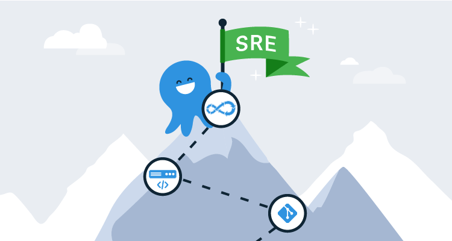

DevOps is everywhere! It’s used as hashtags, the name of products, and job titles. Digital Trends lists DevOps Engineer as the third-best tech job title for 2020. Indeed.com has over 4,000 job postings for the title DevOps engineer, and LinkedIn has over 3 times that number with more than 13,000 job postings. 

Needless to say, DevOps is hot!

The job title Site Reliability Engineer (SRE) has emerged in recent years from Google. SRE isn’t yet as popular as its predecessor, but it is often used synonymously by recruiters. 

In this post, I share my thoughts on how somebody new to the industry can aspire to these roles.

Looking at job postings will likely just confuse you. Everything from 10 years of C# experience to intimate knowledge of Active Directory domain trusts are listed in the job descriptions. With such a broad set of requirements, where do you even begin?

Start by understanding that DevOps and SRE are advanced job roles. You can start a career in web development by applying for entry-level positions and system administration at the help desk. DevOps and SRE don’t yet have that entry position. Typically a DevOps practitioner has already spent a few years working in technology. This is because DevOps and SRE roles require an understanding of development and infrastructure. It’s difficult to learn both disciplines at once, which is why most practitioners have an existing background in one or the other.

I started my career on the help desk. Moved up to a system administrator and eventually landed a gig as a senior systems engineer. When I first started hearing about DevOps through Twitter, blog posts, and conference talks, I thought it was reserved for startups. So I ignored it until my passion for automation brought me to the DevOps practice of Infrastructure as Code. It was episode 275 of the PowerScripting podcast with guest Steve Murawski where I first heard about DSC (Desired State Configuration). Infrastructure as Code was the single idea that pulled me into the world of DevOps. It’s the portal sysadmins of all operating system variants can use to transition into DevOps.

## It isn’t about tools, but...

DevOps isn’t about tools! This is practically shouted at conferences by people seemingly wearing Braveheart face paint and drumming battle drums. They’re arguably correct in their assertion. But the tools you use shape the language you use and determine how you interact with other people to do your job. You literally live in the tools you use. Whether that’s email, Slack, or like most developers, Git. 

In a traditional company, you’ll find developers using one set of tooling and sysadmins using another. This only reinforces the silos. 

If you ever hope to break down those silos you need to do more than change titles, form joint distribution groups, and tell people to work together. You need to give each team opportunities to interact. This happens naturally and organically if the tools they use to do their jobs overlap. 

Sharing tools creates a shared language. This isn’t senior leadership advice, this applies to individual contributors. If you’re a sysadmin looking to move into a DevOps role this applies to you. DevOps isn’t about tools, but tools are a good place to start.

## Learn to code from the command-line 

Automation is the starting point. It is the starting point because it gets you writing code. If you look over the technologies listed in DevOps Engineer job postings, you’ll notice a trend. All of them mention some form of coding. This does not mean you need to attend a coding Bootcamp, learn Java or C#. Any scripting or programming language will suffice. What’s important is that you pick a language that’s practical for you to apply to your job. If you work on Linux, Bash and Python are a natural fit. If you work on Windows, PowerShell is the way to go.

Starting to learn a coding language is easy. There’s an endless number of blog posts, YouTube videos, books, and Pluralsight courses for you to consume. 

What’s difficult is figuring out how to apply it at work. I suggest you start by automating things that suck. Find routine and mundane tasks and work to automate those. The scripting or programming language you choose to learn will become the hammer in your toolbox. As with any tool collection, a hammer is just the beginning. You’ll need to add other tools. Within the context of infrastructure automation, those tools go by the names of Ansible, Chef, Puppet, Terraform, Azure Resource Manager Templates, and CloudFormation. These tools are valuable because they abstract. Leaving you with less code to write and a better framework for managing your infrastructure. If Infrastructure as Code is the portal, automation is how you open it.

## Start at the source

Long gone are the days of relying on shell history and file shares to store your code. You need something better. You need source control. Source control is a broad topic that has entire books dedicated to it. The good news is that you don’t need to understand it in depth. You just need enough information to become competent. Learning just a few commands is all you need to hit the ground running.

Git is by far the most popular source control system. And GitHub is by far the most popular hosted Git provider. Creating an account on GitHub and uploading your code there is a great place to start. GitHub allows you to create public and private repositories. If you choose to upload to a public repository, make sure your code is sanitized and can be open sourced. 

Creating public repositories also serves as public artifacts of your work. You can use them to demonstrate your skills and knowledge, and you can also use them as a reference. Not everything you learn will stay in your head, but by using Git it will be logged in your commit history.

Learning Git will take some effort, but once you learn how to use it, you won’t go back. In fact, if you start using Git outside of work, you won’t want to work without it. Chances are someone within your organization is using Git or another source control system. Ask around and find out how you can gain access to the source control system, then create a repository for your team and help onboard them. Onboarding your team will be more difficult than getting your boss on board. There will be a learning curve for your team, but your manager will agree after you say the word _audit_.

All the advantages of Git are not immediately apparent. Focus on the value it adds upfront vs. in the future. That immediate value is auditable code through a commit history, increased collaboration, and easier management than a file share. Most importantly though, source control unlocks everything else.

## Pull requests mean deployments

Tooling that was traditionally administered by release engineers has become table stakes for anyone writing code. 

Yes, scripts are code too. 

Release engineering is a sub-discipline of software engineering which focuses on the compilation, assembly, and delivery of source code. There is a lot you don’t need to know about release engineering, but two types of tools exist that you won’t want to live without; continuous integration and continuous delivery collectively known as CI/CD.

TeamCity, Octopus Deploy, Jenkins, Azure DevOps, and GitHub Actions are all tools that live in this space. Focusing on tools is going to confuse you because each of these tools contain features that allow you to build CI/CD systems. But, continuous integration and continuous delivery are actually software engineering practices. 

To simplify, think of continuous integration as automating the build phase of software, and continuous delivery as automating the release and deployment of that software. Continuous integration, continuous delivery, and source control combine to make a release pipeline. A release pipeline is a conceptual process that takes your code from source to production for you. It is through source control and CI/CD that you can get out of the business of clicking buttons.

**Scenario**: You’ve automated the deployment, provisioning, and configuration of new infrastructure, and all the infrastructure code is stored in source control. You are at the point where you can scale the infrastructure up and down using this automation. However, it has become difficult to identify which version of the code was last deployed, deployments are done manually at the command-line, and typos frequently make it into the codebase.

**Solution**: Build a release pipeline for infrastructure code. Automate all the steps you take to deploy the infrastructure code by making it programmatic and non-interactive. Then you can start to build out the release pipeline. Starting with source control, the release pipeline will be triggered by commits and or pull requests. Next, in the build stage lint your code to reduce typos and control code quality. After your code passes the lint and other testing you deploy it in the release stage, which deploys the infrastructure code. Implementing a release pipeline frees you from the manual deployment of automation. It’s automating the automation in a sense. The goal is always to click fewer buttons.

## Conclusion

Everything points back to automation, it’s what makes all of this possible. Without automation the portal would not open. Entering the portal, source control is your stronghold. With a stronghold in place, release pipelines carry you through the fog into the uncharted territory of the developer. Learning the technology and practices listed in this article will open many possible paths on your DevOps skill tree. Where you go next, will be up to you. 

Resources:
 - [Microsoft release pipeline model operations manual](http://download.microsoft.com/download/C/4/A/C4A14099-FEA4-4CB3-8A8F-A0C2BE5A1219/The%20Release%20Pipeline%20Model.pdf)
 - [The release pipeline model presentation from WinOps Conf 2016](https://channel9.msdn.com/Events/WinOps/WinOps-Conf-2016/The-Release-Pipeline-Model)
 - [The build release pipeline Model for mere mortals presentation from PowerShell + DevOps Global Summit 2018](https://www.youtube.com/watch?v=ccEO5buASv8)
 - [Crate.io - Infrastructure as Code, Part One](https://crate.io/a/infrastructure-as-code-part-one/)
 - [Crate.io - Infrastructure as Code, Part Two: A Closer Look at Terraform](https://crate.io/a/infrastructure-as-code-part-two-a-closer-look-at-terraform/)

 ---

 Josh Duffney is a Site Reliability Engineer. He [writes](https://duffney.io/posts/), presents, [teaches](https://app.pluralsight.com/profile/author/josh-duffney), and [tweets](https://twitter.com/joshduffney) about Automation, DevOps, Cloud, and optimizing output while minimizing input.
