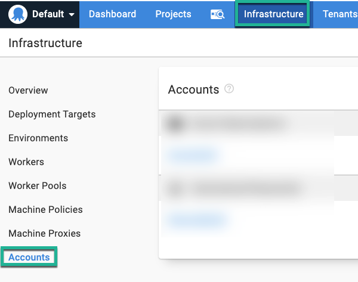
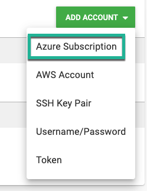
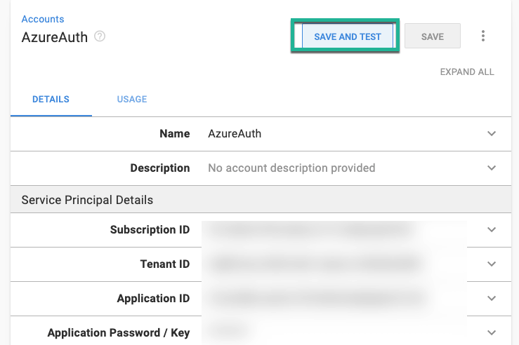
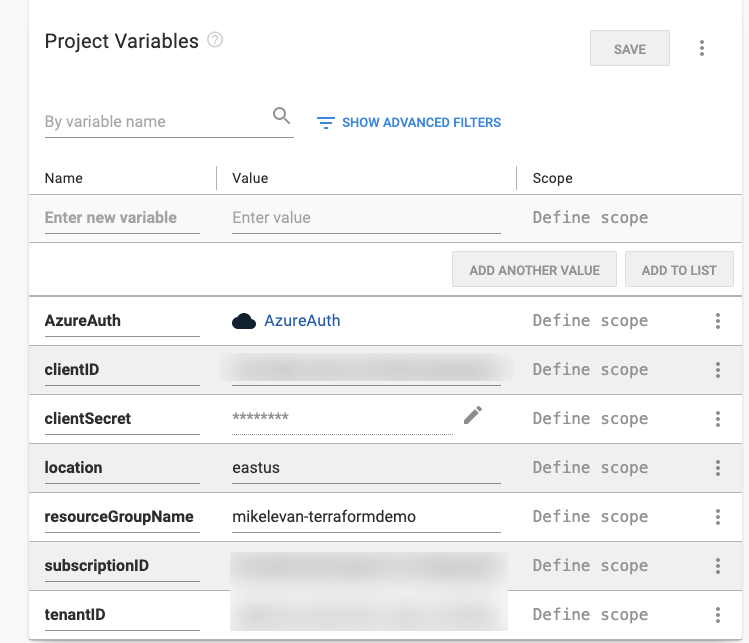
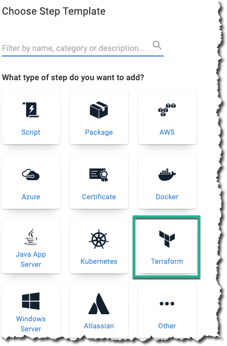
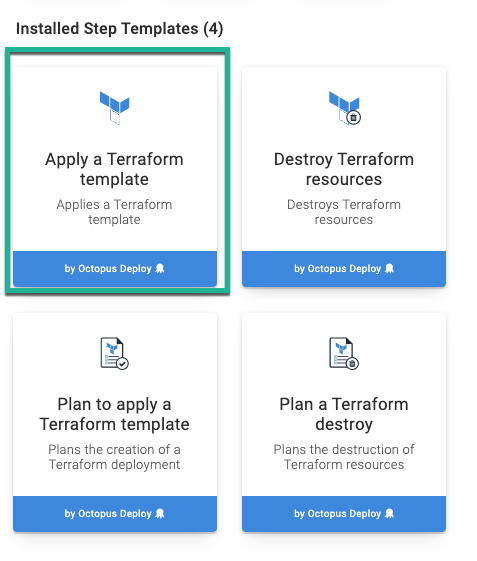
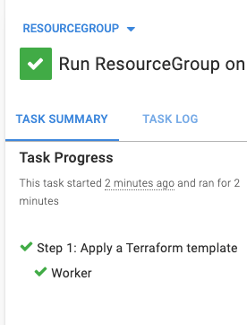

When you think of continuous deployment and continuous delivery, the first thing that typically comes to mind is application code. For example, perhaps you have a web API that you want to deploy to a serverless platform.

When it comes to Octopus Deploy, we focus on software deployments, but there's also the infrastructure side. It's not only about the software developers, but the infrastructure developers. The idea of wanting to help both sides of the fence for automated deployments is why [Runbooks](https://octopus.com/docs/runbooks) exist.

As an infrastructure developer, you need to write code to automate the process of configuring cloud and on-prem infrastructure, but you also need a way to automatically deploy it.

In this blog post, you'll learn about how to use Terraform and Octopus Deploy together to deploy services into Azure.

## Prerequisites

To follow along with this blog post, you should have the following:

- An Octopus Deploy server, either [on-prem](https://octopus.com/start/server) or in the [cloud](https://octopus.com/start/cloud)
- An Azure subscription. If you don't already have one, you can sign up for a 30-day free trial [here](https://azure.microsoft.com/en-us/free/).
- An Azure Service Principal (app registration) that has access to create resource in the Azure subscription you're using.
- Knowledge of [Terraform](https://www.terraform.io/intro/index.html) at a beginner-to-intermediate level.

## Octopus and Terraform

Terraform, an open-source [Infrastructure-as-Code](https://docs.microsoft.com/en-us/azure/devops/learn/what-is-infrastructure-as-code) platform created by [Hashicorp](https://www.hashicorp.com/), is very much supported by default in Octopus Deploy. 

You can deploy Terraform resources to:

- In Azure
- In AWS
- On-prem (hardware and virtualized environments)

One of the major benefits about using Terraform in a continuous delivery and deployment tool is that you only have to focus on writing the code, not manually deploying it. Combining Octopus and Terraform allows you to automate the entire lifecycle.

## The Terraform Code

To create a resource or service in Azure, you need to write the HCL code. In this section, you'll take a look at the HCL code to create a Resource Group in Azure using Terraform.

### The Azure Terraform Provider

As with any time you interact with a Terraform provider, you need to specify some inputs and authentication into the code block. To provider that is used to interact with Azure is the `azurerm` provider, which you can find out more about [here](https://www.terraform.io/docs/providers/azurerm/index.html).

There are four ways to authenticate to the `azurerm` Terraform provider:

- [Authenticating to Azure using the Azure CLI](https://www.terraform.io/docs/providers/azurerm/guides/azure_cli.html)
- [Authenticating to Azure using Managed Service Identity](https://www.terraform.io/docs/providers/azurerm/guides/managed_service_identity.html)
- [Authenticating to Azure using a Service Principal and a Client Certificate](https://www.terraform.io/docs/providers/azurerm/guides/service_principal_client_certificate.html)
- [Authenticating to Azure using a Service Principal and a Client Secret](https://www.terraform.io/docs/providers/azurerm/guides/service_principal_client_secret.html)

For the purposes of this blog post, you'll be using an Azure Service Principal.

The provider will need the following information:

- Azure subscription ID
- Client ID
- Client Secret
- Tenant ID

There is also a `features` parameter that is needed, but it can be left blank.

The provider config block should look like the below code.

```
provider "azurerm" {
  subscription_id = "#{subscriptionID}"
  client_id       = "#{clientID}"
  client_secret   = "#{clientSecret}"
  tenant_id       = "#{tenantID}"
  
  features		  = {}
}
```

Notice of the subscription ID, client ID, client secret, and tenant ID have variables associated for the values. You'll go over setting up the variables in an upcoming section. 

## Creating the Azure Resource

The `resource` create operation will call upon the `azurerm_resource_group` resource type. The resource type contains two parameters needed in the config block:

- name - The name of the resource group you're creating
- location - The location where the resource group will reside (`eastus`, for example)

```
resource "azurerm_resource_group" "resourceGroup" {
  name     = "#{resourceGroupName}"
  location = "#{location}"
}
```

Once you have the provider and resource code, it should look like the below code snippet.

```
provider "azurerm" {
  subscription_id = "#{subscriptionID}"
  client_id       = "#{clientID}"
  client_secret   = "#{clientSecret}"
  tenant_id       = "#{tenantID}"
  
  features		  = {}
}

resource "azurerm_resource_group" "myterraformgroup" {
  name     = "#{resourceGroupName}"
  location = "#{location}"
}
```

## Authentication From Octopus Deploy to Azure

Now that the code is written that will be used to create a new Resource Group in Azure, you need a way to authenticate from Octopus Deploy to Azure. Luckily, Octopus Deploy has a way to create accounts for authentication to cloud and on-prem environments.

To create an Azure account..

Log into the Octopus Deploy portal and go to **Infrastructure** —> **Accounts**



Click the green **ADD ACCOUNT** button and choose the **Azure Subscription** option.



Add in all associated information for the Azure Service Principal you have that has permission to create resources in the Azure portal. To confirm that the Azure Service Principal works, click the **SAVE AND TEST** button.



## Setting up a New Project in Octopus Deploy

Once the authentication is complete from Octopus Deploy to Azure, you can start thinking about how and where you want the Terraform runbook to exist. To ensure that the runbook is in it's own project, you can create the project with the Octopus Deploy UI.

### Creating a Project in Octopus Deploy

1. Log into the Azure portal and go to **Projects**.
2. Choose which project group you'd like to store the Project in and click the green **ADD PROJECT** button.
3. Create a new project and name it **TerraformAzure**.

Once the project is created, it's time to create the runbook.

### Creating Octopus Deploy Variables

Under the variables section of the project, you'll want to add in Project Variables. Because these values can differ based on the environment you're in, below is a screenshot of a sample. The `Name` of the variables should match the screenshot below because you will use them in the code later, but the values will be different for your environment.



## Configuring the Runbook

Since you're deploying a service in Azure and not code for an application, the most efficient action is to use a Runbook. The Runbook will give you the ability to use the Terraform step template and create the Resource Group.

## Creating a Runbook

1. Under the Project, go to **Operations** —> **Runbooks**.
2. Click the green **ADD RUNBOOK** button.
3. Create a Runbook and name it **ResourceGroup**.

## Adding Steps to the Runbook

1. Under the Runbook, go to Process and click **ADD STEP.**
2. Click on the Terraform category.



  3. Choose the **Apply a Terraform template** step.



### Configuring the Terraform Step

Depending on the environment you're running in, these steps could be different. For example, you could use a different Worker Pool than the standard default. Because of that, this blog post will go over the key steps to add in for Terraform specifically.

1. Under **Managed Accounts**, choose **Azure Account** and add in the Azure account you created in the previous section **Authentication to Octopus Deploy from Azure**.
2. Under **Template**, choose **Template Source** and use the Source code option. Then, paste in the following code.

```
provider "azurerm" {
  subscription_id = "#{subscriptionID}"
  client_id       = "#{clientID}"
  client_secret   = "#{clientSecret}"
  tenant_id       = "#{tenantID}"
  
  features		  = {}
}

resource "azurerm_resource_group" "myterraformgroup" {
  name     = "#{resourceGroupName}"
  location = "#{location}"
}
```

As you can see, it utilizes the variables you created in the previous section **Setting up Variables**.

## Running the Terraform Code

The configuration of the project, authentication, steps, and code is all complete. Now, it's time to see the code in action! 

1. Under **Runbooks**, you'll see the **ResourceGroup** Runbook. Click the **RUN** button.
2. Select the environment that you'd like to run the Runbook under and click the green **RUN** button.



Congrats! You have successfully created a Resource Group in Azure using Octopus Deploy and Terraform.

## Conclusion

Combining the power of continuous deployment and infrastructure-as-code is key to any automated environment. Not only does it give you automation, but a place for fellow team members to collaborate, see what's happening, and understand the process instead of manually doing it yourself.