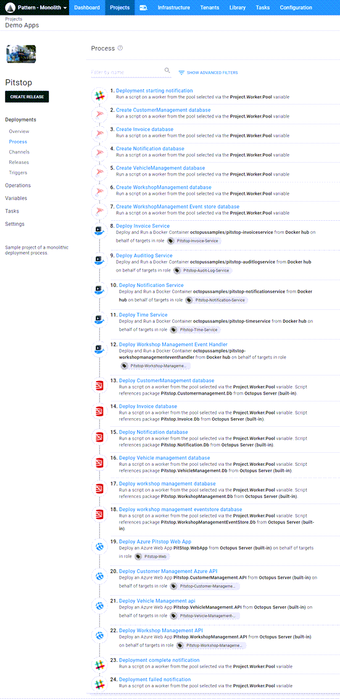
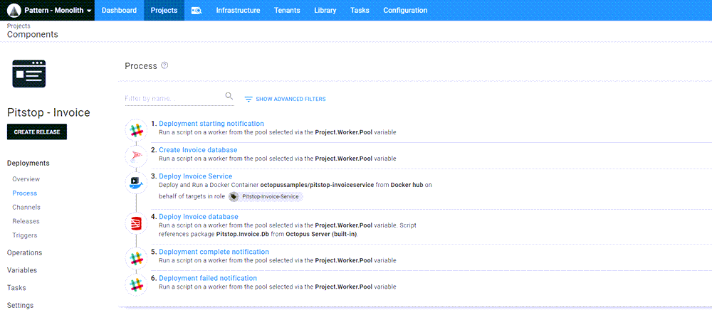

The term `monolithic deployment` often carries a negetive connotation, however, monolithic deployments are the natural progression of an application that has grown over time.  In this post, I'll demonstrate considerations in breaking apart a monolithic process into smaller deployable components.

## Pitstop
For this post, I chose the [Pitstop](https://github.com/EdwinVW/pitstop) to use as an example.  The reason I chose this application was that it contained multiple moving parts:
- Web front end
- APIs
- Microservices
- Databases
- Third-party docker containers

The original version of this application embedded the database and table creation within the C# code itself.  To make a more useful demonstration, I extracted the database activities and placed them into the deployment process.  In addition, the APIs and Web front end were all dockerized.  Again, I modified this so they could be deployed to Azure instead of containers.  The modified version can be found [here](https://github.com/OctopusSamples/PitStop).

## Monolithic deployment process
The modifications to the Pitstop application were to add more pieces to the deployment process.  Deploying the Pitstop application consists of the following steps:
- Slack notification - starting deployment
- Create CustomerManagement database (if not exists)
- Create Invoice database (if not exists)
- Create Notification database (if not exists)
- Create VehicleManagement database (if not exists)
- Create WorkshopManagement database (if not exists)
- Create WorkshopManagementEventStore database (if not exists)
- Deploy Invoice micro service
- Deploy Auditlog micro service
- Deploy Notification micro service
- Deploy Time service micro service
- Deploy Workshop management micro service
- Deploy Customer management database
- Deploy Invoice database
- Deploy Notification database
- Deploy Vehicle management database
- Deploy Workshop management database
- Deploy Workshop management eventstore database
- Deploy Pistop web app
- Deploy Customer management api
- Deploy Vehicle management api
- Deploy Workshop management api
- Slack notification - deployment complete
- Slack notification - deployment failed (only in failure)

In this form, the deployment takes approximetly 15 minutes to complete.  While not an astronomical number, it could be an eternity if a single component is down and needs to be updated.

## Breaking up the monolith
Looking at our deployment process, we can identify some of the steps that are related while others are indepenent.  For example the steps for the Invoice service are all related, so those can be broken out into their own Octopus project:
- Slack notification - starting deployment
- Create Invoice database (if not exists)
- Deploy Invoice micro service
- Deploy Invoice database
- Slack notification - deployment successful
- Slack notification - deployment failed (only on failure)

Deployment of the Invoice components now takes only a minute versus the 15 minutes in the monolith.  This is a significant time savings especially in cases where the Invoice components are the only pieces that need updating.

## Deploying
